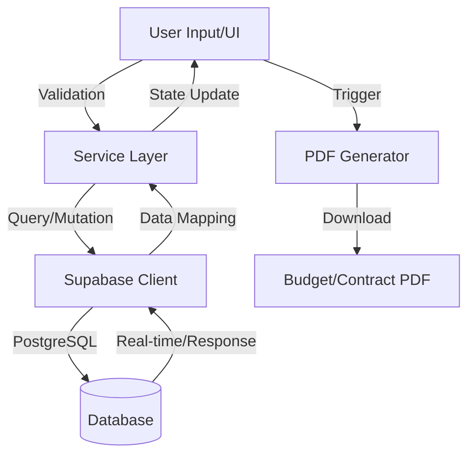

# Data Flow & Integrations

The Solennix is designed as a data-driven React application that facilitates the management of event planning, inventory, and financial tracking. Data enters the system primarily through user interactions in the frontend forms (Clients, Products, Inventory, and Events). This data is processed through a structured service layer before being persisted in a Supabase PostgreSQL database.

The system follows a "Single Source of Truth" pattern where the database state is mirrored in the UI using React's state management and hooks. For read operations, data flows from Supabase through the service layer to the components. For write operations, data is validated in the UI, transformed in the service layer, and committed to the database via the Supabase client.

## Module Dependencies

The system is organized into a hierarchical dependency structure to ensure separation of concerns:

- **src/pages/** → Depends on `src/services`, `src/components`, `src/lib`, and `src/contexts`.
- **src/services/** → Depends on `src/lib/supabase.ts` and `src/types/supabase.ts`.
- **src/components/** → Depends on `src/lib/utils.ts` and UI primitives.
- **src/contexts/** → Depends on `src/lib/supabase.ts` for authentication and session persistence.
- **src/lib/** → Independent utility modules (PDF generation, financial calculations, error handling).

## Service Layer

The service layer abstracts the Supabase API calls, providing a clean interface for the UI components to interact with data.

- **[Client Service](src/services/clientService.ts):** Manages CRM data, including client contact info and history.
- **[Event Service](src/services/eventService.ts):** Orchestrates complex event data, linking clients, products, and financial extras.
- **[Inventory Service](src/services/inventoryService.ts):** Tracks raw materials and stock levels.
- **[Product Service](src/services/productService.ts):** Manages "Recipes" or product compositions, linking products to inventory items.
- **[Payment Service](src/services/paymentService.ts):** Handles the lifecycle of event payments and installments.

## High-level Flow

The primary pipeline from user input to persistent storage and document output follows this flow:

1.  **Input:** Users interact with forms (e.g., `EventForm.tsx`).
2.  **Processing:** Components use hooks to call `eventService` methods.
3.  **Persistence:** The service communicates with Supabase, handling the mapping between TypeScript interfaces and database schemas.
4.  **Transformation:** For outputs like financial summaries or PDF contracts, the data is passed through `src/lib/finance.ts` and `src/lib/pdfGenerator.ts`.

## Internal Movement

Modules collaborate through a combination of React Context and direct service calls:

- **Authentication State:** Managed via `AuthContext.tsx`. All protected data flows check this context to ensure the user has a valid session and `user_id`.
- **Cross-Entity Linking:** When an Event is created, the system performs a multi-step orchestration:
    - Creates the base event record.
    - Associates selected products via `event_products`.
    - Creates payment schedules via `payments`.
- **Calculations:** Financial data is calculated on-the-fly using `src/lib/finance.ts` to ensure that taxes, net sales, and total charged amounts are always consistent across the Dashboard and Event Summary views.

## External Integrations

### Supabase (Backend-as-a-Service)
- **Purpose:** Authentication, PostgreSQL Database, and Storage.
- **Authentication:** JWT-based sessions managed via `AuthContext`.
- **Payload Shape:** Follows the generated types in `src/types/supabase.ts`.
- **Retry Strategy:** Handled by the Supabase client's internal fetch mechanism; application-level errors are caught by `src/lib/errorHandler.ts`.

### jsPDF (Document Generation)
- **Purpose:** Client-side generation of Budget and Contract PDFs.
- **Input:** Event and Profile data objects.
- **Output:** Blob/Binary data triggered for browser download.

## Observability & Failure Modes

- **Error Handling:** The `src/lib/errorHandler.ts` utility provides a centralized `logError` function. It captures database constraints, network failures, and unexpected runtime errors, providing user-friendly messages via `getErrorMessage`.
- **Config Validation:** The `isSupabaseConfigured` check in `src/lib/supabase.ts` prevents the application from crashing if environment variables (URL/Key) are missing, instead providing a fallback or warning.
- **Data Integrity:** The system uses TypeScript interfaces (e.g., `EventInsert`, `ProductUpdate`) to ensure that payloads sent to the database match the expected schema, preventing runtime SQL errors.

## Related Resources

- [architecture.md](./architecture.md)
