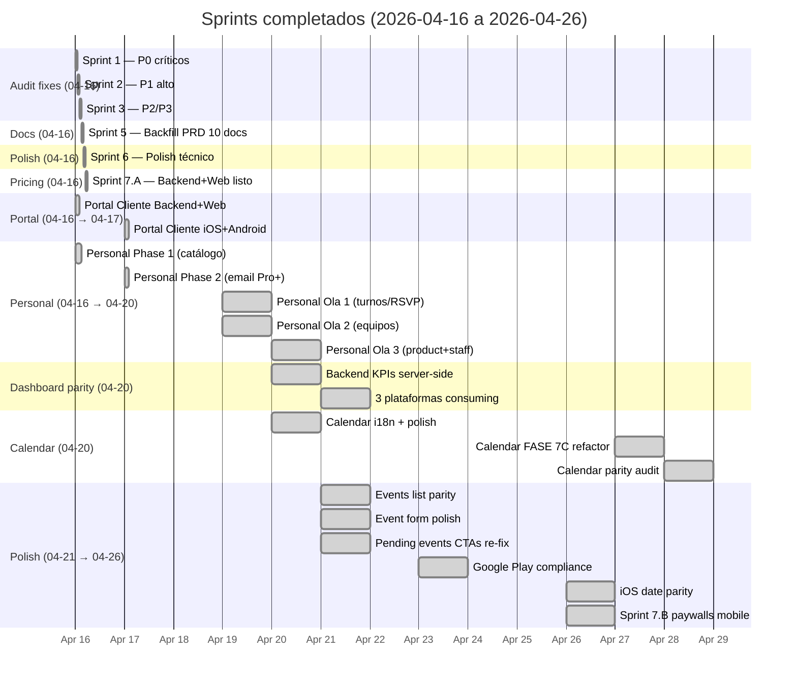
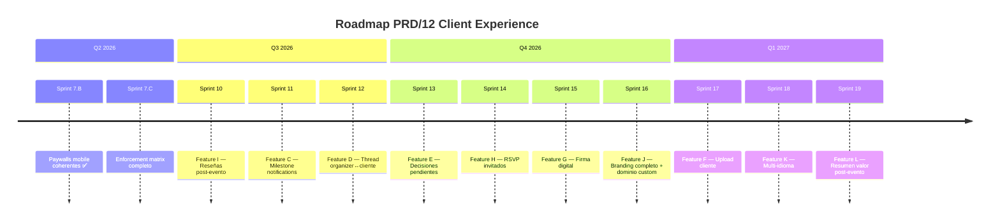
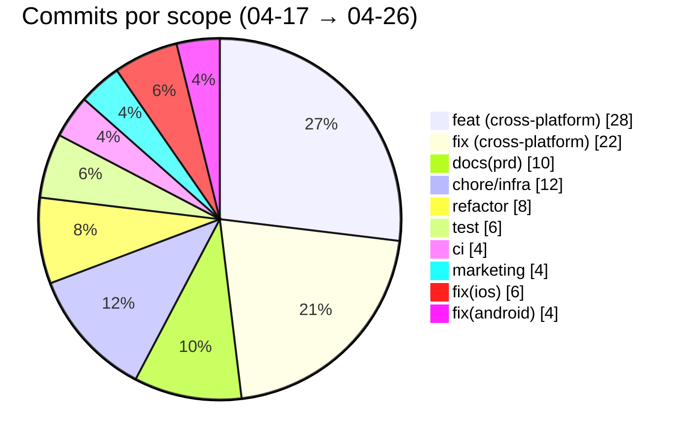
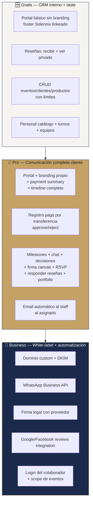

---
tags:
  - dashboard
  - solennix
  - daily-progress
aliases:
  - Dashboard
  - Hub
  - Inicio
date: 2026-04-27
updated: 2026-04-29
status: active
---

# 🏛️ Solennix — Dashboard Ejecutivo

> [!tip] Este es tu punto de entrada diario
> Abrí este archivo cada mañana para ver en **30 segundos** qué pasa con el producto. Todo lo demás se navega desde acá.

**Última actualización:** 2026-04-29 · Estructura de documentación mejorada. Estado Plataforma creado para cada área.

---

## 📱 Estado por plataforma

- **[[iOS/Estado Plataforma|iOS]]** — Status actual de iPhone/iPad
- **[[Android/Estado Plataforma|Android]]** — Status actual de Android
- **[[Web/Estado Plataforma|Web]]** — Status actual de la web
- **[[Backend/Estado Plataforma|Backend]]** — Status actual de API y servicios

---

---

## 📊 Salud del producto — al día de hoy

> [!success] 🟢 PRODUCCIÓN — 4 plataformas live
> - iOS 1.1.0 · App Store México · `https://apps.apple.com/mx/app/solennix/id6760874129`
> - Android 1.1.2 (versionCode 5) · Play Store
> - Web · `solennix.com`
> - Backend · `api.solennix.com`

> [!success] ✅ AUDIT 2026-04-16 — 30 / 38 findings cerrados
> - **P0 crítico:** 7 / 8 resueltos · 1 inválido (finding erróneo del audit)
> - **P1 alto:** 11 / 12 resueltos · 1 skip documentado (Apple docs contradicen audit)
> - **P2 medio:** 8 / 11 resueltos · 3 diferidos con rationale
> - **P3 bajo:** 4 / 7 resueltos · 3 diferidos con rationale

> [!success] 🤝 Personal — Phase 1 + Phase 2 + Olas 1/2/3 COMPLETAS
> Backend + Web + iOS + Android en paridad total. Catálogo + email Pro+ + turnos/RSVP + equipos + productos con staff.
> - **Ola 1** (2026-04-19): turnos + estado RSVP + disponibilidad
> - **Ola 2** (2026-04-19): equipos (`staff_teams`) para asignar cuadrillas en bloque
> - **Ola 3** (2026-04-20): `products.staff_team_id` para vender staffing al cliente
> Ver [[PRD/17_PERSONAL_TRACKER|tracker completo]].

> [!success] 🎁 Portal Cliente MVP — 100% cerrado cross-platform
> Backend + Web + iOS + Android en paridad (Sprint 8 cerrado 2026-04-17). Ver [[PRD/15_PORTAL_CLIENTE_TRACKER|tracker completo]].

> [!success] 📊 Dashboard KPIs — Backend como source of truth
> Desde 2026-04-20 las 3 plataformas consumen `/api/dashboard/kpis` + `/api/dashboard/revenue-chart` + `/api/dashboard/events-by-status`. Cero agregación client-side para los 8 KPI cards. Chart de 6 meses premium-only.

> [!success] 🌐 i18n Foundation — Calendario ES+EN
> Desde 2026-04-20: strings extraídos a catálogos localizables en iOS (`.xcstrings`), Android (`strings.xml`) y Web (`i18next`). Ver [[PRD/19_I18N_STRATEGY|i18n Strategy]].

> [!warning] 📅 Calendario — Paridad Auditada (2026-04-27)
> 15 features con paridad completa · 11 gaps identificados (3 🔴 críticos · 4 🟡 medios · 4 🟢 bajos).
> Críticos: Android sin crear evento · Android loading sin UI · iOS syntax error.
> Ver [[PRD/21_CALENDAR_PARITY_AUDIT|Audit completo]].

> [!success] 🔒 Google Play Compliance — Paridad total
> Desde 2026-04-23: Account Deletion page + Privacy Policy actualizada + entry points en Settings de las 3 plataformas.

> [!warning] ⏳ BLOQUEANTES externos
> Stripe Dashboard · App Store Connect · Google Play Console · RevenueCat.
> Acción del usuario (2–4 h), no de código. Detalle en [[PRD/09_ROADMAP|Roadmap §5]].

---

## 📅 Progreso de Sprints — estado visual

### 🎯 Sprints — barras de progreso

| Sprint | Objetivo | Progreso | Status |
|---|---|---|---|
| 1 | P0 fixes cross-platform | `████████████████████` 100% | ✅ cerrado |
| 2 | P1 fixes cross-platform | `███████████████████░` 92% | ✅ cerrado (1 skip justificado) |
| 3 | P2/P3 fixes | `█████████████████░░░` 83% | ✅ cerrado (3 diferidos) |
| 4 | Activar deploy VPS | `░░░░░░░░░░░░░░░░░░░░` 0% | ⏸️ deferido por usuario (deploy manual) |
| 5 | Backfill PRD (10 docs) | `████████████████████` 100% | ✅ cerrado |
| 6 | Polish técnico (perf + a11y) | `████████████████████` 100% | ✅ cerrado |
| 7.A | Pricing foundation (código) | `████████████████████` 100% | ✅ cerrado |
| 7.B | Paywalls mobile coherentes | `████████████████████` 100% | ✅ cerrado |
| 7.C | Enforcement matrix completo | `░░░░░░░░░░░░░░░░░░░░` 0% | 📋 próximo sprint |
| **Portal Cliente MVP** | **4 stacks completos** | **`████████████████████` 100%** | ✅ cerrado |
| **Personal Phase 1** | **Catálogo + asignación** | **`████████████████████` 100%** | ✅ cerrado |
| **Personal Phase 2** | **Email Pro+ al colaborador** | **`████████████████████` 100%** | ✅ cerrado |
| **Personal Ola 1** | **Turnos + RSVP + disponibilidad** | **`████████████████████` 100%** | ✅ cerrado |
| **Personal Ola 2** | **Equipos (staff_teams)** | **`████████████████████` 100%** | ✅ cerrado |
| **Personal Ola 3** | **Product.staff_team_id** | **`████████████████████` 100%** | ✅ cerrado |
| **Dashboard KPIs parity** | **Backend como source of truth** | **`████████████████████` 100%** | ✅ cerrado |
| **Calendar i18n** | **ES+EN + polish** | **`████████████████████` 100%** | ✅ cerrado |
| **Calendar FASE 7C** | **Overflow fix + refactor** | **`████████████████████` 100%** | ✅ cerrado |
| **Calendar parity audit** | **Cross-platform gaps** | **`████████████████████` 100%** | ✅ audit completo, fixes pendientes |
| **Events list parity** | **Sort, inline status, search** | **`████████████████████` 100%** | ✅ cerrado |
| **Google Play compliance** | **Privacy + Account deletion** | **`████████████████████` 100%** | ✅ cerrado |
| 9 | Feature B (payments transfer) | `░░░░░░░░░░░░░░░░░░░░` 0% | 📋 |
| 10 | Feature I (reseñas) | `░░░░░░░░░░░░░░░░░░░░` 0% | 📋 |

---

## 🧩 Matriz visual por feature

### Core del producto — ya en producción

> [!success] ✅ Funcional en las 4 plataformas
> Auth · Eventos · Clientes · Productos · Inventario · Pagos (internos) · Calendario · PDFs · Dashboard · Settings · Push · Email · Personal · Portal Cliente.

### Pricing / Monetization

| | iOS | Android | Web | Backend |
|---|:-:|:-:|:-:|:-:|
| Plan Gratis | ✅ | ✅ | ✅ | ✅ |
| Plan Pro — código | 🚧 | 🚧 | ✅ | ✅ |
| Plan Pro — cobro real | ⏳ | ⏳ | ⏳ | ✅ |
| Plan Business — código | 🚧 | 🚧 | ✅ | ✅ |
| Plan Business — cobro real | ⏳ | ⏳ | ⏳ | ✅ |
| Paywall por `plan_limit_exceeded` | ✅ | ✅ | ✅ | ✅ |
| Trial 14 días web (Stripe) | — | — | ✅ | ✅ |
| Trial 14 días mobile (IAP) | ⏳ | ⏳ | — | ✅ |

**Leyenda:** ✅ shipped · 🚧 código listo, falta integración · ⏳ bloqueado en dashboards externos · 📋 planeado · — no aplica.

### Personal / Colaboradores — ✅ COMPLETO (Phase 1 + 2 + Olas 1-3)

| | iOS | Android | Web | Backend |
|---|:-:|:-:|:-:|:-:|
| CRUD catálogo de staff | ✅ | ✅ | ✅ | ✅ |
| Asignar a eventos (Step 4) | ✅ | ✅ | ✅ | ✅ |
| Fee opcional por asignación | ✅ | ✅ | ✅ | ✅ |
| Email automático al asignar (Phase 2, Pro+) | ✅ | ✅ | ✅ | ✅ |
| Turnos + RSVP status (Ola 1) | ✅ | ✅ | ✅ | ✅ |
| Disponibilidad por fecha (Ola 1) | ✅ | ✅ | ✅ | ✅ |
| Equipos / cuadrillas (Ola 2) | ✅ | ✅ | ✅ | ✅ |
| Product con staff_team_id (Ola 3) | ✅ | ✅ | ✅ | ✅ |
| Phase 3 — Login colaborador (Business) | 📋 | 📋 | 📋 | hook listo |

**Detalle completo:** [[PRD/17_PERSONAL_TRACKER]]

### Portal Cliente (PRD/12 Feature A) — ✅ MVP COMPLETO

| | iOS | Android | Web | Backend |
|---|:-:|:-:|:-:|:-:|
| Endpoint público `/public/events/{token}` | — | — | — | ✅ |
| Endpoints organizador CRUD | — | — | ✅ | ✅ |
| UI del portal (lo que ve el cliente) | — | — | ✅ | — |
| Share card en EventDetail | ✅ | ✅ | ✅ | — |
| Copy + WhatsApp share | ✅ | ✅ | ✅ | — |
| Tier gating Gratis=básico / Pro=full | 📋 | 📋 | 📋 | 📋 |
| Rotación / Revocación | ✅ | ✅ | ✅ | ✅ |
| Acceso perpetuo (sin TTL default) | — | — | ✅ | ✅ |

**Detalle completo:** [[PRD/15_PORTAL_CLIENTE_TRACKER]]

### Dashboard — ✅ Backend como source of truth

| | iOS | Android | Web | Backend |
|---|:-:|:-:|:-:|:-:|
| KPIs server-side (`/api/dashboard/kpis`) | ✅ | ✅ | ✅ | ✅ |
| Revenue chart 6 meses (premium) | ✅ | ✅ | ✅ | ✅ |
| Events-by-status (backend) | ✅ | ✅ | ✅ | ✅ |
| Pending events + inline CTAs | ✅ | ✅ | ✅ | — |

### Transparencia & delight (PRD/12 features B–L) — 📋 Q3-Q4 2026

---

## 🔥 Lo que pasó — Resumen de commits (2026-04-17 → 2026-04-26)

> [!success] 104 commits en `main` desde el 2026-04-17

### Distribución por scope

### Hitos principales (cronológico)

| Fecha | Hito | Commits | Migraciones |
|---|---|---|---|
| 2026-04-17 | Portal Cliente iOS + Android + Personal Phase 2 | 8 | — |
| 2026-04-18 | iOS extras toggle + nav relocation + nav bar fixes | 6 | — |
| 2026-04-19 | Personal Olas 1 + 2 (turnos, equipos) | 8 | 043, 044 |
| 2026-04-20 | Personal Ola 3 + Dashboard KPIs parity | 14 | 045 |
| 2026-04-20 | Calendar i18n + polish | 6 | — |
| 2026-04-21 | Events list parity + event form polish | 8 | — |
| 2026-04-21 | Pending events CTAs re-implemented | 5 | — |
| 2026-04-22 | Marketing videos V02 + V03 | 3 | — |
| 2026-04-23 | Google Play compliance | 6 | — |
| 2026-04-26 | iOS date parity + quick quote fix | 4 | — |
| 2026-04-26 | Sprint 7.B paywalls mobile coherentes | 1 | — |
| 2026-04-27 | Calendar FASE 7C refactor + CI fixes | 5 | — |
| 2026-04-27 | Calendar parity audit (11 gaps) | 0 | audit only |

---

## 🔮 Decisiones de producto cerradas

> [!abstract] Decisiones duras locked en PRD
> 1. **Portal Cliente MVP** shipped en los 4 stacks (PRD/12 feature A).
> 2. **Stripe "Pagar ahora" del cliente reemplazado por registro por transferencia + approve/reject.** Zero fees, mejor fit LATAM. Ver [[PRD/12_SUBSCRIPTION_PLATFORM_ORIGIN|PRD/12 feature B]].
> 3. **Cliente tiene acceso perpetuo al portal** — nunca caduca por default. Bodas, quinceañeras, eventos importantes se revisitan años después. Ver [[PRD/15_PORTAL_CLIENTE_TRACKER|§A.1]].
> 4. **Gratis tiene "taste" básico** de Portal + Reseñas como upgrade driver. Portal Gratis muestra info básica sin branding, con footer linkeado a Solennix (marketing). Reseñas Gratis permite recibir + ver privado, no responder ni portfolio público. Quality > quantity como upgrade driver.
> 5. **Dashboard KPIs son server-side** — las 3 plataformas consumen el mismo endpoint. Cero divergencia de cálculos.
> 6. **Personal completo**: catálogo → email Pro+ → turnos/RSVP → equipos → producto con staff. Phase 3 (login Business) en backlog.

### Filosofía del split Gratis / Pro / Business

---

## 🎯 Próximo foco de trabajo

> [!tip] Qué toca cuando retomemos
> Según prioridad + disponibilidad de dashboards externos del usuario:

| Prioridad | Trabajo | Bloqueado en | Impacto |
|:-:|---|---|---|
| 🥇 | **Sprint 7.C — Enforcement tier matrix** | Sin bloqueo técnico | Activa el split Gratis/Pro real |
| 🥈 | **Sprint 10 — Feature I reseñas** | Sin bloqueo técnico | Marketing orgánico + retención |
| 🥉 | **Sprint Dashboard refactor** | Sin bloqueo técnico | Ver [[PRD/22_DASHBOARD_REFACTOR_PLAN|Plan completo]] |
| 4º | **Calendar parity fixes (G1-G7)** | Sin bloqueo técnico | Ver [[PRD/21_CALENDAR_PARITY_AUDIT|Audit]] |
| 5º | **Sprint 4 — Activar deploy VPS** | Usuario configura secrets en GitHub | Activa auto-deploy CI/CD |

### Deuda técnica registrada (GitHub Issues)

| # | Título | Label |
|---|---|---|
| [#88](https://github.com/tiagofur/eventosapp/issues/88) | Events: mover filter/search mobile al endpoint `/api/events/search` | `type:refactor` |
| [#89](https://github.com/tiagofur/eventosapp/issues/89) | iOS Events: pagination infra existe pero no se dispara en UI | `type:refactor` |
| [#90](https://github.com/tiagofur/eventosapp/issues/90) | Android: Paging3 infra huérfana tras sort client-side | `type:refactor` |
| [#91](https://github.com/tiagofur/eventosapp/issues/91) | Android Events list: soft-delete + undo toast (paridad iOS) | `enhancement` |
| [#92](https://github.com/tiagofur/eventosapp/issues/92) | Android: `feature:events` tests no compilan (VMs con nuevos params) | `type:bug` |
| [#93](https://github.com/tiagofur/eventosapp/issues/93) | CI: agregar job de Android al pipeline | `type:chore` |
| [#94](https://github.com/tiagofur/eventosapp/issues/94) | i18n: extraer strings de Dashboard al catálogo (ES + EN) | `enhancement` |
| [#95](https://github.com/tiagofur/eventosapp/issues/95) | i18n: extraer strings de Events list al catálogo (ES + EN) | `enhancement` |
| [#96](https://github.com/tiagofur/eventosapp/issues/96) | Stock equipamiento no es date-aware | `enhancement` |

### 🔴 Calendario — Gaps de paridad (Audit 2026-04-27)

> [!warning] Ver detalle completo en [[PRD/21_CALENDAR_PARITY_AUDIT|Audit de Paridad]]

| ID | Gap | Plataforma | Prioridad |
|----|-----|-----------|:---------:|
| G1 | Crear evento desde calendario | Android | 🔴 |
| G2 | Loading state UI | Android | 🔴 |
| G3 | Syntax error CalendarViewModel | iOS | 🔴 |
| G4 | Status filter eliminado | Web | 🟡 |
| G5 | Botón Retry en error | iOS + Android | 🟡 |
| G6 | Status dots por status (no por evento) | Android | 🟡 |
| G7 | Plan limits guard al crear | Web + Android | 🟡 |

### 🔴 Bloqueantes que dependen de vos (2–4 h en dashboards externos)

> [!warning] Estas tareas NO puede hacerlas Claude — son del usuario
> - **Stripe Dashboard** — crear Pro + Business prices (monthly + annual), configurar webhook, cargar `STRIPE_*` al VPS `.env`.
> - **App Store Connect** — subscription group + productos `solennix_premium_*` + trial 14d + submit for review (tarda 1-7 días).
> - **Google Play Console** — idem.
> - **RevenueCat Dashboard** — project + entitlement `pro_access` + offerings + webhook + verificar public keys iOS/Android son **live** (no Test Store).
> - **Resend** — dominio verificado + DKIM + SPF + `RESEND_API_KEY` al VPS.
>
> Checklist de 13 items: [[PRD/04_MONETIZATION#11. Keys y secrets — no confundir]]

---

## 📚 Navegación rápida

> [!info] MOCs (Maps of Content) por área
> - 📋 [[PRD/PRD MOC|PRD MOC]] — índice del PRD
> - 🍏 [[iOS/iOS MOC|iOS MOC]] — documentación iOS
> - 🤖 [[Android/Android MOC|Android MOC]] — documentación Android
> - 🌐 [[Web/Web MOC|Web MOC]] — documentación Web
> - ⚙️ [[Backend/Backend MOC|Backend MOC]] — documentación Backend
> - 🎯 [[SUPER_PLAN/SUPER PLAN MOC|SUPER PLAN MOC]] — programa de transformación
> - 🎬 [[Marketing/MOC|Marketing MOC]] — videos de producto (Remotion)

> [!info] Documentos vivos
> - 📊 [[PRD/11_CURRENT_STATUS|Estado Actual detallado]]
> - 📅 [[PRD/09_ROADMAP|Roadmap Maestro]]
> - 💰 [[PRD/04_MONETIZATION|Tiers + Monetización + Keys]]
> - 🎁 [[PRD/15_PORTAL_CLIENTE_TRACKER|Portal Cliente Tracker]]
> - 🤝 [[PRD/17_PERSONAL_TRACKER|Personal / Colaboradores Tracker]]
> - 📝 [[PRD/16_SPRINT_LOG_2026_04_16|Sprint Log del 04-16]]
> - 🌐 [[PRD/19_I18N_STRATEGY|i18n Strategy]]
> - 📅 [[PRD/21_CALENDAR_PARITY_AUDIT|Calendario Audit de Paridad]]
> - 🏗️ [[PRD/22_DASHBOARD_REFACTOR_PLAN|Dashboard Refactor Plan]]

> [!info] Roadmaps por plataforma
> - 🍏 [[iOS/Roadmap iOS]]
> - 🤖 [[Android/Roadmap Android]]
> - 🌐 [[Web/Roadmap Web]]
> - ⚙️ [[Backend/Roadmap Backend]]

---

## 🧭 Cómo usar este dashboard

> [!tip] Flujo diario recomendado
> 1. **Lunes AM** → abrí este dashboard. Mirá la tabla de sprints, elegí qué atacar.
> 2. **Durante el sprint** → trackeá commits en la sección de hitos.
> 3. **Cierre de sprint** → actualizá la barra de progreso + mové items de "próximo foco" al log.
> 4. **Fin de mes** → creá un nuevo dashboard o duplicá este con fecha nueva. El viejo queda como historia.

---

## 📝 Leyenda

| Ícono | Significado |
|:-:|---|
| ✅ | Shipped / Completado |
| 🚧 | En desarrollo (código parcial) |
| 📋 | Planeado |
| ⏳ | Bloqueado en acción externa (usuario) |
| ⏸️ | Deferido voluntariamente |
| ❌ | No implementado / no aplica |
| 🟢 | Estado OK |
| 🟡 | Requiere atención |
| 🔴 | Crítico |
| — | No aplica a esa plataforma |

---

#dashboard #solennix #daily-progress
