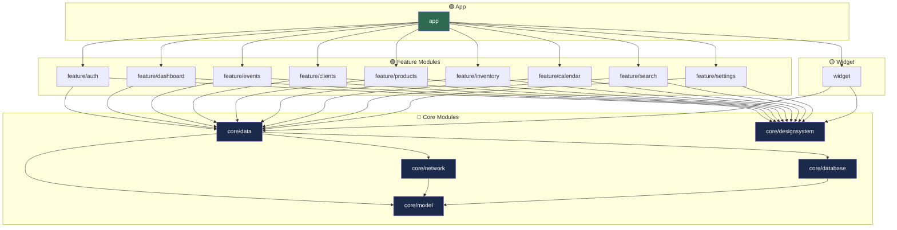
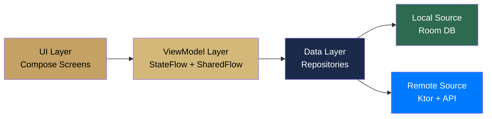
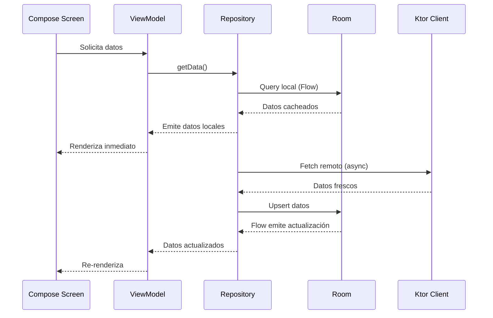

#android #arquitectura #infraestructura

# Arquitectura General

> [!abstract] Resumen
> Solennix Android sigue una arquitectura **multi-módulo con MVVM + Clean Architecture**, offline-first con Room como caché local y Ktor como cliente HTTP. Hilt maneja toda la inyección de dependencias.

---

## Stack Tecnológico

| Capa | Tecnología | Versión |
|------|-----------|---------|
| UI | Jetpack Compose + Material 3 | BOM 2024.12.01 |
| Navegación | Compose Navigation (type-safe) | 2.8.5 |
| Estado | StateFlow + SharedFlow | Lifecycle 2.8.7 |
| DI | Hilt (Dagger) | 2.53.1 |
| HTTP | Ktor Client (OkHttp) | 3.0.3 |
| Serialización | Kotlinx Serialization | 1.7.3 |
| Base de datos | Room | 2.6.1 |
| Imágenes | Coil 3 | 3.0.4 |
| Charts | Vico | 2.0.0-alpha.28 |
| Suscripciones | RevenueCat | 8.10.1 |
| Background | WorkManager | 2.10.0 |
| Seguridad | EncryptedSharedPreferences | 1.1.0-alpha06 |
| Biometría | Biometric | 1.2.0-alpha05 |
| Widgets | Glance AppWidget | 1.1.1 |
| Firebase | Messaging | BOM 33.9.0 |

---

## Estructura de Módulos

---

## Capas de la Arquitectura

| Capa | Responsabilidad | Ubicación |
|------|----------------|-----------|
| **UI** | Composables, pantallas, navegación | `feature/*/ui/` |
| **ViewModel** | Lógica de presentación, estado UI | `feature/*/viewmodel/` |
| **Repository** | Orquesta datos local + remoto | `core/data/repository/` |
| **Network** | Llamadas HTTP, auth, serialización | `core/network/` |
| **Database** | Caché local, DAOs, entities | `core/database/` |
| **Model** | Modelos de dominio compartidos | `core/model/` |
| **Design System** | Tema, componentes, tipografía | `core/designsystem/` |

---

## Patrón Offline-First

> [!important] Single Source of Truth
> Room es la fuente de verdad. La UI siempre observa Flows de Room, nunca datos directos de la API. El repositorio sincroniza en background.

---

## Convenciones de Naming

| Elemento | Convención | Ejemplo |
|----------|-----------|---------|
| Pantallas | `*Screen.kt` | `EventFormScreen.kt` |
| ViewModels | `*ViewModel.kt` | `EventFormViewModel.kt` |
| UI State | `*UiState` | `EventFormUiState` |
| Repositorios | `*Repository.kt` | `EventRepository.kt` |
| DAOs | `*Dao.kt` | `CachedEventDao.kt` |
| Entities Room | `Cached*` | `CachedEvent` |
| Módulos DI | `*Module.kt` | `NetworkModule.kt` |

---

## Relaciones

- [[Sistema de Tipos]] — modelos compartidos en `core/model`
- [[Capa de Red]] — cliente HTTP y endpoints
- [[Base de Datos Local]] — Room y estrategia de caché
- [[Inyección de Dependencias]] — Hilt y módulos DI
- [[Navegación]] — rutas y grafos de navegación
- [[Manejo de Estado]] — ViewModels y patrones de estado
