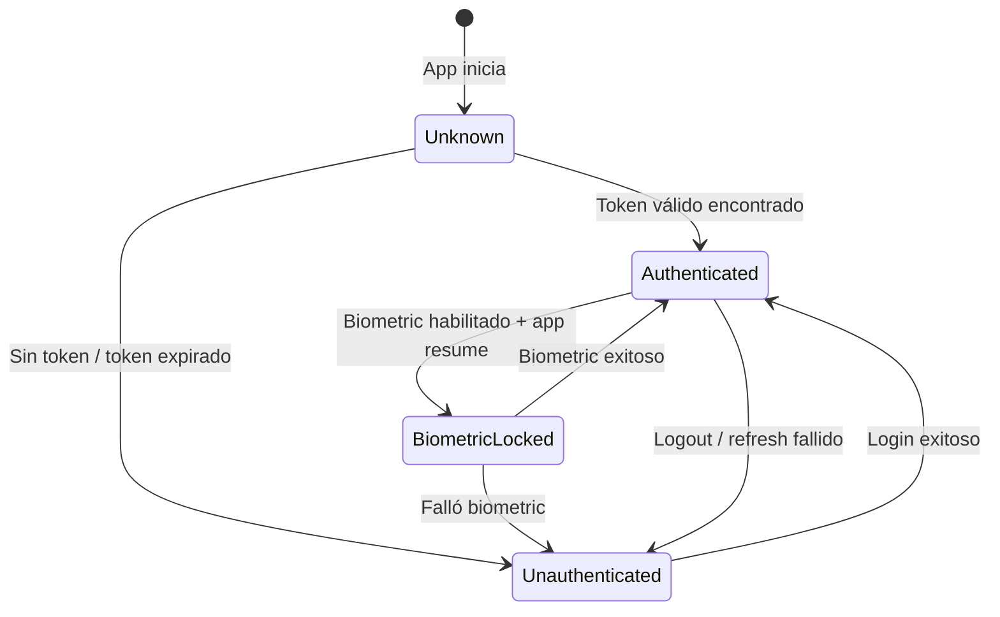
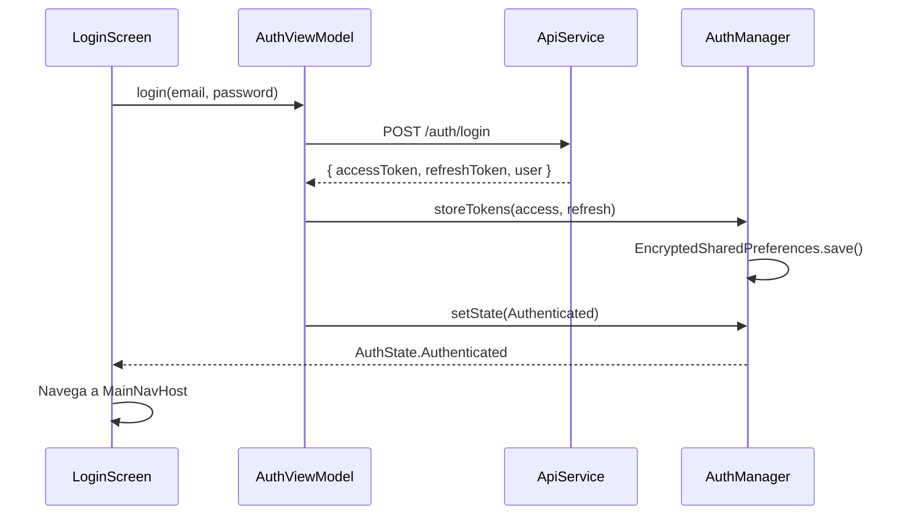
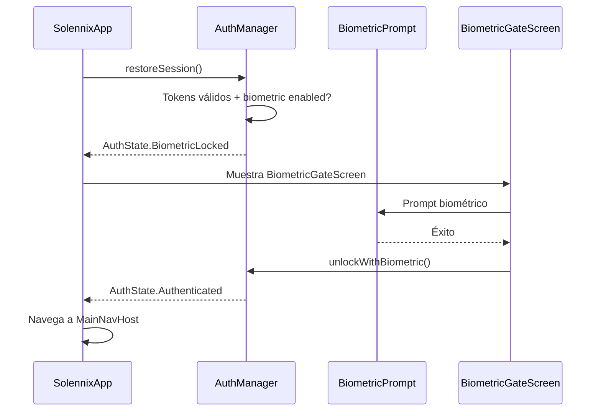
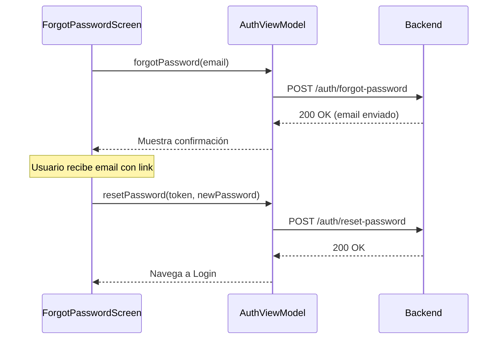

#android #auth #seguridad

# Autenticación

> [!abstract] Resumen
> Autenticación con JWT Bearer tokens almacenados en **EncryptedSharedPreferences**. Soporta email/password, Google (Credentials API), Apple, y bloqueo biométrico. Refresh automático en 401.

---

## Estados de Autenticación



---

## Flujos de Login

### Email/Password



### Google Sign-In ✅

```kotlin
// LoginScreen.kt
GoogleSignInButton(
    onSuccess = { idToken, fullName ->
        viewModel.loginWithGoogle(idToken, fullName)
    }
)
```

| Paso | Acción |
|------|--------|
| 1 | `GoogleSignInButton` composite → `CredentialManager.getCredential()` |
| 2 | Request: `GetGoogleIdTokenCredentialRequest(serverClientId = "...")` |
| 3 | Obtiene `GoogleIdTokenCredential` con `idToken` |
| 4 | Envía token a `POST /auth/google { id_token, full_name }` |
| 5 | Backend valida y retorna JWT |
| 6 | `AuthManager.storeTokens(accessToken, refreshToken)` en EncryptedSharedPreferences |
| 7 | `AuthState.Authenticated(user)` |

**Status:** ✅ Completado. Testeado en emulator + devices reales.

### Apple Sign-In ✅

```kotlin
// LoginScreen.kt
AppleSignInButton(
    onSuccess = { identityToken, fullName ->
        viewModel.loginWithApple(identityToken, fullName)
    }
)
```

| Paso | Acción |
|------|--------|
| 1 | `AppleSignInButton` composite → Apple OAuth SDK |
| 2 | Web-based OAuth flow (compatible con API 26+) |
| 3 | Obtiene `identity_token` + `authorization_code` |
| 4 | Envía a `POST /auth/apple { identity_token, authorization_code }` |
| 5 | Backend valida y retorna JWT |
| 6 | `AuthManager.storeTokens(...)` en EncryptedSharedPreferences |
| 7 | `AuthState.Authenticated(user)` |

**Status:** ✅ Completado. No conflictos con Play Billing (separado).

---

## Seguridad de Tokens

| Aspecto | Implementación |
|---------|---------------|
| Almacenamiento | `EncryptedSharedPreferences` (AES-256 GCM) |
| Access token | Incluido automáticamente por Ktor Auth plugin |
| Refresh token | Usado automáticamente en 401 |
| Concurrencia | `Mutex` previene refresh duplicados |
| Limpieza | `logout()` borra tokens + llama `/auth/logout` |

> [!important] Sin SSL Pinning
> Actualmente no hay certificate pinning. Considerar implementar para producción con `okhttp3.CertificatePinner`.

---

## Bloqueo Biométrico



| Configuración | Valor |
|---------------|-------|
| Biometric class | `BIOMETRIC_STRONG` |
| Prompt authenticators | `BiometricManager.Authenticators.BIOMETRIC_STRONG` |
| Habilitación | Toggle en Settings |

---

## Validación de Password

| Regla | Requisito |
|-------|-----------|
| Longitud mínima | 8 caracteres |
| Mayúscula | Al menos 1 |
| Minúscula | Al menos 1 |
| Número | Al menos 1 |

---

## Recuperación de Contraseña



> [!warning] Oportunidad de mejora
> La validación del token de reset es mínima del lado cliente. No se verifica expiración antes de enviar.

---

## Archivos Clave

| Archivo | Responsabilidad |
|---------|----------------|
| `core/network/AuthManager.kt` | Estado auth, tokens, biometric |
| `feature/auth/viewmodel/AuthViewModel.kt` | Lógica de login, registro, recovery |
| `feature/auth/ui/LoginScreen.kt` | Pantalla de login |
| `feature/auth/ui/RegisterScreen.kt` | Pantalla de registro |
| `feature/auth/ui/ForgotPasswordScreen.kt` | Recuperación de contraseña |
| `app/ui/navigation/AuthNavHost.kt` | Grafo de navegación auth |

---

## Relaciones

- [[Capa de Red]] — Auth plugin de Ktor maneja tokens automáticamente
- [[Navegación]] — AuthState determina el grafo de navegación inicial
- [[Módulo Settings]] — Toggle de biometric y cambio de password
- [[Arquitectura General]] — AuthManager como singleton en el grafo DI
