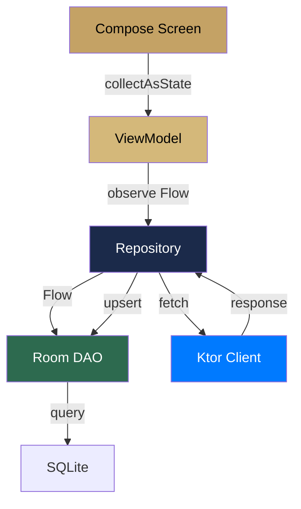

#android #room #database #offline

# Base de Datos Local

> [!abstract] Resumen
> **Room 2.6.1** como caché local para estrategia offline-first. Entities separadas (`Cached*`) de los modelos de dominio. Los DAOs exponen `Flow<List<T>>` para que la UI sea reactiva.

---

## Configuración

| Aspecto | Valor |
|---------|-------|
| Database class | `SolennixDatabase` |
| Versión | 4 |
| Migración | `fallbackToDestructiveMigration` |
| Type converters | `JsonConverters` (Kotlinx Serialization) |
| KSP | Room compiler via KSP |

> [!warning] Migración destructiva
> `fallbackToDestructiveMigration` borra toda la data local si el schema cambia. Aceptable para MVP, pero necesita migraciones incrementales antes de producción.

---

## Entities

| Entity | Tabla | Modelo de dominio |
|--------|-------|------------------|
| `CachedClient` | `clients` | `Client` |
| `CachedEvent` | `events` | `Event` |
| `CachedProduct` | `products` | `Product` |
| `CachedInventoryItem` | `inventory_items` | `InventoryItem` |
| `CachedPayment` | `payments` | `Payment` |
| `CachedEventProduct` | `event_products` | `EventProduct` |
| `CachedEventExtra` | `event_extras` | `EventExtra` |

---

## DAOs

| DAO | Operaciones principales |
|-----|------------------------|
| `CachedClientDao` | getAll(), getById(), insert(), update(), delete(), deleteAll() |
| `CachedEventDao` | getAll(), getById(), getUpcoming(), insert(), update(), delete() |
| `CachedProductDao` | getAll(), getById(), insert(), update(), delete() |
| `CachedInventoryItemDao` | getAll(), getById(), getLowStock(), insert(), update(), delete() |
| `CachedPaymentDao` | getAll(), getByEventId(), insert(), update(), delete() |

> [!tip] Reactive Queries
> Todos los métodos `getAll()` y `getById()` retornan `Flow<List<T>>` o `Flow<T?>`, lo que permite que Compose recomponga automáticamente cuando la data cambia.

---

## Flujo de Datos



---

## Type Converters

Room no puede almacenar tipos complejos directamente. Se usa Kotlinx Serialization:

```kotlin
class JsonConverters {
    private val json = Json { ignoreUnknownKeys = true }

    @TypeConverter
    fun fromIngredientList(value: List<Ingredient>): String =
        json.encodeToString(value)

    @TypeConverter
    fun toIngredientList(value: String): List<Ingredient> =
        json.decodeFromString(value)
}
```

Tipos convertidos: `List<Ingredient>`, `List<EventProduct>`, `List<EventExtra>`, `List<EventEquipment>`, `List<EventSupply>`.

---

## Conversión Entity ↔ Domain

```kotlin
// Extension functions en el Repository
fun CachedEvent.toDomain(): Event = Event(
    id = id,
    clientId = clientId,
    eventDate = eventDate,
    // ...
)

fun Event.toEntity(): CachedEvent = CachedEvent(
    id = id,
    clientId = clientId,
    eventDate = eventDate,
    // ...
)
```

---

## Archivos Clave

| Archivo | Ubicación |
|---------|-----------|
| `SolennixDatabase.kt` | `core/database/` |
| `Cached*.kt` | `core/database/entity/` |
| `*Dao.kt` | `core/database/dao/` |
| `JsonConverters.kt` | `core/database/converter/` |
| `DatabaseModule.kt` | `core/database/di/` |

---

## Relaciones

- [[Arquitectura General]] — capa de datos en la arquitectura
- [[Sistema de Tipos]] — modelos de dominio vs entities de Room
- [[Sincronización Offline]] — WorkManager sincroniza la DB con el backend
- [[Inyección de Dependencias]] — DatabaseModule provee DAOs
