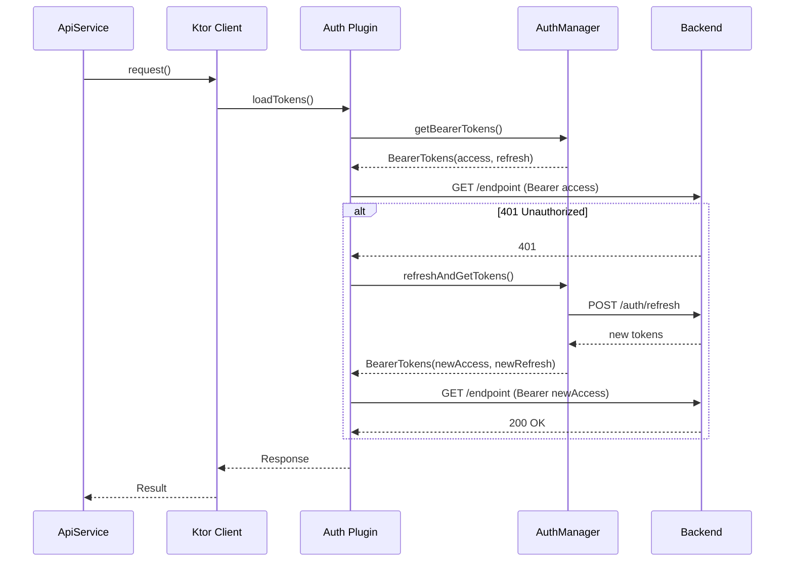

#android #red #infraestructura

# Capa de Red

> [!abstract] Resumen
> El cliente HTTP usa **Ktor 3.0.3 con motor OkHttp**, autenticación Bearer automática con refresh de tokens, y Kotlinx Serialization para JSON. Todo vive en `core/network/`.

---

## Configuración del Cliente

| Aspecto | Configuración |
|---------|--------------|
| Motor | OkHttp |
| Timeout | 30 segundos (connect, request, socket) |
| Content type | `application/json` |
| Serialización | Kotlinx Serialization (ignoreUnknownKeys) |
| Logging | HEADERS level |
| Auth | Bearer token plugin con refresh automático |
| Base URL | `https://api.solennix.com/api/` |

---

## Flujo de Autenticación HTTP



> [!important] Mutex en Refresh
> El refresh usa un `Mutex` para evitar múltiples refresh concurrentes cuando varias requests reciben 401 simultáneamente.

---

## Endpoints

### Autenticación

| Método | Endpoint | Descripción |
|--------|----------|-------------|
| POST | `/auth/login` | Login con email/password |
| POST | `/auth/register` | Registro de usuario |
| POST | `/auth/refresh` | Refresh de token |
| POST | `/auth/google` | Login con Google |
| POST | `/auth/apple` | Login con Apple |
| GET | `/auth/me` | Perfil del usuario actual |
| PUT | `/auth/change-password` | Cambiar contraseña |

### Clientes

| Método | Endpoint | Descripción |
|--------|----------|-------------|
| GET | `/clients` | Listar clientes |
| GET | `/clients/{id}` | Detalle de cliente |
| POST | `/clients` | Crear cliente |
| PUT | `/clients/{id}` | Actualizar cliente |
| DELETE | `/clients/{id}` | Eliminar cliente |

### Eventos

| Método | Endpoint | Descripción |
|--------|----------|-------------|
| GET | `/events` | Listar eventos |
| GET | `/events/upcoming` | Próximos eventos |
| GET | `/events/{id}` | Detalle de evento |
| POST | `/events` | Crear evento |
| PUT | `/events/{id}` | Actualizar evento |
| DELETE | `/events/{id}` | Eliminar evento |
| GET | `/events/{id}/products` | Productos del evento |
| POST | `/events/{id}/products` | Agregar producto |
| GET | `/events/{id}/extras` | Extras del evento |
| POST | `/events/{id}/extras` | Agregar extra |
| GET | `/events/{id}/equipment` | Equipamiento del evento |
| POST | `/events/{id}/equipment` | Agregar equipamiento |
| GET | `/events/{id}/supplies` | Insumos del evento |
| POST | `/events/{id}/supplies` | Agregar insumo |
| GET | `/events/{id}/photos` | Fotos del evento |
| POST | `/events/{id}/photos` | Subir foto |

### Productos

| Método | Endpoint | Descripción |
|--------|----------|-------------|
| GET | `/products` | Listar productos |
| GET | `/products/{id}` | Detalle de producto |
| POST | `/products` | Crear producto |
| PUT | `/products/{id}` | Actualizar producto |
| DELETE | `/products/{id}` | Eliminar producto |
| GET | `/products/{id}/ingredients` | Ingredientes del producto |
| POST | `/products/ingredients/batch` | Actualizar ingredientes en lote |

### Inventario

| Método | Endpoint | Descripción |
|--------|----------|-------------|
| GET | `/inventory` | Listar inventario |
| GET | `/inventory/{id}` | Detalle de item |
| POST | `/inventory` | Crear item |
| PUT | `/inventory/{id}` | Actualizar item |
| DELETE | `/inventory/{id}` | Eliminar item |

### Pagos

| Método | Endpoint | Descripción |
|--------|----------|-------------|
| GET | `/payments` | Listar pagos |
| GET | `/payments/{id}` | Detalle de pago |
| POST | `/payments` | Registrar pago |
| PUT | `/payments/{id}` | Actualizar pago |
| DELETE | `/payments/{id}` | Eliminar pago |

### Otros

| Método | Endpoint | Descripción |
|--------|----------|-------------|
| GET | `/unavailable-dates` | Fechas bloqueadas |
| GET | `/search` | Búsqueda global |
| POST | `/uploads/image` | Subir imagen |
| GET | `/subscriptions/status` | Estado de suscripción |

---

## Manejo de Errores

```kotlin
sealed class ApiError {
    data class Network(val message: String) : ApiError()
    data class Server(val code: Int, val message: String) : ApiError()
    data class Auth(val message: String) : ApiError()
    data object Unknown : ApiError()
}
```

> [!warning] Oportunidad de mejora
> No hay retry con exponential backoff para llamadas regulares (solo WorkManager lo tiene). No hay mapeo de errores server-specific para recovery contextual.

---

## Archivos Clave

| Archivo | Responsabilidad |
|---------|----------------|
| `core/network/KtorClient.kt` | Configuración del cliente HTTP |
| `core/network/AuthManager.kt` | Gestión de tokens y estado auth |
| `core/network/ApiService.kt` | Métodos de llamada a cada endpoint |
| `core/network/Endpoints.kt` | Constantes de URLs |
| `core/network/di/NetworkModule.kt` | Módulo Hilt para red |

---

## Relaciones

- [[Autenticación]] — flujo completo de auth y tokens
- [[Sistema de Tipos]] — modelos serializados
- [[Sincronización Offline]] — sync periódico via WorkManager
- [[Arquitectura General]] — ubicación en la arquitectura
