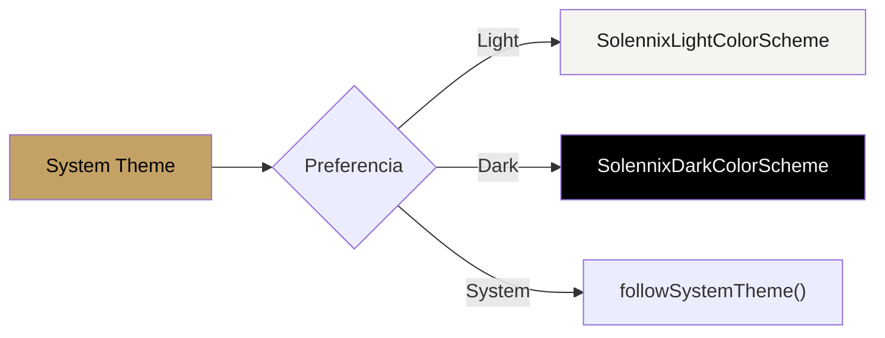

#android #design #ui #tema

# Design System

> [!abstract] Resumen
> Material 3 con tema personalizado Solennix. Paleta cálida (dorado + navy), soporte completo para light/dark/system, tipografía Material 3 estándar, y componentes custom adaptados a la marca.

---

## Paleta de Colores

### Brand

| Token | Hex | Uso |
|-------|-----|-----|
| Primary (Gold) | `#C4A265` | Acciones principales, acentos, marca |
| Primary Dark | `#A3854E` | Variante oscura del dorado |
| Primary Light | `#D4B87A` | Variante clara del dorado |
| On Primary | `#FFFFFF` | Texto sobre primary |

### Superficies

| Modo | Background | Surface | On Surface |
|------|-----------|---------|-----------|
| Light | `#F5F4F1` | `#FFFFFF` | `#1A1A1A` |
| Dark | `#000000` | `#1A1A1A` | `#F5F4F1` |

### Status

| Estado | Color | Hex |
|--------|-------|-----|
| Quoted | Naranja | `#D97706` |
| Confirmed | Azul | `#007AFF` |
| Completed | Verde | `#2D6A4F` |
| Cancelled | Rojo | `#FF3B30` |

### KPIs

| KPI | Color | Hex |
|-----|-------|-----|
| Revenue | Azul | `#007AFF` |
| Events | Verde | `#34C759` |
| Pending | Naranja | `#D97706` |
| Cash | Rojo | `#FF3B30` |

---

## Temas

| Opción | Descripción |
|--------|-------------|
| Light | Superficies crema/beige, texto oscuro |
| Dark | Superficies negras/navy, texto claro |
| System | Sigue la configuración del dispositivo |

> [!tip] Selección de tema
> El usuario elige su tema preferido en Settings. Se persiste en DataStore y se aplica con `CompositionLocal`.

---

## Tipografía

Se usa el sistema de tipografía de Material 3 sin modificaciones:

| Style | Uso en Solennix |
|-------|----------------|
| `displayLarge` | — |
| `displayMedium` | — |
| `headlineLarge` | Títulos de pantalla |
| `headlineMedium` | Secciones principales |
| `titleLarge` | Headers de cards |
| `titleMedium` | Subtítulos |
| `bodyLarge` | Texto principal |
| `bodyMedium` | Texto secundario |
| `labelLarge` | Botones |
| `labelMedium` | Chips, badges |

---

## Componentes Custom

| Componente | Descripción |
|-----------|-------------|
| `SolennixTopAppBar` | App bar con estilo de marca, back navigation |
| `SolennixTextField` | Text field con validación y estilo consistente |
| `StatusBadge` | Badge coloreado según EventStatus |
| `KPICard` | Card de KPI con ícono, valor, label y color |
| `UpgradeBanner` | Banner para promover upgrade de plan |
| `PremiumButton` | Botón con indicador de feature premium |
| `Avatar` | Avatar generado por hash o imagen de perfil |
| `SkeletonLoading` | Placeholder animado durante carga |
| `EmptyState` | Pantalla vacía con ícono, mensaje y CTA |
| `ToastOverlay` | Notificación temporal flotante |
| `ConfirmDialog` | Diálogo de confirmación estandarizado |

---

## Componentes Adaptativos

| Componente | Descripción |
|-----------|-------------|
| `AdaptiveCenteredContent` | Centra contenido con max-width en pantallas anchas |
| `AdaptiveFormRow` | Campos en columna (mobile) o fila (tablet) |
| `AdaptiveDetailLayout` | Layout de detalle que adapta a tamaño de pantalla |
| `AdaptiveCardGrid` | Grid que ajusta columnas según el ancho |

---

## Anti-Patrones

> [!danger] Prohibido
> - Gradientes cyan/purple estilo "AI"
> - Glassmorphism decorativo sin propósito
> - Grids genéricos de card ícono+heading+text
> - Estética fría de enterprise SaaS
> - Usar colores de status para decoración (solo para indicar estado real)

---

## Archivos Clave

| Archivo | Ubicación |
|---------|-----------|
| `Color.kt` | `core/designsystem/theme/` |
| `Theme.kt` | `core/designsystem/theme/` |
| `Type.kt` | `core/designsystem/theme/` |
| `SolennixTopAppBar.kt` | `core/designsystem/component/` |
| `SolennixTextField.kt` | `core/designsystem/component/` |
| `StatusBadge.kt` | `core/designsystem/component/` |
| `KPICard.kt` | `core/designsystem/component/` |

---

## Relaciones

- [[Componentes Compartidos]] — componentes reutilizables del design system
- [[Arquitectura General]] — módulo `core/designsystem`
- [[Módulo Dashboard]] — usa KPICard, StatusBadge
- [[Módulo Settings]] — selector de tema
