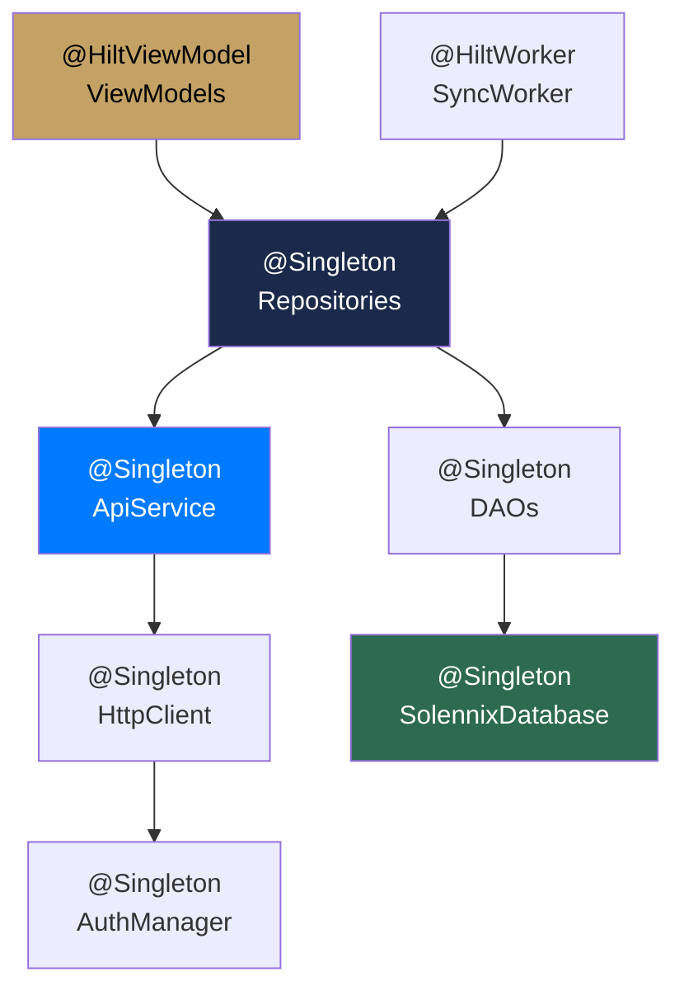

#android #hilt #di #infraestructura

# Inyección de Dependencias

> [!abstract] Resumen
> **Hilt (Dagger)** maneja toda la DI con módulos dedicados por capa. Los ViewModels usan `@HiltViewModel`, los repositorios son `@Singleton`, y WorkManager usa assisted injection.

---

## Módulos DI

| Módulo | Ubicación | Provee |
|--------|-----------|--------|
| `NetworkModule` | `core/network/di/` | Ktor HttpClient, AuthManager, ApiService |
| `DatabaseModule` | `core/database/di/` | Room Database, DAOs |
| `DataModule` | `core/data/di/` | Repositories |
| `DataStoreModule` | `core/data/di/` | DataStore Preferences |

---

## Grafo de Dependencias



---

## Scoping

| Scope | Uso | Ejemplo |
|-------|-----|---------|
| `@Singleton` | Una instancia para toda la app | Repositories, HttpClient, Database |
| `@HiltViewModel` | Scoped al lifecycle del NavBackStackEntry | Todos los ViewModels |
| `@HiltWorker` | Assisted injection para WorkManager | SyncWorker |
| `@ActivityRetainedScoped` | No usado actualmente | — |

---

## Ejemplo: NetworkModule

```kotlin
@Module
@InstallIn(SingletonComponent::class)
object NetworkModule {

    @Provides
    @Singleton
    fun provideAuthManager(
        @ApplicationContext context: Context
    ): AuthManager = AuthManager(context)

    @Provides
    @Singleton
    fun provideHttpClient(
        authManager: AuthManager
    ): HttpClient = createKtorClient(authManager)

    @Provides
    @Singleton
    fun provideApiService(
        client: HttpClient
    ): ApiService = ApiService(client)
}
```

---

## Archivos Clave

| Archivo | Ubicación |
|---------|-----------|
| `SolennixApp.kt` | `app/` — `@HiltAndroidApp` |
| `MainActivity.kt` | `app/` — `@AndroidEntryPoint` |
| `NetworkModule.kt` | `core/network/di/` |
| `DatabaseModule.kt` | `core/database/di/` |
| `DataModule.kt` | `core/data/di/` |

---

## Relaciones

- [[Arquitectura General]] — módulos y capas
- [[Capa de Red]] — NetworkModule provee el cliente HTTP
- [[Base de Datos Local]] — DatabaseModule provee Room y DAOs
- [[Manejo de Estado]] — ViewModels inyectados con Hilt
- [[Sincronización Offline]] — WorkManager con assisted injection
