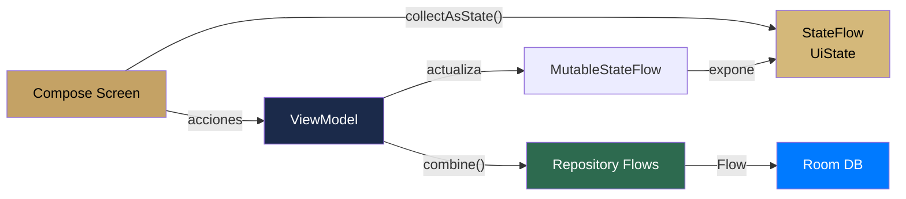

#android #estado #viewmodel

# Manejo de Estado

> [!abstract] Resumen
> El estado se maneja con **ViewModels de AndroidX + StateFlow/SharedFlow**. Cada pantalla tiene su ViewModel con un data class `*UiState` inmutable. Los repositorios exponen Flows de Room que la UI observa reactivamente.

---

## Estrategia por Capa

| Capa | Herramienta | Patrón |
|------|-----------|--------|
| **UI local** | `mutableStateOf` | Campos de formulario, toggles visuales |
| **Pantalla** | `StateFlow<UiState>` | Estado completo de la pantalla |
| **Eventos únicos** | `SharedFlow` | Navegación, toasts, errores |
| **Datos persistidos** | `Flow<List<T>>` (Room) | Listas reactivas desde la DB |
| **Preferencias** | `DataStore` | Settings del usuario |

---

## Patrón ViewModel



---

## ViewModels del Sistema

| ViewModel | Feature | Estado principal |
|-----------|---------|-----------------|
| `AuthViewModel` | auth | Login, registro, recovery, social auth |
| `DashboardViewModel` | dashboard | KPIs, próximos eventos, alertas stock |
| `EventListViewModel` | events | Lista filtrada de eventos |
| `EventFormViewModel` | events | Formulario multi-paso de evento |
| `EventDetailViewModel` | events | Detalle con tabs (productos, extras, equipo) |
| `EventChecklistViewModel` | events | Checklist con fotos |
| `ClientListViewModel` | clients | Lista de clientes con búsqueda |
| `ClientFormViewModel` | clients | Formulario de cliente |
| `ClientDetailViewModel` | clients | Detalle con eventos relacionados |
| `ProductListViewModel` | products | Lista de productos |
| `ProductFormViewModel` | products | Formulario con ingredientes |
| `ProductDetailViewModel` | products | Detalle con demanda |
| `InventoryListViewModel` | inventory | Lista con filtros por tipo |
| `InventoryFormViewModel` | inventory | Formulario de item |
| `InventoryDetailViewModel` | inventory | Detalle de stock |
| `CalendarViewModel` | calendar | Vista mensual/semanal |
| `SearchViewModel` | search | Búsqueda global indexada |
| `SettingsViewModel` | settings | Perfil, negocio, suscripción |

---

## Patrón UiState

```kotlin
data class EventListUiState(
    val events: List<Event> = emptyList(),
    val isLoading: Boolean = true,
    val isRefreshing: Boolean = false,
    val error: String? = null,
    val searchQuery: String = "",
    val statusFilter: EventStatus? = null
)
```

> [!tip] Convención
> Cada UiState es un `data class` inmutable con valores default. El ViewModel expone `StateFlow<UiState>` y la UI lo consume con `collectAsState()`.

---

## Composición de Flows

```kotlin
val uiState: StateFlow<DashboardUiState> = combine(
    eventRepository.getUpcomingEvents(),
    clientRepository.getAllClients(),
    inventoryRepository.getLowStockItems(),
    _isRefreshing
) { events, clients, lowStock, isRefreshing ->
    DashboardUiState(
        upcomingEvents = events.take(5),
        totalClients = clients.size,
        lowStockAlerts = lowStock,
        isRefreshing = isRefreshing
    )
}.stateIn(
    scope = viewModelScope,
    started = SharingStarted.WhileSubscribed(5000),
    initialValue = DashboardUiState()
)
```

> [!important] WhileSubscribed(5000)
> El timeout de 5 segundos evita cancelar el Flow durante rotaciones de pantalla, pero libera recursos cuando el usuario navega fuera.

> [!tip] Sincronización Automática vs iOS
> Gracias a este patrón de Flows reactivos conectados directamente a Room, **Android no requiere utilidades como NotificationCenter** para mantener el Dashboard al día. Cuando una vista secundaria graba un cambio en Room, la base de datos re-emite el Flow de inmediato y todas las Vistas que observen ese estado se refrescan por defecto (Single Source of Truth).

---

## Eventos de UI (One-Shot)

```kotlin
// En el ViewModel
private val _events = MutableSharedFlow<UiEvent>()
val events = _events.asSharedFlow()

sealed class UiEvent {
    data class ShowToast(val message: String) : UiEvent()
    data object NavigateBack : UiEvent()
    data class NavigateToDetail(val id: Int) : UiEvent()
}

// En el Composable
LaunchedEffect(Unit) {
    viewModel.events.collect { event ->
        when (event) {
            is UiEvent.ShowToast -> snackbarHostState.showSnackbar(event.message)
            is UiEvent.NavigateBack -> navController.popBackStack()
            is UiEvent.NavigateToDetail -> navController.navigate(Route.EventDetail(event.id))
        }
    }
}
```

---

## Pull-to-Refresh

Todas las pantallas de lista soportan pull-to-refresh:

```kotlin
// En el ViewModel
private val _isRefreshing = MutableStateFlow(false)

fun refresh() {
    viewModelScope.launch {
        _isRefreshing.value = true
        repository.syncFromRemote()
        _isRefreshing.value = false
    }
}
```

---

## Relaciones

- [[Arquitectura General]] — capas y flujo de datos
- [[Inyección de Dependencias]] — `@HiltViewModel` y scoping
- [[Base de Datos Local]] — Flows reactivos desde Room
- [[Navegación]] — eventos de navegación desde ViewModels
