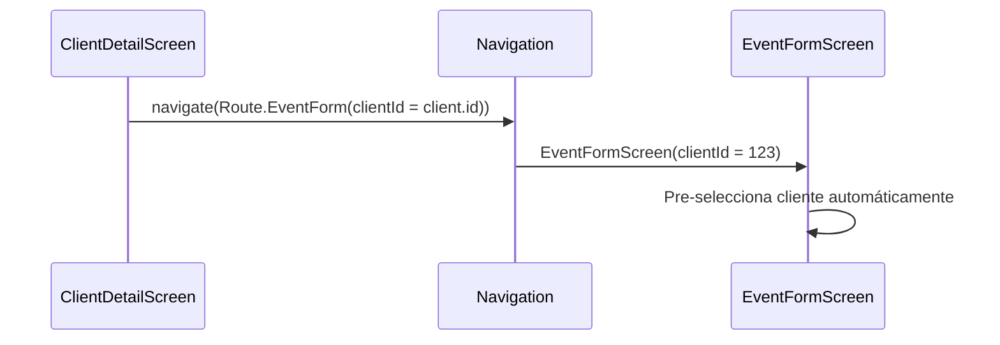

#android #dominio #clientes

# Módulo Clientes

> [!abstract] Resumen
> CRUD completo de clientes con analíticas (total eventos, total gastado), detalle con eventos relacionados, y flujo de cotización rápida integrado.

---

## Pantallas

| Pantalla | Archivo | Descripción |
|----------|---------|-------------|
| `ClientListScreen` | `feature/clients/ui/` | Lista con búsqueda |
| `ClientFormScreen` | `feature/clients/ui/` | Creación/edición |
| `ClientDetailScreen` | `feature/clients/ui/` | Detalle con eventos y analíticas |

---

## Campos del Cliente

| Campo | Tipo | Requerido |
|-------|------|-----------|
| Nombre | Text | Sí |
| Teléfono | Phone | No |
| Email | Email | No |
| Dirección | Text | No |
| Ciudad | Text | No |

---

## Analíticas del Cliente

| Métrica | Cálculo |
|---------|---------|
| Total de eventos | Conteo de eventos del cliente |
| Total gastado | Suma de pagos de todos sus eventos |

---

## Cotización Rápida

Desde el detalle de un cliente se puede crear un evento directamente:

---

## Archivos Clave

| Archivo | Ubicación |
|---------|-----------|
| `ClientListScreen.kt` | `feature/clients/ui/` |
| `ClientFormScreen.kt` | `feature/clients/ui/` |
| `ClientDetailScreen.kt` | `feature/clients/ui/` |
| `ClientListViewModel.kt` | `feature/clients/viewmodel/` |
| `ClientFormViewModel.kt` | `feature/clients/viewmodel/` |
| `ClientDetailViewModel.kt` | `feature/clients/viewmodel/` |
| `ClientRepository.kt` | `core/data/repository/` |

---

## Relaciones

- [[Módulo Eventos]] — un cliente tiene muchos eventos
- [[Módulo Pagos]] — pagos calculados por cliente
- [[Módulo Dashboard]] — conteo de clientes activos en KPIs
- [[Sistema de Tipos]] — modelo `Client`
