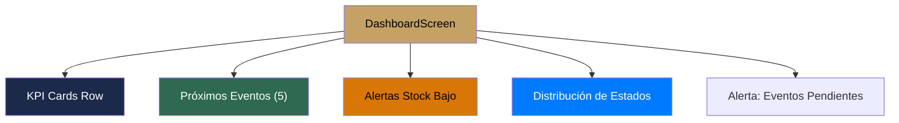

#android #dominio #dashboard

# Módulo Dashboard

> [!abstract] Resumen
> Panel principal con KPIs del negocio, próximos eventos, alertas de stock bajo y distribución de estados. Punto de entrada después del login.

---

## Pantallas

| Pantalla | Archivo | Descripción |
|----------|---------|-------------|
| `DashboardScreen` | `feature/dashboard/ui/` | Panel principal con métricas y resumen |

---

## KPIs Mostrados

| KPI | Cálculo | Color | Ícono |
|-----|---------|-------|-------|
| Ingresos totales | Suma de pagos | Azul `#007AFF` | AttachMoney |
| Eventos del mes | Conteo de eventos del período | Verde `#34C759` | Event |
| Clientes activos | Conteo total de clientes | Naranja `#D97706` | People |
| Efectivo pendiente | Total eventos - pagos recibidos | Rojo `#FF3B30` | Warning |

---

## Secciones del Dashboard



---

## Estado del ViewModel

```kotlin
data class DashboardUiState(
    val kpis: DashboardKPIs = DashboardKPIs(),
    val upcomingEvents: List<Event> = emptyList(),
    val lowStockItems: List<InventoryItem> = emptyList(),
    val eventStatusDistribution: Map<EventStatus, Int> = emptyMap(),
    val isLoading: Boolean = true,
    val isRefreshing: Boolean = false
)
```

> [!tip] Pull-to-Refresh
> El dashboard soporta pull-to-refresh que refresca todos los datos desde el backend.

---

## Onboarding Checklist

Para usuarios nuevos, el dashboard muestra un checklist de primeros pasos:

| Paso | Acción | Deep link |
|------|--------|-----------|
| 1 | Crear primer cliente | `Route.ClientForm()` |
| 2 | Agregar primer producto | `Route.ProductForm()` |
| 3 | Crear primer evento | `Route.EventForm()` |

---

## Relaciones

- [[Módulo Eventos]] — muestra próximos eventos
- [[Módulo Inventario]] — alertas de stock bajo
- [[Módulo Pagos]] — cálculo de KPIs financieros
- [[Módulo Clientes]] — conteo de clientes activos
- [[Manejo de Estado]] — DashboardViewModel con combine de Flows
