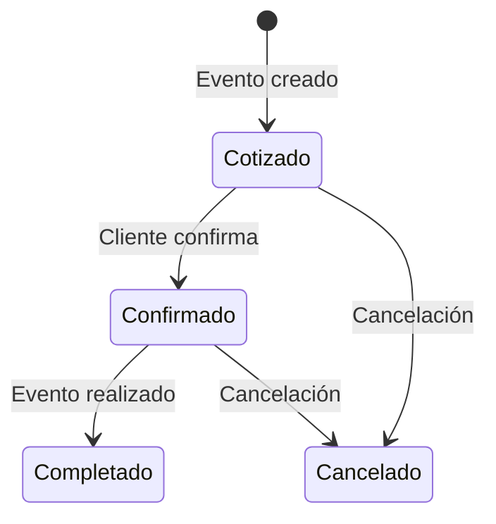
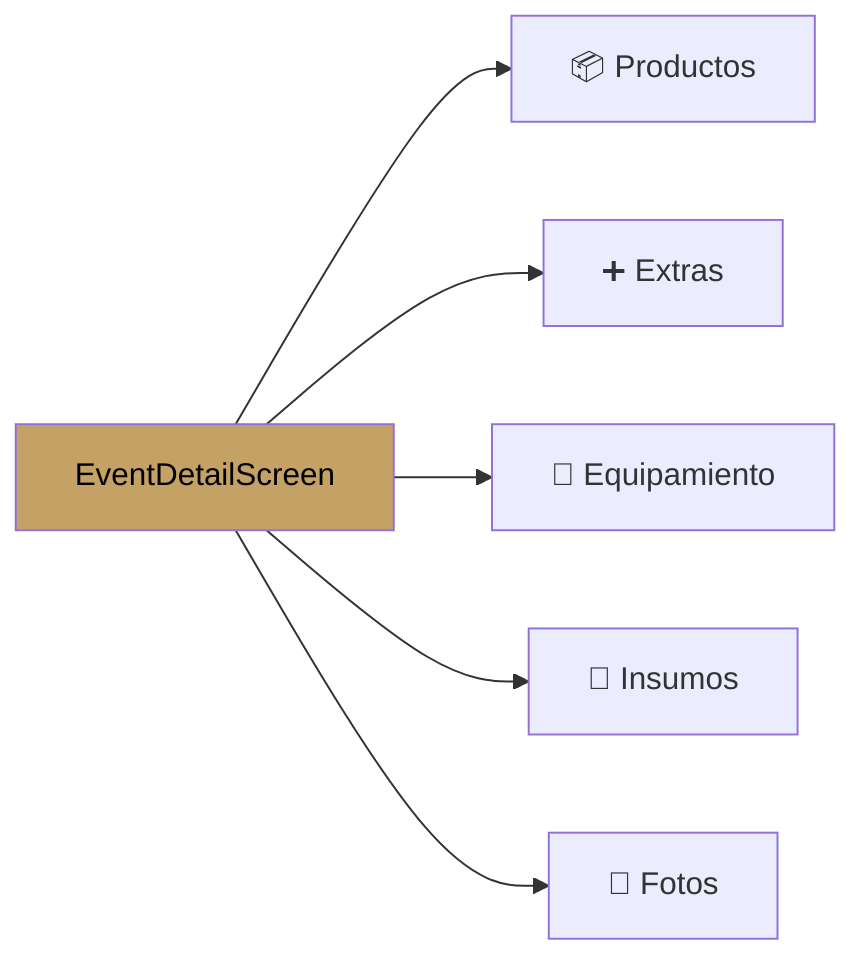
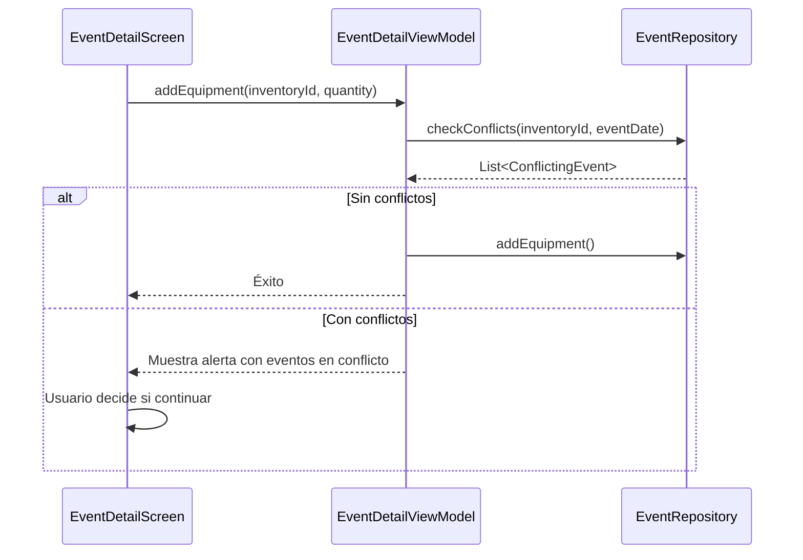

#android #dominio #eventos

# Módulo Eventos

> [!abstract] Resumen
> Módulo central del sistema. CRUD completo de eventos con formulario multi-campo, detalle con tabs (productos, extras, equipamiento, insumos, fotos), checklist con fotos, y generación de PDFs.

---

## Pantallas

| Pantalla | Archivo | Descripción |
|----------|---------|-------------|
| `EventListScreen` | `feature/events/ui/` | Lista de eventos con filtros por estado |
| `EventFormScreen` | `feature/events/ui/` | Creación/edición de evento |
| `EventDetailScreen` | `feature/events/ui/` | Detalle con tabs de sub-entidades |
| `EventChecklistScreen` | `feature/events/ui/` | Checklist de tareas con fotos |

---

## Ciclo de Vida del Evento

---

## Formulario de Evento

| Campo | Tipo | Requerido |
|-------|------|-----------|
| Cliente | Selector (de lista de clientes) | Sí |
| Tipo de servicio | Text | Sí |
| Fecha del evento | DatePicker | Sí |
| Hora inicio | TimePicker | No |
| Hora fin | TimePicker | No |
| Lugar | Text | No |
| Notas | TextArea | No |
| Estado | Selector (EventStatus) | Sí |
| Depósito % | Number | No (usa default del usuario) |
| Días de cancelación | Number | No (usa default) |
| Reembolso % | Number | No (usa default) |

---

## Detalle del Evento — Tabs

### Tab Productos

| Acción | Descripción |
|--------|-------------|
| Agregar | Selecciona producto del catálogo + cantidad + precio + descuento |
| Editar | Modifica cantidad, precio unitario, descuento |
| Eliminar | Quita producto del evento |
| Sugerencias | Sugiere equipamiento/insumos basado en productos |

### Tab Extras

| Campo | Descripción |
|-------|-------------|
| Descripción | Nombre del extra ad-hoc |
| Costo | Costo para el organizador |
| Precio | Precio cobrado al cliente |
| Excluir utilidad | No incluir en cálculo de margen |

### Tab Equipamiento

| Acción | Descripción |
|--------|-------------|
| Agregar | Selecciona item de inventario tipo EQUIPMENT |
| Conflictos | Detecta si el equipo ya está asignado a otro evento en la misma fecha |
| Notas | Notas específicas del uso |

### Tab Insumos

| Campo | Descripción |
|-------|-------------|
| Item | Selecciona item de inventario tipo SUPPLY/INGREDIENT |
| Cantidad | Cantidad necesaria |
| Costo unitario | Costo del insumo |
| Fuente | De dónde se obtiene |
| Excluir costo | No incluir en cálculo de costo |

### Tab Fotos

| Acción | Descripción |
|--------|-------------|
| Subir | Captura o selecciona foto del dispositivo |
| Caption | Agrega descripción a la foto |
| Galería | Vista de galería de fotos del evento |

---

## Detección de Conflictos de Equipamiento

---

## Generación de PDFs

Desde el detalle del evento se pueden generar múltiples documentos:

| Documento | Contenido |
|-----------|-----------|
| Presupuesto | Productos + extras + totales |
| Contrato | Términos + condiciones del usuario |
| Factura | Detalle de pagos y saldos |
| Lista de compras | Insumos necesarios |
| Checklist | Tareas pendientes del evento |
| Lista de equipamiento | Equipo asignado |
| Reporte de pagos | Historial de abonos |

> [!warning] Dependencia faltante
> El código de generación de PDF existe (`InvoicePdfGenerator`, etc.) pero no se ha importado una librería de PDF. La funcionalidad puede fallar en runtime.

---

## ViewModels

| ViewModel | Responsabilidad |
|-----------|----------------|
| `EventListViewModel` | Lista, filtros, búsqueda, refresh |
| `EventFormViewModel` | Validación, creación/edición, defaults |
| `EventDetailViewModel` | Detalle, tabs, productos, extras, equipo, insumos, fotos |
| `EventChecklistViewModel` | Tareas, completado, fotos del checklist |

---

## Archivos Clave

| Archivo | Ubicación |
|---------|-----------|
| `EventListScreen.kt` | `feature/events/ui/` |
| `EventFormScreen.kt` | `feature/events/ui/` |
| `EventDetailScreen.kt` | `feature/events/ui/` |
| `EventChecklistScreen.kt` | `feature/events/ui/` |
| `EventListViewModel.kt` | `feature/events/viewmodel/` |
| `EventFormViewModel.kt` | `feature/events/viewmodel/` |
| `EventDetailViewModel.kt` | `feature/events/viewmodel/` |
| `EventRepository.kt` | `core/data/repository/` |

---

## Relaciones

- [[Módulo Clientes]] — cada evento pertenece a un cliente
- [[Módulo Productos]] — productos asignados al evento
- [[Módulo Inventario]] — equipamiento e insumos asignados
- [[Módulo Pagos]] — pagos registrados contra el evento
- [[Sistema de PDFs]] — generación de documentos
- [[Módulo Calendario]] — visualización temporal de eventos
