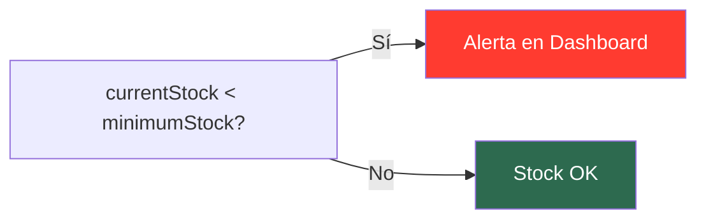

#android #dominio #inventario

# Módulo Inventario

> [!abstract] Resumen
> Control de artículos físicos clasificados por tipo: **equipamiento** (reutilizable), **insumos** (consumibles) e **ingredientes**. Seguimiento de stock actual vs. mínimo con alertas en dashboard.

---

## Pantallas

| Pantalla | Archivo | Descripción |
|----------|---------|-------------|
| `InventoryListScreen` | `feature/inventory/ui/` | Lista con filtros por tipo |
| `InventoryFormScreen` | `feature/inventory/ui/` | Creación/edición de item |
| `InventoryDetailScreen` | `feature/inventory/ui/` | Detalle de stock y uso |

---

## Tipos de Inventario

| Tipo | Enum | Descripción | Ejemplo |
|------|------|-------------|---------|
| Equipamiento | `EQUIPMENT` | Artículos reutilizables | Mesas, sillas, manteles |
| Insumo | `SUPPLY` | Material consumible | Globos, servilletas, velas |
| Ingrediente | `INGREDIENT` | Para recetas de productos | Harina, azúcar, crema |

---

## Campos del Item

| Campo | Tipo | Requerido |
|-------|------|-----------|
| Nombre | Text | Sí |
| Tipo | Selector (InventoryType) | Sí |
| Stock actual | Number | Sí |
| Stock mínimo | Number | Sí |
| Unidad | Text | Sí |
| Costo unitario | Decimal | No |

---

## Alertas de Stock Bajo

> [!tip] Dashboard
> Los items con stock bajo aparecen automáticamente en la sección de alertas del [[Módulo Dashboard]].

---

## Archivos Clave

| Archivo | Ubicación |
|---------|-----------|
| `InventoryListScreen.kt` | `feature/inventory/ui/` |
| `InventoryFormScreen.kt` | `feature/inventory/ui/` |
| `InventoryDetailScreen.kt` | `feature/inventory/ui/` |
| `InventoryListViewModel.kt` | `feature/inventory/viewmodel/` |
| `InventoryFormViewModel.kt` | `feature/inventory/viewmodel/` |
| `InventoryDetailViewModel.kt` | `feature/inventory/viewmodel/` |
| `InventoryRepository.kt` | `core/data/repository/` |

---

## Relaciones

- [[Módulo Eventos]] — equipamiento e insumos se asignan a eventos
- [[Módulo Productos]] — ingredientes linkeados a recetas
- [[Módulo Dashboard]] — alertas de stock bajo
- [[Sistema de Tipos]] — modelo `InventoryItem`, enum `InventoryType`
