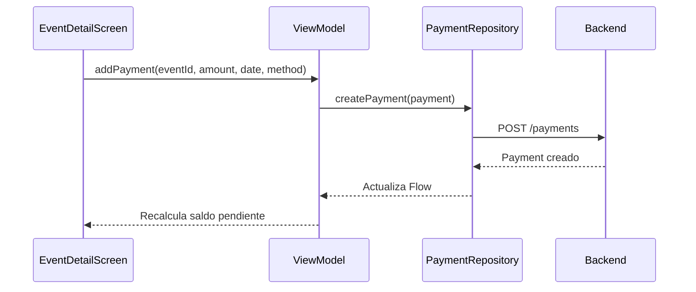

#android #dominio #pagos

# Módulo Pagos

> [!abstract] Resumen
> Registro de pagos vinculados a eventos. Soporta pagos parciales (abonos) con seguimiento de saldo pendiente. Sin integración directa con pasarela de pago — el registro es manual.

---

## Campos del Pago

| Campo | Tipo | Requerido |
|-------|------|-----------|
| Evento | Selector (de lista) | Sí |
| Monto | Decimal | Sí |
| Fecha de pago | DatePicker | Sí |
| Método de pago | Text | No |
| Notas | TextArea | No |

---

## Flujo de Pagos

---

## Cálculos Financieros

| Métrica | Fórmula |
|---------|---------|
| Total del evento | Σ(productos × precio) + Σ(extras) |
| Total pagado | Σ(pagos del evento) |
| Saldo pendiente | Total del evento - Total pagado |
| Depósito requerido | Total del evento × depositPercent% |

---

## Diferencia con Web

> [!warning] Sin Stripe
> A diferencia de la Web que tiene integración con Stripe, Android registra pagos de forma **manual**. No hay procesamiento de tarjetas ni links de pago. Los pagos se registran como constancia de lo cobrado en efectivo, transferencia, etc.

---

## Archivos Clave

| Archivo | Ubicación |
|---------|-----------|
| `PaymentRepository.kt` | `core/data/repository/` |

> [!info] Sin pantalla dedicada
> Los pagos se gestionan desde el detalle del evento, no tienen pantalla de lista propia en Android.

---

## Relaciones

- [[Módulo Eventos]] — pagos vinculados a eventos
- [[Módulo Dashboard]] — KPIs financieros (ingresos, pendiente)
- [[Sistema de PDFs]] — reporte de pagos en PDF
- [[Sistema de Tipos]] — modelo `Payment`
