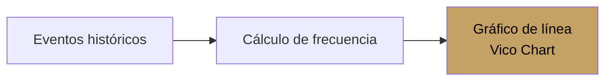

#android #dominio #productos

# Módulo Productos

> [!abstract] Resumen
> Catálogo de productos/servicios con recetas de ingredientes, estado activo/inactivo, y gráfico de demanda predictiva (Vico charts).

---

## Pantallas

| Pantalla | Archivo | Descripción |
|----------|---------|-------------|
| `ProductListScreen` | `feature/products/ui/` | Catálogo con búsqueda |
| `ProductFormScreen` | `feature/products/ui/` | Creación/edición con ingredientes |
| `ProductDetailScreen` | `feature/products/ui/` | Detalle con receta y demanda |

---

## Campos del Producto

| Campo | Tipo | Requerido |
|-------|------|-----------|
| Nombre | Text | Sí |
| Categoría | Text | Sí |
| Precio base | Decimal | Sí |
| Imagen | Image URL | No |
| Receta / Notas | TextArea | No |
| Activo | Boolean | Sí (default: true) |

---

## Receta / Ingredientes

Cada producto puede tener una lista de ingredientes:

| Campo | Tipo | Descripción |
|-------|------|-------------|
| Nombre | Text | Nombre del ingrediente |
| Cantidad | Decimal | Cantidad necesaria |
| Unidad | Text | Unidad de medida (kg, L, pz) |

> [!tip] Batch update
> Los ingredientes se actualizan en lote via `POST /products/ingredients/batch` para evitar múltiples llamadas.

---

## Demanda Predictiva

El detalle del producto incluye un gráfico de demanda (Vico charts v2.0.0-alpha):

---

## Archivos Clave

| Archivo | Ubicación |
|---------|-----------|
| `ProductListScreen.kt` | `feature/products/ui/` |
| `ProductFormScreen.kt` | `feature/products/ui/` |
| `ProductDetailScreen.kt` | `feature/products/ui/` |
| `ProductListViewModel.kt` | `feature/products/viewmodel/` |
| `ProductFormViewModel.kt` | `feature/products/viewmodel/` |
| `ProductDetailViewModel.kt` | `feature/products/viewmodel/` |
| `ProductRepository.kt` | `core/data/repository/` |

---

## Relaciones

- [[Módulo Eventos]] — productos se asignan a eventos
- [[Módulo Inventario]] — ingredientes del producto linkeados a inventario
- [[Sistema de Tipos]] — modelo `Product`, `Ingredient`
