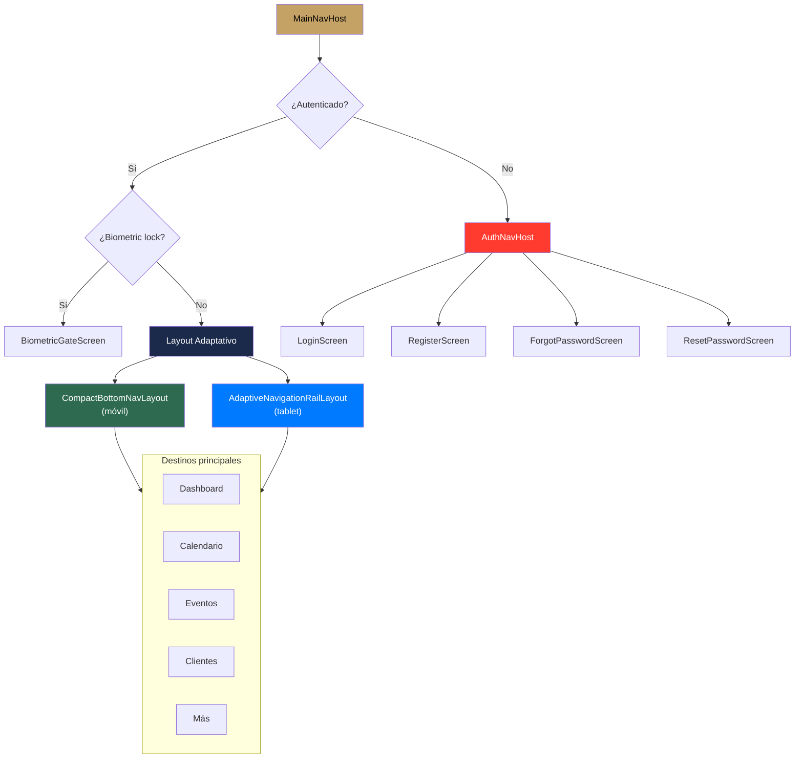
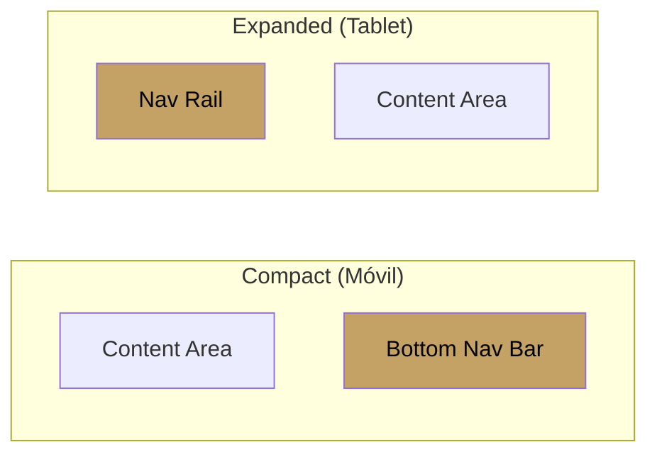

#android #navegación #compose

# Navegación

> [!abstract] Resumen
> Compose Navigation con **rutas type-safe** usando `@Serializable`. Layout adaptativo: bottom navigation bar en pantallas compactas, navigation rail en tablets. Deep links con esquema `solennix://`.

---

## Estructura de Navegación



---

## Rutas Type-Safe

```kotlin
@Serializable
sealed class Route {
    // Auth
    @Serializable data object Login : Route()
    @Serializable data object Register : Route()
    @Serializable data object ForgotPassword : Route()
    @Serializable data class ResetPassword(val token: String) : Route()

    // Main tabs
    @Serializable data object Home : Route()
    @Serializable data object Calendar : Route()
    @Serializable data object Events : Route()
    @Serializable data object Clients : Route()
    @Serializable data object More : Route()

    // Detail / Form
    @Serializable data class EventDetail(val id: Int) : Route()
    @Serializable data class EventForm(val id: Int? = null, val clientId: Int? = null) : Route()
    @Serializable data class ClientDetail(val id: Int) : Route()
    @Serializable data class ClientForm(val id: Int? = null) : Route()
    @Serializable data class ProductDetail(val id: Int) : Route()
    @Serializable data class ProductForm(val id: Int? = null) : Route()
    @Serializable data class InventoryDetail(val id: Int) : Route()
    @Serializable data class InventoryForm(val id: Int? = null) : Route()

    // Others
    @Serializable data object Search : Route()
    @Serializable data object Settings : Route()
    @Serializable data object Products : Route()
    @Serializable data object Inventory : Route()
}
```

> [!tip] Convención
> Las rutas de formulario aceptan `id: Int? = null` — si es `null` es creación, si tiene valor es edición.

---

## Deep Links

| Esquema | Ruta | Pantalla |
|---------|------|----------|
| `solennix://` | `client/{id}` | Detalle de cliente |
| `solennix://` | `event/{id}` | Detalle de evento |
| `solennix://` | `product/{id}` | Detalle de producto |
| `solennix://` | `new-event` | Formulario de evento nuevo |
| `solennix://` | `calendar` | Vista de calendario |
| `solennix://` | `quick-quote` | Cotización rápida |

---

## Layout Adaptativo

| Ancho de pantalla | Layout | Navegación |
|-------------------|--------|-----------|
| Compact (< 600dp) | `CompactBottomNavLayout` | Bottom Navigation Bar |
| Medium/Expanded (≥ 600dp) | `AdaptiveNavigationRailLayout` | Navigation Rail lateral |



> [!important] Window Size Classes
> Se usa `calculateWindowSizeClass()` de Material 3 para determinar el layout en runtime. Esto soporta correctamente split-screen y foldables.

---

## Destinos del Bottom Nav

| Destino | Ícono | Ruta |
|---------|-------|------|
| Inicio | Home | `Route.Home` |
| Calendario | CalendarToday | `Route.Calendar` |
| Eventos | Event | `Route.Events` |
| Clientes | People | `Route.Clients` |
| Más | MoreHoriz | `Route.More` |

---

## Archivos Clave

| Archivo | Ubicación |
|---------|-----------|
| `MainNavHost.kt` | `app/` |
| `Route.kt` | `app/ui/navigation/` |
| `AuthNavHost.kt` | `app/ui/navigation/` |
| `CompactBottomNavLayout.kt` | `app/ui/navigation/` |
| `AdaptiveNavigationRailLayout.kt` | `app/ui/navigation/` |
| `TopLevelDestination.kt` | `app/ui/navigation/` |

---

## Relaciones

- [[Autenticación]] — flujo de auth determina el grafo inicial
- [[Manejo de Estado]] — ViewModels emiten eventos de navegación
- [[Arquitectura General]] — estructura de módulos feature
- [[Widgets y Servicios]] — deep links desde widgets
