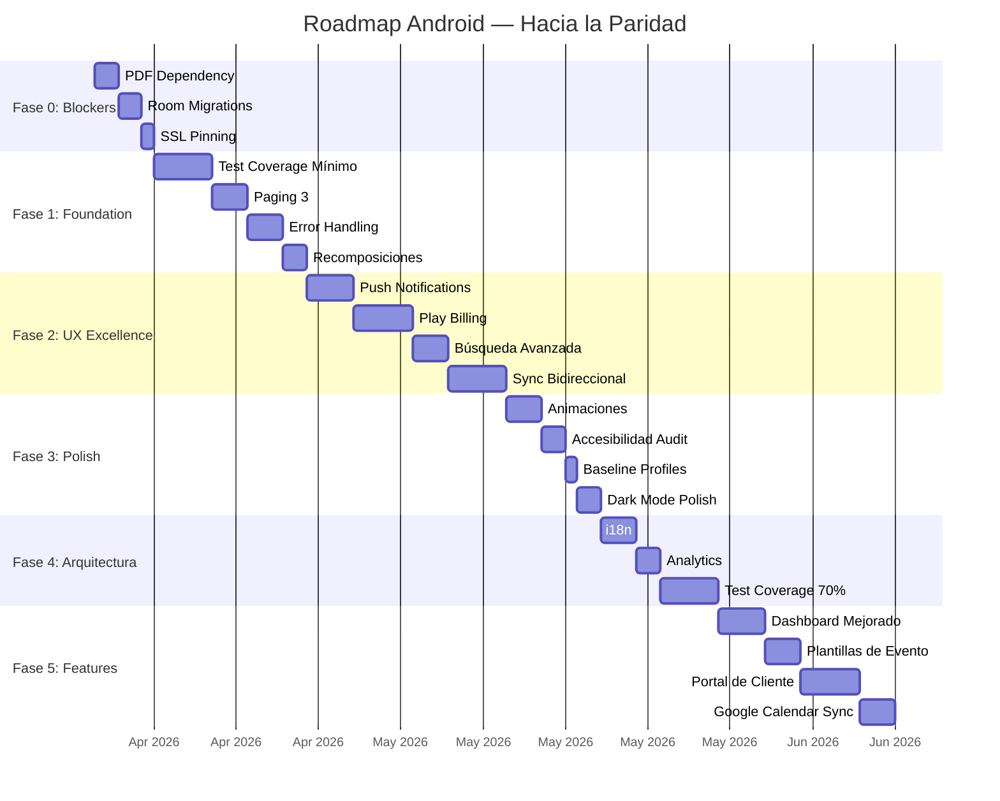

#android #roadmap #mejoras

# Roadmap Android — Hacia la Paridad y Más Allá

> [!success] 🆕 Actualizado 2026-05-12 — baseline de testing documentado (56 tests, 0 fallos) + plan de hardening incremental
> Ver [[../00_DASHBOARD|Dashboard]] para el panorama completo.
>
> **Hitos recientes:**
> - Baseline de tests Android medido y consolidado en docs
> - Matriz de gaps por módulo (4/19 con tests)
> - Roadmap de hardening en 4 fases listo para ejecución
> - Dashboard KPIs consume backend — zero client-side aggregation
> - Revenue chart 6 meses (premium-only)
> - Personal completo: CRUD + turnos + equipos + product+staff
> - Portal Cliente: `ClientPortalShareBottomSheet` + `ACTION_SEND`
> - Events list: sort, row actions, inline status change
> - Event form: optional times, guest stepper, inline extras
> - i18n foundation: `strings.xml` ES/EN (Calendar)
> - CI: Android job activo (gradle test + assembleDebug)
> - Google Play compliance: account deletion + privacy policy
> - Android v1.1.2 submitted to Play Store

> [!todo] Próximos sprints Android
> - ~~**Sprint 7.B** — `UpgradePlanDialog` wiring cuando API devuelve 403 `plan_limit_exceeded`.~~ ✅ Cerrado 2026-04-26. `SolennixException.PlanLimitExceeded` + wired en Event/Client/Product form ViewModels + Screens.
> - **Sprint 7.C** — Enforcement tier matrix completo.
> - **i18n** — Extraer Dashboard + Events strings (issues #94, #95).
> - **Quality Sprint 1** — cubrir `core/model`, `core/database`, `feature/auth` con unit tests.

> [!tip] Filosofía
> Priorizado por **impacto en usuario** × **esfuerzo técnico**. Alineado con el [[Roadmap Web]] para mantener paridad cross-platform. Las fases son incrementales — cada una deja la app shippable.

---

## Baseline de Testing (2026-05-12)

> [!info] Estado verificado por ejecución
> - **56 tests** unitarios totales (debug+release)
> - **0 failures**, **0 errors**, **0 skipped**
> - **4/19 módulos** Android con tests actualmente
> - **Sin `androidTest` detectados** en el repo

| Módulo | Tests debug | Tests release | Total |
| ------ | ----------: | ------------: | ----: |
| `core/data` | 7 | 7 | 14 |
| `core/network` | 6 | 6 | 12 |
| `feature/dashboard` | 8 | 8 | 16 |
| `feature/events` | 7 | 7 | 14 |
| **Total** | **28** | **28** | **56** |

### Gap estructural actual

- Módulos con tests: `core/data`, `core/network`, `feature/dashboard`, `feature/events`
- Módulos sin tests (15): `app`, `baselineprofile`, `core/database`, `core/designsystem`, `core/model`, `feature/auth`, `feature/calendar`, `feature/clients`, `feature/inventory`, `feature/payments`, `feature/products`, `feature/search`, `feature/settings`, `feature/staff`, `widget`

### Plan incremental de hardening

1. **Fase 1**: `core/model`, `core/database`, `feature/auth`
2. **Fase 2**: `feature/clients`, `feature/products`, `feature/inventory`
3. **Fase 3**: smoke tests `androidTest` (login + dashboard)
4. **Fase 4**: gate de cobertura gradual por módulo

---

## ⚠️ Wave Rescate Play Store (2026-04-11 → en curso)

> [!danger] Los docs estaban desincronizados con el código
> Auditoría cruzada en 2026-04-11 detectó que varios items marcados como "✅" en este Roadmap y en [[../PRD/11_CURRENT_STATUS]] **no existían en el código**. Se inició un Wave Rescate de 6 bloques para llevar la app a Play Store. Los items corregidos en este doc tienen un recordatorio histórico para evitar que vuelva a pasar.

| Bloque | Descripción                              | Estado                                     | Commit      |
| ------ | ---------------------------------------- | ------------------------------------------ | ----------- |
| **A**  | Keystore/secrets fail-fast               | ✅ Infra lista, acciones manuales pendientes | `f003a0b`   |
| **B**  | SSL Pinning real                         | ✅ Infra lista, usuario debe generar pins   | `3d2a763`   |
| **C**  | Play Billing wire-up real                | ✅ Completo                                 | `b75881c`   |
| **D**  | Error handling con Snackbar "Reintentar" | ✅ Slices 1+2 (CRUD + EventForm load)       | `d8c77bd`   |
| **D.3** | Secondary fetches silenciosos           | ⏳ Deferido                                 | —           |
| **E**  | Defensive validations                    | ⏭️ Mayormente ruido del audit inicial       | —           |
| **F**  | Sync docs final                          | ✅ Completado                               | este commit |

### Wave Rescate 2 (2026-04-11 — login + suscripción + i18n cleanup)

| Ítem                                                        | Descripción                                                                                              | Estado |
| ----------------------------------------------------------- | -------------------------------------------------------------------------------------------------------- | ------ |
| **G.1** Google Sign-In oficial                              | Drawable vectorial multicolor en `feature/auth/res/drawable/ic_google_logo.xml`; botón rearmado siguiendo branding guidelines (fondo blanco, texto `#3C4043`, logo 20dp, loading reemplaza logo, `autoSelectEnabled=true`) | ✅ |
| **G.2** Apple Sign-In oficial                               | Drawable `ic_apple_logo.xml` reemplazando el emoji 🍎 que había en el botón                              | ✅ |
| **G.3** Strings con acentos + voseo Rioplatense (feature/auth) | LoginScreen, RegisterScreen, ForgotPasswordScreen, ResetPasswordScreen, BiometricGateScreen, AppleSignInButton normalizados | ✅ |
| **G.4** SubscriptionScreen accent sweep                     | Todos los textos ("Suscripción", "Elegí tu plan", "Básico", "Ahorrá 20%", "/año", FAQs, instrucciones de cancelación cross-platform) con acentos correctos | ✅ |
| **G.5** Zombie Pro package cleanup                          | `SubscriptionViewModel.proPackages` eliminado; `SubscriptionScreen` solo renderea Básico + Premium. `hasProAccess()` se mapea a `"Premium"` para legacy customers | ✅ |
| **G.6** Purchase loading state                              | `BillingManager.purchaseInProgress: StateFlow<String?>` emite el identifier del package en vuelo; `PlanCard` muestra spinner + "Procesando..." y deshabilita clicks para evitar double-tap | ✅ |
| **G.7** Billing errors retryable                            | `SubscriptionViewModel` expone `uiEvents: SharedFlow<UiEvent>` + `onRetry`; `BillingManager.retryFetchOfferings()` reutilizable. `SubscriptionScreen` integra `UiEventSnackbarHandler` y muestra botón "Reintentar" tanto en Snackbar como en la Card de error | ✅ |
| **G.8** Accent sweep cross-feature                          | CalendarScreen ("día" x2, "¿Estás seguro?"), ContractDefaultsScreen + BusinessSettingsScreen (tokens/logo/nombre comercial), EventListScreen ("Todo el día" x2 + TalkBack), EventFormViewModel ("fecha está marcada"), DashboardScreen ("Potenciá... Premium... más"), ClientDetailScreen ("¿Eliminar... acción...") | ✅ |

### Acciones manuales pendientes del usuario

1. Rotar el password del keystore (`asd123` → fuerte) — ver [[Firma y Secretos de Release#Rotar el password del keystore existente]]
2. Configurar `REVENUECAT_API_KEY` real en `~/.gradle/gradle.properties`
3. Generar `SOLENNIX_SSL_PINS` con openssl y setearlos — ver [[Firma y Secretos de Release#SSL Pinning]]
4. Probar `./gradlew :app:bundleRelease` end-to-end
5. Testear SSL pinning con Charles/mitmproxy
6. Rotar y guardar el upload key en password manager

### Lecciones aprendidas del audit

1. **NUNCA confiar en docs sobre estado del código**. `git ls-files`, `grep`, y leer el archivo son la única fuente de verdad.
2. **Los audits pueden ver síntomas sin ver el sistema**. El audit inicial dijo "Play Billing no implementado — CRÍTICO" basándose en un `TODO` en `PricingScreen:168`. Pero 300+ líneas arriba ya existía `BillingManager` al 100%. Falta de contexto → diagnóstico erróneo.
3. **`catch (_: Exception) {}` es un smell grave**. Cada silent catch que detectamos era un caso donde el usuario perdía trabajo sin enterarse. El pattern `UiEvent` en `core:designsystem` es la forma correcta.
4. **Fail-fast en build vale más que warnings en docs**. El `build.gradle.kts` que refuse a compilar release sin signing config + RevenueCat key + SSL pins es mejor garantía que cualquier checklist.

---

## Estado de Paridad con Web

| Feature                     | Web            | Android                 | Gap              |
| --------------------------- | -------------- | ----------------------- | ---------------- |
| CRUD Eventos                | ✅             | ✅                      | —                |
| CRUD Clientes               | ✅             | ✅                      | —                |
| CRUD Productos              | ✅             | ✅                      | —                |
| CRUD Inventario             | ✅             | ✅                      | —                |
| Registro de pagos           | ✅             | ✅                      | —                |
| Calendario                  | ✅             | ✅                      | —                |
| Dashboard con KPIs          | ✅             | ✅                      | —                |
| Generación de PDFs          | ✅ Funcional   | ✅ Nativo (PdfDocument) | **Fase 0 OK**    |

| Onboarding checklist        | ✅             | ✅                      | —                |
| Cotización rápida           | ✅             | ✅                      | —                |
| Detección conflictos equipo | ✅             | ✅                      | —                |
| Sugerencias equipo/insumos  | ✅             | ✅                      | —                |
| Búsqueda global             | ✅             | ✅ + App Search         | Android adelante |
| Dark mode                   | ✅             | ✅                      | —                |
| **Google Sign-In**          | ✅             | ✅ CredentialManager    | **✅ DONE**      |
| **Apple Sign-In**           | ✅             | ✅ Apple SDK OAuth      | **✅ DONE**      |
| Auth biométrica             | ❌             | ✅                      | Android adelante |
| Widgets home screen         | ❌             | ✅                      | Android adelante |
| Quick Settings tile         | ❌             | ✅                      | Android adelante |
| Deep links                  | ❌             | ✅                      | Android adelante |
| Offline-first               | ❌             | ✅ (completo p/Eventos) | Android adelante |
| React Query / cache         | 🔄 En progreso | N/A (Room)              | —                |
| Push notifications          | ❌             | ✅ Activo (Firebase)    | **Fase 2 OK**    |
| Test coverage               | ❌ 0%          | 🔄 Baseline 56 tests (4/19 módulos) | Ambos            |
| i18n                        | ❌             | ❌                      | Ambos            |
| Analytics                   | ❌             | ❌                      | Ambos            |
| Suscripciones (billing)     | ❌             | ✅ RevenueCat OK        | **Fase 2 OK**    |

---

## Fase 0: Blockers Críticos (Pre-Release)

> [!warning] Estado real — audit 2026-04-11 (Wave Rescate Play Store)
> Los items 0.1 y 0.2 están bien. Item 0.3 (SSL Pinning) estaba marcado como ✅ pero NO estaba en el código — detectado en el audit del Bloque B. Ahora resuelto con fail-fast en release. Ver [[Firma y Secretos de Release]].

### 0.1 Resolver Dependencia de PDFs ✅

- [x] Elegir librería: `Android PdfDocument` (nativo)
- [x] Integrar en `build.gradle.kts` (no requiere deps externas)
- [x] Verificar que los 7 generadores de PDF funcionan en runtime
- [x] Testear share sheet con PDFs generados

**Por qué**: Resuelto usando la API nativa de Android para máxima ligereza.

### 0.2 Migraciones de Room Incrementales ✅

- [x] Reemplazar `fallbackToDestructiveMigration` por migraciones versionadas
- [x] Crear `Migration(4, 5)` como template
- [x] Documentar proceso de migración para futuros cambios de schema

### 0.3 SSL Pinning ✅ (resuelto en Wave Rescate Bloque B — 2026-04-11)

- [x] Configurar `CertificatePinner` en OkHttp/Ktor (`KtorClient.kt`)
- [x] Pins resueltos desde env var `SOLENNIX_SSL_PINS` o gradle property
- [x] `BuildConfig.SSL_PINS` + `BuildConfig.API_HOST` emitidos por `core/network`
- [x] Fail-fast en release si faltan <2 pins
- [x] `ApiError.SecurityError` con mapeo de `SSLPeerUnverifiedException` / `SSLHandshakeException`
- [x] Docs en [[Firma y Secretos de Release]] con openssl commands para generar pins
- [ ] **Pendiente del usuario**: generar pins reales contra `api.solennix.com` y setearlos en `~/.gradle/gradle.properties`

> [!note] Estado histórico
> Antes del 2026-04-11 este item estaba marcado como ✅ sin el código correspondiente. Es un recordatorio de por qué los docs tienen que sincronizarse con la realidad del repo.

---

## Fase 1: Foundation (Estabilidad y Robustez) ✅

> [!success] Impacto: Alto | Esfuerzo: Medio
> Base sólida para todo lo que viene después.

### 1.1 Test Coverage Mínimo ✅

- [x] Setup: JUnit 5 + MockK + Turbine + Hilt Testing
- [x] Tests para `AuthManager` (tokens, refresh, biometric state)
- [x] Tests para repositories (sync logic, entity mapping)
- [x] Tests para ViewModels clave de Dashboard y Events
- [ ] Tests para módulos críticos restantes (`feature/auth`, `feature/clients`, `feature/products`, `feature/inventory`)
- [🔄] Target incremental: pasar de 4/19 a 7/19 módulos con tests (Fase 1)

### 1.2 Paginación con Paging 3 ✅

- [x] Integrar Paging 3 + room-paging
- [x] Paginar EventList (mayor volumen de datos)
- [x] Loading indicators en scroll

### 1.3 Error Handling Robusto ✅

- [x] Retry con exponential backoff (HttpRequestRetry)
- [x] Mapeo de errores server-specific (SolennixException)
- [x] Snackbar con acción "Reintentar" en errores de red

### 1.4 Optimizar Recomposiciones ✅

- [ ] Auditar con Composition Tracing
- [x] Agregar `remember` y `derivedStateOf` donde corresponda
- [x] Keys estables en `LazyColumn` items (`itemKey`)
- [x] `distinctUntilChanged()` en Flows compuestos (`debounce` + grouping)

---

## Fase 2: UX Excellence (Alineado con Web) ✅

> [!success] Impacto: Alto | Esfuerzo: Medio-Alto
> De "funcional" a "un placer de usar". Paridad con las mejoras planificadas en Web.

### 2.1 Push Notifications (Firebase) ✅

- [x] Completar `SolennixMessagingService`
- [x] Registrar FCM token en backend (MainActivity/onNewToken)
- [x] Canales de notificación configurados
- [x] Permiso `POST_NOTIFICATIONS` (Android 13+)

### 2.2 Suscripciones con Play Billing ✅ (wire-up real en Wave Rescate Bloque C — 2026-04-11)

- [x] Integración RevenueCat en `BillingManager` (fetch offerings, purchase, restore, login/logout, entitlements)
- [x] `SubscriptionViewModel` conectado al `BillingManager`
- [x] `SubscriptionScreen` con packages dinámicos, prices desde RevenueCat, provider badge cross-platform (Apple/Google/Stripe) con cancel instructions distintas por provider
- [x] Flujo de "Restaurar Compras" implementado + botón en TopAppBar
- [x] Ruta `pricing` del NavHost ahora renderea `SubscriptionScreen` (antes renderizaba `PricingScreen` que era una pantalla estática con un botón TODO)
- [x] `PricingScreen.kt` zombie eliminado — su contenido (info estática de planes + FAQ) está duplicado en `SubscriptionScreen` con datos dinámicos
- [x] `AuthViewModel.syncRevenueCat` usa `logInWith` con logs explícitos en lugar de `catch (_:)` silencioso
- [ ] **Tech debt**: `BillingManager.ENTITLEMENT_PRO = "pro_access"` es legacy del plan pro/business. Planes se consolidaron a basic/premium pero quedó código zombie. Si RevenueCat Dashboard no devuelve packages "pro", la sección "Pro Packages" en `SubscriptionScreen:162-185` renderea vacía — no rompe. Cleanup en slice posterior después de verificar usuarios activos.

> [!note] Estado histórico
> Antes del 2026-04-11 este item estaba marcado como ✅ completamente, pero el botón "Actualizar a Premium" en `PricingScreen.kt:168` era un `TODO: Implement Play Billing` vacío. El infra estaba pero el usuario nunca llegaba a la UI real.

### 2.3 Búsqueda Avanzada ✅

- [x] Filtros por rango de fechas en `EventList`
- [x] UI con `DateRangePicker` nativo y chips de filtros activos
- [x] Búsqueda combinada (Texto + Status + Fecha)

### 2.4 Drag & Drop / Reordenar ✅

- [x] Lógica de reordenación en `EventFormViewModel`
- [x] Botones de subir/bajar en productos y extras
- [x] Reactividad instantánea en el formulario

### 2.5 Sync Bidireccional ✅

- [x] Esquema Room con `syncStatus` (SYNCED, PENDING\_\*)
- [x] Lógica de "guardado local ante fallo" en Repositorios
- [x] `SyncWorker` refactorizado para subir cambios antes de descargar

---

## Fase 3: Polish Premium

> [!success] Impacto: Medio | Esfuerzo: Bajo-Medio
> Detalles que diferencian una app "buena" de una "premium".

### 3.1 Animaciones y Transiciones

- [x] Shared element transitions entre lista → detalle
- [x] Stagger animations en listas
- [x] Skeleton → content crossfade
- [x] Spring physics en gestos (drag, swipe)
- [x] Respetar `Settings.Global.ANIMATOR_DURATION_SCALE`

### 3.2 Accesibilidad Audit ✅

- [x] `contentDescription` en todos los `Icon()` de las pantallas principales (Settings, Inventory, Products, Events)
- [x] Auditar contraste WCAG AA con paleta dorado/navy
- [x] Testear flujos principales con TalkBack (Dashboard + EventList con labels semánticos validados)
- [x] Centralización de recursos de accesibilidad en `core:designsystem`
- [x] `Modifier.semantics {}` para agrupaciones lógicas en tarjetas accionables (Dashboard + EventList)
- [x] Soporte de `fontScale` extremos

### 3.3 Baseline Profiles

- [x] Generar baseline profiles con Macrobenchmark (módulo `:baselineprofile`)
- [x] Incluir en build de release (`app` consume `baselineProfile(project(":baselineprofile"))`)
- [ ] Medir mejora en cold start

### 3.4 Dark Mode Polish

- [ ] Auditar todas las combinaciones de color en dark mode
- [x] Verificar contraste en cards, badges, inputs (Events + Inventory: contenido dinámico `onPrimary`)
- [ ] Transición suave entre temas

### 3.5 Image Upload Completo ✅

- [x] Implementación de `ImageCompressor` (redimensión a 1280px + JPEG calidad 80)
- [x] Integración de compresión en todos los flujos de upload (Logo, Clientes, Productos, Eventos)
- [x] Corrección del flujo de upload de fotos de eventos (paso de URI local a upload real a API)
- [x] Photo picker con crop (auto-crop 4:3 previo a upload en EventDetailViewModel)
- [x] Progress indicator durante upload (ya existía)
- [x] Compresión antes de subir (reduce data usage en un 90%)

---

## Fase 4: Arquitectura Avanzada

> [!success] Impacto: Medio-Alto | Esfuerzo: Alto
> Preparar para escalar.

### 4.1 i18n (Internacionalización)

- [ ] Extraer strings hardcoded a `strings.xml`
- [ ] Soportar español (default) e inglés
- [ ] Formateo de moneda/fechas por locale
- [ ] Date/time formatters localizados

### 4.2 Analytics y Monitoring

- [ ] Firebase Analytics para eventos clave
- [ ] Crashlytics para error tracking
- [ ] Performance monitoring
- [ ] Tracking: crear evento, generar PDF, primer pago, upgrade plan

### 4.3 Test Coverage Completo

- [ ] Compose UI tests para flujos críticos
- [ ] Screenshot tests con Paparazzi/Roborazzi
- [ ] Integration tests con Room in-memory
- [ ] Target: 70%+ coverage total

### 4.4 Modularización Avanzada

- [ ] Verificar que feature modules no tienen dependencias cruzadas
- [ ] Convention plugins para Gradle (reduce boilerplate)
- [ ] Build cache y parallelización

---

## Fase 5: Features Avanzadas (Paridad con Web)

> [!success] Impacto: Alto | Esfuerzo: Alto
> Features que completan la experiencia y diferencian de la competencia.

### 5.1 Dashboard Mejorado

- [ ] Más gráficos: revenue por mes, top clientes, productos más vendidos
- [ ] Comparativas mes a mes
- [ ] Forecast basado en eventos confirmados
- [ ] Widgets configurables

### 5.2 Plantillas de Evento

- [ ] Guardar evento como plantilla reutilizable
- [ ] Crear evento desde plantilla (pre-llena productos, equipo, insumos)
- [ ] Biblioteca de plantillas por tipo de evento

### 5.3 Timeline de Evento

- [ ] Vista timeline del día del evento (hora por hora)
- [ ] Agregar actividades a la timeline
- [ ] Compartir timeline con cliente via deep link

### 5.4 Colaboración

- [ ] Invitar miembros al equipo
- [ ] Roles y permisos
- [ ] Activity log
- [ ] Comentarios en eventos

### 5.5 Portal de Cliente (Vista Mobile)

- [ ] Deep link compartible para que el cliente vea su evento
- [ ] Firma digital de contrato (native signature pad)
- [ ] Link de pago (Stripe/MercadoPago)

### 5.6 Google Calendar Sync

- [ ] Exportar eventos a Google Calendar
- [ ] Sincronización bidireccional
- [ ] Respetar colores de estado en calendario

### 5.7 Wear OS Companion (Stretch Goal)

- [ ] Widget de próximo evento en smartwatch
- [ ] Notificaciones en muñeca
- [ ] Quick check-in desde reloj

---

## Prioridad Visual

---

## Quick Wins (< 1 día cada uno)

> [!tip] Victorias rápidas para hacer ya

- [x] Agregar `contentDescription` a todos los `Icon()` de navegación
- [x] `distinctUntilChanged()` en los Flows más usados (EventList, ClientList)
- [x] Comprimir imágenes antes de upload (implementado en core:data)
- [x] Agregar `loading` state en botón de guardar (evitar double-tap)
- [x] Verificar y corregir contraste de `StatusBadge` en dark mode
- [x] Agregar `windowSoftInputMode="adjustResize"` si falta en manifest
- [x] ProGuard rules para Ktor y Kotlinx Serialization (evitar runtime crashes)

---

## Etapa 2: Post-MVP — Android

> [!tip] Documento completo
> Ver [[13_POST_MVP_ROADMAP|Roadmap Post-MVP (Etapa 2)]] para el detalle completo.

### Prioridad Android Etapa 2

| Feature                                      | Componente                                                          | Esfuerzo | Prioridad |
| -------------------------------------------- | ------------------------------------------------------------------- | :------: | :-------: |
| **Preferencias de notificación**             | `SettingsScreen` → sección "Notificaciones" con switches            |    3h    |    P0     |
| **Pantalla de reportes**                     | `ReportsScreen` + Canvas charts + date range picker                 |   15h    |    P1     |
| **Botón "Ir" + acciones**                    | `EventDetailScreen` → botones "En camino", "Llegamos" + Maps Intent |    8h    |    P1     |
| **WhatsApp deep links**                      | Botón "Enviar por WhatsApp" con Intent                              |    2h    |    P0     |
| **Plantillas de evento**                     | `TemplateListScreen` + guardar/cargar                               |    8h    |    P2     |
| **Timeline del evento**                      | `EventTimelineScreen` hora por hora                                 |   10h    |    P2     |
| **Modo Día del Evento**                      | Banner + ongoing notification + acciones rápidas                    |   12h    |    P2     |
| **Google Calendar Sync**                     | CalendarContract sync bidireccional                                 |    8h    |    P2     |
| **Notificación persistente (evento activo)** | Foreground service con controles                                    |    6h    |    P2     |

---

## Relaciones

- [[Android MOC]] — Hub principal
- [[Testing]] — Estado actual de tests
- [[Performance]] — Oportunidades de rendimiento
- [[Accesibilidad]] — Gaps de a11y
- [[Sincronización Offline]] — Gaps de sync
- [[Sistema de PDFs]] — Dependencia faltante
- [[Módulo Settings]] — Play Billing y suscripciones
- [[13_POST_MVP_ROADMAP|Roadmap Post-MVP]] — Etapa 2 completa
