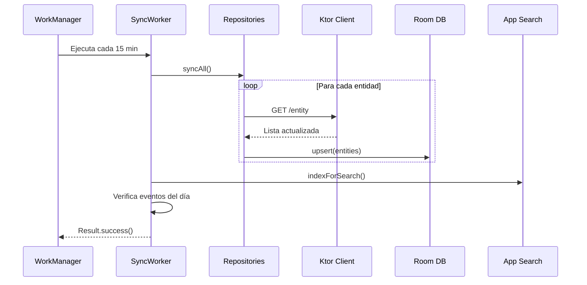

#android #sync #offline #workmanager

# Sincronización Offline

> [!abstract] Resumen
> **WorkManager** ejecuta sincronización periódica cada 15 minutos. Sincroniza eventos, clientes, productos e inventario entre Room y el backend. También indexa datos para App Search.

---

## Arquitectura de Sync



---

## Configuración del Worker

| Aspecto | Valor |
|---------|-------|
| Tipo | `PeriodicWorkRequest` |
| Intervalo | 15 minutos |
| Constraints | `NetworkType.CONNECTED` |
| Retry | `BackoffPolicy.EXPONENTIAL` |
| Inyección | `@HiltWorker` con assisted injection |

---

## Datos Sincronizados

| Entidad | Dirección | Detalle |
|---------|-----------|---------|
| Events | Server → Local | Lista completa + upcoming |
| Clients | Server → Local | Lista completa |
| Products | Server → Local | Lista completa |
| Inventory | Server → Local | Lista completa |
| Payments | Server → Local | Lista completa |

> [!warning] Solo descarga
> Actualmente la sincronización es **unidireccional** (server → local). No hay sync de cambios locales → server ni resolución de conflictos offline.

---

## Notificaciones de Eventos

Después de cada sync, el worker verifica si hay eventos programados para hoy y genera notificaciones:

```kotlin
// En SyncWorker
private fun checkTodayEvents(events: List<Event>) {
    val today = LocalDate.now()
    val todayEvents = events.filter {
        LocalDate.parse(it.eventDate) == today
    }
    todayEvents.forEach { event ->
        notificationManager.showEventReminder(event)
    }
}
```

---

## App Search Indexing

Post-sync, los datos se indexan para búsqueda rápida en el dispositivo:

| Tipo indexado | Campos | Deep link |
|--------------|--------|-----------|
| Eventos | nombre, tipo, fecha | `solennix://event/{id}` |
| Clientes | nombre, teléfono, email | `solennix://client/{id}` |
| Productos | nombre, categoría | `solennix://product/{id}` |

---

## Oportunidades de Mejora

> [!warning] Gaps conocidos
> - **Sin sync bidireccional**: cambios offline no se suben al server
> - **Sin resolución de conflictos**: si el user edita offline y otro dispositivo también, gana el último sync
> - **Sin indicador de estado offline**: la UI no muestra si los datos son del caché o frescos
> - **Sin optimistic updates**: las acciones esperan la respuesta del server
> - **Intervalo fijo**: 15 minutos puede ser demasiado frecuente para batería

---

## Archivos Clave

| Archivo | Ubicación |
|---------|-----------|
| `SyncWorker.kt` | `app/worker/` |
| `SyncWorkManagerInitializer.kt` | `app/` |

---

## Relaciones

- [[Base de Datos Local]] — Room como destino del sync
- [[Capa de Red]] — Ktor como fuente de datos remotos
- [[Inyección de Dependencias]] — HiltWorker para DI en WorkManager
- [[Módulo Dashboard]] — consume datos sincronizados para KPIs
