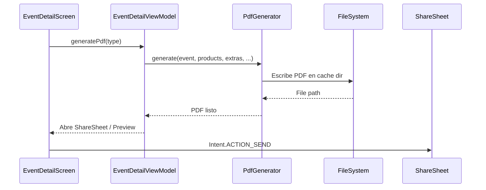

#android #pdfs #documentos

# Sistema de PDFs

> [!abstract] Resumen
> Generación de documentos PDF desde el detalle de eventos: presupuestos, contratos, facturas, listas de compras, checklists, listas de equipamiento y reportes de pagos. El código existe pero **falta la librería de PDF**.

---

## Documentos Disponibles

| Documento | Generador | Contenido |
|-----------|-----------|-----------|
| Presupuesto | `BudgetPdfGenerator` | Productos + extras + totales |
| Contrato | `ContractPdfGenerator` | Términos + datos del negocio + cliente |
| Factura | `InvoicePdfGenerator` | Detalle financiero + pagos |
| Lista de compras | `ShoppingListPdfGenerator` | Insumos e ingredientes necesarios |
| Checklist | `ChecklistPdfGenerator` | Tareas del evento |
| Lista de equipamiento | `EquipmentListPdfGenerator` | Equipamiento asignado |
| Reporte de pagos | `PaymentReportPdfGenerator` | Historial de abonos y saldos |

---

## Flujo de Generación

---

## Datos del Negocio en PDFs

Los documentos incluyen branding del organizador:

| Dato | Fuente |
|------|--------|
| Nombre del negocio | `User.businessName` |
| Logo | `User.logoUrl` |
| Color de marca | `User.brandColor` |
| Template de contrato | `User.contractTemplate` |

---

> [!danger] Dependencia Faltante
> El código de los generadores de PDF está escrito pero **no se ha importado ninguna librería de generación de PDF** en las dependencias de Gradle. Intentar generar un PDF en runtime resultará en error.
>
> **Opciones para resolver**:
> - `iText` — robusto, licencia AGPL (o comercial)
> - `Apache PDFBox` — open source, más limitado en Android
> - `Android Canvas + PdfDocument` — nativo, más trabajo manual
> - `Compose-to-PDF` — renderizar composables como PDF

---

## Relaciones

- [[Módulo Eventos]] — genera PDFs desde el detalle del evento
- [[Módulo Settings]] — datos del negocio incluidos en PDFs
- [[Módulo Pagos]] — reporte de pagos en PDF
