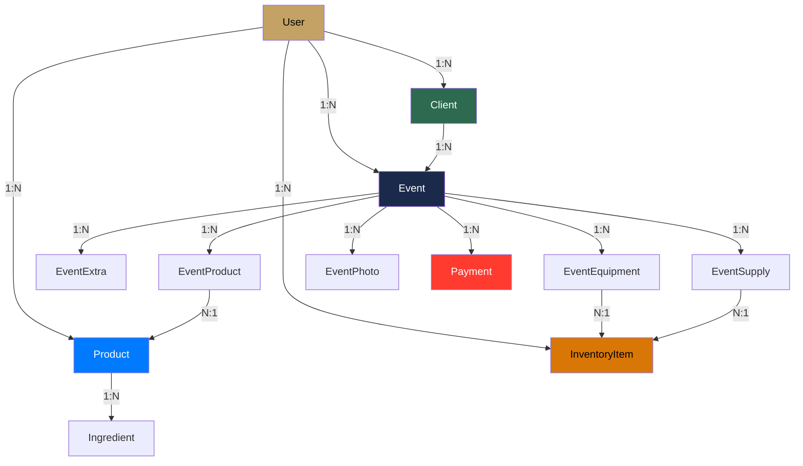

#android #tipos #modelo

# Sistema de Tipos

> [!abstract] Resumen
> Todos los modelos de dominio viven en `core/model/` y se comparten entre módulos. Usan Kotlinx Serialization para JSON y Room entities separadas (`Cached*`) para persistencia local.

---

## Entidades Principales

| Entidad | Archivo | Campos clave |
|---------|---------|-------------|
| `User` | `User.kt` | id, email, name, businessName, plan, stripeCustomerId |
| `Event` | `Event.kt` | id, clientId, eventDate, startTime, endTime, serviceType, status, totalAmount |
| `Client` | `Client.kt` | id, name, phone, email, address, city, totalEvents, totalSpent |
| `Product` | `Product.kt` | id, name, category, basePrice, recipe, imageUrl, isActive |
| `InventoryItem` | `InventoryItem.kt` | id, ingredientName, currentStock, minimumStock, unit, unitCost, type |
| `Payment` | `Payment.kt` | id, eventId, amount, paymentDate, paymentMethod |

---

## Entidades de Relación (Event)

| Entidad | Relación | Campos clave |
|---------|----------|-------------|
| `EventProduct` | Event ↔ Product | eventId, productId, quantity, unitPrice, discount |
| `EventExtra` | Event → Extra | eventId, description, cost, price, excludeUtility |
| `EventEquipment` | Event ↔ InventoryItem | eventId, inventoryId, quantity, notes |
| `EventSupply` | Event ↔ InventoryItem | eventId, inventoryId, quantity, unitCost, source, excludeCost |
| `EventPhoto` | Event → Photo | id, eventId, url, caption |

---

## Enums

| Enum | Valores | Uso |
|------|---------|-----|
| `EventStatus` | QUOTED, CONFIRMED, COMPLETED, CANCELLED | Estado del ciclo de vida del evento |
| `DiscountType` | PERCENT, FIXED | Tipo de descuento en productos |
| `InventoryType` | INGREDIENT, EQUIPMENT, SUPPLY | Clasificación de inventario |
| `Plan` | BASIC, PRO, PREMIUM | Nivel de suscripción |

---

## Diagrama de Relaciones



---

## Patrón de Serialización

```kotlin
@Serializable
data class Event(
    val id: Int = 0,
    @SerialName("client_id") val clientId: Int,
    @SerialName("event_date") val eventDate: String,
    @SerialName("start_time") val startTime: String?,
    @SerialName("end_time") val endTime: String?,
    @SerialName("service_type") val serviceType: String,
    val status: EventStatus = EventStatus.QUOTED,
    @SerialName("total_amount") val totalAmount: Double = 0.0
)
```

> [!tip] Convención
> Los modelos de dominio usan `camelCase` en Kotlin y `@SerialName("snake_case")` para mapear al JSON de la API.

---

## Entities de Room (Caché)

Las entities de Room son separadas de los modelos de dominio para desacoplar la capa de datos:

| Entity Room | Modelo de dominio | Tabla |
|-------------|------------------|-------|
| `CachedClient` | `Client` | `clients` |
| `CachedEvent` | `Event` | `events` |
| `CachedProduct` | `Product` | `products` |
| `CachedInventoryItem` | `InventoryItem` | `inventory_items` |
| `CachedPayment` | `Payment` | `payments` |
| `CachedEventProduct` | `EventProduct` | `event_products` |
| `CachedEventExtra` | `EventExtra` | `event_extras` |

> [!important] Conversión
> Los repositorios tienen extensiones `.toDomain()` y `.toEntity()` para convertir entre capas.

---

## Relaciones

- [[Arquitectura General]] — ubicación de los módulos
- [[Capa de Red]] — serialización en las llamadas API
- [[Base de Datos Local]] — entities de Room y DAOs
- [[Módulo Eventos]] — entidad central del sistema
