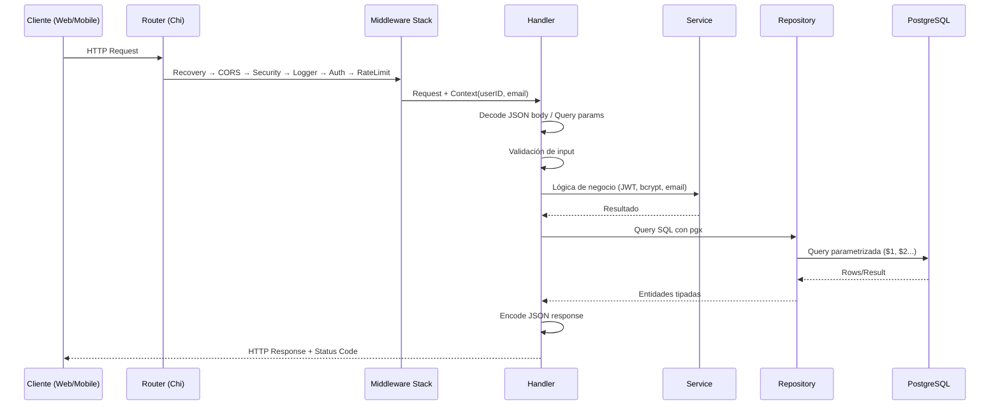

# Arquitectura General

#backend #arquitectura

> [!abstract] Resumen
> API REST en Go con arquitectura en capas inspirada en Clean Architecture. Sin ORM — queries SQL directas con pgx/v5. Inyección de dependencias via constructores. Autenticación JWT con cookies httpOnly, storage desacoplado (local/S3) y 6 jobs de mantenimiento dentro del mismo proceso.

---

## Stack Tecnológico

| Capa | Tecnología | Versión |
|------|-----------|---------|
| Lenguaje | Go | 1.24.7 |
| Router HTTP | Chi | 5.2.5 |
| Base de datos | PostgreSQL | 15+ |
| Driver DB | pgx/v5 | 5.8.0 |
| Autenticación | golang-jwt | 5.3.1 |
| Pagos | Stripe | 81.4.0 |
| Email | Resend | 3.1.1 |
| Hashing | bcrypt (x/crypto) | 0.48.0 |
| UUIDs | google/uuid | 1.6.0 |
| Testing | testify | 1.11.1 |
| Config | godotenv | 1.5.1 |
| Logging | log/slog (stdlib) | — |

## Diagrama de Capas

```mermaid
graph TB
    subgraph Entry["Punto de Entrada"]
        Main["cmd/server/main.go<br/>Config, DB, Repos, Handlers, Router, Graceful Shutdown"]
    end

    subgraph Router["Router (Chi)"]
        Routes["Definición de rutas<br/>Agrupación por dominio<br/>Middleware por grupo"]
    end

    subgraph MW["Middleware Stack"]
        Recovery["Recovery<br/>Panic → 500"]
        CORS["CORS<br/>Orígenes configurables"]
        Security["Security Headers<br/>OWASP全套"]
        Logger["Logger<br/>slog estructurado"]
        Auth["Auth<br/>JWT cookie/header"]
        RateLimit["Rate Limit<br/>Fixed window por IP"]
        Admin["AdminOnly<br/>Role check DB"]
    end

    subgraph Handlers["Handlers"]
        AuthH["AuthHandler<br/>Register, Login, OAuth, Password"]
        CRUDH["CRUDHandler<br/>Clients, Events, Products, Inventory, Payments"]
        SubH["SubscriptionHandler<br/>Stripe, RevenueCat, Webhooks"]
        SearchH["SearchHandler<br/>Búsqueda global paralela"]
        UploadH["UploadHandler<br/>Imágenes + StorageProvider"]
        AdminH["AdminHandler<br/>Stats, Users, Upgrades"]
        UnavailH["UnavailableDateHandler<br/>Fechas bloqueadas"]
        DeviceH["DeviceHandler<br/>Push notification tokens"]
        StaffH["StaffHandler + StaffTeamHandler<br/>Personal, disponibilidad, equipos"]
        PublicH["EventFormHandler + EventPublicLinkHandler<br/>Formularios y portal público"]
        LiveH["LiveActivityHandler<br/>Tokens Dynamic Island"]
    end

    subgraph Services["Services (Lógica de Negocio)"]
        AuthS["AuthService<br/>JWT, bcrypt, token types"]
        EmailS["EmailService<br/>Resend, templates HTML"]
        RCS["RevenueCatService<br/>Stripe↔RC sync"]
        StripeS["StripeService (interface)<br/>Checkout, Portal, Sessions"]
    end

    subgraph Repos["Repository (Acceso a Datos)"]
        UserR["UserRepo"]
        ClientR["ClientRepo"]
        EventR["EventRepo"]
        ProductR["ProductRepo"]
        InventoryR["InventoryRepo"]
        PaymentR["PaymentRepo"]
        SubscriptionR["SubscriptionRepo"]
        AdminR["AdminRepo"]
        UnavailR["UnavailableDateRepo"]
        DeviceR["DeviceRepo"]
    end

    subgraph DB["PostgreSQL"]
        Pool["pgxpool.Pool<br/>MaxConns: 20<br/>MinConns: 2"]
        Migrations["47 migraciones .up.sql<br/>go:embed, auto-apply"]
    end

    Main --> Routes
    Routes --> MW
    MW --> Handlers
    Handlers --> Services
    Handlers --> Repos
    Repos --> Pool
    Pool --> DB

    style Entry fill:#C4A265,stroke:#1B2A4A,color:#1A1A1A
    style Router fill:#2a3f6a,stroke:#C4A265,color:#F5F0E8
    style MW fill:#4a3f6a,stroke:#C4A265,color:#F5F0E8
    style Handlers fill:#1B2A4A,stroke:#C4A265,color:#F5F0E8
    style Services fill:#2D6A4F,stroke:#C4A265,color:#F5F0E8
    style Repos fill:#3a5a3f,stroke:#C4A265,color:#F5F0E8
    style DB fill:#C4A265,stroke:#1B2A4A,color:#1A1A1A
```



## Flujo de un Request



## Estructura de Directorios

```
backend/
├── cmd/
│   └── server/
│       └── main.go                    # Entry point, wiring, graceful shutdown
├── internal/
│   ├── config/
│   │   ├── config.go                  # Carga de .env y validación
│   │   └── config_test.go
│   ├── database/
│   │   ├── database.go                # pgxpool connection
│   │   ├── database_test.go
│   │   ├── migrate.go                 # go:embed migrations, auto-apply
│   │   ├── migrate_test.go
│   │   └── migrations/                # 47 archivos .up.sql (001-046, con split 020a/020b)
│   ├── handlers/                      # HTTP layer
│   │   ├── auth_handler.go            # Auth completo (9 endpoints)
│   │   ├── crud_handler.go            # CRUD 5 dominios (40+ endpoints)
│   │   ├── subscription_handler.go    # Stripe + RevenueCat
│   │   ├── search_handler.go          # Búsqueda global
│   │   ├── upload_handler.go          # Imágenes + thumbnails
│   │   ├── admin_handler.go           # Panel admin
│   │   ├── audit_handler.go           # Activity feed + admin audit log
│   │   ├── dashboard_handler.go       # KPIs y agregados server-side
│   │   ├── unavailable_date_handler.go # Fechas bloqueadas
│   │   ├── device_handler.go          # Device tokens
│   │   ├── live_activity_handler.go   # Tokens para Live Activities iOS
│   │   ├── event_form_handler.go      # Formularios públicos por token
│   │   ├── event_public_link_handler.go # Portal cliente público
│   │   ├── staff_handler.go           # Catálogo de personal + disponibilidad
│   │   ├── staff_team_handler.go      # Equipos reutilizables
│   │   ├── interfaces.go              # Interfaces de repos (DI)
│   │   ├── validation.go              # Validaciones compartidas
│   │   ├── helpers.go                 # JSON encode/decode, writeError
│   │   ├── contract_template.go       # Template default contrato
│   │   ├── stripe_service.go          # Interface + implementación Stripe
│   │   ├── user_repository.go         # Interface UserRepository
│   │   └── *_test.go                  # Tests con mocks
│   ├── middleware/
│   │   ├── auth.go                    # JWT validation + blacklist
│   │   ├── admin.go                   # Role check
│   │   ├── cors.go                    # CORS configurable
│   │   ├── logging.go                 # slog structured
│   │   ├── ratelimit.go               # Fixed window por IP
│   │   ├── recovery.go                # Panic → 500
│   │   ├── security.go                # OWASP headers
│   │   └── *_test.go
│   ├── models/
│   │   └── models.go                  # 15+ structs de dominio
│   ├── repository/                    # Data access layer
│   │   ├── user_repo.go
│   │   ├── client_repo.go
│   │   ├── event_repo.go              # Queries más complejas (joins, conflictos)
│   │   ├── product_repo.go
│   │   ├── inventory_repo.go
│   │   ├── payment_repo.go
│   │   ├── subscription_repo.go
│   │   ├── admin_repo.go
│   │   ├── audit_repo.go
│   │   ├── dashboard_repo.go
│   │   ├── unavailable_date_repo.go
│   │   ├── device_repo.go
│   │   ├── live_activity_token_repo.go
│   │   ├── event_form_link_repo.go
│   │   ├── event_public_link_repo.go
│   │   ├── staff_repo.go
│   │   ├── staff_team_repo.go
│   │   ├── refresh_token_repo.go
│   │   ├── revoked_token_repo.go
│   │   └── *_test.go                  # Integration tests con DB real
│   ├── router/
│   │   ├── router.go                  # Definición completa de rutas
│   │   ├── router_test.go
│   │   └── router_api_integration_test.go
│   └── services/                      # Business logic
│       ├── auth_service.go            # JWT (3 tipos), bcrypt
│       ├── email_service.go           # Resend + templates HTML
│       ├── notification_service.go    # Push + emails periódicos
│       ├── push_service.go            # FCM + APNs
│       ├── live_activity_service.go   # APNs liveactivity updates
│       ├── revenuecat_service.go      # Stripe↔RC sync
│       └── *_test.go
├── internal/storage/
│   ├── storage.go                     # Interface de storage
│   ├── local.go                       # Filesystem local + thumbnails
│   ├── s3.go                          # S3 / MinIO / Spaces
│   └── local_test.go
├── go.mod
├── Dockerfile                         # Multi-stage: golang:alpine → alpine
└── docker-compose.yml                 # PostgreSQL 15 local
```

## Principios Arquitectónicos

1. **Sin ORM** — Queries SQL directas con `pgx` para control total y rendimiento
2. **Inyección de dependencias** — Todos los componentes reciben dependencias via constructor (`NewXxxHandler(repo, service)`)
3. **Interfaces para testing** — Handlers dependen de interfaces (`FullUserRepository`, `FullEventRepository`), facilitando mocks
4. **Propagación de contexto** — `context.Context` desde handler hasta repositorio (cancellation, timeouts)
5. **Error handling explícito** — Go idiomático, retorno de `error` sin excepciones
6. **Type safety** — Models centralizados en `models.go`, JSON tags consistentes
7. **Separación de concerns** — Handler (HTTP) → Service (lógica) → Repository (datos)

## Relaciones

- [[Backend MOC]] — Hub principal
- [[Middleware Stack]] — Detalle de cada middleware
- [[Autenticación]] — Flujo completo de auth
- [[Base de Datos]] — Migraciones, pool config, schema
- [[Seguridad]] — Security headers, rate limiting, JWT
