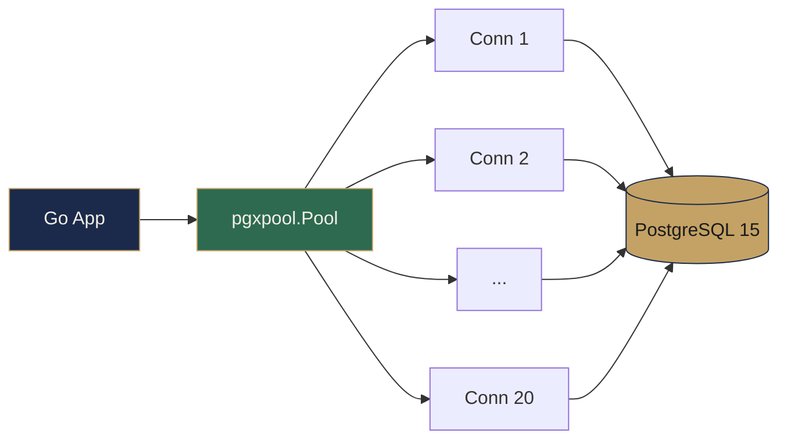
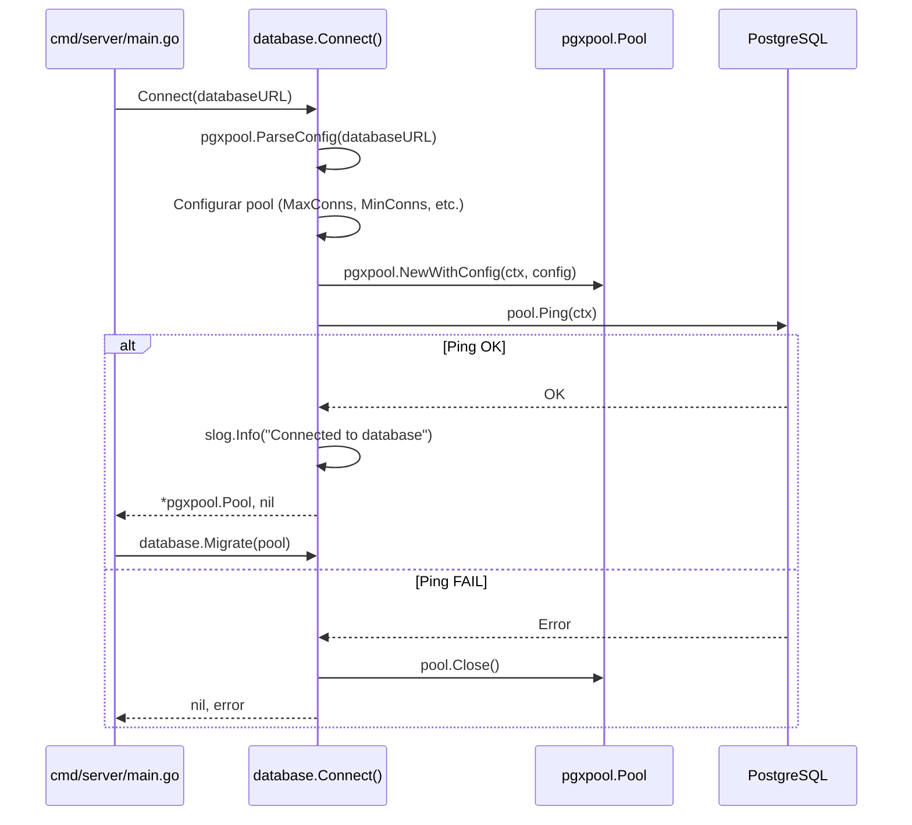
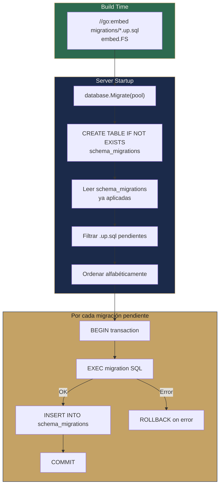
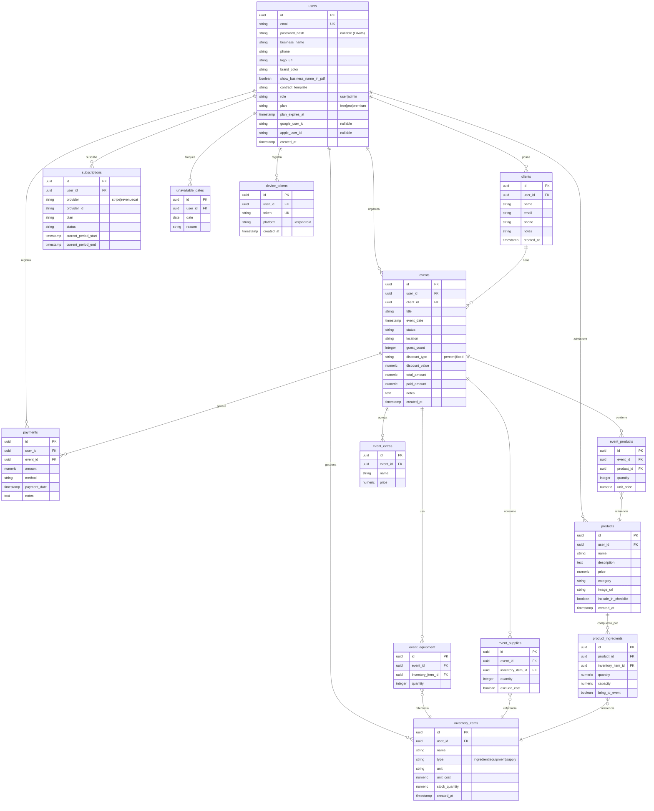
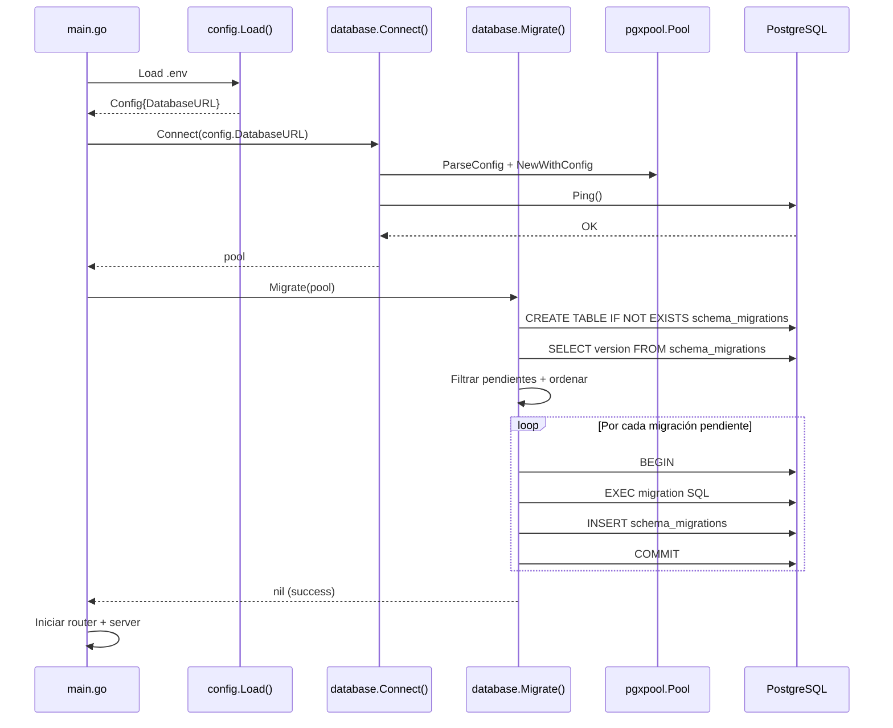

# Base de Datos

#backend #database #infraestructura

> [!abstract] Resumen
> **PostgreSQL 15** con **pgx/v5** connection pool. Sistema de migraciones custom con `go:embed` — sin herramientas externas. 29 migraciones que evolucionaron el schema desde usuarios hasta OAuth, push tokens y nullable passwords. Sin ORM: queries SQL directas con control total.

---

## Connection Pool



| Parámetro | Valor | Descripción |
|-----------|-------|-------------|
| `MaxConns` | 20 | Máximo conexiones simultáneas |
| `MinConns` | 2 | Conexiones idle mínimas (warm) |
| `MaxConnLifetime` | 30 min | Rotación de conexiones |
| `MaxConnIdleTime` | 5 min | Cleanup de conexiones inactivas |
| `ConnectTimeout` | 10 s | Timeout al conectar |

> [!tip] Ping verification
> `database.go:31` — Luego de crear el pool, se ejecuta `pool.Ping(ctx)`. Si falla, se hace `pool.Close()` y se retorna error. El servidor no arranca sin DB.

**Archivo**: `internal/database/database.go`

> [!warning] Pool config hardcoded
> Los valores del pool están hardcodeados en `Connect()` — no son configurables via variables de entorno. Para diferentes workloads (dev vs prod), esto debería externalizarse.

## Flujo de Conexión



---

## Sistema de Migraciones



### Características

| Propiedad | Detalle |
|-----------|---------|
| **Embedding** | `//go:embed migrations/*.up.sql` → binario único, sin archivos externos |
| **Tracking** | Tabla `schema_migrations` (version PK + applied_at) |
| **Idempotente** | Solo aplica migraciones que NO están en `schema_migrations` |
| **Transaccional** | Cada migración corre en una transacción — rollback automático on failure |
| **Auto-apply** | Se ejecuta en `main.go` antes de arrancar el server |
| **Solo up** | Down migrations existen como archivos pero NO se ejecutan automáticamente |
| **Naming** | `{NNN}_{description}.up.sql` / `{NNN}_{description}.down.sql` |

> [!important] Down migrations
> Los archivos `.down.sql` existen para rollback manual, pero el sistema NO los ejecuta automáticamente. Rollback es manual contra la DB.

**Archivo**: `internal/database/migrate.go`

---

## Las 29 Migraciones

```mermaid
timeline
    title Evolución del Schema
    section Fundacionales (001-007)
        001_create_users : Users table
        002_create_clients : Clients (user_id FK)
        003_create_events : Events con finanzas
        004_create_products : Productos/servicios
        005_create_inventory : Inventario (ingredientes, equipo, insumos)
        006_create_junction_tables : event_products, event_extras, product_ingredients
        007_create_payments_subscriptions : Pagos + suscripciones
    section Branding (008-012)
        008_add_client_logo : logo_url en clients
        009_move_logo : Logo de clients → users
        010_add_user_brand_color : brand_color en users
        011_add_show_business_name : show_business_name_in_pdf
        012_extend_subscriptions : RevenueCat fields
    section Correctivas (013-014)
        013_fix_plan_constraint : Fix plan constraint
        014_add_indexes_and_cascade : Índices + CASCADE en FKs
    section Features (015-024)
        015_add_image_fields : Imágenes en productos
        016_create_event_equipment : event_equipment table
        017_add_contract_template_to_users : Contratos
        018_add_role_to_users : Role (user/admin)
        019_add_plan_expires_at : Planes regalados
        020a_add_discount_type_to_events : Descuento % o fijo
        020b_add_equipment_capacity : Capacidad en product_ingredients
        021_add_bring_to_event : bring_to_event
        022_create_unavailable_dates : Fechas bloqueadas
        023_add_supply_type_and_table : Insumos + event_supplies
        024_add_exclude_cost_to_event_supplies : Excluir del costo
    section OAuth & Push (025-029)
        025_add_oauth_user_ids : google_user_id, apple_user_id
        026_create_device_tokens : Push notification tokens
        027_add_subscription_provider_unique : Unique constraint
        028_add_include_in_checklist : Checklist de productos
        029_make_password_hash_nullable : Cuentas OAuth-only
```



### Detalle Completo

| # | Nombre | Propósito | Tablas/Columnas Afectadas |
|---|--------|-----------|--------------------------|
| 001 | `create_users` | Tabla base de usuarios | `users` |
| 002 | `create_clients` | Clientes con FK a user | `clients` (user_id FK) |
| 003 | `create_events` | Eventos con campos financieros | `events` |
| 004 | `create_products` | Productos y servicios | `products` |
| 005 | `create_inventory` | Inventario de ingredientes, equipo, insumos | `inventory_items` |
| 006 | `create_junction_tables` | Relaciones N:M | `event_products`, `event_extras`, `product_ingredients` |
| 007 | `create_payments_subscriptions` | Pagos y suscripciones | `payments`, `subscriptions` |
| 008 | `add_client_logo` | Logo URL en clientes | `clients.logo_url` |
| 009 | `move_logo` | Logo pasa de clients a users | `users.logo_url` |
| 010 | `add_user_brand_color` | Color de marca del usuario | `users.brand_color` |
| 011 | `add_show_business_name` | Mostrar nombre en PDFs | `users.show_business_name_in_pdf` |
| 012 | `extend_subscriptions` | Campos RevenueCat + provider | `subscriptions` (provider, RevenueCat) |
| 013 | `fix_plan_constraint` | Corrección de constraint de plan | `users` |
| 014 | `add_indexes_and_cascade` | Índices de performance + CASCADE | Múltiples FKs |
| 015 | `add_image_fields` | Campos de imagen en productos | `products` (image fields) |
| 016 | `create_event_equipment` | Equipamiento por evento | `event_equipment` |
| 017 | `add_contract_template_to_users` | Template de contrato | `users.contract_template` |
| 018 | `add_role_to_users` | Rol de usuario | `users.role` (user/admin) |
| 019 | `add_plan_expires_at` | Expiración para planes regalados | `users.plan_expires_at` |
| 020a | `add_discount_type_to_events` | Tipo de descuento | `events.discount_type` (percent/fixed) |
| 020b | `add_equipment_capacity` | Capacidad en ingredientes | `product_ingredients.capacity` |
| 021 | `add_bring_to_event` | Traer al evento | `product_ingredients.bring_to_event` |
| 022 | `create_unavailable_dates` | Fechas bloqueadas | `unavailable_dates` |
| 023 | `add_supply_type_and_table` | Tipo insumo + tabla de supplies | `inventory_items` supply type + `event_supplies` |
| 024 | `add_exclude_cost_to_event_supplies` | Excluir del costo total | `event_supplies.exclude_cost` |
| 025 | `add_oauth_user_ids` | IDs de Google y Apple | `users.google_user_id`, `users.apple_user_id` |
| 026 | `create_device_tokens` | Tokens para push notifications | `device_tokens` |
| 027 | `add_subscription_provider_unique` | Unique por provider de suscripción | `subscriptions` unique constraint |
| 028 | `add_include_in_checklist` | Incluir en checklist | `products.include_in_checklist` |
| 029 | `make_password_hash_nullable` | Password opcional (OAuth-only) | `users.password_hash` nullable |

> [!tip] Naming con sufijo
> Las migraciones `020a` y `020b` usan sufijo alfabético para mantener orden lógico dentro del mismo número de versión. El sistema las ordena alfabéticamente así que esto funciona correctamente.

---

## Diagrama ER



> [!important] Multi-tenant isolation
> **Todas** las tablas principales tienen `user_id` FK. Las queries en repos SIEMPRE filtran por `user_id` extraído del JWT via middleware [[Autenticación]]. Esto garantiza aislamiento entre usuarios.

---

## Flujo de Startup (DB)



---

## Áreas de Mejora

> [!danger] P0 — Operacionales

| Gap | Impacto | Solución |
|-----|---------|----------|
| **Sin backup strategy** | Pérdida total de datos ante desastre | pg_dump automatizado + S3/GCS |
| **Sin down migrations automático** | Rollback manual, riesgoso | Comando CLI para rollback |
| **Pool config hardcoded** | No se adapta a distintos ambientes | Variables de entorno para cada parámetro |

> [!warning] P1 — Performance

| Gap | Impacto | Solución |
|-----|---------|----------|
| **UpdateEventItems: DELETE ALL + INSERT ALL** | Transacción grande, locks prolongados | UPSERT con conflictos + DELETE los removidos |
| **Índices faltantes para búsqueda** | Full table scans en search, date ranges | GIN index para texto, B-tree para fechas |
| **Sin read replicas** | Toda la carga en una instancia | Streaming replication para reads |

> [!note] P2 — Observabilidad

| Gap | Impacto | Solución |
|-----|---------|----------|
| **Sin pool metrics** | No visibilidad de saturación | Exponer `pool.Stat()` como Prometheus metrics |
| **Sin query logging** | Queries lentas invisibles | `pgx.QueryTracer` con slog |
| **Sin health check endpoint** | K8s/Docker no pueden verificar DB | `GET /health` con ping al pool |

> [!tip] Patrón alternativo para UpdateEventItems
> En vez de `DELETE FROM event_products WHERE event_id=$1` + `INSERT` de todo, considerar:
> ```sql
> INSERT INTO event_products (...) VALUES (...) ON CONFLICT (event_id, product_id) DO UPDATE SET ...
> ```
> Y luego borrar solo los que ya no están. Esto reduce locks y preserva datos no modificados.

---

## Relaciones

- [[Arquitectura General]] — Posición de la DB en las capas del backend
- [[Backend MOC]] — Hub principal del backend
- [[Seguridad]] — Multi-tenant isolation, SQL parametrizado
- [[Performance]] — Índices, pool config, queries optimizadas

#backend #database #infraestructura
