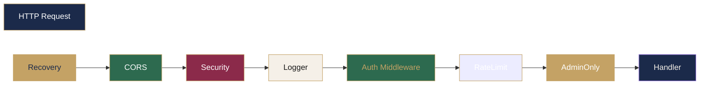

# Middleware Stack

#backend #middleware #arquitectura

> [!abstract] Resumen
> Cadena de middleware composable que se ejecuta en orden intencencional. Cada middleware tiene una responsabilidad específica.

 Recovery captura panics → CORS configura or origines → Security Headers OWASP → Logger estructurado → Auth valida JWT → Rate Limit protege → AdminOnly verifica roles.

---

## Diagrama de Flujo



## Middleware por Capa

| Middleware | Archivo | Responsabilidad |
|-----------|---------|---------------|
| **Recovery** | `middleware/recovery.go` | Captura panics, stack trace → 500 |
| **CORS** | `middleware/cors.go` | Orígenes configurables, credentials, preflight cache |
| **Security Headers** | `middleware/security.go` | X-Frame-Options, CSP, HSTS, X-Content-Type-Options, Referrer-Policy, Permissions-Policy |
| **Logger** | `middleware/logging.go` | method, path, status, duration, remote IP con slog |
| **Auth** | `middleware/auth.go` | JWT validation (cookie/header), blacklist check, context injection |
| **RateLimit** | `middleware/ratelimit.go` | Fixed window counter por IP, cleanup automático |
| **AdminOnly** | `middleware/admin.go` | Verifica role `admin` en DB |

> [!important] Orden
El orden de los middleware es **intencional**. Recovery DEBE ser el primero para capturar panics en cualquier middleware posterior.

 Auth debe ejecutarse ANTES de RateLimit para que los rate limits se apliquen solo a usuarios autenticados.

## Detalle de Auth Middleware

```mermaid
graph TD
    A[Cookie: auth_token] --> B{¿Presente?}
    B -->|Sí| C[Usa token]
    B -->|No| D[Header: Authorization]
    D --> E{¿Bearer presente?}
    E -->|Sí| C[Extraer token]
    E -->|No| F[401: Auth required]

    C --> G[SHA-256 blacklist check]
    G --> H{ValidateToken JWT]
    H -->|Válido| I[Inyectar UserID + Email en context]
    H -->|Inválido| J[401]

    style A fill:#C4A265,color:#1B2A4A
    style B fill:#2D6A4F,color:#1B2A4A
    style C fill:#E74C3C,color:#1B2A4A
    style D fill:#E74C3C,color:#1B2A4A
    style E fill:#E74C3C,color:#1B2A4A
    style F fill:#C4A265,color:#1A1A1A
    style G fill:#C4A265,color:#1A1A1A
    style H fill:#C4A265,color:#1A1A1A
    style I fill:#C4A265,color:#F5F0E8
```

> [!warning] Token Blacklist
> El `AccessTokenBlacklist` usa un `sync.Map` con hashes SHA-256. Esto es un **mecanismo en memoria** — no persiste entre reinicios. Para logout definitivo, se necesitaría una solución más robusta (Redis, DB table, o JWT con `jti` claim).

## Rate Limiting

| Ruta | Limite | Ventana |
|------|-------|---------|
| `/api/auth/*` | 5 req/min | 1 minuto |
| `/api/uploads/image` | 5 req/min | 1 minuto |
| `/api/search` | 30 req/min | 1 minuto |
| `/api/admin/*` | 30 req/min | 1 minuto |

> [!note] Algoritmo: Fixed Window Counter
> Simple pero funcional. No so sofisticado como sliding window o token bucket, pero suficiente para el caso de uso actual. Futuro: migrar a Redis con sliding window.

## Relaciones

- [[Arquitectura General]] — Posición del middleware en las capas
- [[Autenticación]] — Detalle del middleware Auth
- [[Seguridad]] — Headers de seguridad
