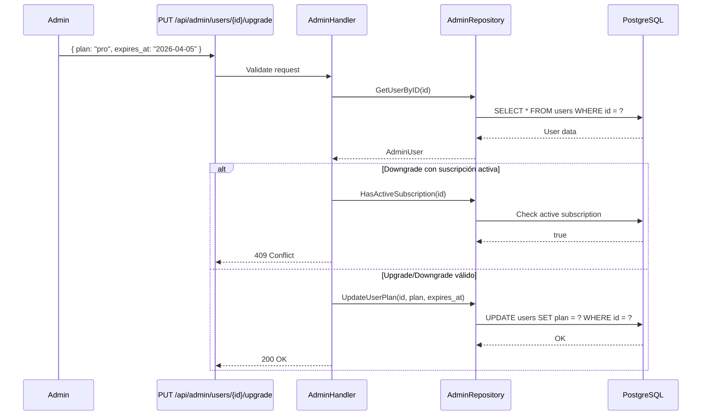
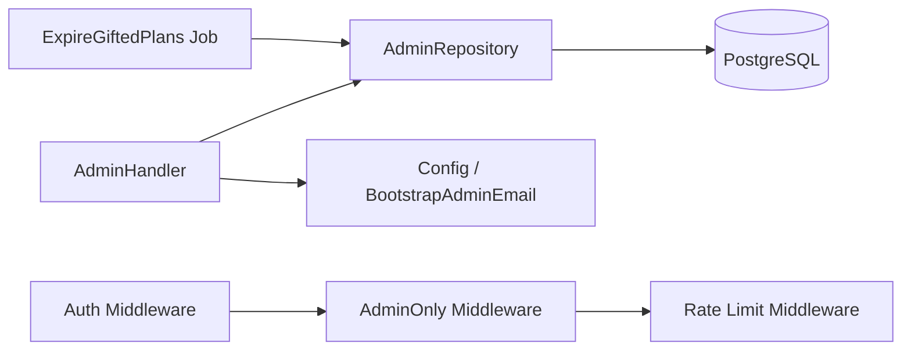

---
tags:
  - backend
  - admin
  - módulo
  - go
  - plataforma
created: 2025-04-05
updated: 2025-04-05
related:
  - "[[Backend MOC]]"
  - "[[Middleware Stack]]"
  - "[[Módulo Suscripciones]]"
  - "[[Seguridad]]"
---

# Módulo Admin

> [!info] Panel de administración de la plataforma Solennix
> Endpoints protegidos para gestión centralizada de usuarios, suscripciones y estadísticas a nivel plataforma.

---

## Seguridad y Acceso

> [!warning] Middleware obligatorio
> Todos los endpoints del módulo admin requieren pasar por tres capas de middleware en orden:
>
> 1. **Auth** — Verifica JWT válido → `401 Unauthorized`
> 2. **AdminOnly** — Verifica `role = admin` → `403 Forbidden`
> 3. **Rate Limit** — 30 requests/minuto por IP → `429 Too Many Requests`

Ver [[Middleware Stack]] para el flujo completo de middlewares.

Ver [[Seguridad]] para políticas generales de seguridad.

---

## Arquitectura

```
Handler Layer        Repository Layer        Database
┌──────────────┐    ┌─────────────────┐    ┌──────────┐
│ AdminHandler │───▶│ AdminRepository  │───▶│ PostgreSQL│
└──────────────┘    └─────────────────┘    └──────────┘
```

- **AdminHandler** — Recibe requests, valida input, orquesta la lógica.
- **AdminRepository** — Queries directas a la base de datos (lectura/escritura).

> [!tip] Convención Clean Architecture
> El handler NUNCA ejecuta SQL directamente. Toda interacción con la DB pasa por el `AdminRepository`, lo que facilita testing con mocks y eventual migración de storage.

---

## Endpoints

### `GET /api/admin/stats`

Estadísticas a nivel plataforma.

**Response `200`:**

```json
{
  "total_users": 1250,
  "active_subscriptions": 340,
  "revenue": 15420.50
}
```

**Estructura `PlatformStats`:**

| Campo                 | Tipo     | Descripción                          |
| --------------------- | -------- | ------------------------------------ |
| `total_users`         | `int`    | Total de usuarios registrados        |
| `active_subscriptions`| `int`    | Suscripciones con estado activo      |
| `revenue`             | `float64`| Ingresos totales de la plataforma    |

> [!note] Revenue
> El campo `revenue` refleja ingresos acumulados de suscripciones pagas. No incluye planes gifted ni trial.

---

### `GET /api/admin/users`

Lista todos los usuarios de la plataforma.

**Query Params opcionales:**

| Param    | Tipo     | Default | Descripción                  |
| -------- | -------- | ------- | ---------------------------- |
| `page`   | `int`    | `1`     | Página de resultados         |
| `limit`  | `int`    | `20`    | Resultados por página (máx 100) |
| `search` | `string` | —       | Filtrar por nombre o email   |

**Response `200`:**

```json
{
  "users": [
    {
      "id": "uuid",
      "email": "user@example.com",
      "name": "Juan Pérez",
      "role": "user",
      "plan": "pro",
      "subscription": { ... },
      "created_at": "2025-01-15T10:00:00Z"
    }
  ],
  "total": 1250,
  "page": 1,
  "limit": 20
}
```

**Estructura `AdminUser`:**

| Campo          | Tipo                | Descripción                              |
| -------------- | ------------------- | ---------------------------------------- |
| `id`           | `string (uuid)`     | Identificador único                      |
| `email`        | `string`            | Email del usuario                        |
| `name`         | `string`            | Nombre completo                          |
| `role`         | `string`            | Rol: `user` / `admin`                    |
| `plan`         | `string`            | Plan actual                              |
| `subscription` | `Subscription?`     | Info de suscripción activa (puede ser null) |
| `created_at`   | `datetime`          | Fecha de registro                        |

---

### `GET /api/admin/users/{id}`

Detalle de un usuario específico.

**Response `200`:** Un objeto `AdminUser` completo.

**Response `404`:**

```json
{
  "error": "user not found"
}
```

---

### `PUT /api/admin/users/{id}/upgrade`

Upgrade o downgrade del plan de un usuario.

**Request Body:**

```json
{
  "plan": "pro",
  "expires_at": "2026-04-05T00:00:00Z"
}
```

**Estructura `UpdateUserPlan`:**

| Campo       | Tipo      | Requerido | Descripción                                      |
| ----------- | --------- | --------- | ------------------------------------------------ |
| `plan`      | `string`  | Sí        | Nombre del plan: `basic`, `pro`, `enterprise`    |
| `expires_at`| `string?` | No        | Fecha de expiración (para planes gifted/regalados)|

> [!important] Protección contra downgrade accidental
> Antes de degradar un plan, el sistema ejecuta `HasActiveSubscription()`. Si el usuario tiene una suscripción paga activa, el endpoint retorna `409 Conflict` para evitar pérdida de beneficios por error.

**Response `200`:**

```json
{
  "message": "plan updated successfully",
  "user": { ... }
}
```

**Response `409`:**

```json
{
  "error": "user has an active paid subscription, cancel it before downgrading"
}
```

> [!tip] Planes gifted
> Si se envía `expires_at`, el plan se marca como **gifted** (regalado). Al expirar, el background job `ExpireGiftedPlans` revierte automáticamente al plan `basic`.

Ver [[Módulo Suscripciones]] para el flujo completo del sistema de planes.

---

### `GET /api/admin/subscriptions`

Lista todas las suscripciones de la plataforma.

**Query Params opcionales:**

| Param       | Tipo     | Default | Descripción                     |
| ----------- | -------- | ------- | ------------------------------- |
| `status`    | `string` | —       | Filtrar por estado: `active`, `canceled`, `expired` |
| `plan`      | `string` | —       | Filtrar por plan                |
| `page`      | `int`    | `1`     | Página de resultados            |
| `limit`     | `int`    | `20`    | Resultados por página           |

**Response `200`:**

```json
{
  "subscriptions": [
    {
      "id": "uuid",
      "user_id": "uuid",
      "plan": "pro",
      "status": "active",
      "current_period_start": "2025-03-01T00:00:00Z",
      "current_period_end": "2025-04-01T00:00:00Z",
      "gifted": false,
      "expires_at": null
    }
  ],
  "total": 340,
  "page": 1,
  "limit": 20
}
```

---

## Bootstrap Admin

> [!abstract] Auto-promoción en startup
> La configuración `BootstrapAdminEmail` en el archivo de config permite promover automáticamente un usuario a `admin` cuando el servidor arranca.
>
> ```yaml
> admin:
>   bootstrap_email: "admin@solennix.com"
> ```
>
> **Flujo:**
> 1. Server arranca → lee `BootstrapAdminEmail` del config.
> 2. Busca el usuario con ese email en la DB.
> 3. Si existe y NO es admin → actualiza `role = "admin"`.
> 4. Si no existe → log warning, no hace nada (no crea el usuario).

> [!caution] Seguridad
> Este mecanismo es solo para el primer setup o recuperación. En producción normal, los roles se gestionan vía el endpoint `PUT /api/admin/users/{id}/upgrade` o directamente en DB.

---

## Background Jobs

### `ExpireGiftedPlans`

> [!example] Job programado
> - **Frecuencia:** Cada 1 hora
> - **Función:** Busca planes gifted donde `expires_at <= NOW()` y los revierte a `basic`.
> - **Alcance:** Solo afecta planes marcados como `gifted = true`. No toca suscripciones pagas.

**Lógica:**

```
1. SELECT * FROM subscriptions WHERE gifted = true AND expires_at <= NOW()
2. Para cada resultado:
   a. UPDATE users SET plan = 'basic' WHERE id = user_id
   b. UPDATE subscriptions SET status = 'expired' WHERE id = subscription_id
3. Log cantidad de planes expirados
```

---

## Debug Endpoints

> [!danger] Solo desarrollo
> Estos endpoints están disponibles **únicamente** cuando `APP_ENV=development` y requieren rol admin. En producción se deshabilitan completamente en el router.

| Endpoint                              | Método | Descripción                                  |
| ------------------------------------- | ------ | -------------------------------------------- |
| `/api/admin/debug/subscription/{id}`  | GET    | Detalle raw de una suscripción específica    |
| `/api/admin/debug/reset-plan/{id}`    | POST   | Resetea el plan de un usuario a `basic`      |
| `/api/admin/debug/simulate-expiry`    | POST   | Ejecuta manualmente `ExpireGiftedPlans`      |

> [!warning] No usar en staging/producción
> El build de producción omite el registro de estas rutas. Si se necesita debug en staging, usar logs estructurados o queries directas a DB con audit trail.

---

## Flujo de Datos — Upgrade de Plan



---

## Dependencias



---

## Notas de Implementación

> [!faq]- ¿Qué pasa si se upgradea un usuario que ya tiene el mismo plan?
> El handler lo permite (idempotente). Actualiza la fecha de `updated_at` pero no cambia el plan. Si se envía un `expires_at` nuevo, sí se actualiza.

> [!faq]- ¿Se puede gifted un plan sin expires_at?
> No. Si `expires_at` es null, el plan NO se marca como gifted. Es una suscripción manual permanente hasta que un admin la cambie.

> [!faq]- ¿El ExpireGiftedPlans borra la suscripción?
> No. La marca como `status = 'expired'` y revierte el usuario a `basic`. El registro se conserva para auditoría.

---

**Navegación:** [[Backend MOC]] | [[Middleware Stack]] | [[Módulo Suscripciones]] | [[Seguridad]]
