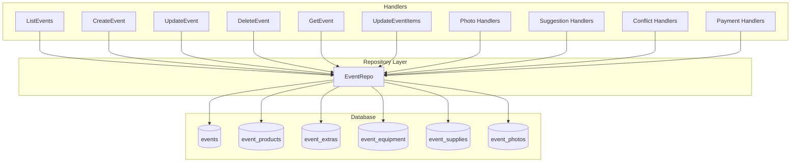
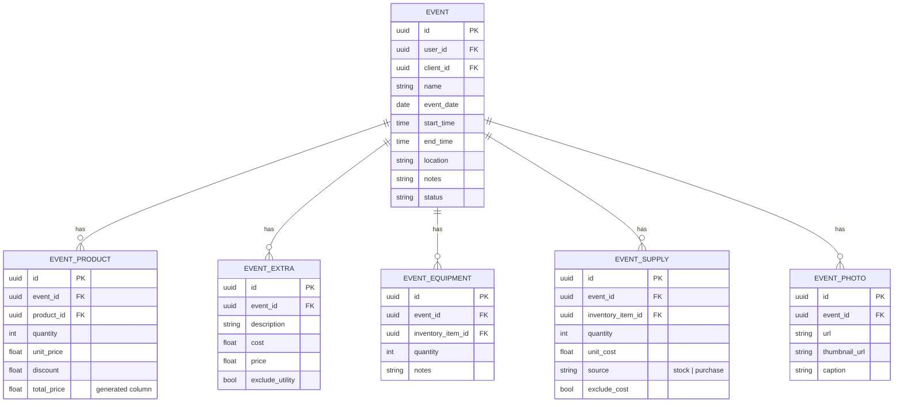
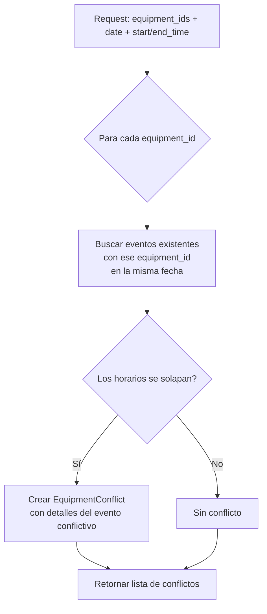
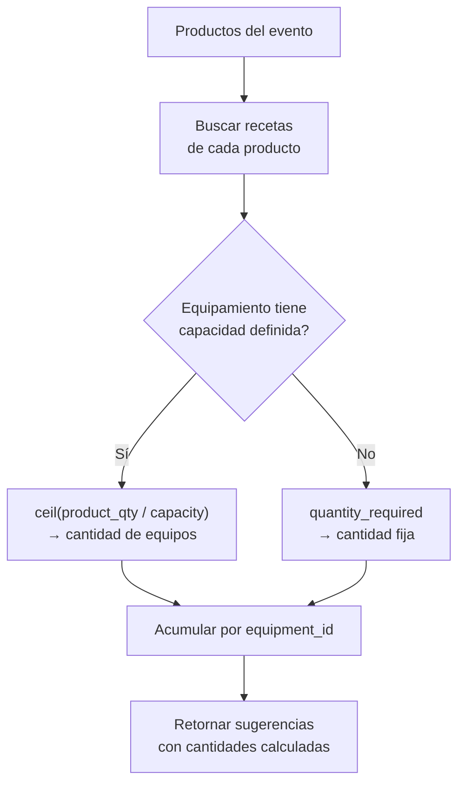
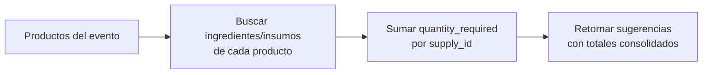
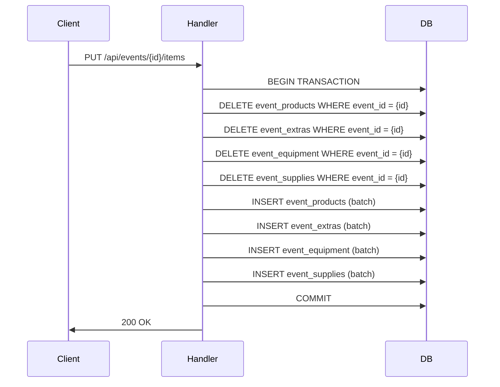
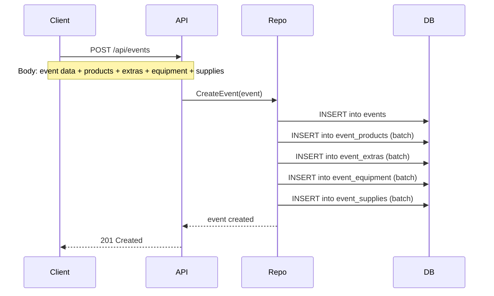

---
tags:
  - backend
  - eventos
  - módulo
created: 2025-04-05
updated: 2025-04-05
---

# Módulo Eventos

> [!abstract] Resumen
> El módulo de Eventos es el **core de Solennix**. Gestiona el CRUD completo de eventos junto con todos sus sub-items (productos, extras, equipamiento, suministros y fotos). Toda operación está filtrada por `user_id` para garantizar el aislamiento multi-tenant.

**Archivos principales:**
- `internal/handlers/crud_handler.go`
- `internal/repository/event_repo.go`

**Relacionado:** [[Backend MOC]] | [[Arquitectura General]] | [[Base de Datos]] | [[Módulo Productos]] | [[Módulo Inventario]]

---

## Arquitectura del Módulo



---

## Endpoints

### CRUD Principal

| Method | Route | Handler | Descripción |
|--------|-------|---------|-------------|
| `GET` | `/api/events` | ListEvents | Listar todos los eventos del usuario |
| `GET` | `/api/events/upcoming` | GetUpcomingEvents | Próximos N eventos |
| `POST` | `/api/events` | CreateEvent | Crear evento con items |
| `GET` | `/api/events/{id}` | GetEvent | Evento con datos del cliente |
| `PUT` | `/api/events/{id}` | UpdateEvent | Actualizar evento |
| `DELETE` | `/api/events/{id}` | DeleteEvent | Eliminar evento |

### Sub-items

| Method | Route | Handler | Descripción |
|--------|-------|---------|-------------|
| `GET` | `/api/events/{id}/products` | GetEventProducts | Lista de productos |
| `GET` | `/api/events/{id}/extras` | GetEventExtras | Lista de extras |
| `PUT` | `/api/events/{id}/items` | UpdateEventItems | Actualizar todos los sub-items |
| `GET` | `/api/events/{id}/equipment` | GetEventEquipment | Lista de equipamiento |
| `GET` | `/api/events/{id}/supplies` | GetEventSupplies | Lista de suministros |
| `GET` | `/api/events/{id}/photos` | GetEventPhotos | Galería de fotos |
| `POST` | `/api/events/{id}/photos` | AddEventPhoto | Subir foto |
| `DELETE` | `/api/events/{id}/photos/{photoId}` | DeleteEventPhoto | Eliminar foto |

### Equipamiento — Conflictos

| Method | Route | Handler | Descripción |
|--------|-------|---------|-------------|
| `GET` | `/api/events/equipment/conflicts` | CheckEquipmentConflictsGET | Para mobile (query params) |
| `POST` | `/api/events/equipment/conflicts` | CheckEquipmentConflicts | Para web (JSON body) |

### Equipamiento — Sugerencias

| Method | Route | Handler | Descripción |
|--------|-------|---------|-------------|
| `GET` | `/api/events/equipment/suggestions` | GetEquipmentSuggestionsGET | Para mobile (query params) |
| `POST` | `/api/events/equipment/suggestions` | GetEquipmentSuggestions | Para web (JSON body) |

### Suministros — Sugerencias

| Method | Route | Handler | Descripción |
|--------|-------|---------|-------------|
| `GET` | `/api/events/supplies/suggestions` | GetSupplySuggestionsGET | Para mobile (query params) |
| `POST` | `/api/events/supplies/suggestions` | GetSupplySuggestions | Para web (JSON body) |

---

## Sub-items

Los eventos tienen **5 tipos de sub-items**, cada uno con su propia tabla y lógica de negocio:



### Detalle de cada sub-item

#### 1. EventProduct

Productos vinculados al evento con pricing detallado.

| Campo | Tipo | Descripción |
|-------|------|-------------|
| `product_id` | UUID | Referencia al producto del catálogo |
| `quantity` | int | Cantidad solicitada |
| `unit_price` | float | Precio unitario |
| `discount` | float | Descuento aplicado |
| `total_price` | float | Columna generada: `quantity * unit_price - discount` |

> [!tip] `total_price` es una **generated column** en la DB. No se inserta manualmente, se calcula automáticamente.

#### 2. EventExtra

Cargos adicionales al evento.

| Campo | Tipo | Descripción |
|-------|------|-------------|
| `description` | string | Descripción del cargo extra |
| `cost` | float | Costo interno |
| `price` | float | Precio al cliente |
| `exclude_utility` | bool | Excluir del cálculo de utilidad |

#### 3. EventEquipment

Equipamiento del inventario asignado al evento.

| Campo | Tipo | Descripción |
|-------|------|-------------|
| `inventory_item_id` | UUID | Referencia al item de inventario |
| `quantity` | int | Cantidad asignada |
| `notes` | string | Notas adicionales |

#### 4. EventSupply

Suministros del inventario necesarios para el evento.

| Campo | Tipo | Descripción |
|-------|------|-------------|
| `inventory_item_id` | UUID | Referencia al item de inventario |
| `quantity` | int | Cantidad necesaria |
| `unit_cost` | float | Costo unitario |
| `source` | string | Origen: `stock` o `purchase` |
| `exclude_cost` | bool | Excluir del cálculo de costos |

#### 5. EventPhoto

Galería fotográfica del evento.

| Campo | Tipo | Descripción |
|-------|------|-------------|
| `url` | string | URL de la imagen original |
| `thumbnail_url` | string | URL del thumbnail |
| `caption` | string | Descripción de la foto |

---

## Detección de Conflictos de Equipamiento

> [!important] Los conflictos se detectan cuando el **mismo equipamiento** está asignado a **eventos que se solapan en horario**.



### Estructura de respuesta

```
EquipmentConflict {
    EquipmentID    uuid
    EquipmentName  string
    ConflictingEvents []ConflictingEvent {
        EventID    uuid
        EventName  string
        StartTime  time
        EndTime    time
        Quantity   int
    }
}
```

### GET vs POST

> [!tip] Los endpoints duplicados (GET/POST) existen para compatibilidad:
> - **GET** → Mobile envía parámetros via query string
> - **POST** → Web envía JSON body con arrays más complejos

---

## Sugerencias Inteligentes

### Sugerencias de Equipamiento

Calcula el equipamiento necesario basándose en las **recetas de los productos** del evento.



**Ejemplo:**
- Producto: Pizza (quantity: 30)
- Receta requiere: Horno (capacidad: 10 pizzas)
- Resultado: `ceil(30 / 10) = 3 hornos`

### Sugerencias de Suministros

Suma los `quantity_required` de **todos los productos** del evento para cada suministro.



**Ejemplo:**
- Producto 1 requiere: Harina (500g), Queso (200g)
- Producto 2 requiere: Harina (300g), Salsa (100g)
- Resultado: Harina 800g, Queso 200g, Salsa 100g

---

## Patrón UpdateEventItems

> [!warning] Operación pesada
> `UpdateEventItems` elimina **TODOS** los sub-items existentes y los re-inserta. Es transaccional pero costosa. Usar con criterio, especialmente en eventos con muchos items.



> [!danger] Si el evento tiene 100+ sub-items, esta operación puede tardar significativamente. Considerar estrategias de:
> - **Upsert diferencial** (solo insertar/actualizar los cambiados)
> - **Batch sizes** limitados
> - **Retry con backoff** en el cliente

---

## Flujo de Creación de Evento



---

---

## Notas de Seguridad

> [!warning] Multi-tenant
> **TODAS** las queries filtran por `user_id` extraído del JWT. Nunca exponer datos de otros usuarios. Ver [[Seguridad]] y [[Middleware Stack]] para más detalles.

> [!tip] Verificación de ownership
> Antes de cualquier operación sobre un evento (GET, PUT, DELETE), verificar que `event.user_id == authenticated_user_id`. Esto se aplica en la capa de repositorio.

---

## Ver también

- [[Backend MOC]] — Mapa general del backend
- [[Arquitectura General]] — Visión completa del sistema
- [[Base de Datos]] — Esquema de tablas y relaciones
- [[Módulo Productos]] — Catálogo y recetas
- [[Módulo Inventario]] — Equipamiento y suministros
- [[Seguridad]] — Autenticación y autorización
- [[Middleware Stack]] — Stack de middleware
