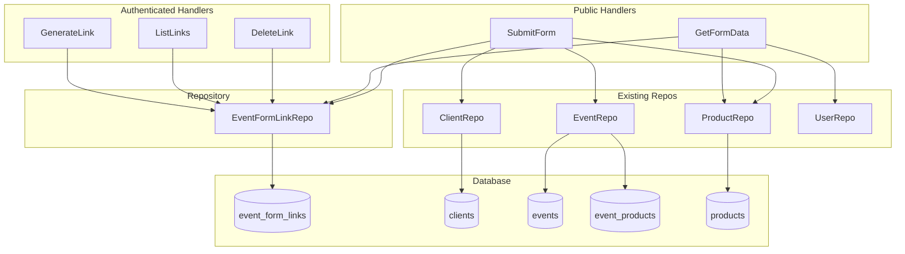
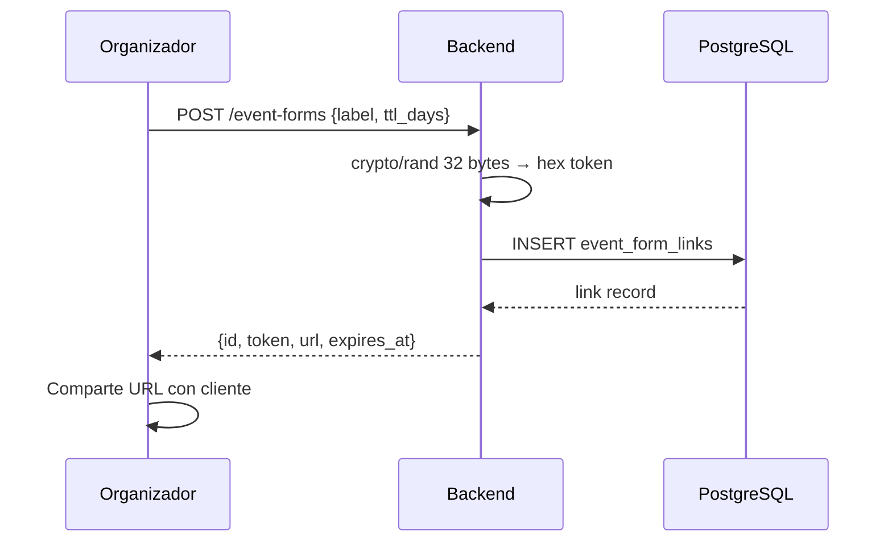
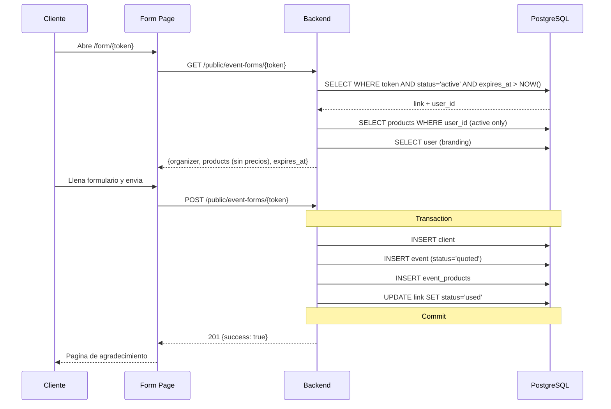

# Módulo Formularios Compartibles

#backend #formularios #módulo

> [!abstract] Resumen
> Permite a un organizador generar un enlace temporal y de un solo uso. Su cliente potencial abre el enlace en el navegador, llena datos del evento, selecciona productos del catálogo (sin ver precios) y envía. Esto crea un **evento borrador** + **cliente nuevo** para el organizador. El enlace expira al usarse o por TTL (7 días default).

**Archivos principales:**
- `internal/handlers/event_form_handler.go`
- `internal/repository/event_form_link_repo.go`
- `internal/database/migrations/038_add_event_form_links.up.sql`

**Relacionado:** [[Backend MOC]] | [[Módulo Eventos]] | [[Módulo Clientes]] | [[Módulo Productos]] | [[Seguridad]]

---

## Arquitectura del Módulo



---

## Tabla `event_form_links`

```sql
CREATE TABLE event_form_links (
    id UUID PRIMARY KEY DEFAULT gen_random_uuid(),
    user_id UUID NOT NULL REFERENCES users(id) ON DELETE CASCADE,
    token TEXT NOT NULL UNIQUE,           -- 64 chars hex (crypto/rand 32 bytes)
    label TEXT,                           -- etiqueta opcional del organizador
    status TEXT NOT NULL DEFAULT 'active', -- 'active' | 'used' | 'expired'
    submitted_event_id UUID REFERENCES events(id) ON DELETE SET NULL,
    submitted_client_id UUID REFERENCES clients(id) ON DELETE SET NULL,
    expires_at TIMESTAMPTZ NOT NULL,
    used_at TIMESTAMPTZ,
    created_at TIMESTAMPTZ NOT NULL DEFAULT NOW(),
    updated_at TIMESTAMPTZ NOT NULL DEFAULT NOW()
);
```

**Indices:** `token` (lookup publico), `user_id` (listado), `expires_at WHERE status='active'` (cleanup).

---

## Endpoints

### Autenticados (requieren `mw.Auth`)

| Method | Route | Handler | Descripcion |
|--------|-------|---------|-------------|
| `POST` | `/api/event-forms` | GenerateLink | Crear enlace (label, ttl_days 1-30) |
| `GET` | `/api/event-forms` | ListLinks | Listar enlaces del organizador |
| `DELETE` | `/api/event-forms/{id}` | DeleteLink | Revocar enlace |

### Publicos (sin auth, rate-limited 10/min)

| Method | Route | Handler | Descripcion |
|--------|-------|---------|-------------|
| `GET` | `/api/public/event-forms/{token}` | GetFormData | Branding + productos sin precios |
| `POST` | `/api/public/event-forms/{token}` | SubmitForm | Crear cliente + evento borrador |

---

## Flujo de Generacion



## Flujo de Envio (Publico)



---

## Seguridad

| Riesgo | Mitigacion |
|--------|------------|
| Enumeracion de tokens | `crypto/rand` 256 bits, no UUID predecible |
| Exposicion de precios | DTO dedicado `PublicProduct` sin base_price/recipe |
| Doble envio (race condition) | `MarkUsed` atomico con `WHERE status='active'`, 409 si 0 rows |
| Spam de formularios | Rate limit 10 req/min en endpoints publicos |
| CSRF en POST publico | Pasa sin validar — no hay `auth_token` cookie |
| Links perpetuos | TTL max 30 dias + background job hourly para expirar |
| Productos ajenos | `VerifyOwnership` antes de crear event_products |

---

## Modelo Go

```go
type EventFormLink struct {
    ID                uuid.UUID  `json:"id"`
    UserID            uuid.UUID  `json:"user_id"`
    Token             string     `json:"token"`
    Label             *string    `json:"label,omitempty"`
    Status            string     `json:"status"`
    SubmittedEventID  *uuid.UUID `json:"submitted_event_id,omitempty"`
    SubmittedClientID *uuid.UUID `json:"submitted_client_id,omitempty"`
    ExpiresAt         time.Time  `json:"expires_at"`
    UsedAt            *time.Time `json:"used_at,omitempty"`
    CreatedAt         time.Time  `json:"created_at"`
    UpdatedAt         time.Time  `json:"updated_at"`
}
```

## Repository

| Metodo | Descripcion |
|--------|-------------|
| `Create` | Inserta link nuevo |
| `GetByToken` | Busca por token, valida status='active' y no expirado |
| `GetByUserID` | Lista links del organizador (management UI) |
| `MarkUsed` | Atomico: status='used', used_at, event_id, client_id |
| `Delete` | Revoca un link por id + user_id |
| `ExpireStale` | Background: marca links expirados por TTL |

---

## Background Job

Igual que el patron de `ExpireGiftedPlans` en `main.go`:

```go
go func() {
    runExpiry := func() {
        count, err := eventFormLinkRepo.ExpireStale(context.Background())
        // log si count > 0
    }
    runExpiry()
    ticker := time.NewTicker(1 * time.Hour)
    for range ticker.C { runExpiry() }
}()
```

---

> [!tip] Navegacion
> Este modulo conecta con [[Módulo Eventos]], [[Módulo Clientes]] y [[Módulo Productos]] para crear registros. Ver [[Seguridad]] para detalles de rate limiting y token management.
