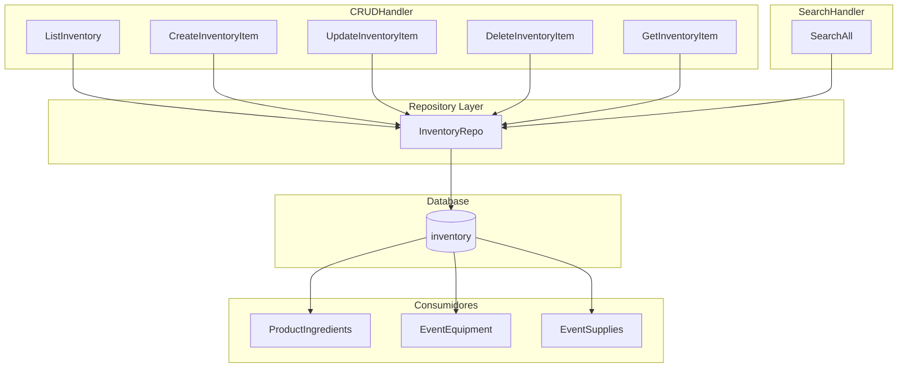
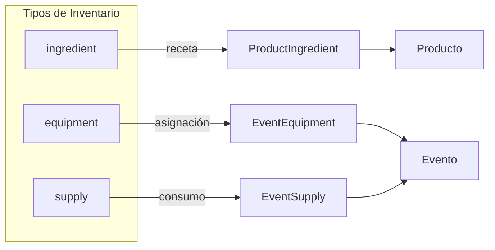
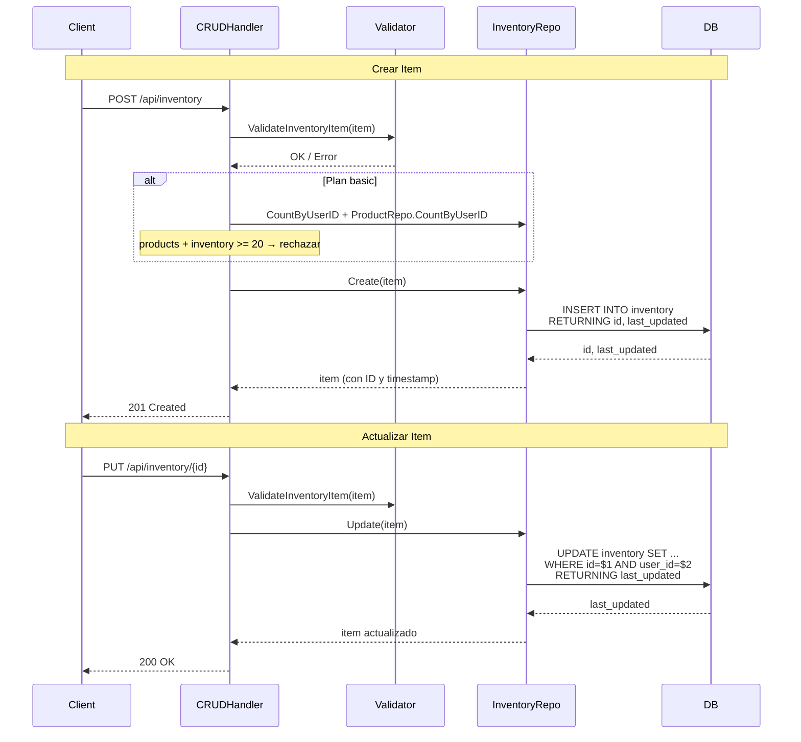
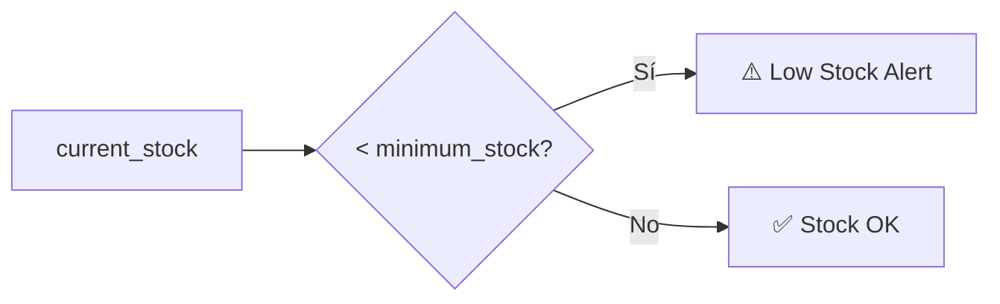
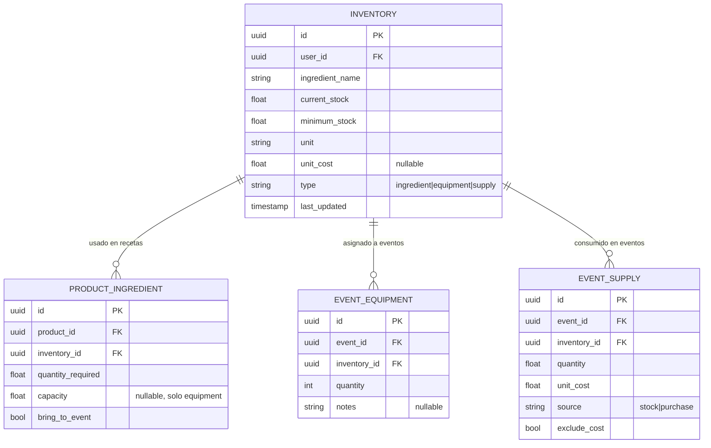

---
tags:
  - backend
  - inventario
  - módulo
created: 2025-04-05
updated: 2025-04-05
---

# Módulo Inventario

> [!abstract] Resumen
> El módulo de Inventario gestiona el stock de ingredientes, equipamiento y suministros. Es la base transversal del sistema: alimenta las recetas de productos ([[Módulo Productos]]), el equipamiento asignado a eventos ([[Módulo Eventos]]) y el tracking de suministros consumibles. Toda operación está filtrada por `user_id` para garantizar aislamiento multi-tenant.

**Archivos principales:**
- `internal/handlers/crud_handler.go` — Handlers CRUD
- `internal/repository/inventory_repo.go` — Capa de datos
- `internal/models/models.go` — Struct `InventoryItem`
- `internal/handlers/search_handler.go` — Búsqueda global

**Relacionado:** [[Backend MOC]] | [[Módulo Eventos]] | [[Módulo Productos]] | [[Sistema de Tipos]]

---

## Arquitectura del Módulo



---

## Modelo de Datos

### InventoryItem

| Campo | Tipo Go | JSON | Descripción |
|-------|---------|------|-------------|
| `ID` | `uuid.UUID` | `id` | PK, generado por DB |
| `UserID` | `uuid.UUID` | `user_id` | FK → users, aislamiento multi-tenant |
| `IngredientName` | `string` | `ingredient_name` | Nombre del item |
| `CurrentStock` | `float64` | `current_stock` | Stock actual disponible |
| `MinimumStock` | `float64` | `minimum_stock` | Umbral mínimo para alertas |
| `Unit` | `string` | `unit` | Unidad de medida (kg, lts, unidades, etc.) |
| `UnitCost` | `*float64` | `unit_cost,omitempty` | Costo por unidad (opcional) |
| `Type` | `string` | `type` | Tipo: `ingredient`, `equipment`, `supply` |
| `LastUpdated` | `time.Time` | `last_updated` | Auto-generado en DB |

> [!tip] El campo `unit_cost` usa puntero (`*float64`) para permitir `NULL` en DB. No todos los items tienen costo unitario — especialmente equipamiento reutilizable.

### Struct en Go

```go
type InventoryItem struct {
    ID             uuid.UUID `json:"id"`
    UserID         uuid.UUID `json:"user_id"`
    IngredientName string    `json:"ingredient_name"`
    CurrentStock   float64   `json:"current_stock"`
    MinimumStock   float64   `json:"minimum_stock"`
    Unit           string    `json:"unit"`
    UnitCost       *float64  `json:"unit_cost,omitempty"`
    Type           string    `json:"type"`
    LastUpdated    time.Time `json:"last_updated"`
}
```

---

## Tipos de Inventario

> [!important] Los tres tipos comparten la misma tabla `inventory` y el mismo CRUD. La diferenciación está en el campo `type` y en **cómo se consumen**.

### Ingredient (`type: "ingredient"`)

Componentes de recetas. Se vinculan a productos vía [[Sistema de Tipos#ProductIngredient|ProductIngredient]].

- **Uso**: Receta de productos (catálogo)
- **Stock**: Se consume al cocinar, se repone al comprar
- **Relación**: `ProductIngredient.inventory_id → inventory.id`
- **Ejemplo**: Harina, quuesto, tomates, aceite

### Equipment (`type: "equipment"`)

Items reutilizables asignados a eventos. Soporta capacidad y detección de conflictos.

- **Uso**: Asignación a eventos vía `EventEquipment`
- **Stock**: No se consume, se **asigna y desasigna**
- **Capacidad**: Definida en `ProductIngredient.capacity` — indica cuántas unidades de producto puede manejar un equipo
- **Conflictos**: Detectados cuando el mismo equipo se asigna a eventos solapados
- **Ejemplo**: Hornos, mesas, sillas, freidoras, carritos

> [!warning] Detección de conflictos
> Los conflictos de equipamiento se manejan en [[Módulo Eventos]] via `CheckEquipmentConflicts`. El módulo de inventario solo provee los datos base.

### Supply (`type: "supply"`)

Suministros consumibles necesarios para eventos. Se vinculan vía `EventSupply`.

- **Uso**: Tracking en eventos
- **Stock**: Se descuenta cuando el evento pasa a estado `confirmed`
- **Source**: `stock` (del inventario) o `purchase` (compra específica para el evento)
- **Ejemplo**: Platos descartables, servilletas, bolsas, envoltorios



---

## Endpoints

### CRUD Principal

| Method | Route | Handler | Descripción |
|--------|-------|---------|-------------|
| `GET` | `/api/inventory` | `CRUDHandler.ListInventory` | Listar todos los items del usuario |
| `POST` | `/api/inventory` | `CRUDHandler.CreateInventoryItem` | Crear nuevo item |
| `GET` | `/api/inventory/{id}` | `CRUDHandler.GetInventoryItem` | Obtener item por ID |
| `PUT` | `/api/inventory/{id}` | `CRUDHandler.UpdateInventoryItem` | Actualizar item |
| `DELETE` | `/api/inventory/{id}` | `CRUDHandler.DeleteInventoryItem` | Eliminar item |

### Búsqueda Global

| Method | Route | Handler | Descripción |
|--------|-------|---------|-------------|
| `GET` | `/api/search?q={query}` | `SearchHandler.SearchAll` | Búsqueda en inventario (entre otros) |

> [!info] La búsqueda sobre inventario busca en `ingredient_name`, `unit` y `type` con `ILIKE`. Retorna máximo 10 resultados por categoría.

---

## Flujo CRUD



---

## Alertas de Stock Bajo

> [!warning] Low Stock Alert
> Un item tiene **stock bajo** cuando `current_stock < minimum_stock`. Esta lógica se evalúa del lado del cliente — el backend no genera alertas proactivas (aún).



**Ejemplo:**
- Aceite de oliva: `current_stock = 2`, `minimum_stock = 5` → **Stock bajo**
- Harina: `current_stock = 50`, `minimum_stock = 10` → Stock OK

---

## Límites por Plan

> [!danger] Plan Basic
> En el plan **basic**, el límite compartido entre productos e inventario es de **20 items** (`products + inventory >= 20`). La verificación se hace en `CreateInventoryItem` y `CreateProduct`.

| Plan | Límite (productos + inventario) |
|------|--------------------------------|
| `basic` | 20 items combinados |
| `pro` | Sin límite |

Verificación en `crud_handler.go:1227-1242`:

```go
if user.Plan == "basic" {
    productCount, _ := h.productRepo.CountByUserID(ctx, userID)
    inventoryCount, _ := h.inventoryRepo.CountByUserID(ctx, userID)
    if productCount+inventoryCount >= 20 {
        writePlanLimitError(w, "catalog", productCount+inventoryCount, 20)
        return
    }
}
```

---

## Búsqueda

La búsqueda se realiza a través del [[Módulo Eventos#Búsqueda Global|SearchHandler]] que ejecuta búsquedas en paralelo sobre 4 entidades (clientes, productos, inventario, eventos).

### Query de Búsqueda

```sql
SELECT id, user_id, ingredient_name, current_stock, minimum_stock,
       unit, unit_cost, type, last_updated
FROM inventory
WHERE user_id = $1
AND (
    ingredient_name ILIKE '%' || $2 || '%'
    OR unit ILIKE '%' || $2 || '%'
    OR type ILIKE '%' || $2 || '%'
)
ORDER BY last_updated DESC
LIMIT 10
```

> [!info] La búsqueda es case-insensitive (`ILIKE`) y cubre nombre, unidad y tipo. Resultados limitados a 10 por categoría, acotados a 6 en la respuesta final del SearchHandler.

---

## Relaciones con Otros Módulos



### Dónde se usa cada tipo

| Tipo | Tabla intermedia | Módulo consumidor | Comportamiento |
|------|------------------|-------------------|----------------|
| `ingredient` | `product_ingredients` | [[Módulo Productos]] | Componente de receta con `quantity_required` |
| `equipment` | `event_equipment` | [[Módulo Eventos]] | Asignación con `quantity` y detección de conflictos |
| `supply` | `event_supplies` | [[Módulo Eventos]] | Consumo con `source` (stock/purchase) y deducción automática al confirmar |

> [!tip] Descuento automático de suministros
> Cuando un evento pasa a estado `confirmed`, se ejecuta `DeductSupplyStock` que descuenta del `current_stock` los suministros con `source = "stock"`. Ver [[Módulo Eventos]] para el flujo completo.

---

## Seguridad

> [!warning] Multi-tenant
> **TODAS** las queries filtran por `user_id` extraído del JWT. Un usuario nunca puede acceder a items de inventario de otro usuario. Ver [[Seguridad]] y [[Middleware Stack]].

- `Create`: `user_id` se inyecta desde el contexto, no del body
- `Update`: doble verificación (`id` del path + `user_id` del contexto)
- `Delete`: filtra por `id` AND `user_id`
- `GetByID`: retorna 404 si no pertenece al usuario autenticado

---

## Ver también

- [[Backend MOC]] — Mapa general del backend
- [[Módulo Eventos]] — Equipamiento, suministros y conflictos
- [[Módulo Productos]] — Recetas e ingredientes
- [[Sistema de Tipos]] — Todos los modelos del sistema
- [[Seguridad]] — Autenticación y autorización
- [[Middleware Stack]] — Stack de middleware
