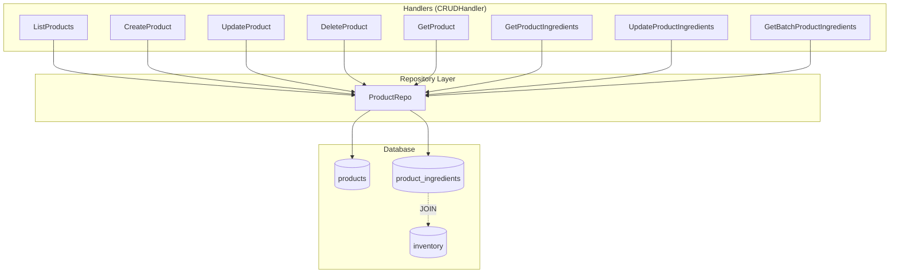
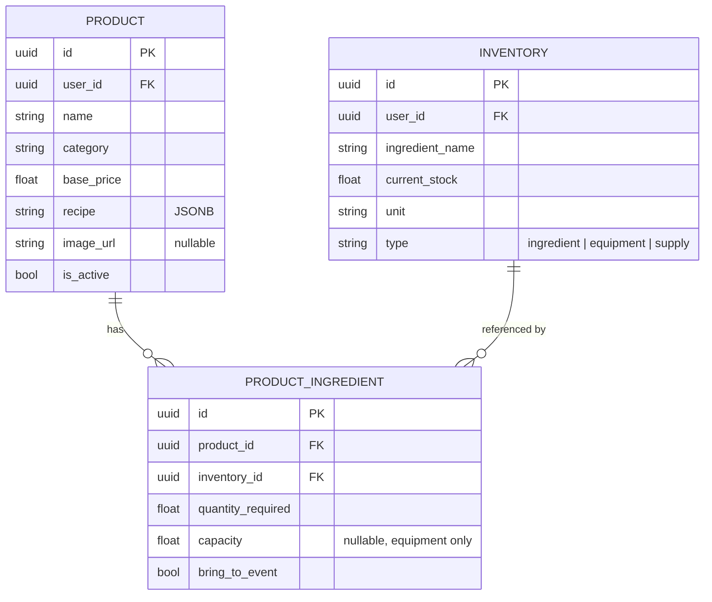
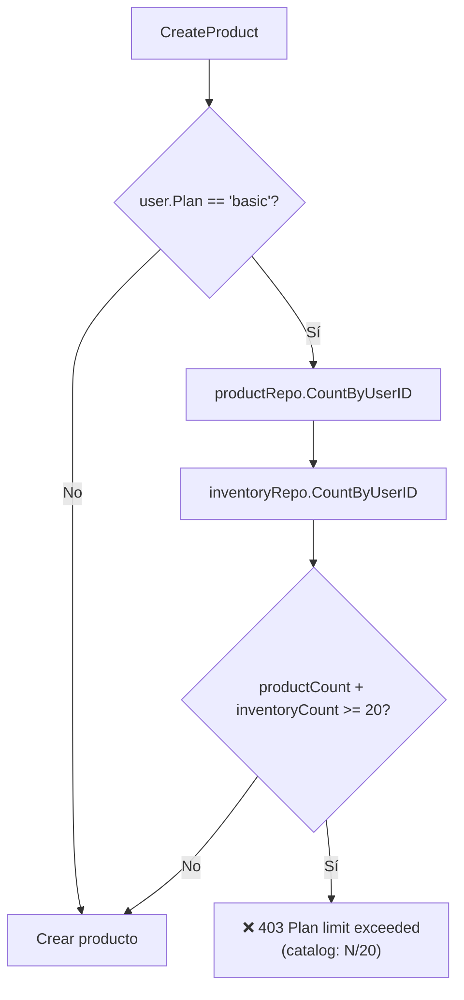
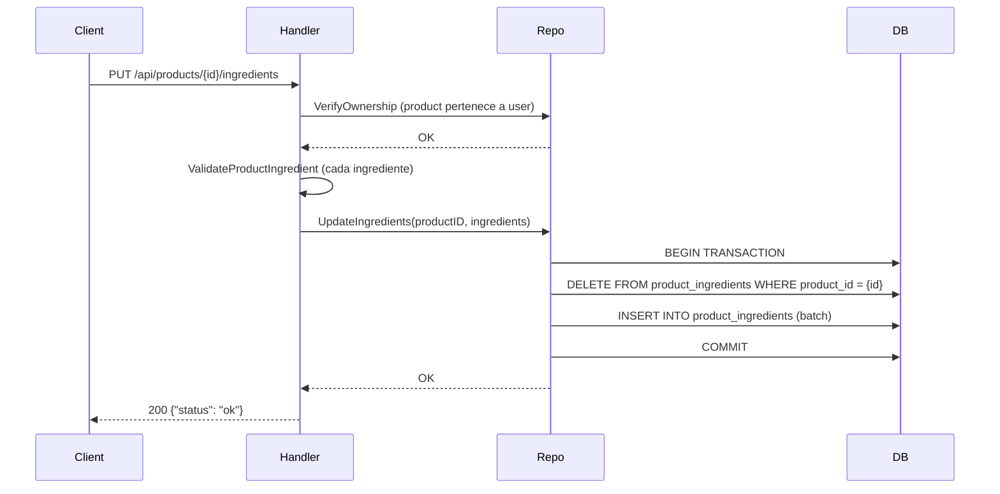
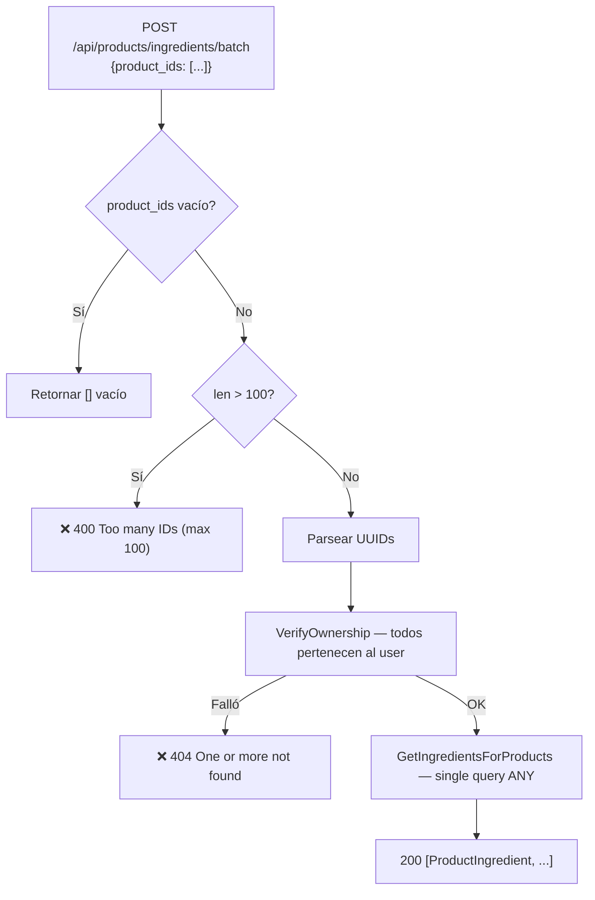
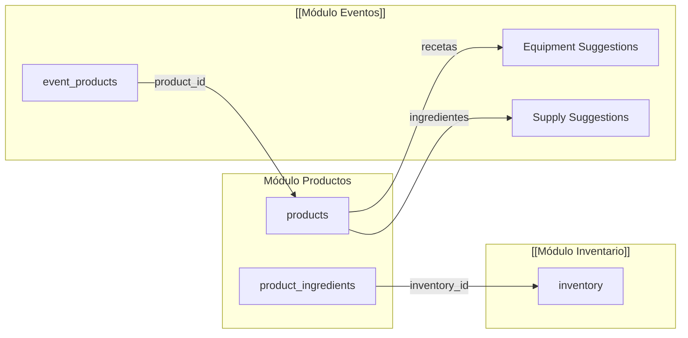

---
tags:
  - backend
  - productos
  - módulo
created: 2025-04-05
updated: 2025-04-05
---

# Módulo Productos

> [!abstract] Resumen
> El módulo de Productos gestiona el **catálogo de productos con recetas**. Cada producto puede tener ingredientes vinculados al inventario (equipamiento, insumos, consumibles). Las recetas permiten calcular automáticamente sugerencias de equipamiento y suministros para los eventos. Toda operación está filtrada por `user_id` para garantizar el aislamiento multi-tenant.

**Archivos principales:**
- `internal/handlers/crud_handler.go` — Handlers de productos e ingredientes
- `internal/repository/product_repo.go` — Capa de persistencia
- `internal/handlers/validation.go` — `ValidateProduct`, `ValidateProductIngredient`

**Relacionado:** [[Backend MOC]] | [[Módulo Eventos]] | [[Módulo Inventario]] | [[Sistema de Tipos]]

---

## Arquitectura del Módulo



---

## Endpoints

### CRUD Principal

| Method | Route | Handler | Descripción |
|--------|-------|---------|-------------|
| `GET` | `/api/products` | ListProducts | Listar todos los productos del usuario |
| `POST` | `/api/products` | CreateProduct | Crear producto |
| `GET` | `/api/products/{id}` | GetProduct | Obtener producto por ID |
| `PUT` | `/api/products/{id}` | UpdateProduct | Actualizar producto |
| `DELETE` | `/api/products/{id}` | DeleteProduct | Eliminar producto |

### Recetas / Ingredientes

| Method | Route | Handler | Descripción |
|--------|-------|---------|-------------|
| `GET` | `/api/products/{id}/ingredients` | GetProductIngredients | Ingredientes de un producto (con JOIN a inventario) |
| `PUT` | `/api/products/{id}/ingredients` | UpdateProductIngredients | Reemplazar ingredientes de un producto |
| `POST` | `/api/products/ingredients/batch` | GetBatchProductIngredients | Batch: ingredientes de múltiples productos (mobile) |

> [!tip] Orden de rutas
> El endpoint `POST /ingredients/batch` se registra **antes** que `GET /{id}` en el router (Chi) para evitar que "ingredients" sea interpretado como un UUID. Ver `internal/router/router.go:140-149`.

---

## Modelo de Datos

### Product

Definido en `internal/models/models.go:78`.

| Campo | Tipo Go | JSON | Descripción |
|-------|---------|------|-------------|
| `ID` | `uuid.UUID` | `id` | PK, generado por DB |
| `UserID` | `uuid.UUID` | `user_id` | FK a users, aislamiento multi-tenant |
| `Name` | `string` | `name` | Nombre del producto |
| `Category` | `string` | `category` | Categoría (ej: "catering", "bebidas") |
| `BasePrice` | `float64` | `base_price` | Precio base (≥ 0) |
| `Recipe` | `*string` | `recipe,omitempty` | JSONB — receta textual del producto |
| `ImageURL` | `*string` | `image_url,omitempty` | URL de la imagen del producto |
| `IsActive` | `bool` | `is_active` | Soft delete / desactivación |
| `CreatedAt` | `time.Time` | `created_at` | Timestamp de creación |
| `UpdatedAt` | `time.Time` | `updated_at` | Timestamp de última actualización |

### ProductIngredient

Definido en `internal/models/models.go:164`. Vincula un producto con items del inventario.

| Campo | Tipo Go | JSON | Descripción |
|-------|---------|------|-------------|
| `ID` | `uuid.UUID` | `id` | PK |
| `ProductID` | `uuid.UUID` | `product_id` | FK a products |
| `InventoryID` | `uuid.UUID` | `inventory_id` | FK a inventory |
| `QuantityRequired` | `float64` | `quantity_required` | Cantidad necesaria por unidad de producto (> 0) |
| `Capacity` | `*float64` | `capacity,omitempty` | Solo equipamiento: cuántas unidades maneja un equipo. `nil` = cantidad fija |
| `BringToEvent` | `bool` | `bring_to_event` | Indica si se transporta al evento. Equipamiento siempre viaja |
| `CreatedAt` | `time.Time` | `created_at` | Timestamp de creación |
| `IngredientName` | `*string` | `ingredient_name,omitempty` | JOIN desde inventory |
| `Unit` | `*string` | `unit,omitempty` | JOIN desde inventory |
| `UnitCost` | `*float64` | `unit_cost,omitempty` | JOIN desde inventory |
| `Type` | `*string` | `type,omitempty` | JOIN desde inventory |

### Diagrama ER



---

## Validaciones

### ValidateProduct (`validation.go:157`)

| Campo | Regla |
|-------|-------|
| `name` | Requerido, no vacío |
| `category` | Requerido, no vacío |
| `base_price` | Debe ser ≥ 0 |

### ValidateProductIngredient (`validation.go:245`)

| Campo | Regla |
|-------|-------|
| `quantity_required` | Debe ser > 0 |
| `capacity` | Si está seteado, debe ser > 0 |

> [!warning] No hay validación de `inventory_id`
> El handler no verifica que el `inventory_id` exista ni que pertenezca al usuario. Esto se maneja por FK constraint en la base de datos. Si el inventario no existe, el INSERT falla con error de DB.

---

## Límites de Plan

> [!important] Límite compartido con Inventario
> El límite del plan **basic** es **compartido** entre productos e inventario: `productCount + inventoryCount >= 20` bloquea la creación de ambos. Ver `crud_handler.go:1012-1027`.

| Plan | Límite | Código |
|------|--------|--------|
| `basic` | 20 items (productos + inventario combinados) | `CountByUserID` (products) + `CountByUserID` (inventory) |
| `pro` | Sin límite | — |



---

## Flujo de Ingredientes

### UpdateProductIngredients (PUT)

> [!warning] Estrategia delete-and-reinsert
> `UpdateProductIngredients` elimina **TODOS** los ingredientes existentes del producto y los re-inserta dentro de una transacción. Es la misma estrategia que usa [[Módulo Eventos]] para `UpdateEventItems`.



### GetBatchProductIngredients (POST /batch)

Diseñado específicamente para **mobile** — permite obtener los ingredientes de múltiples productos en una sola request.

> [!tip] Caso de uso: Shopping List
> La app mobile usa este endpoint para generar la **lista de compras** de un evento. Envía todos los `product_id` del evento y recibe los ingredientes consolidados.



> [!important] VerifyOwnership
> Antes de cualquier operación batch, se ejecuta `VerifyOwnership` que verifica en una **sola query** que TODOS los product IDs pertenecen al usuario:
> ```sql
> SELECT COUNT(*) FROM products WHERE id = ANY($1) AND user_id = $2
> ```
> Si `COUNT != len(productIDs)`, retorna error. Esto previene acceso no autorizado a productos de otros usuarios.

---

## Capacity y BringToEvent

### Capacity (solo equipamiento)

El campo `capacity` determina **cuántas unidades del producto puede manejar un equipo**:

| `capacity` | Comportamiento | Ejemplo |
|------------|----------------|---------|
| `nil` | Cantidad fija → se usa `quantity_required` como-is | "Se necesita 1 cuchillo" |
| `10.0` | Proporcional → `ceil(event_qty / capacity)` | "Un horno maneja 10 pizzas, para 30 necesito 3 hornos" |

> [!tip] Integración con Eventos
> El cálculo de `capacity` se usa en [[Módulo Eventos]] para las sugerencias de equipamiento: `GetEquipmentSuggestionsFromProducts` aplica `ceil(product_qty / capacity)` cuando capacity está definido.

### BringToEvent

| `bring_to_event` | Comportamiento |
|-------------------|----------------|
| `true` | El ingrediente debe transportarse al evento (aparece en checklist/logística) |
| `false` | No se transporta |

> [!note] Equipamiento siempre viaja
> Los items de tipo `equipment` siempre se incluyen en la logística del evento, independientemente del valor de `bring_to_event`.

---

## Relación con Otros Módulos



- **[[Módulo Inventario]]** — Los ingredientes de las recetas referencian items del inventario vía `inventory_id`
- **[[Módulo Eventos]]** — Los eventos referencian productos vía `event_products`. Las sugerencias de equipamiento y suministros se calculan a partir de las recetas de los productos del evento
- **[[Sistema de Tipos]]** — `Product` y `ProductIngredient` son modelos centrales del sistema de tipos

---

## Seguridad

> [!warning] Multi-tenant
> **TODAS** las queries filtran por `user_id` extraído del JWT. Nunca exponer datos de otros usuarios. Ver [[Seguridad]] y [[Middleware Stack]].

| Operación | Verificación de Ownership |
|-----------|---------------------------|
| `GetProduct` | `WHERE id = $1 AND user_id = $2` |
| `UpdateProduct` | `WHERE id = $1 AND user_id = $2` |
| `DeleteProduct` | `WHERE id = $1 AND user_id = $2` |
| `GetProductIngredients` | Primero verifica `productRepo.GetByID(id, userID)` |
| `UpdateProductIngredients` | Primero verifica `productRepo.GetByID(id, userID)` |
| `GetBatchProductIngredients` | `VerifyOwnership(productUUIDs, userID)` — check masivo |

---

## Ver también

- [[Backend MOC]] — Mapa general del backend
- [[Módulo Eventos]] — Cómo los eventos consumen productos y calculan sugerencias
- [[Módulo Inventario]] — Items de inventario referenciados por las recetas
- [[Sistema de Tipos]] — Definición completa de `Product` y `ProductIngredient`
- [[Seguridad]] — Autenticación, autorización y aislamiento multi-tenant
- [[Middleware Stack]] — Stack de middleware incluyendo `Auth`
