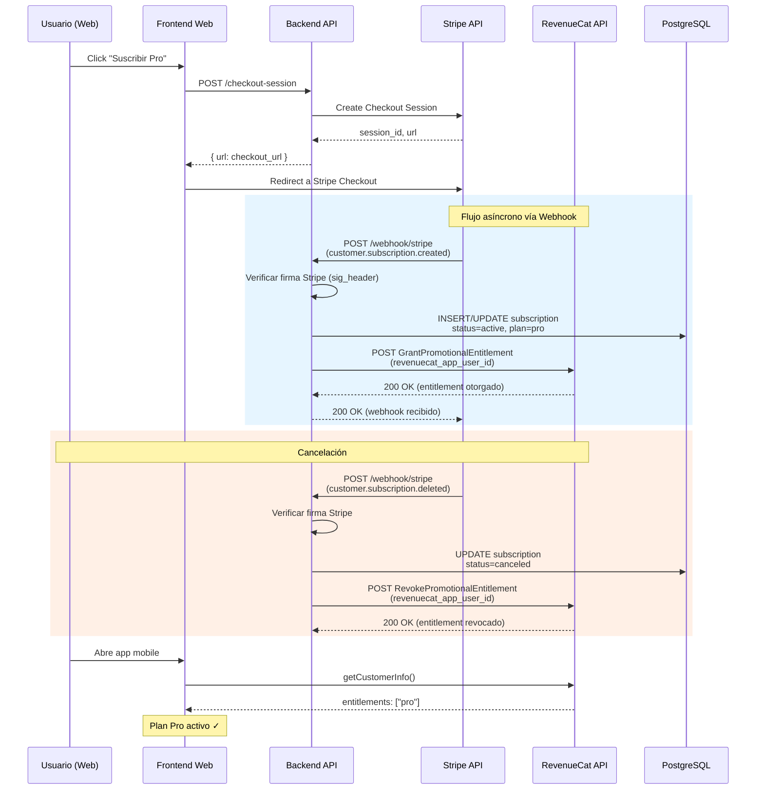
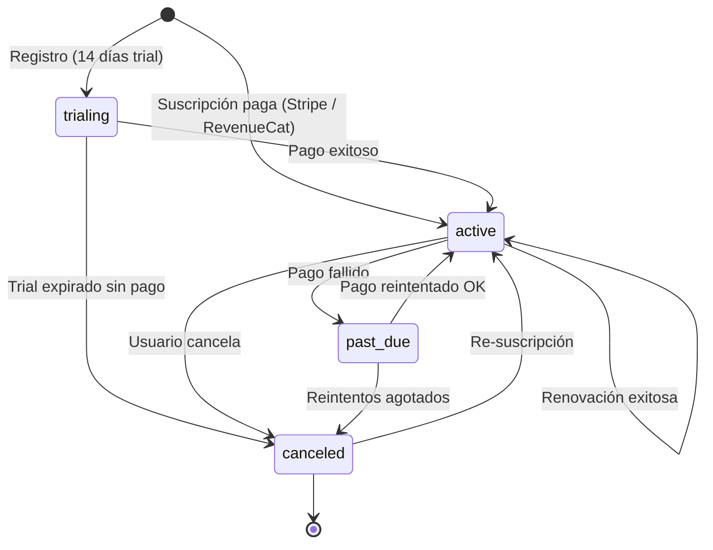

---
tags:
  - backend
  - suscripciones
  - módulo
created: 2025-04-05
updated: 2025-04-05
---

# Módulo Suscripciones

> [!info] Módulo responsable de la gestión de suscripciones multi-provider para Solennix.
> Administra planes, pagos, webhooks y sincronización entre Stripe (web) y RevenueCat (mobile).

**Relacionado con:** [[Backend MOC]] · [[Integraciones]] · [[Autenticación]] · [[Módulo Admin]]

---

## Arquitectura

> [!abstract] Visión General
> El sistema opera con **dos proveedores de pagos en paralelo**:
> - **Stripe** → suscripciones desde la plataforma web
> - **RevenueCat** → suscripciones desde iOS (StoreKit) y Android (Google Play Billing)
>
> La sincronización entre ambos es **unidireccional**: Stripe → RevenueCat. Cuando un usuario compra en web, se le otorgan entitlements promocionales en RevenueCat para que la app mobile también reconozca el plan.

### Modelo de Datos

```
┌──────────────────────────────────────────────────────────────┐
│                      Subscription                             │
├──────────────────────────────────────────────────────────────┤
│  id                  UUID           PK                        │
│  user_id             UUID           FK → users               │
│  provider            TEXT           'stripe' | 'apple' | 'google' │
│  provider_sub_id     TEXT           ID de la suscripción en el provider │
│  revenuecat_app_user_id  TEXT       ID de usuario en RevenueCat       │
│  plan                TEXT           'basic' | 'pro'                   │
│  status              TEXT           'active' | 'past_due' | 'canceled' | 'trialing' │
│  current_period_start  TIMESTAMP                               │
│  current_period_end    TIMESTAMP                               │
│  created_at          TIMESTAMP                                │
│  updated_at          TIMESTAMP                                │
└──────────────────────────────────────────────────────────────┘
```

### Handler Principal

> [!tip] `SubscriptionHandler`
> Centraliza **todas** las operaciones de suscripciones. Recibe `SubscriptionService`, `RevenueCatService` y `StripeClient` por inyección de dependencias.

| Responsabilidad                | Método / Flujo                              |
| ------------------------------ | ------------------------------------------- |
| Obtener estado de suscripción  | `GetStatus()`                               |
| Crear checkout de Stripe       | `CreateCheckoutSession()`                   |
| Crear sesión del portal        | `CreatePortalSession()`                     |
| Procesar webhook de Stripe     | `HandleStripeWebhook()`                     |
| Procesar webhook de RevenueCat | `HandleRevenueCatWebhook()`                 |
| Sincronizar entitlements       | Delegado a `RevenueCatService`              |
| Debug upgrade/downgrade        | `DebugUpgrade()` / `DebugDowngrade()`       |

---

## Flujo de Sincronización Stripe → RevenueCat

> [!important] Flujo Central
> Este es el corazón de la integración. Cuando un usuario se suscribe vía web con Stripe, el backend sincroniza el entitlement hacia RevenueCat para que la app mobile reconozca el plan Pro inmediatamente.



---

## Endpoints

### API Pública

| Método | Ruta                                    | Descripción                                     | Auth    |
| ------ | --------------------------------------- | ----------------------------------------------- | ------- |
| GET    | `/api/subscriptions/status`             | Estado actual de la suscripción del usuario     | JWT     |
| POST   | `/api/subscriptions/checkout-session`   | Crea una sesión de checkout en Stripe (web)     | JWT     |
| POST   | `/api/subscriptions/portal-session`     | Crea sesión del portal de billing de Stripe     | JWT     |
| POST   | `/api/subscriptions/webhook/stripe`     | Recibe eventos de webhook de Stripe             | Firma   |
| POST   | `/api/subscriptions/webhook/revenuecat` | Recibe eventos de webhook de RevenueCat         | Header  |

### Endpoints de Debug (Admin)

> [!warning] Solo para entornos de desarrollo / admin
> Estos endpoints permiten forzar cambios de plan sin pasar por el flujo de pago real.

| Método | Ruta                                    | Descripción                         |
| ------ | --------------------------------------- | ----------------------------------- |
| POST   | `/api/subscriptions/debug-upgrade`      | Forzar upgrade a plan Pro           |
| POST   | `/api/subscriptions/debug-downgrade`    | Forzar downgrade a plan Basic       |

Ambos requieren rol `admin` y están protegidos por el middleware de autorización (ver [[Autenticación]]).

---

## Webhooks

### Stripe Webhook

> [!example] Verificación
> Cada request se verifica con la **firma HMAC-SHA256** del header `Stripe-Signature` usando el webhook secret configurado.

**Eventos manejados:**

| Evento                                | Acción                                                                  |
| ------------------------------------- | ----------------------------------------------------------------------- |
| `customer.subscription.created`       | Crear registro en DB + `GrantPromotionalEntitlement` en RC              |
| `customer.subscription.updated`       | Actualizar plan/status en DB + sincronizar entitlement en RC            |
| `customer.subscription.deleted`       | Marcar `canceled` en DB + `RevokePromotionalEntitlement` en RC          |
| `invoice.payment_failed`              | Marcar `past_due` en DB                                                 |
| `customer.subscription.trial_will_end` | Notificar al usuario (trial por expirar)                               |
| `checkout.session.completed`          | Confirmar checkout exitoso, vincular `customer_id` con `user_id`        |

### RevenueCat Webhook

> [!example] Verificación
> Se valida el header `Authorization: Bearer <secret>` configurado como webhook secret en RevenueCat.

**Eventos manejados:**

| Evento                       | Acción                                                         |
| ---------------------------- | -------------------------------------------------------------- |
| `INITIAL_PURCHASE`           | Crear/actualizar suscripción con provider `apple` o `google`  |
| `RENEWAL`                    | Actualizar `current_period_end`                                |
| `CANCELLATION`               | Marcar `canceled` en DB                                        |
| `EXPIRATION`                 | Marcar `canceled` + limpiar entitlements                       |
| `BILLING_RETRY`              | Marcar `past_due`                                              |
| `TRANSFER`                   | Migrar suscripción entre cuentas de usuario                    |

---

## RevenueCatService

> [!note] Sincronización de Entitlements
> El `RevenueCatService` es el encargado de comunicarse con la REST API de RevenueCat para otorgar o revocar entitlements promocionales.

| Método                          | Cuándo se llama                            | Efecto                               |
| ------------------------------- | ------------------------------------------ | ------------------------------------ |
| `GrantPromotionalEntitlement()` | Suscripción creada/actualizada vía Stripe   | Otorga "pro" en RC para el usuario   |
| `RevokePromotionalEntitlement` | Suscripción cancelada/expirada vía Stripe   | Revoca "pro" en RC para el usuario   |

**Flujo de identidad:**
- El `revenuecat_app_user_id` se establece en el primer login mobile y se almacena en la DB.
- Al otorgar entitlements, se usa este ID para que RevenueCat vincule el beneficio al usuario correcto.

---

## Background Jobs

### ExpireGiftedPlans

> [!info] Job programado
> Se ejecuta **cada hora**. Busca suscripciones con planes regalados (`gifted`) cuyo período haya expirado y los marca como `canceled`.

```
Cron: 0 * * * * (cada hora en punto)
Query: SELECT * FROM subscriptions WHERE plan = 'gifted' AND current_period_end < NOW() AND status != 'canceled'
Acción: UPDATE status = 'canceled' + RevokePromotionalEntitlement en RC
```

---

## Planes

| Plan     | Features                                                        |
| -------- | --------------------------------------------------------------- |
| `basic`  | Acceso limitado, 5 eventos, catálogo hasta 20 productos        |
| `pro`    | Acceso completo, eventos ilimitados, catálogo ilimitado, calendario avanzado, cotizaciones con IVA |
| `trial`  | 14 días de Pro gratis al registrarse (status = `trialing`)      |

---

## Flujo de Estados



---

## Seguridad

> [!caution] Consideraciones críticas
> - Los webhooks **NUNCA** deben aceptarse sin verificación de firma/secret.
> - Los endpoints de debug deben estar **deshabilitados en producción** o protegidos con rol admin estricto.
> - El `webhook_secret` de Stripe y el `bearer_token` de RevenueCat se almacenan en variables de entorno, **nunca** en código.
> - Ver [[Seguridad]] para más detalles.

---

## Configuración (Variables de Entorno)

| Variable                        | Descripción                                      |
| ------------------------------- | ------------------------------------------------ |
| `STRIPE_SECRET_KEY`             | Clave secreta de Stripe API                      |
| `STRIPE_WEBHOOK_SECRET`         | Secret para verificar firmas de webhook          |
| `STRIPE_PRICE_ID_PRO`           | ID del precio del plan Pro en Stripe             |
| `REVENUECAT_API_KEY`            | API key de RevenueCat (REST)                     |
| `REVENUECAT_WEBHOOK_SECRET`     | Bearer token para verificar webhooks de RC       |
| `REVENUECAT_PROJECT_ID`         | ID del proyecto en RevenueCat                    |

---

## Testing

> [!tip] Estrategia de testing
> - **Unit tests**: Mock de Stripe y RevenueCat para testear lógica de sincronización.
> - **Integration tests**: Usar `stripe-mock` o fixtures de webhook para simular eventos.
> - **E2E**: Flujo completo con Stripe en modo test (test clocks).

Ver [[Testing]] para la estrategia general del backend.
