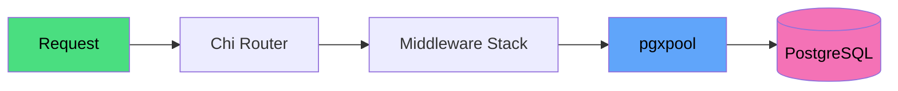
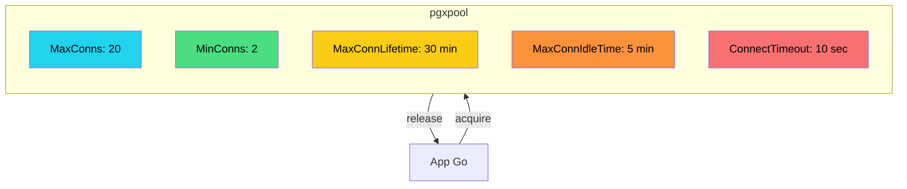
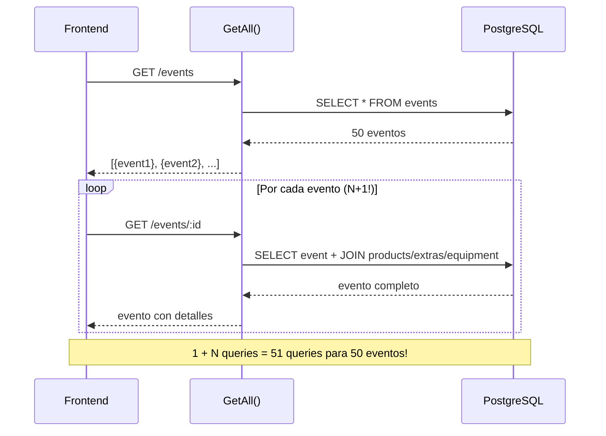
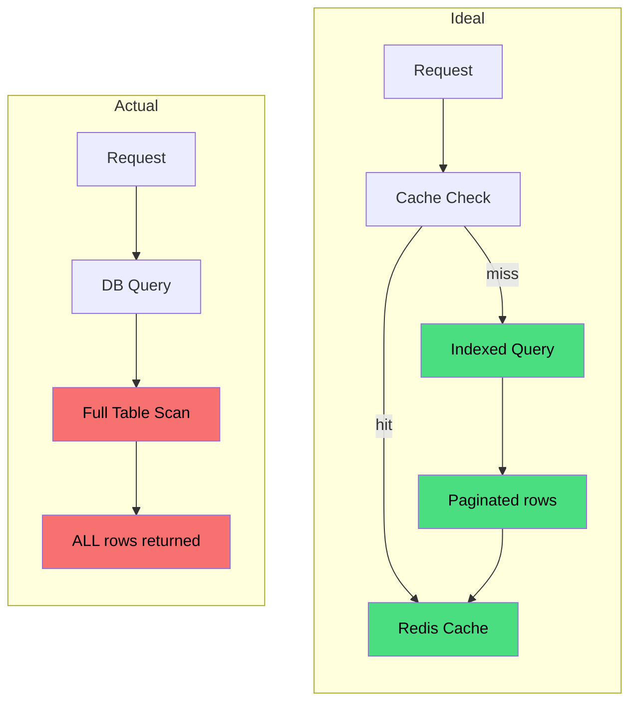
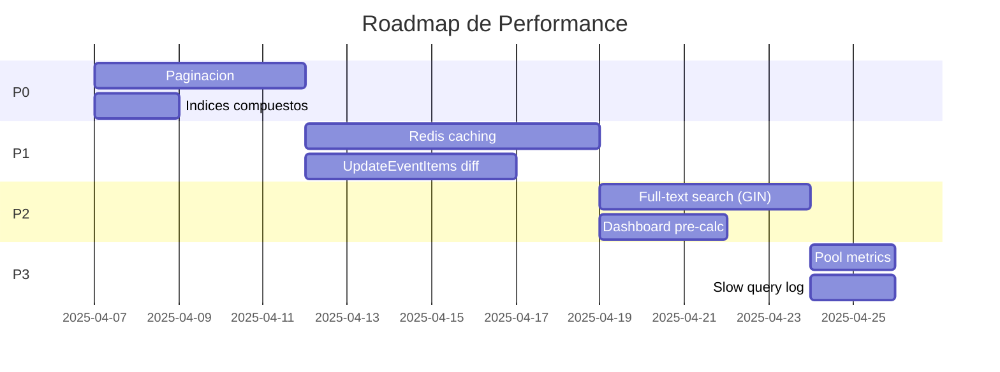
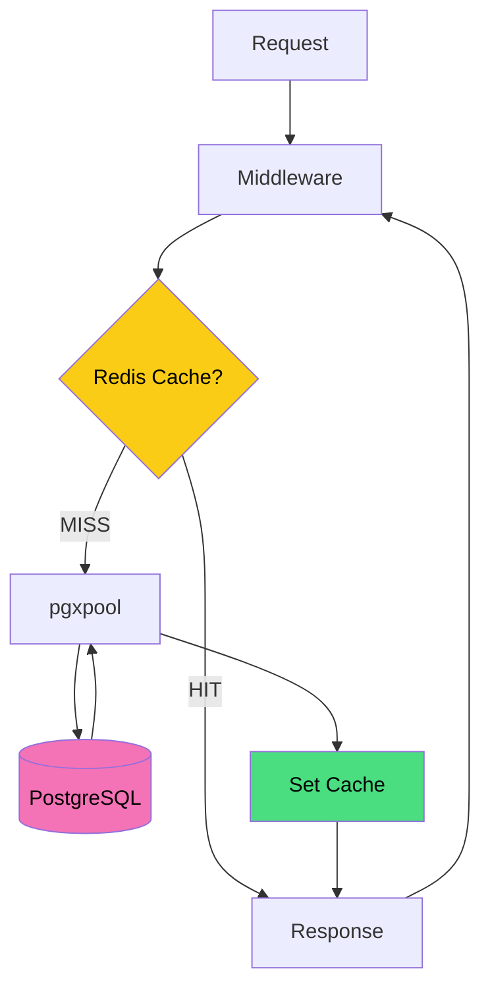

---
tags:
  - backend
  - performance
  - calidad
created: 2025-04-05
updated: 2025-04-05
related:
  - "[[Backend MOC]]"
  - "[[Base de Datos]]"
  - "[[Roadmap Backend]]"
  - "[[Arquitectura General]]"
---

# Backend Performance

> [!abstract] Resumen
> Análisis del rendimiento del backend Go de Solennix: qué funciona bien, problemas identificados y mejoras priorizadas para escalar la aplicación.

## Lo Que Funciona Bien



- **pgxpool**: Connection pooling (20 max, 2 min) evita overhead de conexión por request
- **Go**: Binario compilado, startup rápido, bajo consumo de memoria, concurrencia nativa
- **Chi**: Router liviano, sin reflection, compatible con `net/http`
- **Binary responses**: Encoding directo a JSON sin buffers intermedios
- **Migrations embebidas**: Sin lectura de archivos externos en runtime (`go:embed`)
- **Static file caching**: Uploads servidos con `Cache-Control` de 1 año

## Connection Pool Config



| Param | Value | Description |
|-------|-------|-------------|
| `MaxConns` | 20 | Máximo de conexiones en el pool |
| `MinConns` | 2 | Mínimo de conexiones mantenidas |
| `MaxConnLifetime` | 30 min | Vida máxima de una conexión |
| `MaxConnIdleTime` | 5 min | Tiempo máximo idle antes de cerrar |
| `ConnectTimeout` | 10 sec | Timeout de conexión inicial |

## Problemas de Performance Identificados

> [!warning] N+1 Queries en Event Listing
> `GetAll()` devuelve eventos, y luego el frontend puede llamar `GetByID` por cada evento para obtener products/extras/equipment. Debería devolver datos completos en el endpoint de listado o proveer un endpoint de "detailed list".



> [!warning] UpdateEventItems es pesado
> Elimina TODOS los sub-items (products, extras, equipment, supplies) y los re-inserta. Para eventos con muchos items, esto es costoso. Mejor: updates basados en diff.

> [!warning] Sin paginación
> Todos los endpoints de listado (`GetAll`, `ListClients`, `ListEvents`, etc.) devuelven TODOS los registros. Sin paginación por cursor/offset. Se degradará con la escala.

> [!warning] Búsqueda basada en LIKE
> `Search()` usa SQL `ILIKE '%query%'` que hace un full table scan. Para datasets grandes, necesita full-text search (PostgreSQL FTS5 con GIN indexes) o búsqueda externa (Meilisearch, Elasticsearch).

> [!warning] Sin cache de queries
> Cada request hittea la base de datos. Sin cache a nivel aplicación. Considerar Redis para datos accedidos frecuentemente (perfil de usuario, estado de suscripción, stats del dashboard).

## Flujo de Request Actual vs. Ideal



## Mejoras Priorizadas

| Prioridad | Mejora | Impacto | Esfuerzo |
|-----------|--------|---------|----------|
| **P0** | Paginación en todos los list endpoints | Alto | Medio |
| **P0** | Índices compuestos para queries frecuentes | Alto | Bajo |
| **P1** | Query caching con Redis | Alto | Medio |
| **P1** | `UpdateEventItems` con diff | Medio | Medio |
| **P2** | Full-text search con GIN indexes | Alto | Medio |
| **P2** | Dashboard stats pre-calculadas | Medio | Bajo |
| **P3** | Connection pool metrics | Bajo | Bajo |
| **P3** | Query profiling y slow query log | Bajo | Bajo |

> [!tip] Priorización
> Las mejoras P0 y P1 son criticas antes de pasar a produccion con mas de 100 usuarios activos. Las P2 y P3 pueden implementarse de forma iterativa.



## Indices Recomendados

```sql
-- Events por rango de fechas (calendario, proximos)
CREATE INDEX idx_events_user_date ON events(user_id, event_date);
CREATE INDEX idx_events_user_status ON events(user_id, status);

-- Payments por evento
CREATE INDEX idx_payments_event_id ON payments(event_id);

-- Batch lookup de ingredientes de productos
CREATE INDEX idx_product_ingredients_product ON product_ingredients(product_id);
CREATE INDEX idx_product_ingredients_inventory ON product_ingredients(inventory_id);

-- Optimizacion de busqueda (alternativas a ILIKE)
CREATE INDEX idx_clients_name_trgm ON clients USING gin(name gin_trgm_ops);
CREATE INDEX idx_products_name_trgm ON products USING gin(name gin_trgm_ops);
```

> [!tip] Trigram Indexes
> Los indexes `gin_trgm_ops` requieren la extension `pg_trgm`. Activar con `CREATE EXTENSION IF NOT EXISTS pg_trgm;`. Soportan busquedas `ILIKE` sin full table scan.

## Arquitectura de Cache Propuesta



**Candidatos para cache:**

| Dato | TTL | Razón |
|------|-----|-------|
| Perfil de usuario | 15 min | Poco cambio, acceso frecuente |
| Estado de suscripción | 5 min | Validado en cada request |
| Dashboard stats | 1 min | Datos agregados, acceso frecuente |
| Catálogo de productos | 10 min | Cambio infrecuente |
| Lista de clientes | 5 min | Cambio moderado |

---

**Relacionado:** [[Backend MOC]] | [[Base de Datos]] | [[Roadmap Backend]] | [[Arquitectura General]]
