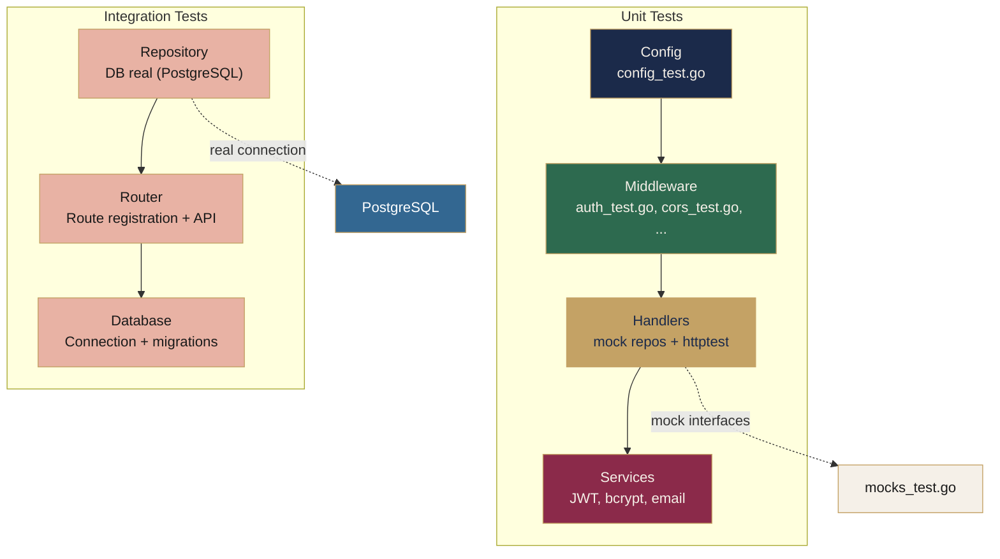
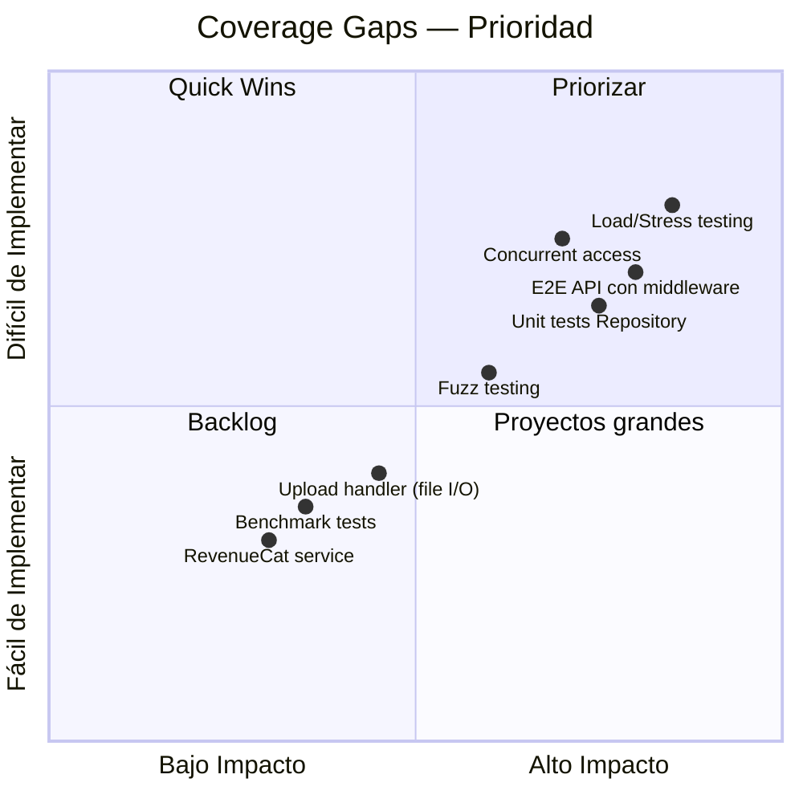

# Testing — Backend

#backend #testing #calidad

> [!abstract] Resumen
> El backend tiene tests en todas las capas. Usa **testify** para assertions y mocks, **httptest** para simular HTTP requests sin levantar un servidor real. Los mocks implementan las interfaces de repositorio definidas en `handlers/interfaces.go`.

---

## Diagrama de Capas de Testing



---

## Test Stack

| Tool | Uso |
|------|-----|
| **testify** (`assert`, `require`, `mock`) | Assertions y mocking |
| **net/http/httptest** | Requests HTTP simulados sin servidor real |
| **Mocks en `handlers/mocks_test.go`** | Implementan interfaces de repositorio |

---

## Test Layers

| Capa | Archivos | Cantidad | Enfoque |
|------|----------|----------|---------|
| **Config** | `config_test.go` | ~2 | Env vars, valores por defecto |
| **Middleware** | `auth_test.go`, `cors_test.go`, `recovery_test.go`, `security_test.go`, `ratelimit_test.go`, `admin_test.go`, `logging_test.go` | ~14 | Comportamiento individual de cada middleware |
| **Handlers** | `auth_handler_test.go`, `crud_handler_test.go`, `crud_handler_success_test.go`, `crud_handler_error_test.go`, `crud_payment_test.go`, `subscription_handler_test.go`, `upload_handler_test.go`, `search_handler_test.go`, `helpers_test.go`, `validation_test.go`, `contract_template_test.go`, `device_handler_test.go`, `handlers_integration_test.go` | ~13 archivos | Mock repos, validación de respuestas HTTP |
| **Services** | `auth_service_test.go`, `email_service_test.go`, `revenuecat_service_test.go` | ~3 | JWT, bcrypt, templates de email |
| **Repository** | `repository_integration_test.go`, `repository_error_test.go`, `repository_integration_full_test.go` | ~3 | Integración con DB real |
| **Router** | `router_test.go`, `router_api_integration_test.go` | ~2 | Registro de rutas, integración API |
| **Database** | `database_test.go`, `migrate_test.go` | ~2 | Conexión, sistema de migraciones |

---

## Mock Pattern

Todos los mocks están en `handlers/mocks_test.go`. Implementan las interfaces de repositorio definidas en `handlers/interfaces.go`:

```mermaid
graph LR
    Interfaces["handlers/interfaces.go"] --> Mocks["handlers/mocks_test.go"]

    subgraph "Interfaces → Mocks"
        UserRepo["UserRepository"] --> MockUser["mockUserRepo"]
        ClientRepo["ClientRepository"] --> MockClient["mockClientRepo"]
        EventRepo["EventRepository"] --> MockEvent["mockEventRepo"]
        ProductRepo["ProductRepository"] --> MockProduct["mockProductRepo"]
        InventoryRepo["InventoryRepository"] --> MockInventory["mockInventoryRepo"]
        PaymentRepo["PaymentRepository"] --> MockPayment["mockPaymentRepo"]
        AdminRepo["AdminRepository"] --> MockAdmin["mockAdminRepo"]
        StripeSvc["StripeService"] --> MockStripe["mockStripeService"]
    end

    style Interfaces fill:#1B2A4A,color:#F5F0E8,stroke:#C4A265
    style Mocks fill:#C4A265,color:#1B2A4A,stroke:#C4A265
    style UserRepo fill:#2D6A4F,color:#F5F0E8,stroke:#C4A265
    style ClientRepo fill:#2D6A4F,color:#F5F0E8,stroke:#C4A265
    style EventRepo fill:#2D6A4F,color:#F5F0E8,stroke:#C4A265
    style ProductRepo fill:#2D6A4F,color:#F5F0E8,stroke:#C4A265
    style InventoryRepo fill:#2D6A4F,color:#F5F0E8,stroke:#C4A265
    style PaymentRepo fill:#2D6A4F,color:#F5F0E8,stroke:#C4A265
    style AdminRepo fill:#2D6A4F,color:#F5F0E8,stroke:#C4A265
    style StripeSvc fill:#2D6A4F,color:#F5F0E8,stroke:#C4A265
    style MockUser fill:#F5F0E8,stroke:#C4A265,color:#1A1A1A
    style MockClient fill:#F5F0E8,stroke:#C4A265,color:#1A1A1A
    style MockEvent fill:#F5F0E8,stroke:#C4A265,color:#1A1A1A
    style MockProduct fill:#F5F0E8,stroke:#C4A265,color:#1A1A1A
    style MockInventory fill:#F5F0E8,stroke:#C4A265,color:#1A1A1A
    style MockPayment fill:#F5F0E8,stroke:#C4A265,color:#1A1A1A
    style MockAdmin fill:#F5F0E8,stroke:#C4A265,color:#1A1A1A
    style MockStripe fill:#F5F0E8,stroke:#C4A265,color:#1A1A1A
```



> [!tip] Patrón
> Cada handler recibe sus dependencias como interfaces, no como structs concretos. Esto permite inyectar mocks en los tests y validar comportamiento sin tocar la DB.

---

## Comandos de Ejecución

```bash
# Todos los tests
cd backend && go test ./...

# Verbose
go test ./... -v

# Paquete específico
go test ./internal/handlers/ -v

# Integration tests (requieren DB)
go test ./internal/repository/ -v

# Con coverage
go test ./... -coverprofile=coverage.out
go tool cover -html=coverage.out
```

---

## Coverage Gaps

> [!warning] Áreas de mejora
> Estos son los gaps identificados en la cobertura de tests del backend.



| Gap | Descripción |
|-----|-------------|
| **`event_form_handler.go`** | Sin archivo de test — `GenerateLink`, `ListLinks`, `DeleteLink`, `GetFormData`, `SubmitForm` sin cobertura |
| **`event_public_link_handler.go`** | Sin archivo de test — `GetPublicEvent`, `CreatePublicLink` sin cobertura |
| **`staff_team_handler.go`** | Sin archivo de test — CRUD de equipos sin cobertura |
| Repository unit tests | No hay unit tests con mocks — solo integration tests con DB real |
| Benchmark tests | No hay tests de performance con `go test -bench` |
| Fuzz testing | No hay fuzz testing para validación de inputs |
| Load/Stress testing | No hay tests de carga o estrés |
| E2E API con middleware | No hay tests end-to-end que exercise toda la cadena de middleware |
| Upload handler | Tests limitados — falta mocking de file I/O |
| Concurrent access | No hay tests para escenarios de acceso concurrente |
| RevenueCat service | Tests básicos, cobertura insuficiente |

---

## Relacionado

- [[Backend MOC]] — Índice general del backend
- [[Arquitectura General]] — Capas, flujo de datos, estructura
- [[Seguridad]] — Headers OWASP, rate limiting, JWT blacklist
- [[Roadmap Backend]] — Mejoras priorizadas incluyendo gaps de testing

#backend #testing #calidad
