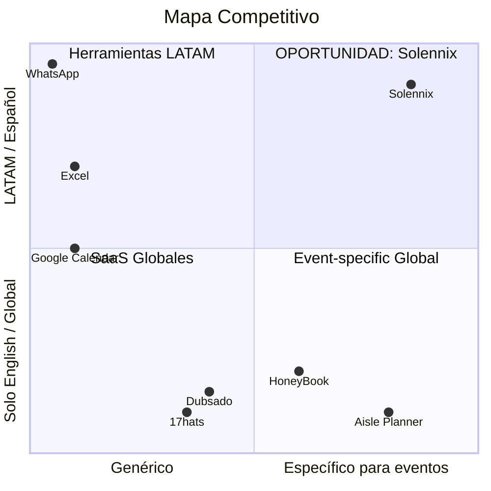

---
tags:
  - prd
  - competencia
  - estrategia
  - solennix
aliases:
  - Análisis Competitivo
  - Competitive Analysis
date: 2026-03-20
updated: 2026-04-17
status: active
---

# Análisis Competitivo

> [!abstract] Posicionamiento
> Solennix deja de competir como "otra app de planificación" para posicionarse como **plataforma integral de gestión de eventos para organizadores LATAM** — donde no existe ninguna solución nativa que combine cotización, inventario, finanzas, contratos y catálogos en una sola app multi-plataforma.

---

## Posicionamiento de Mercado

### Antes (descartado)
> "App de planificación de eventos" compitiendo con Trello, Asana, Monday.com — categoría equivocada, sin diferenciación.

### Ahora
> "La única plataforma de gestión de eventos diseñada para Latinoamérica."

---

## Competidores Globales

### HoneyBook

| Aspecto        | Detalle                                                             |
| -------------- | ------------------------------------------------------------------- |
| **URL**        | honeybook.com                                                       |
| **Precio**     | USD $39/mo (o $390/año ≈ $32/mo) — abril 2026                       |
| **Mercado**    | EE.UU., creativos, wedding planners                                 |
| **Idioma**     | Solo inglés (español parcial 2025)                                  |
| **Fortalezas** | CRM robusto, contratos digitales, firma legal US, pagos online, UX excelente |
| **Debilidades** | Sin inventario · Sin catálogo con recetas · Sin LATAM · Sin MercadoPago/Conekta/PSE |

> [!tip] Lección que copiamos
> Sensación premium del portal del cliente + flujo de firma digital. NO copiamos: precio en USD, tono frío, peso del onboarding.

> [!danger] Amenaza ALTA
> Si entra a LATAM con localización, es el competidor más peligroso. **Mitigación**: construir base de usuarios leal + features LATAM-específicos que HoneyBook no tenga incentivo de construir.

**Ventaja Solennix**: Inventario integrado · Catálogo con recetas · ~50% menos precio · Español nativo · IVA local · 3 apps nativas

### Dubsado

| Aspecto | Detalle |
|---------|---------|
| **URL** | dubsado.com |
| **Precio** | USD $40/mo, USD $400/año |
| **Fortalezas** | Formularios, workflows automatizados, portales de cliente — customización profunda |
| **Debilidades** | Sin inventario · UI recargada · Stripe/Square (sin pasarelas LATAM) · UX compleja |

> [!warning] Amenaza MEDIA — buena automatización, pero no es para eventos ni LATAM

### 17hats

| Aspecto | Detalle |
|---------|---------|
| **URL** | 17hats.com |
| **Precio** | USD $15–50/mo |
| **Fortalezas** | Todo-en-uno para freelancers: contratos, facturas, calendario |
| **Debilidades** | Producto estancado · UX anticuada · No event-specific · Sin inventario · Sin app nativa · Sin LATAM |

> [!warning] Amenaza MEDIA — overlap parcial en CRM, pero no es vertical

### Aisle Planner

| Aspecto | Detalle |
|---------|---------|
| **URL** | aisleplanner.com |
| **Precio** | USD $50/mo aprox (nicho boda) |
| **Fortalezas** | Diseñado para bodas: timelines, floor plans, vendors |
| **Debilidades** | Solo bodas · Sin inventario · Sin app nativa · Sin LATAM |

> [!note] Amenaza BAJA — nicho demasiado estrecho

---

## Competidores LATAM

> [!important] El competidor real
> La competencia en LATAM no son apps especializadas — son las herramientas informales que los organizadores ya usan. Son gratuitas, familiares, y ya integradas en su flujo de trabajo.

### Players LATAM especializados (observados — 2026-04-16)

> [!warning] Requiere investigación de campo
> Este bloque se rellena con entrevistas a 20 organizadores MX/AR/CO/CL en Q2 2026.

| Competidor   | País | Modelo    | Fortaleza observada           | Debilidad observada                               |
| ------------ | ---- | --------- | ----------------------------- | ------------------------------------------------- |
| Aplanar.app  | AR   | Freemium  | UI local, precios en ARS      | Producto joven, feature gap, foco bodas           |
| Eventos365   | MX   | Anual     | Integración con salones       | UI anticuada, no mobile                           |
| PlanPro MX   | MX   | Comisión  | Marketplace de proveedores    | No es SaaS puro, depende de proveedores pagando   |
| WedPlanner CO| CO   | Freemium  | Foco wedding                  | Cero traction reportado                           |

### Excel / Google Sheets

| Aspecto | Detalle |
|---------|---------|
| **Precio** | Gratis |
| **Adopción** | **La más usada** por organizadores LATAM |
| **Uso** | Presupuestos, listas de precios, control de pagos, inventario manual |

> [!danger] Amenaza MUY ALTA
> El mayor obstáculo no es otro software — es la inercia de "ya me funciona con Excel".

**Ventaja Solennix**: Automatización de cotizaciones · PDFs profesionales · Inventario automático · Calendario visual · Dashboard KPIs · Todo desde el teléfono

### WhatsApp

| Aspecto | Detalle |
|---------|---------|
| **Adopción** | **Ubicuo** — 95%+ organizadores lo usan como canal principal |
| **Uso** | Enviar cotizaciones, confirmar detalles, coordinar, recibir pagos |

> [!danger] Amenaza MUY ALTA — no como reemplazo sino como complemento inevitable
> **Estrategia**: Solennix NO reemplaza WhatsApp — lo complementa. Genera PDFs que se comparten por WhatsApp. Organiza lo que WhatsApp no puede.

### Google Calendar · Cuaderno · CRMs genéricos

| Herramienta | Amenaza | Razón |
|-------------|---------|-------|
| Google Calendar | 🟡 Media | Suficiente para agendar, no para gestionar |
| Cuaderno / Papel | 🟡 Media | Prevalente en segmento informal |
| Pipedrive/HubSpot/Zoho | 🟢 Baja | Demasiado corporativos y complejos |

---

## Matriz Comparativa

> [!note] Leyenda
> ✅ Incluido · 🟡 Parcial · ❌ No disponible

| Feature | **Solennix** | HoneyBook | 17hats | Dubsado | Excel | WhatsApp |
|---------|:---:|:---:|:---:|:---:|:---:|:---:|
| Gestión de eventos | ✅ | 🟡 | ❌ | ❌ | 🟡 | ❌ |
| Cotizaciones / PDF | ✅ | ✅ | ✅ | ✅ | 🟡 | ❌ |
| Catálogo de productos | ✅ | ❌ | ❌ | ❌ | 🟡 | ❌ |
| Recetas / ingredientes | ✅ | ❌ | ❌ | ❌ | 🟡 | ❌ |
| Inventario de equipo | ✅ | ❌ | ❌ | ❌ | 🟡 | ❌ |
| Control de insumos | ✅ | ❌ | ❌ | ❌ | 🟡 | ❌ |
| Calendario integrado | ✅ | ✅ | ✅ | ✅ | ❌ | ❌ |
| Seguimiento de pagos | ✅ | ✅ | ✅ | ✅ | 🟡 | ❌ |
| Contratos digitales | ✅ | ✅ | ✅ | ✅ | ❌ | ❌ |
| App iOS nativa | ✅ | ✅ | ❌ | ❌ | 🟡 | ✅ |
| App Android nativa | ✅ | ✅ | ❌ | ❌ | 🟡 | ✅ |
| App Web | ✅ | ✅ | ✅ | ✅ | ✅ | 🟡 |
| Pricing LATAM | ✅ | ❌ | ❌ | ❌ | ✅ | ✅ |
| Español nativo | ✅ | ❌ | ❌ | ❌ | ✅ | ✅ |
| IVA / impuestos locales | ✅ | ❌ | ❌ | ❌ | 🟡 | ❌ |
| Dashboard KPIs | ✅ | ✅ | 🟡 | 🟡 | ❌ | ❌ |
| Widgets móviles | ✅ | ❌ | ❌ | ❌ | ❌ | ❌ |
| Live Activity | ✅ | ❌ | ❌ | ❌ | ❌ | ❌ |
| Offline mode | ✅ | ❌ | ❌ | ❌ | 🟡 | 🟡 |

---

## Ventajas Competitivas Clave

> [!success] Diferenciadores únicos

1. **Multi-plataforma nativa** — SwiftUI + Compose + React con Go backend. Ningún competidor LATAM ofrece esto
2. **Catálogo con recetas** — Ningún competidor global ni local tiene productos con recetas que desglosan ingredientes
3. **Inventario integrado** — Equipo reutilizable + insumos consumibles en un solo sistema con disponibilidad en tiempo real
4. **PDFs profesionales** — 7-8 tipos de documento con branding, un tap desde el teléfono
5. **Pricing LATAM** — ~50% menos que competidores globales, tier gratuito generoso
6. **Español nativo** — Diseñado en español, terminología correcta ("cotización", no "quote")

---

## Riesgos Competitivos

### Competidores Globales

| Riesgo | Severidad | Probabilidad | Mitigación |
|--------|:---------:|:------------:|------------|
| HoneyBook entra a LATAM | 🔴 | Media (2-3 años) | Base de usuarios leal + features LATAM + community building |
| Dubsado/17hats lanzan app nativa | 🟡 | Baja | Mantener ventaja en UX y features event-specific |

### Herramientas Informales

| Riesgo | Severidad | Probabilidad | Mitigación |
|--------|:---------:|:------------:|------------|
| "Excel es suficiente" | 🔴 | Alta | Demostrar ROI: tiempo ahorrado, errores evitados, imagen profesional |
| WhatsApp Business agrega CRM | 🟡 | Alta | Posicionar como complemento, no reemplazo |

### Mercado

| Riesgo | Severidad | Probabilidad | Mitigación |
|--------|:---------:|:------------:|------------|
| Sensibilidad de precio extrema | 🔴 | Alta | Free tier generoso + pricing escalonado |
| Baja penetración digital | 🟡 | Media | Onboarding simple + tutoriales en video |
| Competidor local LATAM | 🟡 | Baja-Media | First-mover + multi-plataforma como barrera |

---

## Pricing benchmark (2026-04-16)

| Producto                      | USD/mes | USD/año  | País  |
| ----------------------------- | ------- | -------- | ----- |
| Honeybook                     | 39      | 390      | USA   |
| Dubsado                       | 40      | 400      | USA   |
| 17hats                        | 15–50   | variable | USA   |
| Aisle Planner                 | 50      | 480      | USA   |
| **Solennix Pro**              | **15**  | **144**  | LATAM |
| **Solennix Business**         | **49**  | **470**  | LATAM |

Ver [[04_MONETIZATION]] para justificación de los precios Solennix.

---

## Siguientes pasos (2026-Q2/Q3)

- **Q2 2026:** 20 entrevistas a organizadores LATAM (5 por país clave MX/AR/CO/CL). Llenar la tabla de competidores LATAM.
- **Q2 2026:** Comprar suscripción Honeybook 1 mes y documentar screenshots del portal del cliente para benchmarking.
- **Q3 2026:** Mystery-shopping de 3 competidores LATAM (cuenta nueva, flujo completo, reporte de fricciones).
- **Revisión:** cada 6 meses o ad-hoc si un competidor lanza algo grande.

---

## Conclusiones Estratégicas

> [!tip] Las 7 claves

1. **El competidor real es Excel + WhatsApp + Calendar + cuaderno** — no HoneyBook
2. **Catálogo con recetas + inventario son diferenciadores únicos** — centrales en marketing
3. **Pricing LATAM es ventaja Y requisito** — free tier generoso, ROI inmediato
4. **WhatsApp es aliado, no enemigo** — integrarse con su flujo, no reemplazarlo
5. **Multi-plataforma nativa es barrera de entrada** — 12-18 meses para replicar
6. **HoneyBook es el riesgo a largo plazo** — mitigar con especialización vertical
7. **XV años y catering familiar es océano azul** — ningún software los atiende

---

> [!tip] Documentos relacionados
> - [[01_PRODUCT_VISION|Visión]] — problema y oportunidad
> - [[04_MONETIZATION|Monetización]] — pricing vs competidores
> - [[02_FEATURES|Features]] — qué nos diferencia funcionalmentem

#prd #competencia #estrategia #solennix
