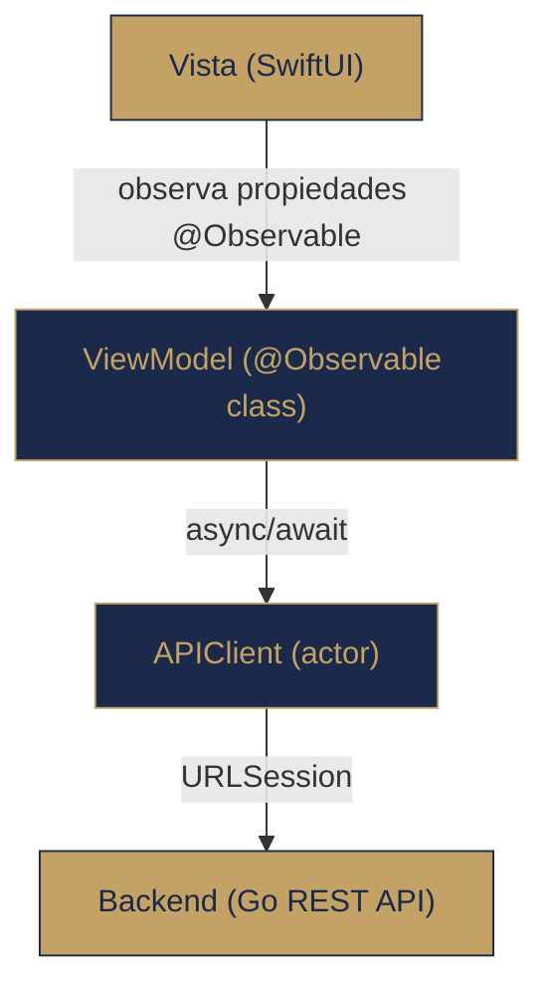
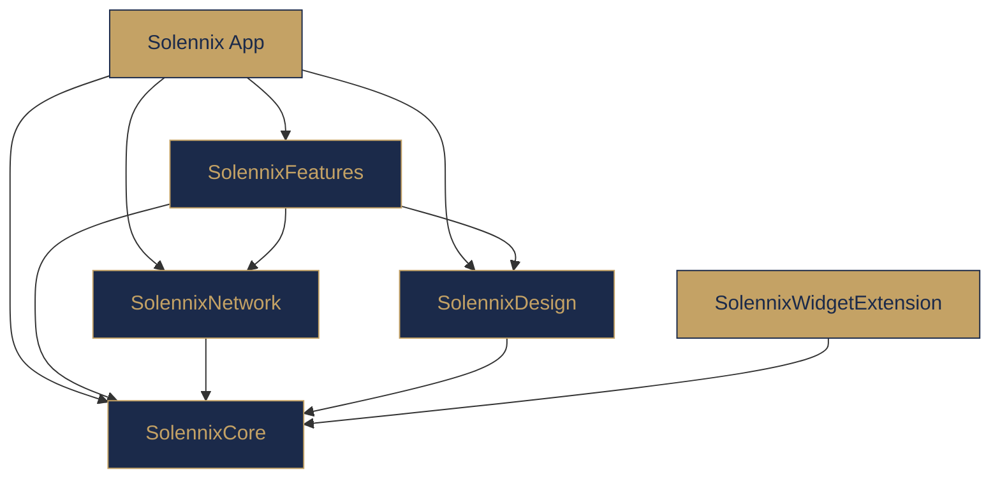
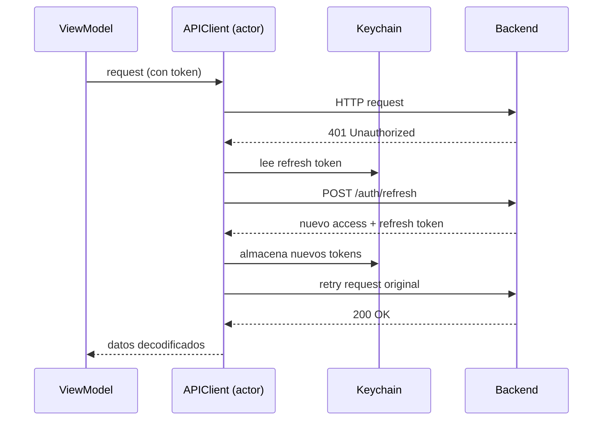

---
tags:
  - prd
  - arquitectura
  - ios
  - swiftui
  - solennix
aliases:
  - Arquitectura iOS
  - iOS Architecture
date: 2026-03-20
updated: 2026-05-17
status: active
platform: iOS
---

# Arquitectura Tecnica: Solennix iOS

> [!info] Stack Principal
> **Fecha:** Marzo 2026 · **Última actualización:** 2026-04-29
> **Plataformas:** iOS 17+ / iPadOS 17+ / macOS 14+ (Designed for iPad)
> **Lenguaje:** Swift 5.9+
> **Framework UI:** SwiftUI
> **Arquitectura:** MVVM con @Observable

> [!success] Versionado actual (2026-05-06)
>
> - **App Store live:** https://apps.apple.com/mx/app/solennix/id6760874129
> - **Manifest canónico:** `versioning/releases.json`
> - **Versión app (`ios/project.yml`):** `1.2.0` (build `7`)
> - **Targets embebidos:** widget + notification service alineados a `1.2.0` (build `7`)
> - **Bundle ID:** `com.solennix.app`
> - **Development Team:** `T5SKULSP2M`
> - **Base URL API:** `https://api.solennix.com/api`

> [!info] Release train 2026-05-06
>
> - **Búsqueda de eventos:** iOS consume resultados alineados al backend vía `/api/events/search`
> - **Calendario:** paridad con filtro por estado, retry, navegación e iCal
> - **Detalle/Dashboard:** restore de upcoming events/top clients y fix en guardado de stock adjustment
> - **Detalle de evento:** se removió la acción legacy de WhatsApp; la compartición oficial queda en `ClientPortalShareSheet`
> - **Settings:** el centro de ayuda vive como acción secundaria en Ajustes y la apariencia se mantiene concentrada en esa pantalla

> [!success] UI Refresh Lab 2026-05-08 (iOS/iPadOS/macOS)
>
> - Se incorporó `SolennixGlassSurface` en `SolennixDesign` para material/glass reutilizable y controlado (uso recomendado en chrome y overlays, no en todas las cards de datos).
> - Se estandarizó la migración a `SolennixColors` en vistas SwiftUI para evitar drift de colores de sistema hardcodeados.
> - `SidebarSplitLayout` refuerza consistencia de fondo/superficies y aplica glass sutil en header/footer del sidebar para iPad/macOS.
> - `SearchView` y `EventDetailView` mejoran comportamiento de regular width con límites de ancho y espaciado desktop-class.

> [!success] 2026-05-15 — Team Member Portal (Ola 4) base implementada
>
> - Implementado: `User.role` en modelo compartido + routing por rol en `ContentView`.
> - Implementado: `TeamMemberPortalView` y `TeamMemberPortalViewModel` con carga y respuesta de asignaciones (`accept|decline`).
> - Implementado: Home `Mi jornada` (Hoy + Próximos 7 días + Pendientes) con CTAs de agenda de hoy y revisión de asignaciones.
> - Pendiente: calendario completo mes/semana/día y detalle Team scoped.
> - Fuente de roadmap y DoD: `docs/PRD/17_PERSONAL_TRACKER.md`.

> [!success] 2026-05-15 — Team Member Portal iOS: consolidación + calendario (slice A3)
>
> - `TeamMemberPortalView` se consolidó en una única superficie operativa con selector segmentado: `Mi jornada` + `Calendario`.
> - `Mi jornada` contiene pendientes accionables y agenda completa en la misma vista.
> - `Calendario` usa grilla mensual custom (`LazyVGrid`) con navegación de mes y dots por estado para fechas con asignaciones.
> - `TeamMemberPortalViewModel.respond` ahora actualiza estado (`confirmed/declined/cancelled`) en lugar de eliminar la asignación, para mantener continuidad de agenda.
> - `TeamMemberPortalView` consume `AuthManager` desde `Environment` y expone logout directo en la top bar, alineando la salida del portal con Android sin agregar otra pantalla.

> [!success] 2026-05-17 — Team Member Portal iOS: H3 calendario operativo (issue #338)
>
> - `TeamMemberPortalView` agrega modos `Mes`, `Semana` y `Día` en la sección `Calendario`.
> - `Semana` y `Día` ordenan asignaciones por horario de turno (`shiftStart/shiftEnd`) con fallback por fecha del evento.
> - Tap en asignación abre `TeamPortalAssignmentDetailSheet` con fecha, turno, rol, pago y notas.
> - Se mantiene intacto el calendario del organizer (sin cambios de comportamiento fuera del portal `team_member`).

> [!success] 2026-05-17 — Team Member Portal iOS: H4 detalle Team scoped (issue #339)
>
> - `TeamPortalAssignmentDetailSheet` amplía el contexto operativo con brief, turno, contacto, notas del organizador y CTA `Abrir en mapas`.
> - Se agregó checklist personal de ejecución + nota rápida persistida localmente por evento (`team_event_detail_{eventId}`).
> - El detalle Team permanece scoped al flujo `team_member` y no introduce nuevas rutas del organizer.

> [!success] 2026-05-17 — Team Member Portal iOS: H5 timeline de cambios (issue #340)
>
> - `TeamMemberPortalView` incorpora bloque `Cambios recientes` con badge de no leídos.
> - Cada cambio abre el detalle Team del evento asignado y marca leído vía backend (`/staff/my-timeline/read`).
> - El feed se consume desde `/staff/my-timeline` y queda scoped al usuario `team_member` autenticado.

> [!success] 2026-05-17 — Team Member Portal iOS: H6 disponibilidad del miembro (issue #341)
>
> - `TeamMemberPortalView` incorpora sección `Mi disponibilidad` con alta/edición/baja de bloqueos.
> - Se agregan bloqueos por fecha con rango horario opcional (`startTime`/`endTime`) y motivo.
> - Los cambios refrescan inmediatamente en el portal y usan endpoints scoped del miembro (`/unavailable-dates`).

> [!info] Dependencias externas SPM (2026-04-16)
>
> | Paquete                          | Versión mínima | Usado en                              |
> | -------------------------------- | -------------- | ------------------------------------- |
> | `RevenueCat/purchases-ios-spm`   | 5.0.0          | SolennixNetwork, SolennixFeatures     |
> | `google/GoogleSignIn-iOS`        | 8.0.0          | SolennixNetwork                       |
> | `getsentry/sentry-cocoa`         | 8.43.0         | SolennixFeatures                      |

> [!tip] Documentos relacionados
>
> - [[PRD MOC]] — Indice general del PRD
> - [[01_PRODUCT_VISION]] — Vision del producto
> - [[02_FEATURES]] — Features y tabla de paridad
> - [[19_I18N_STRATEGY]] — Estrategia de i18n, copy matrix y reglas de paridad semántica
> - `docs/iOS/Plan iOS i18n + QA + Refactor por Pantalla.md` — ejecución iOS pantalla por pantalla (traducciones + tests + refactor)
> - [[06_TECHNICAL_ARCHITECTURE_ANDROID]] — Arquitectura Android
> - [[07_TECHNICAL_ARCHITECTURE_BACKEND]] — Arquitectura Backend
> - [[08_TECHNICAL_ARCHITECTURE_WEB]] — Arquitectura Web
> - [[11_CURRENT_STATUS]] — Estado actual de implementacion

---

## 1. Stack Tecnologico

| Capa                    | Tecnologia                                     | Version minima |
| ----------------------- | ---------------------------------------------- | -------------- |
| Lenguaje                | Swift 5.9                                      | Xcode 15+      |
| UI                      | SwiftUI                                        | iOS 17         |
| Arquitectura            | MVVM con `@Observable` macro                   | iOS 17         |
| Paquetes                | Swift Package Manager (SPM) local              | --             |
| Cache offline           | SwiftData                                      | iOS 17         |
| Widgets                 | WidgetKit (4 widgets + 1 interactivo)          | iOS 17         |
| Dynamic Island          | ActivityKit (Live Activity)                    | iOS 16.1+      |
| Spotlight               | CoreSpotlight (indexacion de eventos/clientes) | iOS 17         |
| Suscripciones           | RevenueCat SDK (wraps StoreKit 2)              | iOS 17         |
| Biometria               | LocalAuthentication (Face ID / Touch ID)       | iOS 17         |
| Onboarding              | TipKit                                         | iOS 17         |
| Crash Reporting         | Sentry                                         | --             |
| Generacion de proyectos | XcodeGen (`project.yml`)                       | --             |
| Red                     | URLSession (actor-based `APIClient`)           | iOS 17         |
| Almacenamiento seguro   | Keychain Services                              | iOS 17         |
| Conectividad            | NWPathMonitor (Network framework)              | iOS 17         |
| Apple Sign-In           | AuthenticationServices                         | iOS 17         |
| i18n                    | `Localizable.xcstrings` + `FeatureL10n`        | iOS 17         |

### Decisiones clave

> [!note] Decisiones de arquitectura
>
> - **Sin dependencias SPM externas:** Todos los paquetes son locales (SolennixCore, SolennixNetwork, SolennixDesign, SolennixFeatures). Cero dependencias de terceros para maximo control y tiempos de compilacion minimos.
> - **@Observable sobre TCA:** Se eligio la macro nativa `@Observable` (iOS 17) sobre The Composable Architecture. TCA agrega complejidad innecesaria para una app CRUD centrada en formularios. `@Observable` ofrece reactividad nativa sin boilerplate.
> - **Actor-based networking:** `APIClient` es un `actor` de Swift, garantizando seguridad de hilos sin locks manuales ni `DispatchQueue`.
> - **SwiftData solo para cache:** SwiftData se usa exclusivamente para cache offline (no como fuente de verdad). La fuente de verdad es siempre el backend via API REST.
> - **XcodeGen:** El archivo `project.yml` genera el `.xcodeproj`, eliminando conflictos de merge en el archivo de proyecto y facilitando la gestion de targets.
> - **i18n dinamico en runtime:** El target principal inyecta `\.locale` desde `@AppStorage("preferredLocale")`; `SolennixFeatures` resuelve strings con `FeatureL10n` sobre `Localizable.xcstrings` usando `bundle: .module`. El idioma se sincroniza con `User.preferredLanguage` y se persiste via `PUT /api/users/me` (`preferred_language`).

---

## 2. Arquitectura -- MVVM con @Observable

### Por que MVVM con @Observable

> [!abstract] Patron arquitectonico: MVVM + @Observable
> MVVM fue elegido sobre TCA, VIPER y Clean Architecture por las siguientes razones:
>
> 1. **Simplicidad nativa** -- `@Observable` (iOS 17) elimina la necesidad de `ObservableObject`, `@Published` y `objectWillChange`. El compilador genera la observacion automaticamente.
> 2. **DI via @Environment** -- Inyeccion de dependencias nativa de SwiftUI sin contenedores externos.
> 3. **Menor boilerplate** -- Sin reducers, actions, effects ni stores. Ideal para una app centrada en CRUD y formularios.
> 4. **Curva de aprendizaje minima** -- Patron estandar de la industria, facil de mantener y escalar.
> 5. **Compatibilidad total** -- Funciona con SwiftUI, SwiftData, WidgetKit y todas las APIs de Apple sin adaptadores.

### Patron fundamental



### Ejemplo representativo

```swift
@Observable
public final class EventFormViewModel {

    // Estado del formulario — la vista observa automaticamente
    public var clientId: String = ""
    public var serviceType: String = ""
    public var isLoading: Bool = false
    public var errorMessage: String?

    // Dependencia inyectada
    public let apiClient: APIClient

    public init(apiClient: APIClient) {
        self.apiClient = apiClient
    }

    @MainActor
    public func loadInitialData() async {
        isLoading = true
        defer { isLoading = false }

        do {
            clients = try await apiClient.get(Endpoint.clients)
        } catch {
            errorMessage = error.localizedDescription
        }
    }
}
```

### Principios de diseno

| Principio    | Implementacion                                                                  |
| ------------ | ------------------------------------------------------------------------------- |
| Reactividad  | `@Observable` macro en todos los ViewModels                                     |
| DI           | `@Environment` para servicios globales (AuthManager, APIClient, NetworkMonitor) |
| Concurrencia | `actor` para APIClient; `@MainActor` para actualizaciones de UI                 |
| Protocolos   | `Codable`, `Identifiable`, `Sendable`, `Hashable` en todos los modelos          |
| Separacion   | Views no contienen logica de negocio; ViewModels no importan SwiftUI            |

---

## 3. Estructura del Proyecto

```
ios/
├── Solennix/                              # Target principal de la app
│   ├── SolennixApp.swift                  # @main, init de dependencias, Scene
│   ├── ContentView.swift                  # Vista raiz (auth flow, adaptive layout)
│   ├── Navigation/                        # Sistema de navegacion
│   │   ├── Route.swift                    # Tab enum, SidebarSection enum
│   │   ├── RouteDestination.swift         # Switch de Route -> View
│   │   ├── CompactTabLayout.swift         # TabView para iPhone (4 tabs + FAB)
│   │   ├── SidebarSplitLayout.swift       # NavigationSplitView para iPad
│   │   └── DeepLinkHandler.swift          # Manejo de deep links y Spotlight
│   ├── Widgets/
│   │   └── WidgetDataSync.swift           # Sincronizacion de datos app -> widgets
│   ├── Info.plist
│   └── Solennix.entitlements
│
├── Packages/
│   ├── SolennixCore/                      # Modelos, cache, utilidades
│   │   └── Sources/SolennixCore/
│   │       ├── Models/                    # Structs Codable (Event, Client, etc.)
│   │       ├── Cache/                     # SwiftData models + CacheManager
│   │       ├── Extensions/                # Extensiones de Foundation
│   │       ├── Route.swift                # Route enum compartido entre paquetes
│   │       ├── SolennixEventAttributes.swift  # ActivityKit attributes
│   │       ├── APIError.swift             # Enum de errores de red
│   │       └── EmptyResponse.swift        # Respuesta vacia para DELETE/204
│   │
│   ├── SolennixNetwork/                   # Capa de red
│   │   └── Sources/SolennixNetwork/
│   │       ├── APIClient.swift            # Actor HTTP client
│   │       ├── APIClientEnvironmentKey.swift  # EnvironmentKey para DI
│   │       ├── AuthManager.swift          # Autenticacion y sesion
│   │       ├── AppleSignInService.swift   # Sign in with Apple
│   │       ├── SubscriptionManager.swift  # RevenueCat SDK
│   │       ├── KeychainHelper.swift       # Almacenamiento seguro
│   │       ├── NetworkMonitor.swift       # NWPathMonitor
│   │       └── Endpoints.swift            # Constantes de endpoints API
│   │
│   ├── SolennixDesign/                    # Sistema de diseno
│   │   └── Sources/SolennixDesign/
│   │       ├── Colors.swift               # Paleta de colores (gold/tan)
│   │       ├── Gradient.swift             # Gradientes premium
│   │       ├── Typography.swift           # Estilos tipograficos
│   │       ├── Spacing.swift              # Sistema de espaciado
│   │       ├── Shadows.swift              # Estilos de sombras
│   │       └── Components/               # Componentes reutilizables
│   │           ├── Avatar.swift
│   │           ├── ConfirmDialog.swift
│   │           ├── EmptyStateView.swift
│   │           ├── GlassSurface.swift
│   │           ├── PremiumButton.swift
│   │           ├── SkeletonView.swift
│   │           ├── SolennixTextField.swift
│   │           ├── StatusBadge.swift
│   │           ├── ToastOverlay.swift
│   │           └── UpgradeBannerView.swift
│   │
│   └── SolennixFeatures/                 # Modulos de funcionalidades
│       └── Sources/SolennixFeatures/
│           ├── Auth/                      # Login, Register, ForgotPassword
│           ├── Dashboard/                 # Vista principal, KPIs
│           ├── Calendar/                  # Vista de calendario
│           ├── Events/
│           │   ├── ViewModels/            # EventFormViewModel, EventDetailViewModel
│           │   ├── Views/                 # EventListView, EventFormView, etc.
│           │   └── PDFGenerators/         # 7 generadores de PDF
│           ├── Clients/
│           │   ├── ViewModels/            # QuickQuoteViewModel
│           │   ├── Views/                 # ClientListView, QuickQuoteView
│           │   └── PDFGenerators/         # QuickQuotePDFGenerator
│           ├── Products/                  # CRUD de productos
│           ├── Inventory/                 # CRUD de inventario (ingredientes, equipo, insumos)
│           ├── Settings/                  # Perfil, negocio, contrato, precios, legal
│           ├── Search/                    # Busqueda global
│           ├── Onboarding/               # Flujo de primera vez
│           └── Common/
│               ├── Helpers/               # Sentry, Spotlight, Haptics, LiveActivity, Tips, StoreReview
│               └── ViewModels/            # PlanLimitsManager
│
├── SolennixWidgetExtension/               # Bundle de widgets
│   ├── SolennixWidgets.swift              # @main WidgetBundle (5 widgets)
│   ├── Widgets/
│   │   ├── UpcomingEventsWidget.swift     # Proximos eventos
│   │   ├── KPIWidget.swift               # Metricas clave
│   │   ├── LockScreenWidget.swift        # Widget de pantalla de bloqueo
│   │   └── InteractiveWidget.swift        # Widget interactivo (iOS 17)
│   ├── Info.plist
│   └── SolennixWidgetExtension.entitlements
│
├── SolennixLiveActivity/                  # Dynamic Island
│   ├── SolennixLiveActivityView.swift     # Vista de la Live Activity
│   └── SolennixLiveActivityAttributes.swift  # Atributos (en SolennixCore)
│
├── SolennixIntents/                       # App Intents / Siri Shortcuts
│   └── Info.plist
│
├── project.yml                            # XcodeGen configuration
└── Solennix.xcodeproj/                    # Generado por XcodeGen
```

---

## 4. Paquetes SPM

Todos los paquetes son locales (no remotos), definidos en `project.yml` y resueltos como dependencias del workspace.



### SolennixCore

**Proposito:** Modelos de datos, cache offline, utilidades compartidas.

| API Publica                                            | Descripcion                                             |
| ------------------------------------------------------ | ------------------------------------------------------- |
| `Event`, `Client`, `Product`, `User`, `Payment`, etc.  | Structs `Codable + Identifiable + Sendable + Hashable`  |
| `EventStatus`, `DiscountType`, `InventoryType`, `Plan` | Enums de dominio                                        |
| `Route`                                                | Enum con todos los destinos navegables de la app        |
| `SolennixEventAttributes`                              | `ActivityAttributes` para Live Activities               |
| `APIError`                                             | Enum de errores de red con mensajes localizados         |
| `CacheManager`                                         | Gestor de cache SwiftData (`@MainActor @Observable`)    |
| `SolennixModelContainer`                               | Factory para el `ModelContainer` de SwiftData           |
| `CachedEvent`, `CachedClient`, `CachedProduct`         | Modelos `@Model` de SwiftData                           |
| `AnyCodable`                                           | Type-erased Codable wrapper para diccionarios dinamicos |

### SolennixNetwork

**Proposito:** Comunicacion HTTP, autenticacion, suscripciones, conectividad.

| API Publica           | Descripcion                                                        |
| --------------------- | ------------------------------------------------------------------ |
| `APIClient`           | Actor HTTP: `get()`, `post()`, `put()`, `delete()`, `upload()`     |
| `AuthManager`         | `@Observable`: login, register, signOut, refreshToken, biometrics  |
| `SubscriptionManager` | RevenueCat SDK: offerings, compras, entitlements, login/logout     |
| `AppleSignInService`  | Sign in with Apple                                                 |
| `KeychainHelper`      | Lectura/escritura segura en Keychain                               |
| `NetworkMonitor`      | `@Observable` con `isConnected` y `connectionType`                 |
| `Endpoint`            | Constantes de rutas API (ej. `/auth/login`, `/events`, `/clients`) |

### SolennixDesign

**Proposito:** Sistema de diseno visual — colores, tipografia, componentes reutilizables.

| API Publica          | Descripcion                                                                                                                                           |
| -------------------- | ----------------------------------------------------------------------------------------------------------------------------------------------------- |
| `SolennixColors`     | Paleta de colores (primary, background, surface, text, status)                                                                                        |
| `SolennixGradient`   | Gradientes premium (gold -> tan)                                                                                                                      |
| `SolennixTypography` | Estilos tipograficos predefinidos                                                                                                                     |
| `SolennixSpacing`    | Sistema de espaciado consistente                                                                                                                      |
| `SolennixShadows`    | Estilos de sombra (card, fab, modal)                                                                                                                  |
| Componentes          | `Avatar`, `ConfirmDialog`, `EmptyStateView`, `PremiumButton`, `SkeletonView`, `SolennixTextField`, `StatusBadge`, `ToastOverlay`, `UpgradeBannerView` |

### SolennixFeatures

**Proposito:** Todos los modulos de funcionalidad de la app. Cada feature contiene sus propios ViewModels y Views.

| Modulo       | Descripcion                                                                             |
| ------------ | --------------------------------------------------------------------------------------- |
| `Auth`       | Login, registro, recuperacion de contrasena, reset                                      |
| `Dashboard`  | Vista principal con KPIs, eventos pendientes                                            |
| `Calendar`   | Calendario mensual con eventos                                                          |
| `Events`     | CRUD completo de eventos (formulario multi-paso), detalle, checklist, 7 generadores PDF |
| `Clients`    | CRUD de clientes, cotizacion rapida (QuickQuote) con PDF                                |
| `Products`   | CRUD de productos/servicios                                                             |
| `Inventory`  | CRUD de inventario (ingredientes, equipo, insumos)                                      |
| `Settings`   | Perfil, ajustes de negocio, plantilla de contrato, precios, legal                       |
| `Search`     | Busqueda global multi-entidad                                                           |
| `Onboarding` | Flujo de primera vez con TipKit                                                         |
| `Common`     | PlanLimitsManager, Sentry, Spotlight, Haptics, LiveActivity, StoreReview, `PaymentEntrySheet` (sheet reusable de registro de pago, consumido por dashboard y detalle de evento) |

Regla funcional de stock bajo (iOS): `minimumStock > 0 && currentStock < minimumStock`.

---

## 5. Modelos de Datos

Todos los modelos residen en `SolennixCore/Models/` y son structs `Codable + Identifiable + Sendable + Hashable`. Usan `CodingKeys` con `snake_case` para mapear desde la API REST.

### Event

```swift
public struct Event: Codable, Identifiable, Sendable, Hashable {
    public let id: String
    public let userId: String
    public let clientId: String
    public let eventDate: String           // ISO8601 date
    public var startTime: String?
    public var endTime: String?
    public let serviceType: String
    public let numPeople: Int
    public let status: EventStatus         // .quoted | .confirmed | .completed | .cancelled
    public let discount: Double
    public let discountType: DiscountType  // .percent | .fixed
    public let requiresInvoice: Bool
    public let taxRate: Double
    public let taxAmount: Double
    public let totalAmount: Double
    public var location: String?
    public var city: String?
    public var depositPercent: Double?
    public var cancellationDays: Double?
    public var refundPercent: Double?
    public var notes: String?
    public var photos: String?
    public let createdAt: String
    public let updatedAt: String
}
```

### Client

```swift
public struct Client: Codable, Identifiable, Sendable, Hashable {
    public let id: String
    public let userId: String
    public let name: String
    public let phone: String
    public var email: String?
    public var address: String?
    public var city: String?
    public var notes: String?
    public var photoUrl: String?
    public var totalEvents: Int?
    public var totalSpent: Double?
    public let createdAt: String
    public let updatedAt: String
}
```

### Product

```swift
public struct Product: Codable, Identifiable, Sendable, Hashable {
    public let id: String
    public let userId: String
    public let name: String
    public let category: String
    public let basePrice: Double
    public var recipe: AnyCodable?
    public var imageUrl: String?
    public let isActive: Bool
    public let createdAt: String
    public let updatedAt: String
}
```

### InventoryItem

```swift
public struct InventoryItem: Codable, Identifiable, Sendable, Hashable {
    public let id: String
    public let userId: String
    public let ingredientName: String
    public let currentStock: Double
    public let minimumStock: Double
    public let unit: String
    public var unitCost: Double?
    public let lastUpdated: String
    public let type: InventoryType   // .ingredient | .equipment | .supply
}
```

### User

```swift
public struct User: Codable, Identifiable, Sendable, Hashable {
    public let id: String
    public let email: String
    public let name: String
    public var businessName: String?
    public var logoUrl: String?
    public var brandColor: String?
    public var showBusinessNameInPdf: Bool?
    public var defaultDepositPercent: Double?
    public var defaultCancellationDays: Double?
    public var defaultRefundPercent: Double?
    public var contractTemplate: String?
    public let plan: Plan                  // .basic | .premium
    public var stripeCustomerId: String?
    public let createdAt: String
    public let updatedAt: String
}
```

### Payment

```swift
public struct Payment: Codable, Identifiable, Sendable, Hashable {
    public let id: String
    public let eventId: String
    public let userId: String
    public let amount: Double
    public let paymentDate: String
    public let paymentMethod: String
    public var notes: String?
    public let createdAt: String
}
```

### Modelos de relacion (Event sub-items)

| Modelo              | Campos clave                                                                 |
| ------------------- | ---------------------------------------------------------------------------- |
| `EventProduct`      | `productId`, `quantity`, `unitPrice`, `discount`                             |
| `EventExtra`        | `description`, `cost`, `price`, `excludeUtility`                             |
| `EventEquipment`    | `inventoryId`, `equipmentName`, `quantity`, `notes`                          |
| `EventSupply`       | `inventoryId`, `supplyName`, `quantity`, `unitCost`, `source`, `excludeCost` |
| `ProductIngredient` | Relacion producto-ingrediente para recetas                                   |
| `UnavailableDate`   | Fechas bloqueadas del usuario                                                |

### DashboardKPIs + DashboardRevenuePoint (aggregates)

Modelos solo-lectura consumidos desde `GET /api/dashboard/kpis` y `GET /api/dashboard/revenue-chart`. **Backend es la unica fuente de verdad** para los 8 KPI cards del dashboard — `DashboardViewModel` expone los valores monetarios como computed properties sobre `kpis?.*` y ya no recalcula desde listas. El chart de "Ingresos — Ultimos 6 meses" toma `suffix(6)` sobre la respuesta de `revenue-chart?period=year` y solo se renderiza para usuarios no-basicos (`!planLimitsManager.isBasicPlan`). Ver `07_TECHNICAL_ARCHITECTURE_BACKEND.md#619-rutas-protegidas--dashboard-aggregated-analytics` para el contrato completo.

---

## 6. Capa de Red (SolennixNetwork)

### APIClient (actor)

`APIClient` es un `actor` de Swift que encapsula toda la comunicacion HTTP. Al ser un actor, garantiza acceso serial a su estado mutable (tokens, refresh task) sin locks ni queues manuales.

```swift
public actor APIClient {
    private let baseURL: URL
    private let keychainHelper: KeychainHelper
    private let session: URLSession
    private let decoder: JSONDecoder    // .convertFromSnakeCase
    private let encoder: JSONEncoder    // .convertToSnakeCase

    private weak var _authManager: AuthManager?
    private var refreshTask: Task<Bool, Error>?
}
```

### Metodos HTTP

| Metodo | Firma                                     | Retorno                      |
| ------ | ----------------------------------------- | ---------------------------- |
| GET    | `get<T: Decodable>(_ endpoint:, params:)` | `T`                          |
| POST   | `post<T: Decodable>(_ endpoint:, body:)`  | `T`                          |
| PUT    | `put<T: Decodable>(_ endpoint:, body:)`   | `T`                          |
| DELETE | `delete(_ endpoint:)`                     | `Void` (usa `EmptyResponse`) |
| Upload | `upload(_ endpoint:, data:, filename:)`   | `UploadResponse`             |

### Inyeccion de autenticacion

Cada request adjunta automaticamente el Bearer token desde Keychain:

```swift
if let token = keychainHelper.readString(for: KeychainHelper.Keys.accessToken) {
    request.setValue("Bearer \(token)", forHTTPHeaderField: "Authorization")
}
```

### Manejo de 401 (Token Refresh)



1. Si un request recibe 401 y NO es un retry, se intenta refresh del token.
2. `refreshTask` coalece multiples intentos concurrentes en un solo refresh.
3. Si el refresh tiene exito, se reconstruye el request con el nuevo token y se reintenta.
4. Si el refresh falla, se propaga `APIError.unauthorized`.

### Manejo de errores

```swift
public enum APIError: LocalizedError, Sendable {
    case unauthorized                           // 401
    case networkError(String)                   // URLError
    case serverError(statusCode: Int, message: String)  // 4xx/5xx
    case decodingError                          // JSON decode failure
    case unknown
}
```

Los errores 4xx/5xx intentan extraer un mensaje del body JSON (`error` o `message`). Errores visibles se envian al UI via `onError` callback (toast system).

### Upload de archivos

Soporta multipart/form-data para subir imagenes (JPEG/PNG). Genera automaticamente el boundary y el content type.

---

## 7. Autenticacion

### AuthManager

`AuthManager` es una clase `@Observable` que gestiona todo el ciclo de vida de la sesion del usuario.

```swift
@Observable
public final class AuthManager {
    public private(set) var currentUser: User?
    public private(set) var isLoading: Bool
    public private(set) var authState: AuthState
    // .unknown | .authenticated(User) | .unauthenticated | .biometricLocked
}
```

### Flujo de autenticacion

| Operacion       | Metodo                         | Descripcion                                      |
| --------------- | ------------------------------ | ------------------------------------------------ |
| Login           | `signIn(email:password:)`      | POST `/auth/login`, almacena tokens en Keychain  |
| Registro        | `signUp(name:email:password:)` | POST `/auth/register`, almacena tokens           |
| Logout          | `signOut()`                    | POST `/auth/logout` (best-effort), limpia tokens |
| Refresh         | `refreshToken()`               | POST `/auth/refresh` con refresh token           |
| Session restore | `checkAuth()`                  | Lee token de Keychain, GET `/auth/me`            |
| Profile update  | `updateProfile(data:)`         | PUT `/auth/profile`                              |

### Biometria (Face ID / Touch ID)

```swift
public func canUseBiometrics() -> Bool       // Verifica disponibilidad
public func authenticateWithBiometrics() async throws -> Bool  // Solicita autenticacion
```

Usa `LAContext` de `LocalAuthentication`. Si el usuario tiene biometria habilitada, la app muestra `BiometricGateView` antes de acceder al contenido.

### Apple Sign-In

Implementado en `AppleSignInService.swift` usando `AuthenticationServices`.

### Almacenamiento de tokens

Los tokens (access + refresh) se almacenan en **Keychain** con `kSecAttrAccessibleWhenUnlockedThisDeviceOnly`:

- Tokens solo accesibles con el dispositivo desbloqueado.
- No se respaldan ni migran a otros dispositivos.

### Resolucion del ciclo de dependencias

> [!note] Ciclo AuthManager <-> APIClient
> `AuthManager` y `APIClient` tienen una dependencia circular:
>
> - `APIClient` necesita `AuthManager` para token refresh.
> - `AuthManager` necesita `APIClient` para hacer requests.
>
> **Solucion:** `APIClient` lee tokens directamente de `KeychainHelper` (no via `AuthManager`). Ambos se inicializan independientemente y se conectan despues.

```swift
let client = APIClient(baseURL: baseURL, keychainHelper: keychain)
let auth = AuthManager(keychain: keychain)
auth.apiClient = client
await apiClient.setAuthManager(authManager)
```

### User Tracking Delegate

Protocolo `UserTrackingDelegate` permite reportar identidad del usuario a servicios externos (Sentry) sin acoplar el paquete de red a SDKs de terceros.

---

## 8. Navegacion

### Layout adaptativo

La app usa un layout adaptativo basado en `horizontalSizeClass`:

| Size Class            | Layout               | Descripcion                                          |
| --------------------- | -------------------- | ---------------------------------------------------- |
| `.compact` (iPhone)   | `CompactTabLayout`   | `TabView` con 4 tabs + FAB flotante                  |
| `.regular` (iPad/Mac) | `SidebarSplitLayout` | `NavigationSplitView` con sidebar + content + detail |

### CompactTabLayout (iPhone)

Cuatro tabs, cada uno con su propio `NavigationStack` y `NavigationPath` independiente:

| Tab        | Icono           | Vista raiz       |
| ---------- | --------------- | ---------------- |
| Inicio     | `house.fill`    | `DashboardView`  |
| Calendario | `calendar`      | `CalendarView`   |
| Clientes   | `person.2.fill` | `ClientListView` |
| Mas        | `ellipsis`      | `MoreMenuView`   |

Un **FAB (Floating Action Button)** con gradiente premium se superpone al tab bar para creacion rapida de eventos. Se oculta automaticamente cuando el usuario navega a una pantalla de detalle.

### SidebarSplitLayout (iPad)

`NavigationSplitView` de tres columnas:

| Columna | Contenido                                                                                |
| ------- | ---------------------------------------------------------------------------------------- |
| Sidebar | Secciones: Inicio, Calendario, Eventos, Clientes, Personal, Productos, Inventario, Formularios, Ajustes |
| Content | Lista de la seccion seleccionada                                                         |
| Detail  | `NavigationStack` con `Route`-based navigation                                           |

### Route enum

Definido en `SolennixCore` para ser compartido entre todos los paquetes:

```swift
public enum Route: Hashable {
    // Events
    case eventList
    case eventDetail(id: String)
    case eventForm(id: String? = nil, clientId: String? = nil, date: Date? = nil)
    case eventChecklist(id: String)

    // Clients
    case clientList, clientDetail(id: String), clientForm(id: String? = nil), quickQuote

    // Products
    case productDetail(id: String), productForm(id: String? = nil)

    // Inventory
    case inventoryDetail(id: String), inventoryForm(id: String? = nil)

    // Settings
    case editProfile, changePassword, businessSettings, contractDefaults
    case pricing, about, privacy, terms
}
```

`RouteDestination` resuelve cada `Route` a su `View` correspondiente via `.navigationDestination(for: Route.self)`.

### Navigation Bar y Búsqueda (Apple Default)

La app sigue el patrón default de Apple para la navigation bar:

| Tipo de pantalla                   | Display Mode | Ejemplos                                                      |
| ---------------------------------- | ------------ | ------------------------------------------------------------- |
| Tab root / Sidebar root            | `.large`     | `DashboardView`, `EventListView`, `CalendarView`, `SettingsView` |
| Pushed detail / Form / Sheet       | `.inline`    | `EventDetailView`, `ClientFormView`, `QuickQuoteView`            |
| Auth / Splash / Onboarding         | —            | Layouts full-screen custom sin nav bar                           |

**Búsqueda (`.searchable`) en tab roots:**

- **Home, Calendario, Más** (`CompactTabLayout`): `.searchable` con submit que navega a `Route.search(query:)` → `SearchView` dedicada (búsqueda global cross-entidad).
- **Eventos, Clientes, Productos, Personal, Inventario**: `.searchable` dentro de cada list view, bound al `viewModel.searchText`/`searchQuery` — filtra la lista local mientras el usuario tipea. Sigue el patrón de iOS Mail/Notes.

**Paridad cross-platform** (los 3 platforms tienen búsqueda global accesible):

| Platform | Patrón                                                                      |
| -------- | --------------------------------------------------------------------------- |
| iOS      | `.searchable` nativo (colapso on-scroll, patrón Apple)                      |
| Android  | Ícono 🔍 en `SolennixTopAppBar` → `SearchScreen` dedicada (Material 3)      |
| Web      | `Ctrl/Cmd+K` → `CommandPalette` → `SearchPage` (`/search?q=`)               |

**Appearance global (no configurar):**

`UINavigationBar.appearance()` **no se configura** en `SolennixApp.swift` — se deja el default de SwiftUI/UIKit. Configurar `standardAppearance` y `scrollEdgeAppearance` con el mismo `UINavigationBarAppearance.configureWithOpaqueBackground()` rompe dos comportamientos críticos:

1. **Large title no renderiza** — al no haber diferencia entre el appearance at-rest y el scrolled, UIKit no activa el layout del large title y el título se ve siempre como inline.
2. **Collapse-on-scroll desaparece** — el fade que UIKit hace entre large y inline depende de que `scrollEdgeAppearance` sea distinto (transparente) del `standardAppearance` (blur). Con ambos iguales no hay transición.

Si se necesita un background personalizado para la nav bar (ej. matchear surface grouped), usar `.toolbarBackground(color, for: .navigationBar)` por vista — no el appearance global.

El `UITabBar.appearance()` sí se configura globalmente porque la paleta del tab bar es custom (surface grouped warm) y el tab bar no tiene el comportamiento de "large title collapse" que rompería.

### Deep Linking

`DeepLinkHandler` maneja dos fuentes de navegacion profunda:

1. **URL schemes** -- `solennix://reset-password?token=xxx` para reset de contrasena.
2. **Core Spotlight** -- Cuando el usuario toca un resultado de busqueda de Spotlight, se publica una notificacion `spotlightNavigationRequested` con la `Route` correspondiente.

### Integracion con Spotlight

`SpotlightIndexer` (en `Common/Helpers`) indexa eventos y clientes en Core Spotlight para que aparezcan en busquedas del sistema. Se maneja via `CSSearchableItemActionType` en `SolennixApp`.

---

## 9. Widgets y Live Activity

### WidgetKit Bundle

El target `SolennixWidgetExtension` contiene 5 widgets registrados en `SolennixWidgets`:

| Widget                   | Descripcion                              | Tamanos              |
| ------------------------ | ---------------------------------------- | -------------------- |
| `UpcomingEventsWidget`   | Lista de proximos eventos                | Small, Medium, Large |
| `KPIWidget`              | Metricas clave del negocio               | Small, Medium        |
| `LockScreenWidget`       | Widget circular para pantalla de bloqueo | Accessory            |
| `InteractiveEventWidget` | Widget interactivo con botones (iOS 17)  | Medium, Large        |
| `SolennixLiveActivity`   | Dynamic Island + Lock Screen banner      | --                   |

### Datos compartidos (App Group)

Los widgets acceden a datos via **App Group** (`group.com.solennix.app`):

```swift
enum AppGroup {
    static let identifier = "group.com.solennix.app"
    static var userDefaults: UserDefaults? {
        UserDefaults(suiteName: identifier)
    }
}
```

Claves de datos: `widget_upcoming_events`, `widget_kpis`, `widget_last_updated`.

`WidgetDataSync` (en el target principal) sincroniza datos desde el APIClient hacia el App Group `UserDefaults` y solicita `WidgetCenter.shared.reloadAllTimelines()`.

### Live Activity (Dynamic Island)

Implementada con `ActivityKit` para eventos en curso. Usa `SolennixEventAttributes` definido en SolennixCore:

**Datos estaticos** (fijados al iniciar):

- `clientName`, `eventType`, `location`, `guestCount`

**Estado dinamico** (`ContentState`, actualizable en tiempo real):

- `status` ("setup" | "in_progress" | "completed")
- `startTime`, `elapsedMinutes`, `statusLabel`

**Presentaciones:**

- **Lock Screen / Banner** -- Vista expandida con info del cliente, ubicacion, invitados, barra de progreso.
- **Dynamic Island expandida** -- Leading (cliente + ubicacion), trailing (invitados + timer), center (tipo de evento), bottom (badge de estado).
- **Dynamic Island compacta** -- Icono de evento + timer.
- **Minimal** -- Circulo de color segun estado.

`LiveActivityManager` (en `Common/Helpers`) gestiona el inicio, actualizacion y finalizacion de las Live Activities.

---

## 10. Cache Offline

### SwiftData como cache

> [!abstract] Estrategia de persistencia
> SwiftData se utiliza exclusivamente como **cache local** para soportar modo offline. La fuente de verdad es siempre el backend via API REST ([[07_TECHNICAL_ARCHITECTURE_BACKEND]]).

### Modelos de cache

| Modelo SwiftData | Modelo fuente | Proposito          |
| ---------------- | ------------- | ------------------ |
| `CachedEvent`    | `Event`       | Cache de eventos   |
| `CachedClient`   | `Client`      | Cache de clientes  |
| `CachedProduct`  | `Product`     | Cache de productos |

Cada modelo `@Model` tiene:

- Un `init(from:)` que convierte desde el struct API.
- Un `toX()` que convierte de vuelta al struct API.

### CacheManager

```swift
@MainActor @Observable
public final class CacheManager {
    func cacheClients(_ clients: [Client]) throws
    func getCachedClients() throws -> [Client]
    func cacheEvents(_ events: [Event]) throws
    func getCachedEvents() throws -> [Event]
    func cacheProducts(_ products: [Product]) throws
    func getCachedProducts() throws -> [Product]
    func clearAll() throws
}
```

### SolennixModelContainer

Factory que crea el `ModelContainer` con los tres modelos registrados. Usado en `SolennixApp.init()`.

### Estrategia de cache

1. **Escritura:** Cuando el API retorna datos exitosamente, se cachean via `CacheManager`.
2. **Lectura offline:** Si `NetworkMonitor.isConnected == false`, se leen datos desde cache.
3. **Banner offline:** `ContentView` muestra un banner amarillo "Sin conexion - Mostrando datos guardados" cuando no hay red.
4. **Invalidacion:** `clearAll()` se llama en logout para limpiar datos del usuario anterior.

---

## 11. Generacion de PDFs

La app genera 7 tipos de PDF para diferentes documentos de negocio. Todos residen en `SolennixFeatures/Events/PDFGenerators/` y `SolennixFeatures/Clients/PDFGenerators/`.

| Generador         | Archivo                           | Descripcion                            |
| ----------------- | --------------------------------- | -------------------------------------- |
| Contrato          | `ContractPDFGenerator.swift`      | Contrato de servicio con terminos      |
| Presupuesto       | `BudgetPDFGenerator.swift`        | Cotizacion detallada para el cliente   |
| Checklist         | `ChecklistPDFGenerator.swift`     | Lista de tareas del evento             |
| Lista de compras  | `ShoppingListPDFGenerator.swift`  | Insumos necesarios para el evento      |
| Lista de equipo   | `EquipmentListPDFGenerator.swift` | Equipo asignado al evento              |
| Reporte de pagos  | `PaymentReportPDFGenerator.swift` | Historial de pagos del evento          |
| Cotizacion rapida | `QuickQuotePDFGenerator.swift`    | Cotizacion simplificada desde clientes |

`PDFConstants.swift` define estilos compartidos (margenes, tipografia, colores) para mantener consistencia visual entre todos los PDFs.

Los PDFs incorporan la marca del usuario (logo, nombre de negocio, color de marca) desde el modelo `User` cuando `showBusinessNameInPdf == true`.

---

## 12. Diseno

### Sistema de colores

La paleta de Solennix usa tonos dorados/tan como color primario, con soporte completo para modo claro y oscuro.

| Token                          | Uso                                                 |
| ------------------------------ | --------------------------------------------------- |
| `SolennixColors.primary`       | Dorado principal (botones, acentos, titulos)        |
| `SolennixColors.background`    | Fondo principal de la app                           |
| `SolennixColors.surface`       | Fondo de tarjetas y secciones                       |
| `SolennixColors.surfaceAlt`    | Fondo alternativo (campos de formulario)            |
| `SolennixColors.textPrimary`   | Texto principal                                     |
| `SolennixColors.textSecondary` | Texto secundario                                    |
| `SolennixColors.textTertiary`  | Texto terciario / deshabilitado                     |
| `SolennixColors.textInverse`   | Texto sobre fondos oscuros                          |
| `SolennixColors.success`       | Verde para estados exitosos                         |
| `SolennixColors.warning`       | Amarillo/naranja para advertencias (offline banner) |
| `SolennixColors.error`         | Rojo para errores                                   |
| `SolennixColors.tabBarActive`  | Color del tab activo                                |

### Gradientes

- `SolennixGradient.premium` -- Gradiente dorado usado en el FAB, botones premium, y elementos destacados.

### Modo claro / oscuro

Controlado via `@AppStorage("appearance")` con tres opciones:

- `"light"` -> `.light`
- `"dark"` -> `.dark`
- `"system"` -> `nil` (sigue la configuracion del sistema)

### Tipografia

`SolennixTypography` define estilos consistentes usando el sistema tipografico de SwiftUI (`.title`, `.headline`, `.body`, `.caption`, etc.) con pesos personalizados.

### Componentes reutilizables

| Componente          | Uso                                                     |
| ------------------- | ------------------------------------------------------- |
| `Avatar`            | Foto de perfil circular con placeholder                 |
| `ConfirmDialog`     | Dialogo de confirmacion (eliminar, cancelar)            |
| `EmptyStateView`    | Estado vacio con icono y mensaje                        |
| `PremiumButton`     | Boton con gradiente para acciones premium               |
| `SkeletonView`      | Placeholder animado durante carga                       |
| `SolennixTextField` | Campo de texto con estilo consistente                   |
| `StatusBadge`       | Badge de estado del evento (cotizado, confirmado, etc.) |
| `ToastOverlay`      | Notificaciones toast desde la capa de red               |
| `UpgradeBannerView` | Banner para promover upgrade a premium                  |

---

## 13. Testing

### SwiftUI Previews

La app utiliza extensivamente `#Preview` macros para desarrollo y validacion visual:

```swift
#Preview("Authenticated - Compact") {
    let keychain = KeychainHelper.standard
    let auth = AuthManager(keychain: keychain)
    ContentView()
        .environment(auth)
}
```

Cada vista y componente reutilizable incluye previews con diferentes estados (cargando, error, vacio, con datos).

### Enfoque de testing

| Tipo        | Cobertura                                                    |
| ----------- | ------------------------------------------------------------ |
| Previews    | Validacion visual de todas las vistas con diferentes estados |
| Unit Tests  | ViewModels (logica de negocio, calculos, validaciones)       |
| Integration | Flujos completos (auth, CRUD) contra API mock                |

Los ViewModels son facilmente testeables gracias a la inyeccion del `APIClient` como dependencia en el constructor, permitiendo sustituirlo con un mock en tests.

---

## 14. Gotchas y Decisiones Tecnicas

> [!note] @Observable sobre TCA
> **Decision:** Usar `@Observable` (macro nativa iOS 17) en lugar de The Composable Architecture (TCA).
>
> **Razon:** Solennix es fundamentalmente una app CRUD con formularios multi-paso. No tiene estados complejos tipo maquina de estados (como un temporizador). TCA agrega boilerplate significativo (reducers, actions, effects, stores) sin beneficio proporcional para este tipo de app.

> [!note] Actor-based APIClient
> **Decision:** `APIClient` es un `actor`, no una clase.
>
> **Razon:** Multiples ViewModels hacen requests concurrentes. El `actor` garantiza acceso serial al `refreshTask` (para coalescencia de token refresh) sin locks manuales. Ademas, `actor` comunica al compilador la intencion de seguridad de hilos.
>
> **Implicacion:** No puede conformar a `@Observable` (los actores no lo soportan), por lo que se inyecta via `EnvironmentKey` tradicional en lugar de `@Environment(APIClient.self)`.

> [!note] SwiftData solo para cache (no para persistencia primaria)
> **Decision:** SwiftData almacena copies de los datos del backend para soporte offline, NO es la fuente de verdad.
>
> **Razon:** La fuente de verdad es la API REST (Go backend). Usar SwiftData como fuente primaria requeriria resolver conflictos de sincronizacion, versionado de esquema, y merge strategies -- complejidad innecesaria cuando el backend ya maneja todo esto.

> [!note] XcodeGen para gestion del proyecto
> **Decision:** Usar `project.yml` + XcodeGen en lugar de mantener `.xcodeproj` manualmente.
>
> **Razon:** El archivo `.xcodeproj` es un XML complejo propenso a conflictos de merge. Con XcodeGen, el `project.yml` es legible, mergeable, y el `.xcodeproj` se regenera deterministicamente.
>
> **Targets definidos:**
>
> - `Solennix` (app principal, incluye SolennixIntents como source)
> - `SolennixWidgetExtension` (widgets + live activity, extension de app)

> [!note] Sin dependencias SPM externas
> **Decision:** Cero paquetes remotos. Todo es local.
>
> **Razon:** Maximo control sobre el codigo, tiempos de build minimos, sin riesgo de breaking changes de terceros, sin latencia de resolucion de paquetes.

> [!note] Resolucion del ciclo AuthManager <-> APIClient
> **Decision:** `APIClient` lee tokens directamente de `KeychainHelper` (no de `AuthManager`). Ambos se inicializan independientemente y se conectan despues via `setAuthManager()`.
>
> **Razon:** Evita un ciclo de dependencias en init que requeriria un patron como lazy initialization o un service locator.

> [!note] Environment-based DI
> **Decision:** Todos los servicios globales se inyectan via `@Environment`:
>
> - `@Environment(AuthManager.self)` -- macro-based (tipo @Observable)
> - `@Environment(\.apiClient)` -- key-based (actor, no puede ser @Observable)
> - `@Environment(NetworkMonitor.self)` -- macro-based
>
> **Razon:** Es el patron nativo de SwiftUI. No requiere contenedores DI externos ni singletons globales.

> [!note] Formulario de eventos multi-paso
> **Decision:** El formulario de creacion/edicion de eventos tiene 5 pasos (stepper), todos manejados por un unico `EventFormViewModel`.
>
> **Razon:** Un solo ViewModel para todo el formulario simplifica la gestion del estado y permite calculos cruzados (subtotal, descuento, impuesto, total, deposito). Dividirlo en multiples ViewModels requeriria sincronizacion compleja entre ellos.

---

#prd #arquitectura #ios #swiftui #solennix
