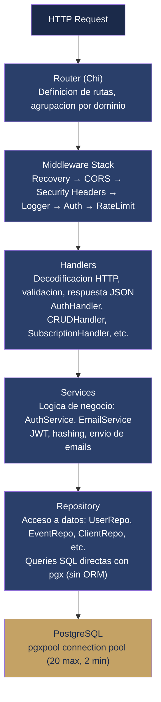
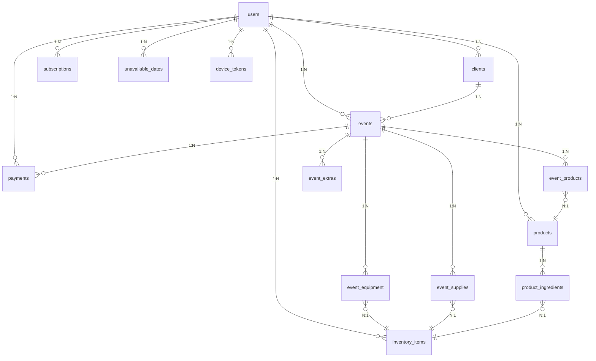

---
tags:
  - prd
  - arquitectura
  - backend
  - go
  - postgresql
  - solennix
aliases:
  - Arquitectura Backend
  - Backend Architecture
date: 2026-03-20
updated: 2026-04-17
status: active
platform: Backend
---

# Arquitectura Tecnica — Backend API

> [!tip] Documentos relacionados
> [[PRD MOC]] | [[01_PRODUCT_VISION]] | [[02_FEATURES]] | [[05_TECHNICAL_ARCHITECTURE_IOS]] | [[06_TECHNICAL_ARCHITECTURE_ANDROID]] | [[08_TECHNICAL_ARCHITECTURE_WEB]] | [[11_CURRENT_STATUS]] | [[04_MONETIZATION]]

**Version:** 1.0
**Fecha:** 2026-03-20 · **Última actualización:** 2026-04-17
**Plataforma:** Go REST API + PostgreSQL

> [!success] Producción (2026-04-16)
>
> - **Base URL prod:** `https://api.solennix.com/api`
> - **Fuente de verdad versiones:** `backend/go.mod`
> - **Fuente de verdad endpoints:** `backend/internal/router/router.go` + `backend/docs/openapi.yaml`

> [!info] Migraciones recientes (2026-04-16)
>
> | # | Tabla / Cambio | Sprint |
> | --- | --- | --- |
> | **040** | Stripe trial 14d (`trial_ends_at`, `is_in_trial`) | 7.A |
> | **041** | `event_public_links` (Portal Cliente MVP) | Portal MVP |
> | **042** | `staff` + `event_staff` (Personal Phase 1) | 8.bis |

---

## 1. Stack Tecnologico

> [!info] Stack principal
> **Go 1.24** + **Chi router** + **PostgreSQL 15** + **pgx driver** — sin ORM, queries SQL directas con connection pooling nativo.

| Componente        | Tecnologia                       | Version     | Rol                                                              |
| ----------------- | -------------------------------- | ----------- | ---------------------------------------------------------------- |
| **Lenguaje**      | Go                               | 1.24.7      | Rendimiento, concurrencia nativa, binario estatico               |
| **Router HTTP**   | Chi (`go-chi/chi/v5`)            | 5.2.5       | Router ligero y compatible con `net/http`, middleware composable |
| **Base de datos** | PostgreSQL                       | 15 (Alpine) | Base de datos relacional principal, JSONB para datos flexibles   |
| **Driver DB**     | pgx (`jackc/pgx/v5`)             | 5.8.0       | Driver nativo PostgreSQL con connection pooling (`pgxpool`)      |
| **Autenticacion** | golang-jwt (`golang-jwt/jwt/v5`) | 5.3.1       | Generacion y validacion de tokens JWT (HS256)                    |
| **Pagos**         | Stripe (`stripe/stripe-go/v81`)  | 81.4.0      | Checkout sessions, webhooks, portal de facturacion               |
| **Email**         | Resend (`resend/resend-go/v3`)   | 3.1.1       | Emails transaccionales (recuperacion de contrasena)              |
| **Hashing**       | bcrypt (`golang.org/x/crypto`)   | 0.48.0      | Hash seguro de contrasenas con cost factor configurable          |
| **UUIDs**         | google/uuid                      | 1.6.0       | Identificadores unicos para todas las entidades                  |
| **Configuracion** | godotenv (`joho/godotenv`)       | 1.5.1       | Carga de variables de entorno desde archivo `.env`               |
| **Imagenes**      | golang.org/x/image               | 0.36.0      | Redimensionamiento de imagenes para thumbnails                   |
| **Testing**       | testify (`stretchr/testify`)     | 1.11.1      | Assertions y mocks para tests unitarios e integracion            |
| **Contenedor**    | Docker (multi-stage)             | Alpine      | Build y despliegue en contenedor ligero                          |
| **Logging**       | log/slog (stdlib)                | —           | Logging estructurado nativo de Go                                |

---

## 2. Arquitectura

### Patron General

> [!abstract] Arquitectura en capas
> El backend sigue una **arquitectura en capas** inspirada en Clean Architecture, con inyeccion de dependencias via constructores y propagacion de contexto a traves de toda la cadena.



### Principios

> [!note] Decisiones de diseno clave
>
> - **Sin ORM**: Queries SQL directas con `pgx` para control total y rendimiento
> - **Inyeccion de dependencias**: Todos los componentes reciben dependencias via constructor (`NewXxxHandler(repo, service)`)
> - **Propagacion de contexto**: `context.Context` se propaga desde el handler hasta el repositorio para cancelacion y timeouts
> - **Interfaces para testing**: Los handlers dependen de interfaces (e.g., `FullUserRepository`, `AdminUserRepo`), facilitando mocks en tests
> - **Manejo de errores explicito**: Go idiomatico — sin excepciones, retorno explicito de `error`
> - **Graceful shutdown**: El servidor captura `SIGTERM`/`SIGINT` y drena conexiones activas antes de cerrar

---

## 3. Estructura del Proyecto

```
backend/
├── cmd/
│   └── server/
│       └── main.go                    # Punto de entrada. Configura logging, DB, repos, handlers, router y graceful shutdown
│
├── internal/
│   ├── config/
│   │   ├── config.go                  # Carga de configuracion desde variables de entorno (.env)
│   │   └── config_test.go             # Tests de configuracion
│   │
│   ├── database/
│   │   ├── database.go                # Conexion a PostgreSQL con pgxpool (pool configurado)
│   │   ├── database_test.go           # Tests de conexion
│   │   ├── migrate.go                 # Sistema de migraciones con go:embed
│   │   ├── migrate_test.go            # Tests de migraciones
│   │   └── migrations/                # Archivos SQL de migracion (047 migraciones, 001-046 + doble 020_)
│   │       ├── 001_create_users.up.sql
│   │       ├── 001_create_users.down.sql
│   │       ├── ...
│   │       └── 029_make_password_hash_nullable.up.sql
│   │
│   ├── handlers/
│   │   ├── auth_handler.go            # Registro, login, logout, OAuth, password reset
│   │   ├── crud_handler.go            # CRUD para clients, events, products, inventory, payments
│   │   ├── subscription_handler.go    # Stripe checkout, webhooks, RevenueCat
│   │   ├── search_handler.go          # Busqueda global multi-entidad
│   │   ├── upload_handler.go          # Subida de imagenes con thumbnails
│   │   ├── admin_handler.go           # Panel de administracion (stats, usuarios)
│   │   ├── unavailable_date_handler.go # Gestion de fechas no disponibles
│   │   ├── device_handler.go          # Registro de dispositivos para push notifications
│   │   ├── contract_template.go       # Plantilla de contratos por defecto
│   │   ├── stripe_service.go          # Interfaz del servicio Stripe
│   │   ├── helpers.go                 # Funciones utilitarias (JSON encode/decode, writeError)
│   │   ├── interfaces.go             # Interfaces de repositorios usadas por handlers
│   │   ├── user_repository.go         # Interfaz completa del repositorio de usuario
│   │   ├── validation.go             # Validaciones compartidas
│   │   └── *_test.go                  # Tests unitarios por handler (mocks incluidos)
│   │
│   ├── middleware/
│   │   ├── auth.go                    # Validacion JWT (cookie httpOnly + header Authorization)
│   │   ├── admin.go                   # Verificacion de rol admin
│   │   ├── cors.go                    # CORS con origenes configurables
│   │   ├── logging.go                 # Logger de requests (slog estructurado)
│   │   ├── ratelimit.go              # Rate limiting por IP con ventana deslizante
│   │   ├── recovery.go               # Recuperacion de panics con stack trace
│   │   ├── security.go               # Headers de seguridad OWASP
│   │   └── *_test.go                  # Tests unitarios por middleware
│   │
│   ├── models/
│   │   └── models.go                  # Todas las estructuras de dominio con JSON tags
│   │
│   ├── repository/
│   │   ├── user_repo.go               # Queries de usuarios
│   │   ├── client_repo.go             # Queries de clientes
│   │   ├── event_repo.go              # Queries de eventos (con joins a client, products, extras)
│   │   ├── product_repo.go            # Queries de productos e ingredientes
│   │   ├── inventory_repo.go          # Queries de inventario
│   │   ├── payment_repo.go            # Queries de pagos
│   │   ├── subscription_repo.go       # Queries de suscripciones
│   │   ├── admin_repo.go              # Queries de administracion + expiracion de planes gifted
│   │   ├── unavailable_date_repo.go   # Queries de fechas no disponibles
│   │   ├── device_repo.go             # Queries de tokens de dispositivos
│   │   └── *_test.go                  # Tests de integracion con DB real
│   │
│   ├── router/
│   │   ├── router.go                  # Definicion completa de rutas con Chi
│   │   ├── router_test.go             # Tests de configuracion de rutas
│   │   ├── router_api_integration_test.go # Tests de integracion API
│   │   └── testdata/                  # Datos de prueba para tests
│   │
│   └── services/
│       ├── auth_service.go            # JWT (generacion, validacion), bcrypt (hash, verify)
│       ├── auth_service_test.go       # Tests del servicio de auth
│       ├── email_service.go           # Envio de emails con Resend (templates HTML)
│       ├── email_service_test.go      # Tests del servicio de email
│       └── revenuecat_service.go      # Sync Stripe↔RevenueCat (grant/revoke entitlements)
│
├── go.mod                             # Dependencias del modulo Go
├── go.sum                             # Checksums de dependencias
├── Dockerfile                         # Multi-stage build (golang:alpine → alpine)
└── docker-compose.yml                 # PostgreSQL 15 local para desarrollo
```

---

## 4. Modelos de Datos

Todos los modelos se definen en `internal/models/models.go`. Cada struct usa tags `json` para serializacion y `json:"-"` para campos sensibles.

### 4.1 Usuarios

#### `User`

| Campo                     | Tipo         | JSON                        | Descripcion                              |
| ------------------------- | ------------ | --------------------------- | ---------------------------------------- |
| `ID`                      | `uuid.UUID`  | `id`                        | Identificador unico                      |
| `Email`                   | `string`     | `email`                     | Email del usuario (unico)                |
| `PasswordHash`            | `string`     | `-`                         | Hash bcrypt (nunca se expone en JSON)    |
| `Name`                    | `string`     | `name`                      | Nombre del usuario                       |
| `BusinessName`            | `*string`    | `business_name`             | Nombre de la empresa (opcional)          |
| `LogoURL`                 | `*string`    | `logo_url`                  | URL del logo (opcional)                  |
| `BrandColor`              | `*string`    | `brand_color`               | Color de marca personalizado (opcional)  |
| `ShowBusinessNameInPdf`   | `*bool`      | `show_business_name_in_pdf` | Mostrar nombre de empresa en PDFs        |
| `DefaultDepositPercent`   | `*float64`   | `default_deposit_percent`   | Porcentaje de anticipo por defecto       |
| `DefaultCancellationDays` | `*float64`   | `default_cancellation_days` | Dias de cancelacion por defecto          |
| `DefaultRefundPercent`    | `*float64`   | `default_refund_percent`    | Porcentaje de reembolso por defecto      |
| `ContractTemplate`        | `*string`    | `contract_template`         | Plantilla HTML de contratos              |
| `Plan`                    | `string`     | `plan`                      | Plan de suscripcion (`basic` / `pro`)    |
| `Role`                    | `string`     | `role`                      | Rol del usuario (`user` / `admin`)       |
| `StripeCustomerID`        | `*string`    | `stripe_customer_id`        | ID de cliente en Stripe                  |
| `GoogleUserID`            | `*string`    | `google_user_id`            | ID de usuario Google OAuth               |
| `AppleUserID`             | `*string`    | `apple_user_id`             | ID de usuario Apple Sign In              |
| `PlanExpiresAt`           | `*time.Time` | `plan_expires_at`           | Expiracion del plan (para planes gifted) |
| `CreatedAt`               | `time.Time`  | `created_at`                | Fecha de creacion                        |
| `UpdatedAt`               | `time.Time`  | `updated_at`                | Fecha de ultima actualizacion            |

#### Requests de Autenticacion (definidas en `auth_handler.go`)

- `registerRequest` — `email`, `password`, `name`
- `loginRequest` — `email`, `password`
- `forgotPasswordRequest` — `email`

### 4.2 Eventos

#### `Event`

| Campo              | Tipo        | JSON                | Descripcion                          |
| ------------------ | ----------- | ------------------- | ------------------------------------ |
| `ID`               | `uuid.UUID` | `id`                | Identificador unico                  |
| `UserID`           | `uuid.UUID` | `user_id`           | Propietario del evento               |
| `ClientID`         | `uuid.UUID` | `client_id`         | Cliente asociado                     |
| `EventDate`        | `string`    | `event_date`        | Fecha del evento (`YYYY-MM-DD`)      |
| `StartTime`        | `*string`   | `start_time`        | Hora de inicio (opcional)            |
| `EndTime`          | `*string`   | `end_time`          | Hora de fin (opcional)               |
| `ServiceType`      | `string`    | `service_type`      | Tipo de servicio                     |
| `NumPeople`        | `int`       | `num_people`        | Numero de personas                   |
| `Status`           | `string`    | `status`            | Estado del evento                    |
| `Discount`         | `float64`   | `discount`          | Monto/porcentaje de descuento        |
| `DiscountType`     | `string`    | `discount_type`     | Tipo: `percent` o `fixed`            |
| `RequiresInvoice`  | `bool`      | `requires_invoice`  | Requiere factura                     |
| `TaxRate`          | `float64`   | `tax_rate`          | Tasa de impuesto                     |
| `TaxAmount`        | `float64`   | `tax_amount`        | Monto de impuesto                    |
| `TotalAmount`      | `float64`   | `total_amount`      | Total del evento                     |
| `Location`         | `*string`   | `location`          | Ubicacion (opcional)                 |
| `City`             | `*string`   | `city`              | Ciudad (opcional)                    |
| `DepositPercent`   | `*float64`  | `deposit_percent`   | Porcentaje de anticipo               |
| `CancellationDays` | `*float64`  | `cancellation_days` | Dias para cancelacion                |
| `RefundPercent`    | `*float64`  | `refund_percent`    | Porcentaje de reembolso              |
| `Notes`            | `*string`   | `notes`             | Notas (opcional)                     |
| `Photos`           | `*string`   | `photos`            | URLs de fotos (JSONB como string)    |
| `CreatedAt`        | `time.Time` | `created_at`        | Fecha de creacion                    |
| `UpdatedAt`        | `time.Time` | `updated_at`        | Fecha de actualizacion               |
| `Client`           | `*Client`   | `client`            | Datos del cliente (joined, opcional) |

#### `EventProduct`

| Campo         | Tipo        | JSON           | Descripcion                           |
| ------------- | ----------- | -------------- | ------------------------------------- |
| `ID`          | `uuid.UUID` | `id`           | Identificador unico                   |
| `EventID`     | `uuid.UUID` | `event_id`     | Evento asociado                       |
| `ProductID`   | `uuid.UUID` | `product_id`   | Producto asociado                     |
| `Quantity`    | `float64`   | `quantity`     | Cantidad                              |
| `UnitPrice`   | `float64`   | `unit_price`   | Precio unitario                       |
| `Discount`    | `float64`   | `discount`     | Descuento                             |
| `TotalPrice`  | `float64`   | `total_price`  | Precio total (columna generada en DB) |
| `CreatedAt`   | `time.Time` | `created_at`   | Fecha de creacion                     |
| `ProductName` | `*string`   | `product_name` | Nombre del producto (joined)          |

#### `EventExtra`

| Campo            | Tipo        | JSON              | Descripcion                     |
| ---------------- | ----------- | ----------------- | ------------------------------- |
| `ID`             | `uuid.UUID` | `id`              | Identificador unico             |
| `EventID`        | `uuid.UUID` | `event_id`        | Evento asociado                 |
| `Description`    | `string`    | `description`     | Descripcion del extra           |
| `Cost`           | `float64`   | `cost`            | Costo del extra                 |
| `Price`          | `float64`   | `price`           | Precio al cliente               |
| `ExcludeUtility` | `bool`      | `exclude_utility` | Excluir del calculo de utilidad |
| `CreatedAt`      | `time.Time` | `created_at`      | Fecha de creacion               |

#### `EventEquipment`

| Campo           | Tipo        | JSON             | Descripcion                |
| --------------- | ----------- | ---------------- | -------------------------- |
| `ID`            | `uuid.UUID` | `id`             | Identificador unico        |
| `EventID`       | `uuid.UUID` | `event_id`       | Evento asociado            |
| `InventoryID`   | `uuid.UUID` | `inventory_id`   | Equipo del inventario      |
| `Quantity`      | `int`       | `quantity`       | Cantidad asignada          |
| `Notes`         | `*string`   | `notes`          | Notas (opcional)           |
| `CreatedAt`     | `time.Time` | `created_at`     | Fecha de creacion          |
| `EquipmentName` | `*string`   | `equipment_name` | Nombre del equipo (joined) |
| `Unit`          | `*string`   | `unit`           | Unidad de medida (joined)  |
| `CurrentStock`  | `*float64`  | `current_stock`  | Stock actual (joined)      |

#### `EventSupply`

| Campo          | Tipo        | JSON            | Descripcion                  |
| -------------- | ----------- | --------------- | ---------------------------- |
| `ID`           | `uuid.UUID` | `id`            | Identificador unico          |
| `EventID`      | `uuid.UUID` | `event_id`      | Evento asociado              |
| `InventoryID`  | `uuid.UUID` | `inventory_id`  | Insumo del inventario        |
| `Quantity`     | `float64`   | `quantity`      | Cantidad                     |
| `UnitCost`     | `float64`   | `unit_cost`     | Costo unitario               |
| `Source`       | `string`    | `source`        | Origen: `stock` o `purchase` |
| `ExcludeCost`  | `bool`      | `exclude_cost`  | Excluir del total del evento |
| `CreatedAt`    | `time.Time` | `created_at`    | Fecha de creacion            |
| `SupplyName`   | `*string`   | `supply_name`   | Nombre del insumo (joined)   |
| `Unit`         | `*string`   | `unit`          | Unidad (joined)              |
| `CurrentStock` | `*float64`  | `current_stock` | Stock actual (joined)        |

#### `EventPhoto`

| Campo          | Tipo        | JSON            | Descripcion                   |
| -------------- | ----------- | --------------- | ----------------------------- |
| `ID`           | `uuid.UUID` | `id`            | Identificador unico           |
| `URL`          | `string`    | `url`           | URL de la imagen              |
| `ThumbnailURL` | `*string`   | `thumbnail_url` | URL del thumbnail (opcional)  |
| `Caption`      | `*string`   | `caption`       | Titulo/descripcion (opcional) |
| `CreatedAt`    | `time.Time` | `created_at`    | Fecha de creacion             |

#### Modelos auxiliares de eventos

- `EquipmentSuggestion` — Sugerencia automatica de equipo con `SuggestedQty` calculado: `ceil(product_qty / capacity)`
- `EquipmentConflict` — Conflicto detectado cuando el mismo equipo esta asignado a eventos en la misma fecha
- `SupplySuggestion` — Sugerencia de insumos con cantidad fija por evento (no escalada por cantidad de producto)

### 4.3 Clientes

#### `Client`

| Campo         | Tipo        | JSON           | Descripcion                  |
| ------------- | ----------- | -------------- | ---------------------------- |
| `ID`          | `uuid.UUID` | `id`           | Identificador unico          |
| `UserID`      | `uuid.UUID` | `user_id`      | Propietario                  |
| `Name`        | `string`    | `name`         | Nombre del cliente           |
| `Phone`       | `string`    | `phone`        | Telefono                     |
| `Email`       | `*string`   | `email`        | Email (opcional)             |
| `Address`     | `*string`   | `address`      | Direccion (opcional)         |
| `City`        | `*string`   | `city`         | Ciudad (opcional)            |
| `Notes`       | `*string`   | `notes`        | Notas (opcional)             |
| `PhotoURL`    | `*string`   | `photo_url`    | Foto del cliente (opcional)  |
| `TotalEvents` | `int`       | `total_events` | Total de eventos (calculado) |
| `TotalSpent`  | `float64`   | `total_spent`  | Total gastado (calculado)    |
| `CreatedAt`   | `time.Time` | `created_at`   | Fecha de creacion            |
| `UpdatedAt`   | `time.Time` | `updated_at`   | Fecha de actualizacion       |

### 4.4 Productos

#### `Product`

| Campo       | Tipo        | JSON         | Descripcion                |
| ----------- | ----------- | ------------ | -------------------------- |
| `ID`        | `uuid.UUID` | `id`         | Identificador unico        |
| `UserID`    | `uuid.UUID` | `user_id`    | Propietario                |
| `Name`      | `string`    | `name`       | Nombre del producto        |
| `Category`  | `string`    | `category`   | Categoria                  |
| `BasePrice` | `float64`   | `base_price` | Precio base                |
| `Recipe`    | `*string`   | `recipe`     | Receta (JSONB como string) |
| `ImageURL`  | `*string`   | `image_url`  | URL de imagen (opcional)   |
| `IsActive`  | `bool`      | `is_active`  | Activo/inactivo            |
| `CreatedAt` | `time.Time` | `created_at` | Fecha de creacion          |
| `UpdatedAt` | `time.Time` | `updated_at` | Fecha de actualizacion     |

#### `ProductIngredient`

| Campo              | Tipo        | JSON                | Descripcion                                                     |
| ------------------ | ----------- | ------------------- | --------------------------------------------------------------- |
| `ID`               | `uuid.UUID` | `id`                | Identificador unico                                             |
| `ProductID`        | `uuid.UUID` | `product_id`        | Producto asociado                                               |
| `InventoryID`      | `uuid.UUID` | `inventory_id`      | Item del inventario                                             |
| `QuantityRequired` | `float64`   | `quantity_required` | Cantidad requerida                                              |
| `Capacity`         | `*float64`  | `capacity`          | Capacidad por pieza (solo equipo): `ceil(event_qty / capacity)` |
| `BringToEvent`     | `bool`      | `bring_to_event`    | Transportar al evento                                           |
| `CreatedAt`        | `time.Time` | `created_at`        | Fecha de creacion                                               |
| `IngredientName`   | `*string`   | `ingredient_name`   | Nombre del ingrediente (joined)                                 |
| `Unit`             | `*string`   | `unit`              | Unidad de medida (joined)                                       |
| `UnitCost`         | `*float64`  | `unit_cost`         | Costo unitario (joined)                                         |
| `Type`             | `*string`   | `type`              | Tipo de inventario (joined)                                     |

### 4.5 Inventario

#### `InventoryItem`

| Campo            | Tipo        | JSON              | Descripcion                                                                         |
| ---------------- | ----------- | ----------------- | ----------------------------------------------------------------------------------- |
| `ID`             | `uuid.UUID` | `id`              | Identificador unico                                                                 |
| `UserID`         | `uuid.UUID` | `user_id`         | Propietario                                                                         |
| `IngredientName` | `string`    | `ingredient_name` | Nombre del ingrediente/equipo                                                       |
| `CurrentStock`   | `float64`   | `current_stock`   | Stock actual                                                                        |
| `MinimumStock`   | `float64`   | `minimum_stock`   | Stock minimo (alerta solo si `minimum_stock > 0` y `current_stock < minimum_stock`) |
| `Unit`           | `string`    | `unit`            | Unidad de medida                                                                    |
| `UnitCost`       | `*float64`  | `unit_cost`       | Costo unitario (opcional)                                                           |
| `Type`           | `string`    | `type`            | Tipo: `ingredient`, `equipment`, `supply`                                           |
| `LastUpdated`    | `time.Time` | `last_updated`    | Ultima actualizacion                                                                |

### 4.6 Pagos

#### `Payment`

| Campo           | Tipo        | JSON             | Descripcion                   |
| --------------- | ----------- | ---------------- | ----------------------------- |
| `ID`            | `uuid.UUID` | `id`             | Identificador unico           |
| `EventID`       | `uuid.UUID` | `event_id`       | Evento asociado               |
| `UserID`        | `uuid.UUID` | `user_id`        | Propietario                   |
| `Amount`        | `float64`   | `amount`         | Monto del pago                |
| `PaymentDate`   | `string`    | `payment_date`   | Fecha del pago (`YYYY-MM-DD`) |
| `PaymentMethod` | `string`    | `payment_method` | Metodo de pago                |
| `Notes`         | `*string`   | `notes`          | Notas (opcional)              |
| `CreatedAt`     | `time.Time` | `created_at`     | Fecha de creacion             |

### 4.7 Suscripciones

#### `Subscription`

| Campo                 | Tipo         | JSON                       | Descripcion                                          |
| --------------------- | ------------ | -------------------------- | ---------------------------------------------------- |
| `ID`                  | `uuid.UUID`  | `id`                       | Identificador unico                                  |
| `UserID`              | `uuid.UUID`  | `user_id`                  | Usuario suscrito                                     |
| `Provider`            | `string`     | `provider`                 | Proveedor: `stripe`, `apple`, `google`               |
| `ProviderSubID`       | `*string`    | `provider_subscription_id` | ID de suscripcion del proveedor                      |
| `RevenueCatAppUserID` | `*string`    | `revenuecat_app_user_id`   | App User ID de RevenueCat                            |
| `Plan`                | `string`     | `plan`                     | Plan: `basic` o `pro`                                |
| `Status`              | `string`     | `status`                   | Estado: `active`, `past_due`, `canceled`, `trialing` |
| `CurrentPeriodStart`  | `*time.Time` | `current_period_start`     | Inicio del periodo actual                            |
| `CurrentPeriodEnd`    | `*time.Time` | `current_period_end`       | Fin del periodo actual                               |
| `CreatedAt`           | `time.Time`  | `created_at`               | Fecha de creacion                                    |
| `UpdatedAt`           | `time.Time`  | `updated_at`               | Fecha de actualizacion                               |

### 4.8 Otros

#### `UnavailableDate`

| Campo       | Tipo        | JSON         | Descripcion                    |
| ----------- | ----------- | ------------ | ------------------------------ |
| `ID`        | `uuid.UUID` | `id`         | Identificador unico            |
| `UserID`    | `uuid.UUID` | `user_id`    | Propietario                    |
| `StartDate` | `string`    | `start_date` | Fecha de inicio (`YYYY-MM-DD`) |
| `EndDate`   | `string`    | `end_date`   | Fecha de fin (`YYYY-MM-DD`)    |
| `Reason`    | `*string`   | `reason`     | Razon (opcional)               |
| `CreatedAt` | `time.Time` | `created_at` | Fecha de creacion              |
| `UpdatedAt` | `time.Time` | `updated_at` | Fecha de actualizacion         |

#### `DeviceToken`

| Campo       | Tipo        | JSON         | Descripcion                         |
| ----------- | ----------- | ------------ | ----------------------------------- |
| `ID`        | `uuid.UUID` | `id`         | Identificador unico                 |
| `UserID`    | `uuid.UUID` | `user_id`    | Propietario                         |
| `Token`     | `string`    | `token`      | Token del dispositivo               |
| `Platform`  | `string`    | `platform`   | Plataforma: `ios`, `android`, `web` |
| `CreatedAt` | `time.Time` | `created_at` | Fecha de creacion                   |
| `UpdatedAt` | `time.Time` | `updated_at` | Fecha de actualizacion              |

---

## 5. Base de Datos (PostgreSQL)

### 5.1 Conexion

La conexion se establece mediante `pgxpool.Pool` con la siguiente configuracion:

| Parametro         | Valor  | Descripcion                            |
| ----------------- | ------ | -------------------------------------- |
| `MaxConns`        | 20     | Conexiones maximas en el pool          |
| `MinConns`        | 2      | Conexiones minimas mantenidas          |
| `MaxConnLifetime` | 30 min | Vida maxima de una conexion            |
| `MaxConnIdleTime` | 5 min  | Tiempo maximo inactivo antes de cerrar |
| `ConnectTimeout`  | 10 seg | Timeout para la conexion inicial       |

El pool se inicializa en `database.Connect()` y se verifica con un `Ping()` antes de retornar.

### 5.2 Sistema de Migraciones

> [!note] Migraciones custom con go:embed
> El sistema de migraciones es **custom** (sin herramientas externas como `golang-migrate`):
>
> 1. **Embedido**: Los archivos SQL se incluyen en el binario usando `go:embed migrations/*.up.sql`
> 2. **Tabla de control**: `schema_migrations` almacena las versiones aplicadas con timestamp
> 3. **Ejecucion automatica**: Se ejecutan al iniciar el servidor (`database.Migrate(pool)`)
> 4. **Transaccional**: Cada migracion se ejecuta en una transaccion; si falla, hace rollback
> 5. **Idempotente**: Solo aplica migraciones que no estan en `schema_migrations`
> 6. **Nomenclatura**: `{NNN}_{descripcion}.up.sql` / `{NNN}_{descripcion}.down.sql`

### 5.3 Migraciones

| #    | Archivo                              | Proposito                                                                |
| ---- | ------------------------------------ | ------------------------------------------------------------------------ |
| 001  | `create_users`                       | Tabla principal de usuarios                                              |
| 002  | `create_clients`                     | Tabla de clientes (`user_id` FK)                                         |
| 003  | `create_events`                      | Tabla de eventos con todos los campos financieros                        |
| 004  | `create_products`                    | Tabla de productos/servicios                                             |
| 005  | `create_inventory`                   | Tabla de inventario (ingredientes, equipo, insumos)                      |
| 006  | `create_junction_tables`             | Tablas de union: `event_products`, `event_extras`, `product_ingredients` |
| 007  | `create_payments_subscriptions`      | Tablas de pagos y suscripciones                                          |
| 008  | `add_client_logo`                    | Campo `logo_url` en clientes                                             |
| 009  | `move_logo`                          | Migracion de logo de clients a users                                     |
| 010  | `add_user_brand_color`               | Campo `brand_color` en usuarios                                          |
| 011  | `add_show_business_name`             | Campo `show_business_name_in_pdf`                                        |
| 012  | `extend_subscriptions`               | Campos adicionales de suscripcion (provider, RevenueCat)                 |
| 013  | `fix_plan_constraint`                | Correccion de constraint de plan                                         |
| 014  | `add_indexes_and_cascade`            | Indices de rendimiento + CASCADE en FKs                                  |
| 015  | `add_image_fields`                   | Campos de imagen en productos                                            |
| 016  | `create_event_equipment`             | Tabla `event_equipment`                                                  |
| 017  | `add_contract_template_to_users`     | Campo `contract_template` en usuarios                                    |
| 018  | `add_role_to_users`                  | Campo `role` (user/admin)                                                |
| 019  | `add_plan_expires_at`                | Campo `plan_expires_at` para planes gifted                               |
| 020a | `add_discount_type_to_events`        | Campo `discount_type` (percent/fixed)                                    |
| 020b | `add_equipment_capacity`             | Campo `capacity` en `product_ingredients`                                |
| 021  | `add_bring_to_event`                 | Campo `bring_to_event` en `product_ingredients`                          |
| 022  | `create_unavailable_dates`           | Tabla de fechas no disponibles                                           |
| 023  | `add_supply_type_and_table`          | Tipo `supply` en inventario + tabla `event_supplies`                     |
| 024  | `add_exclude_cost_to_event_supplies` | Campo `exclude_cost` en `event_supplies`                                 |
| 025  | `add_oauth_user_ids`                 | Campos `google_user_id` y `apple_user_id`                                |
| 026  | `create_device_tokens`               | Tabla de tokens de dispositivo para push                                 |
| 027  | `add_subscription_provider_unique`   | Constraint unico por proveedor de suscripcion                            |
| 028  | `add_include_in_checklist`           | Campo `include_in_checklist` para productos                              |
| 029  | `make_password_hash_nullable`        | Hash de contrasena nullable (soporte OAuth-only)                         |

### 5.4 Relaciones Principales



Todas las entidades principales se filtran por `user_id` (multi-tenant por usuario). Los CASCADE DELETE se aplican en las tablas de union para mantener integridad referencial.

---

## 6. API — Rutas Completas

### 6.1 Health Check

| Metodo | Ruta      | Handler | Descripcion               |
| ------ | --------- | ------- | ------------------------- |
| `GET`  | `/health` | inline  | Retorna `{"status":"ok"}` |

### 6.2 Rutas Publicas — Autenticacion

Rate limit: **10 requests/minuto** por IP.

Estas rutas publicas de auth ya quedaron congeladas en `backend/docs/openapi.yaml`, incluyendo Google y Apple Sign In porque iOS/Android dependen de esos payloads.

| Metodo | Ruta                        | Handler                      | Descripcion                            |
| ------ | --------------------------- | ---------------------------- | -------------------------------------- |
| `POST` | `/api/auth/register`        | `AuthHandler.Register`       | Registro de nuevo usuario              |
| `POST` | `/api/auth/login`           | `AuthHandler.Login`          | Login con email/password               |
| `POST` | `/api/auth/logout`          | `AuthHandler.Logout`         | Logout (limpia cookie httpOnly)        |
| `POST` | `/api/auth/refresh`         | `AuthHandler.RefreshToken`   | Renovar access token con refresh token |
| `POST` | `/api/auth/forgot-password` | `AuthHandler.ForgotPassword` | Solicitar email de recuperacion        |
| `POST` | `/api/auth/reset-password`  | `AuthHandler.ResetPassword`  | Restablecer contrasena con token       |
| `POST` | `/api/auth/google`          | `AuthHandler.GoogleSignIn`   | Login/registro con Google OAuth        |
| `POST` | `/api/auth/apple`           | `AuthHandler.AppleSignIn`    | Login/registro con Apple Sign In       |

### 6.3 Rutas Protegidas — Auth (requiere JWT)

| Metodo | Ruta                        | Handler                      | Descripcion                       |
| ------ | --------------------------- | ---------------------------- | --------------------------------- |
| `GET`  | `/api/auth/me`              | `AuthHandler.Me`             | Obtener perfil del usuario actual |
| `POST` | `/api/auth/change-password` | `AuthHandler.ChangePassword` | Cambiar contrasena                |

### 6.4 Rutas Publicas — Webhooks

| Metodo | Ruta                                    | Handler                                 | Descripcion                                   |
| ------ | --------------------------------------- | --------------------------------------- | --------------------------------------------- |
| `POST` | `/api/subscriptions/webhook/stripe`     | `SubscriptionHandler.StripeWebhook`     | Webhook de Stripe (verificado por firma)      |
| `POST` | `/api/subscriptions/webhook/revenuecat` | `SubscriptionHandler.RevenueCatWebhook` | Webhook de RevenueCat (verificado por header) |

### 6.5 Rutas Publicas — Archivos

| Metodo | Ruta             | Handler           | Descripcion                           |
| ------ | ---------------- | ----------------- | ------------------------------------- |
| `GET`  | `/api/uploads/*` | `http.FileServer` | Servir archivos subidos (cache 1 ano) |

### 6.6 Rutas Protegidas — Usuarios

| Metodo | Ruta            | Handler                     | Descripcion                   |
| ------ | --------------- | --------------------------- | ----------------------------- |
| `PUT`  | `/api/users/me` | `AuthHandler.UpdateProfile` | Actualizar perfil del usuario |

`PUT /api/users/me` tambien esta cubierto por el freeze contractual OpenAPI porque los clientes mobile actualizan branding y defaults desde esta ruta.

### 6.7 Rutas Protegidas — Clientes

| Metodo   | Ruta                | Handler                    | Descripcion                 |
| -------- | ------------------- | -------------------------- | --------------------------- |
| `GET`    | `/api/clients`      | `CRUDHandler.ListClients`  | Listar clientes del usuario |
| `POST`   | `/api/clients`      | `CRUDHandler.CreateClient` | Crear cliente               |
| `GET`    | `/api/clients/{id}` | `CRUDHandler.GetClient`    | Obtener cliente por ID      |
| `PUT`    | `/api/clients/{id}` | `CRUDHandler.UpdateClient` | Actualizar cliente          |
| `DELETE` | `/api/clients/{id}` | `CRUDHandler.DeleteClient` | Eliminar cliente            |

### 6.8 Rutas Protegidas — Eventos

Las rutas de fotos y los endpoints GET orientados a mobile de esta seccion quedan protegidos por `contract_test.go` para evitar drift entre backend y clientes nativos.

| Metodo   | Ruta                                | Handler                                  | Descripcion                                               |
| -------- | ----------------------------------- | ---------------------------------------- | --------------------------------------------------------- |
| `GET`    | `/api/events`                       | `CRUDHandler.ListEvents`                 | Listar eventos del usuario                                |
| `GET`    | `/api/events/upcoming`              | `CRUDHandler.GetUpcomingEvents`          | Eventos proximos                                          |
| `POST`   | `/api/events`                       | `CRUDHandler.CreateEvent`                | Crear evento                                              |
| `GET`    | `/api/events/{id}`                  | `CRUDHandler.GetEvent`                   | Obtener evento con datos del cliente                      |
| `PUT`    | `/api/events/{id}`                  | `CRUDHandler.UpdateEvent`                | Actualizar evento                                         |
| `DELETE` | `/api/events/{id}`                  | `CRUDHandler.DeleteEvent`                | Eliminar evento                                           |
| `GET`    | `/api/events/{id}/products`         | `CRUDHandler.GetEventProducts`           | Productos del evento                                      |
| `GET`    | `/api/events/{id}/extras`           | `CRUDHandler.GetEventExtras`             | Extras del evento                                         |
| `PUT`    | `/api/events/{id}/items`            | `CRUDHandler.UpdateEventItems`           | Actualizar productos, extras, equipo e insumos del evento |
| `GET`    | `/api/events/{id}/equipment`        | `CRUDHandler.GetEventEquipment`          | Equipo asignado al evento                                 |
| `GET`    | `/api/events/{id}/supplies`         | `CRUDHandler.GetEventSupplies`           | Insumos del evento                                        |
| `GET`    | `/api/events/{id}/photos`           | `CRUDHandler.GetEventPhotos`             | Fotos del evento                                          |
| `POST`   | `/api/events/{id}/photos`           | `CRUDHandler.AddEventPhoto`              | Agregar foto al evento                                    |
| `DELETE` | `/api/events/{id}/photos/{photoId}` | `CRUDHandler.DeleteEventPhoto`           | Eliminar foto del evento                                  |
| `GET`    | `/api/events/equipment/conflicts`   | `CRUDHandler.CheckEquipmentConflictsGET` | Detectar conflictos de equipo (GET para mobile)           |
| `POST`   | `/api/events/equipment/conflicts`   | `CRUDHandler.CheckEquipmentConflicts`    | Detectar conflictos de equipo (POST para web)             |
| `GET`    | `/api/events/equipment/suggestions` | `CRUDHandler.GetEquipmentSuggestionsGET` | Sugerencias de equipo (GET para mobile)                   |
| `POST`   | `/api/events/equipment/suggestions` | `CRUDHandler.GetEquipmentSuggestions`    | Sugerencias de equipo (POST para web)                     |
| `GET`    | `/api/events/supplies/suggestions`  | `CRUDHandler.GetSupplySuggestionsGET`    | Sugerencias de insumos (GET para mobile)                  |
| `POST`   | `/api/events/supplies/suggestions`  | `CRUDHandler.GetSupplySuggestions`       | Sugerencias de insumos (POST para web)                    |

### 6.9 Rutas Protegidas — Productos

| Metodo   | Ruta                              | Handler                                  | Descripcion                                 |
| -------- | --------------------------------- | ---------------------------------------- | ------------------------------------------- |
| `GET`    | `/api/products`                   | `CRUDHandler.ListProducts`               | Listar productos                            |
| `POST`   | `/api/products`                   | `CRUDHandler.CreateProduct`              | Crear producto                              |
| `POST`   | `/api/products/ingredients/batch` | `CRUDHandler.GetBatchProductIngredients` | Obtener ingredientes de multiples productos |
| `GET`    | `/api/products/{id}`              | `CUDHandler.GetProduct`                  | Obtener producto                            |
| `PUT`    | `/api/products/{id}`              | `CRUDHandler.UpdateProduct`              | Actualizar producto                         |
| `DELETE` | `/api/products/{id}`              | `CRUDHandler.DeleteProduct`              | Eliminar producto                           |
| `GET`    | `/api/products/{id}/ingredients`  | `CRUDHandler.GetProductIngredients`      | Ingredientes del producto                   |
| `PUT`    | `/api/products/{id}/ingredients`  | `CRUDHandler.UpdateProductIngredients`   | Actualizar ingredientes                     |

### 6.10 Rutas Protegidas — Inventario

| Metodo   | Ruta                  | Handler                           | Descripcion                 |
| -------- | --------------------- | --------------------------------- | --------------------------- |
| `GET`    | `/api/inventory`      | `CRUDHandler.ListInventory`       | Listar items del inventario |
| `POST`   | `/api/inventory`      | `CRUDHandler.CreateInventoryItem` | Crear item de inventario    |
| `GET`    | `/api/inventory/{id}` | `CRUDHandler.GetInventoryItem`    | Obtener item                |
| `PUT`    | `/api/inventory/{id}` | `CRUDHandler.UpdateInventoryItem` | Actualizar item             |
| `DELETE` | `/api/inventory/{id}` | `CRUDHandler.DeleteInventoryItem` | Eliminar item               |

### 6.11 Rutas Protegidas — Pagos

| Metodo   | Ruta                 | Handler                     | Descripcion     |
| -------- | -------------------- | --------------------------- | --------------- |
| `GET`    | `/api/payments`      | `CRUDHandler.ListPayments`  | Listar pagos    |
| `GET`    | `/api/payments/{id}` | `CRUDHandler.GetPayment`    | Obtener pago    |
| `POST`   | `/api/payments`      | `CRUDHandler.CreatePayment` | Registrar pago  |
| `PUT`    | `/api/payments/{id}` | `CRUDHandler.UpdatePayment` | Actualizar pago |
| `DELETE` | `/api/payments/{id}` | `CRUDHandler.DeletePayment` | Eliminar pago   |

### 6.12 Rutas Protegidas — Fechas No Disponibles

| Metodo   | Ruta                          | Handler                                        | Descripcion               |
| -------- | ----------------------------- | ---------------------------------------------- | ------------------------- |
| `GET`    | `/api/unavailable-dates`      | `UnavailableDateHandler.GetUnavailableDates`   | Listar fechas bloqueadas  |
| `POST`   | `/api/unavailable-dates`      | `UnavailableDateHandler.CreateUnavailableDate` | Crear fecha no disponible |
| `DELETE` | `/api/unavailable-dates/{id}` | `UnavailableDateHandler.DeleteUnavailableDate` | Eliminar fecha            |

### 6.13 Rutas Protegidas — Dispositivos

| Metodo | Ruta                      | Handler                          | Descripcion                             |
| ------ | ------------------------- | -------------------------------- | --------------------------------------- |
| `POST` | `/api/devices/register`   | `DeviceHandler.RegisterDevice`   | Registrar token para push notifications |
| `POST` | `/api/devices/unregister` | `DeviceHandler.UnregisterDevice` | Desregistrar dispositivo                |

### 6.14 Rutas Protegidas — Suscripciones

| Metodo | Ruta                                  | Handler                                     | Descripcion                            |
| ------ | ------------------------------------- | ------------------------------------------- | -------------------------------------- |
| `GET`  | `/api/subscriptions/status`           | `SubscriptionHandler.GetSubscriptionStatus` | Estado de la suscripcion               |
| `POST` | `/api/subscriptions/checkout-session` | `SubscriptionHandler.CreateCheckoutSession` | Crear sesion de checkout Stripe        |
| `POST` | `/api/subscriptions/portal-session`   | `SubscriptionHandler.CreatePortalSession`   | Crear sesion del portal de facturacion |

### 6.15 Rutas Protegidas — Busqueda

Rate limit: **30 requests/minuto** por IP.

| Metodo | Ruta          | Handler                   | Descripcion                                                  |
| ------ | ------------- | ------------------------- | ------------------------------------------------------------ |
| `GET`  | `/api/search` | `SearchHandler.SearchAll` | Busqueda global en clientes, productos, inventario y eventos |

**Contrato de comportamiento:**

- **Estrategia híbrida**: cada entidad usa `ILIKE '%query%'` (case-insensitive) combinado con `pg_trgm similarity() > 0.3` (fuzzy). Los índices GIN con `gin_trgm_ops` (migración 033) aceleran ambas operaciones.
- **Paralelismo**: el handler lanza 4 goroutines simultáneas (clients, products, inventory, events) coordinadas con `sync.WaitGroup`.
- **Límite duro de 6 resultados por categoría**: cada repo devuelve hasta 10 candidatos; el handler trunca a 6 antes de serializar la respuesta.
- **Filtrado por `user_id`**: todas las queries limitan resultados al usuario autenticado.
- **FTS nativo** (`tsvector`/stemming en español) es deuda técnica planificada, no comportamiento actual.

### 6.16 Rutas de Uploads

Rate limit: **5 requests/minuto** por IP.

| Metodo | Ruta                 | Handler                     | Descripcion                                                          |
| ------ | -------------------- | --------------------------- | -------------------------------------------------------------------- |
| `POST` | `/api/uploads/image` | `UploadHandler.UploadImage` | Subir imagen (genera thumbnail). Limite por plan: 50 basic / 200 pro |

### 6.17 Rutas Admin

Requieren: JWT + rol `admin`. Rate limit: **30 requests/minuto**.

Estas rutas ya forman parte del contrato en `backend/docs/openapi.yaml` y quedan protegidas por `backend/internal/handlers/contract_test.go` para evitar drift respecto del panel admin Web.

| Metodo | Ruta                            | Handler                         | Descripcion                            |
| ------ | ------------------------------- | ------------------------------- | -------------------------------------- |
| `GET`  | `/api/admin/stats`              | `AdminHandler.GetStats`         | Estadisticas globales de la plataforma |
| `GET`  | `/api/admin/users`              | `AdminHandler.ListUsers`        | Listar todos los usuarios              |
| `GET`  | `/api/admin/users/{id}`         | `AdminHandler.GetUser`          | Obtener usuario especifico             |
| `PUT`  | `/api/admin/users/{id}/upgrade` | `AdminHandler.UpgradeUser`      | Upgrade/downgrade de plan de usuario   |
| `GET`  | `/api/admin/subscriptions`      | `AdminHandler.GetSubscriptions` | Listar todas las suscripciones         |

### 6.18 Rutas Debug (Admin Only)

> [!warning] Solo desarrollo
> Solo disponibles en entornos de desarrollo. Requieren JWT + rol `admin`.

| Metodo | Ruta                                 | Handler                              | Descripcion                         |
| ------ | ------------------------------------ | ------------------------------------ | ----------------------------------- |
| `POST` | `/api/subscriptions/debug-upgrade`   | `SubscriptionHandler.DebugUpgrade`   | Upgrade manual de plan (solo dev)   |
| `POST` | `/api/subscriptions/debug-downgrade` | `SubscriptionHandler.DebugDowngrade` | Downgrade manual de plan (solo dev) |

### 6.19 Rutas Protegidas — Dashboard (aggregated analytics)

> [!info] Single source of truth
> El dashboard de iOS, Android y Web consume **estos endpoints** para todos sus KPIs y charts. Cero agregacion client-side. Si alguien cambia una formula, la cambia aca y las 3 apps ven el nuevo numero al mismo tiempo.

| Metodo | Ruta                                  | Handler                            | Descripcion                                                                  |
| ------ | ------------------------------------- | ---------------------------------- | ---------------------------------------------------------------------------- |
| `GET`  | `/api/dashboard/kpis`                 | `DashboardHandler.GetKPIs`         | 11 campos agregados (ver contrato abajo)                                     |
| `GET`  | `/api/dashboard/revenue-chart`        | `DashboardHandler.GetRevenueChart` | Revenue por mes. Query `?period=month\|quarter\|year` (default `year`)       |
| `GET`  | `/api/dashboard/events-by-status`     | `DashboardHandler.GetEventsByStatus`| Conteo de eventos agrupado por `status`                                      |
| `GET`  | `/api/dashboard/top-clients`          | `DashboardHandler.GetTopClients`   | Top clientes por `total_spent`. Query `?limit=N` (1-50, default 10)          |
| `GET`  | `/api/dashboard/product-demand`       | `DashboardHandler.GetProductDemand`| Productos mas usados (usos + revenue). Limit 10 hardcoded                    |
| `GET`  | `/api/dashboard/forecast`             | `DashboardHandler.GetForecast`     | Revenue proyectado de eventos confirmed/quoted futuros, agrupado por mes     |

**Contrato `GET /api/dashboard/kpis`** (`DashboardKPIs`):

```json
{
  "total_revenue": 125000.00,                // lifetime de pagos
  "events_this_month": 5,                    // COUNT(events) en mes actual
  "pending_quotes": 3,                       // COUNT(events) con status='quoted'
  "low_stock_items": 2,                      // COUNT(inventory) con current_stock <= minimum_stock
  "upcoming_events": 4,                      // COUNT(events) en los proximos 7 dias
  "total_clients": 42,                       // COUNT(clients)
  "average_event_value": 8500.00,            // AVG(events.total_amount)
  "net_sales_this_month": 32000.00,          // SUM(events.total_amount) WHERE status IN ('confirmed','completed') AND event_date en mes actual
  "cash_collected_this_month": 18000.00,     // SUM(payments.amount) WHERE payment_date en mes actual
  "vat_collected_this_month": 2480.00,       // Prorateado: SUM(tax_amount × min(total_paid/total_amount, 1.0)) sobre eventos del mes realized
  "vat_outstanding_this_month": 2640.00      // SUM(tax_amount × max(1 − total_paid/total_amount, 0)) sobre los mismos eventos
}
```

**Notas de implementacion** (`backend/internal/repository/dashboard_repo.go`):

- Los 4 campos monetarios del mes usan una CTE unica (`month_events`) con `DATE_TRUNC('month', event_date) = DATE_TRUNC('month', CURRENT_DATE)` para no duplicar el scan de la tabla.
- `LEAST(total_paid/total_amount, 1.0)` y `GREATEST(1 - ratio, 0.0)` evitan que un sobrepago envenene el `vat_collected` (y su espejo `vat_outstanding`).
- `cash_collected_this_month` usa `payment_date` (no `event_date`) — refleja la caja del mes, no la facturacion del mes.

---

## 7. Middleware Stack

> [!abstract] Cadena de middleware
> El orden de los middleware es intencional — Recovery debe ser el primero para capturar panics en cualquier middleware posterior.


### 7.1 Recovery (Global)

**Archivo:** `middleware/recovery.go`

- Captura panics en cualquier handler o middleware
- Registra el stack trace completo con `debug.Stack()`
- Retorna HTTP 500 con `{"error":"Internal server error"}`
- **Debe ser el primer middleware** en la cadena

### 7.2 CORS (Global)

**Archivo:** `middleware/cors.go`

- Origenes permitidos configurables via `CORS_ALLOWED_ORIGINS`
- Verifica el header `Origin` contra un set de origenes permitidos
- Headers permitidos: `Accept`, `Content-Type`, `Authorization`
- Metodos permitidos: `GET`, `POST`, `PUT`, `DELETE`, `OPTIONS`, `PATCH`
- Responde preflight (`OPTIONS`) con `204 No Content`
- `Access-Control-Allow-Credentials: true` para cookies httpOnly
- `Access-Control-Max-Age: 3600` (1 hora de cache del preflight)

### 7.3 Security Headers (Global)

**Archivo:** `middleware/security.go`

Implementa headers de seguridad OWASP:

| Header                      | Valor                                           | Proteccion                                   |
| --------------------------- | ----------------------------------------------- | -------------------------------------------- |
| `X-Content-Type-Options`    | `nosniff`                                       | Previene MIME sniffing                       |
| `X-Frame-Options`           | `DENY`                                          | Previene clickjacking                        |
| `X-XSS-Protection`          | `1; mode=block`                                 | XSS en navegadores legacy                    |
| `Strict-Transport-Security` | `max-age=31536000; includeSubDomains`           | Fuerza HTTPS (solo si TLS/proxy HTTPS)       |
| `Content-Security-Policy`   | `default-src 'self'; script-src 'self'; ...`    | Restringe fuentes de recursos                |
| `Referrer-Policy`           | `strict-origin-when-cross-origin`               | Controla info del Referer                    |
| `Permissions-Policy`        | `geolocation=(), microphone=(), camera=(), ...` | Deshabilita APIs del navegador no necesarias |

### 7.4 Logger (Global)

**Archivo:** `middleware/logging.go`

- Registra cada request con `slog.Info`
- Campos: `method`, `path`, `status`, `duration`, `remote`
- Usa un `responseWriter` wrapper para capturar el status code real
- Formato estructurado (key-value pairs)

### 7.5 Auth (Per-Route)

**Archivo:** `middleware/auth.go`

Flujo de validacion:

1. Busca token en cookie `auth_token` (prioridad, seguro)
2. Fallback a header `Authorization: Bearer {token}` (para API clients/mobile)
3. Si no hay token: HTTP 401 `"Authentication required"`
4. Valida el JWT con `AuthService.ValidateToken()`
5. Rechaza tokens de tipo `refresh` o `password-reset`
6. Inyecta `UserID` y `UserEmail` en `context.Context`
7. Los handlers acceden con `middleware.GetUserID(ctx)` y `middleware.GetUserEmail(ctx)`

### 7.6 Rate Limiting (Per-Route)

**Archivo:** `middleware/ratelimit.go`

- **Algoritmo**: Ventana fija por IP (fixed window counter)
- **Extraccion de IP**: `RemoteAddr` por defecto; `X-Forwarded-For` solo si `TrustProxy = true`
- **Limpieza**: Goroutine de fondo cada 5 minutos elimina entradas expiradas
- **Stop function**: `RateLimitStopFunc` para shutdown limpio

Limites configurados:

| Grupo de rutas               | Limite      | Ventana  |
| ---------------------------- | ----------- | -------- |
| Auth (login, register, etc.) | 10 requests | 1 minuto |
| Uploads (subida de imagenes) | 5 requests  | 1 minuto |
| Search                       | 30 requests | 1 minuto |
| Admin                        | 30 requests | 1 minuto |

Respuesta cuando se excede: HTTP 429 con header `Retry-After`.

### 7.7 Admin Only (Per-Route)

**Archivo:** `middleware/admin.go`

- Requiere que el middleware `Auth` haya corrido antes
- Extrae `UserID` del contexto
- Consulta la base de datos para verificar `user.Role == "admin"`
- HTTP 401 si no hay usuario; HTTP 403 si no es admin

---

## 8. Autenticacion y Seguridad

### 8.1 JWT — Generacion y Validacion

**Archivo:** `services/auth_service.go`

El sistema usa **tres tipos de token**, todos firmados con HS256:

| Tipo          | Subject          | Duracion                   | Uso                                |
| ------------- | ---------------- | -------------------------- | ---------------------------------- |
| Access Token  | `access`         | Configurable (default 24h) | Autenticar requests a la API       |
| Refresh Token | `refresh`        | 7 dias                     | Renovar access tokens sin re-login |
| Reset Token   | `password-reset` | 1 hora                     | Restablecer contrasena             |

**Claims del token** (`TokenClaims`):

- `user_id` — UUID del usuario
- `email` — Email del usuario
- `exp` — Expiracion
- `iat` — Fecha de emision
- `iss` — `"solennix-backend"`
- `sub` — Tipo de token

**Validacion estricta por tipo**: `ValidateToken()` rechaza tokens refresh y reset. `ValidateRefreshToken()` solo acepta subject `refresh`. `ValidateResetToken()` solo acepta subject `password-reset`.

### 8.2 Password Hashing

- **Algoritmo**: bcrypt con `bcrypt.DefaultCost` (10)
- `HashPassword()` — genera hash al registrar o cambiar contrasena
- `CheckPassword()` — compara contrasena plana con hash almacenado
- El campo `PasswordHash` tiene tag `json:"-"` para nunca exponerse en JSON

### 8.3 Token Refresh

1. El cliente envia su refresh token a `POST /api/auth/refresh`
2. El servidor valida que sea un token tipo `refresh` (no access, no reset)
3. Genera un nuevo `TokenPair` (access + refresh)
4. Retorna ambos tokens al cliente

### 8.4 OAuth — Google y Apple

- `POST /api/auth/google` — Recibe un token de Google, verifica la identidad y crea/actualiza el usuario con `google_user_id`
- `POST /api/auth/apple` — Recibe un token de Apple Sign In, verifica y crea/actualiza con `apple_user_id`
- Ambos flujos generan un `TokenPair` JWT propio del backend

### 8.5 Cookie httpOnly

- El access token se puede almacenar en una cookie `auth_token` con flag `httpOnly`
- El middleware de Auth prioriza la cookie sobre el header `Authorization`
- `POST /api/auth/logout` limpia la cookie

### 8.6 Seguridad General

- Rate limiting en endpoints sensibles (auth, uploads)
- Security headers OWASP en todas las respuestas
- CORS restringido a origenes especificos
- `TrustProxy` configurable para despliegues detras de reverse proxy
- Todas las queries usan parametros (`$1`, `$2`) para prevenir SQL injection
- Multi-tenant: todas las queries filtran por `user_id`

---

## 9. Integraciones Externas

### 9.1 Stripe

**Archivos:** `handlers/subscription_handler.go`, `handlers/stripe_service.go`

| Funcionalidad                  | Endpoint                                   | Descripcion                                                     |
| ------------------------------ | ------------------------------------------ | --------------------------------------------------------------- |
| Checkout Session (suscripcion) | `POST /api/subscriptions/checkout-session` | Crea una sesion de Stripe Checkout para upgrade a plan Pro      |
| Customer Portal                | `POST /api/subscriptions/portal-session`   | Redirige al portal de facturacion de Stripe                     |
| Webhook                        | `POST /api/subscriptions/webhook/stripe`   | Procesa eventos de Stripe (suscripcion creada, cancelada, etc.) |

**Variables de entorno requeridas:**

- `STRIPE_SECRET_KEY`
- `STRIPE_WEBHOOK_SECRET`
- `STRIPE_PRO_PRICE_ID`
- `STRIPE_PORTAL_CONFIG_ID` (opcional)

### 9.2 RevenueCat

**Archivos:** `handlers/subscription_handler.go`, `services/revenuecat_service.go`

- `POST /api/subscriptions/webhook/revenuecat` — Procesa webhooks v2 de RevenueCat (verificado por header `REVENUECAT_WEBHOOK_SECRET`)
- `RevenueCatService` — Sync bidireccional Stripe <-> RevenueCat via REST API v1:
  - `GrantPromotionalEntitlement` — Cuando un usuario compra por Stripe (web), se le otorga el entitlement `pro_access` en RevenueCat para que iOS/Android lo vean
  - `RevokePromotionalEntitlement` — Cuando se cancela/elimina la suscripcion Stripe, se revoca el entitlement en RevenueCat
- **Variables de entorno:** `REVENUECAT_WEBHOOK_SECRET`, `REVENUECAT_API_KEY` (secret key para server-to-server)

### 9.3 Resend

**Archivo:** `services/email_service.go`

- Unico uso actual: **email de recuperacion de contrasena**
- Template HTML en espanol con branding de Solennix
- El enlace de reset apunta a `{FRONTEND_URL}/reset-password?token={token}`
- Si `RESEND_API_KEY` no esta configurado, el email no se envia (warning en log)

**Variables de entorno:**

- `RESEND_API_KEY`
- `RESEND_FROM_EMAIL` (default: `Solennix <noreply@solennix.com>`)
- `FRONTEND_URL` (default: `http://localhost:5173`)

### 9.4 File Uploads

**Archivo:** `handlers/upload_handler.go`

- Almacenamiento local en disco (`UPLOAD_DIR`, default `./uploads`)
- Archivos organizados por usuario: `{uploadDir}/{userID}/{filename}`
- Genera thumbnails automaticamente al subir imagenes
- Acepta JPEG y PNG
- Servidos estaticamente en `GET /api/uploads/*` con cache de 1 ano

> [!warning] Limitacion conocida
> El almacenamiento local no funciona en deploys multi-instancia sin volumen compartido. Migrar a S3/Cloud Storage es un cambio futuro planificado.

**Limites por plan:**

| Plan  | Uploads maximos |
| ----- | --------------- |
| Basic | 50              |
| Pro   | 200             |

---

## 10. Testing

### 10.1 Estrategia

El proyecto tiene tests en todas las capas:

| Capa       | Archivos                                                                                                                                                                                                                                                                                                                                    | Enfoque                                                                                     |
| ---------- | ------------------------------------------------------------------------------------------------------------------------------------------------------------------------------------------------------------------------------------------------------------------------------------------------------------------------------------------- | ------------------------------------------------------------------------------------------- |
| Config     | `config_test.go`                                                                                                                                                                                                                                                                                                                            | Variables de entorno, defaults                                                              |
| Middleware | `auth_test.go`, `cors_test.go`, `recovery_test.go`, `security_test.go`, `ratelimit_test.go`, `admin_test.go`, `logging_test.go`                                                                                                                                                                                                             | Comportamiento de cada middleware                                                           |
| Handlers   | `auth_handler_test.go`, `crud_handler_test.go`, `crud_handler_success_test.go`, `crud_handler_error_test.go`, `crud_payment_test.go`, `subscription_handler_test.go`, `upload_handler_test.go`, `search_handler_test.go`, `helpers_test.go`, `validation_test.go`, `contract_template_test.go`, `contract_test.go`, `admin_handler_test.go` | Mocks de repos, validacion de HTTP responses y freeze contractual OpenAPI para web y mobile |
| Services   | `auth_service_test.go`, `email_service_test.go`                                                                                                                                                                                                                                                                                             | JWT, bcrypt, templates de email                                                             |
| Repository | `repository_integration_test.go`, `repository_error_test.go`                                                                                                                                                                                                                                                                                | Tests de integracion con DB real                                                            |
| Router     | `router_test.go`, `router_api_integration_test.go`                                                                                                                                                                                                                                                                                          | Rutas registradas, integracion API                                                          |
| Database   | `database_test.go`, `migrate_test.go`                                                                                                                                                                                                                                                                                                       | Conexion, sistema de migraciones                                                            |

### 10.2 Herramientas

- **testify** — Assertions (`assert`, `require`) y mocks (`mock.Mock`)
- **Mocks**: Definidos en `handlers/mocks_test.go` — implementan las interfaces de repositorio
- **httptest**: `httptest.NewRecorder()` para simular HTTP requests sin servidor real

### 10.3 Ejecucion

```bash
# Todos los tests
cd backend && go test ./...

# Tests con verbose
go test ./... -v

# Tests de un paquete especifico
go test ./internal/handlers/ -v

# Tests de integracion (requieren DB)
go test ./internal/repository/ -v
```

---

## 11. Despliegue

### 11.1 Docker

**Dockerfile** (multi-stage build):

1. **Stage builder** (`golang:1.25-alpine`): Descarga dependencias, compila binario estatico
2. **Stage final** (`alpine:latest`): Solo el binario + certificados CA

```bash
# Build
docker build -t solennix-backend .

# Run
docker run -p 8080:8080 --env-file .env solennix-backend
```

### 11.2 Docker Compose (Desarrollo Local)

```yaml
services:
  db:
    image: postgres:15-alpine
    environment:
      POSTGRES_USER: solennix_user
      POSTGRES_PASSWORD: solennix_password
      POSTGRES_DB: solennix
    ports:
      - "5433:5432"
    volumes:
      - db_data:/var/lib/postgresql/data
```

### 11.3 Variables de Entorno

| Variable                    | Requerida | Default                           | Descripcion                                       |
| --------------------------- | --------- | --------------------------------- | ------------------------------------------------- |
| `DATABASE_URL`              | Si        | —                                 | URL de conexion PostgreSQL                        |
| `JWT_SECRET`                | Si        | —                                 | Secreto para firmar JWTs                          |
| `PORT`                      | No        | `8080`                            | Puerto del servidor HTTP                          |
| `ENVIRONMENT`               | No        | `development`                     | Entorno (`development` / `production`)            |
| `JWT_EXPIRY_HOURS`          | No        | `24`                              | Horas de expiracion del access token              |
| `CORS_ALLOWED_ORIGINS`      | No        | `http://localhost:5173`           | Origenes CORS (separados por coma)                |
| `RESEND_API_KEY`            | No        | —                                 | API key de Resend para emails                     |
| `RESEND_FROM_EMAIL`         | No        | `Solennix <noreply@solennix.com>` | Direccion de envio de emails                      |
| `FRONTEND_URL`              | No        | `http://localhost:5173`           | URL del frontend (para links en emails)           |
| `STRIPE_SECRET_KEY`         | No        | —                                 | Secret key de Stripe                              |
| `STRIPE_WEBHOOK_SECRET`     | No        | —                                 | Secreto para verificar webhooks de Stripe         |
| `STRIPE_PRO_PRICE_ID`       | No        | —                                 | Price ID del plan Pro en Stripe                   |
| `STRIPE_PORTAL_CONFIG_ID`   | No        | —                                 | Config ID del portal de facturacion               |
| `REVENUECAT_WEBHOOK_SECRET` | No        | —                                 | Secreto para webhooks de RevenueCat               |
| `REVENUECAT_API_KEY`        | No        | —                                 | Secret API key de RevenueCat para sync Stripe->RC |
| `UPLOAD_DIR`                | No        | `./uploads`                       | Directorio de uploads                             |
| `BOOTSTRAP_ADMIN_EMAIL`     | No        | —                                 | Email a promover a admin al iniciar               |
| `TRUST_PROXY`               | No        | `false`                           | Confiar en `X-Forwarded-For`                      |

### 11.4 Health Check

```bash
curl http://localhost:8080/health
# {"status":"ok"}
```

### 11.5 Graceful Shutdown

El servidor captura senales `SIGINT` y `SIGTERM`:

1. Deja de aceptar nuevas conexiones
2. Espera hasta 15 segundos para que las conexiones activas terminen
3. Cierra el pool de conexiones a PostgreSQL
4. Sale limpiamente

### 11.6 Background Jobs

| Job                 | Frecuencia  | Descripcion                                |
| ------------------- | ----------- | ------------------------------------------ |
| Expire Gifted Plans | Cada 1 hora | Revierte planes gifted expirados a `basic` |

---

## 12. Gotchas y Decisiones Tecnicas

### 12.1 pgx sobre GORM

> [!note] Decision: pgx directo sin ORM
> **Razones:**
>
> - Control total sobre las queries SQL (JOINs complejos, columnas generadas, JSONB)
> - Mejor rendimiento al eliminar la capa de abstraccion del ORM
> - `pgxpool` provee connection pooling nativo eficiente
> - El driver nativo de PostgreSQL soporta tipos avanzados (UUID, JSONB, arrays)
> - Mas idiomatico en Go (explicito > implicito)

### 12.2 Chi sobre Gin/Echo

> [!note] Decision: Chi como router HTTP
> **Razones:**
>
> - Totalmente compatible con `net/http` (handlers estandar de Go)
> - Middleware composable con la firma estandar `func(http.Handler) http.Handler`
> - Sin dependencias externas pesadas
> - Enrutamiento basado en radix tree (rendimiento similar a Gin)
> - Integracion natural con el ecosistema estandar de Go

### 12.3 Migraciones Embebidas

> [!note] Decision: Sistema de migraciones propio con go:embed
> **Razones:**
>
> - Las migraciones se incluyen en el binario compilado (no hay archivos externos que gestionar)
> - Ejecucion automatica al arrancar el servidor
> - Control total sobre el proceso (transacciones por migracion, rollback automatico)
> - Sin dependencias adicionales
> - Simple de mantener: solo archivos `.up.sql` y `.down.sql` numerados

### 12.4 slog sobre zerolog/zap

> [!note] Decision: log/slog (stdlib) para logging
> **Razones:**
>
> - Incluido en la biblioteca estandar desde Go 1.21
> - Logging estructurado nativo (key-value pairs)
> - Sin dependencias externas
> - Rendimiento suficiente para la carga actual
> - API estable garantizada por el equipo de Go

### 12.5 JWT en Cookie httpOnly + Header

> [!note] Decision: Soportar ambos mecanismos de autenticacion
> **Razones:**
>
> - Cookie httpOnly es mas seguro para la web (no accesible desde JavaScript)
> - Header `Authorization: Bearer` es estandar para clientes moviles (iOS/Android)
> - La prioridad es cookie > header para maxima seguridad en web

### 12.6 Multi-tenant por user_id

> [!note] Decision: Filtrar por user_id en lugar de multi-database
> **Razones:**
>
> - Simplicidad de implementacion y despliegue
> - Una sola base de datos para todos los usuarios
> - Cada usuario solo accede a sus propios datos
> - Los indices incluyen `user_id` para rendimiento

### 12.7 Almacenamiento Local de Uploads

> [!note] Decision: Almacenamiento en disco local (MVP)
> **Razones:**
>
> - Simplicidad para MVP
> - Sin costos adicionales de almacenamiento en la nube
> - Servidos directamente por el servidor Go con `http.FileServer`
> - **Limitacion conocida**: No funciona en deploys multi-instancia sin volumen compartido. Migrar a S3/Cloud Storage es un cambio futuro planificado.

### 12.8 Fechas como Strings

> [!note] Decision: Fechas como string (YYYY-MM-DD) en modelos Go
> **Razones:**
>
> - PostgreSQL almacena como tipo `DATE`
> - Evita problemas de timezone al transportar entre servidor y clientes moviles
> - Formato consistente y predecible en JSON
> - Los clientes (iOS, Android, web) parsean el string directamente

---

#prd #arquitectura #backend #go #postgresql #solennix
