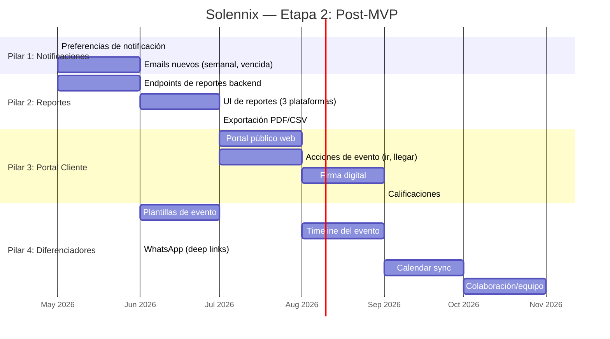

---
tags:
  - prd
  - roadmap
  - post-mvp
  - etapa-2
  - solennix
aliases:
  - Post MVP
  - Etapa 2
  - Post-Launch
date: 2026-04-10
updated: 2026-04-10
status: planning
---

# Solennix — Etapa 2: Post-MVP Roadmap

**Version:** 1.0
**Fecha:** 2026-04-10
**Estado:** Planificación
**Contexto:** MVP enviado a Apple Store Review. Android en preparación. Web y Backend funcionales en producción.

> [!tip] Documentos relacionados
> - [[PRD MOC]] — índice del PRD
> - [[09_ROADMAP|Roadmap MVP]] — timeline original (Etapa 1)
> - [[02_FEATURES|Features MVP]] — catálogo de features implementadas
> - [[11_CURRENT_STATUS|Estado Actual]] — progreso detallado

---

## Visión Post-MVP

> [!abstract] De "funcional" a "imprescindible"
> El MVP resuelve el problema: gestionar eventos, clientes, productos e inventario. La Etapa 2 transforma Solennix de una herramienta operativa a una **plataforma integral** que conecta al organizador con sus clientes, automatiza comunicaciones, y genera inteligencia de negocio que ningún competidor LATAM ofrece.

### Pilares Estratégicos

| # | Pilar | Objetivo |
|---|-------|----------|
| 1 | **Notificaciones Inteligentes** | Comunicación automatizada con preferencias del usuario |
| 2 | **Reportes y Analítica** | Inteligencia de negocio con datos que ya capturamos |
| 3 | **Portal del Cliente** | Experiencia para el cliente final del organizador |
| 4 | **Diferenciadores Únicos** | Features que hacen la app incomparable |

---

## Pilar 1: Notificaciones Inteligentes

### 1.1 Estado Actual de Emails Transaccionales

> [!success] Ya implementado en Backend
> El backend envía emails automáticos via Resend en estos momentos:

| Email | Trigger | Estado | Paridad |
|-------|---------|--------|---------|
| Welcome email | Al registrarse | ✅ Backend | ✅ Todas (backend-driven) |
| Event reminder | 24h antes del evento | ✅ Backend | ✅ Todas (backend-driven) |
| **Payment receipt** | Al crear un pago | ✅ Backend | ✅ Todas (backend-driven) |
| Subscription confirmation | Al upgrade a Pro | ✅ Backend | ✅ Todas (backend-driven) |
| Password reset | Forgot password | ✅ Backend | ✅ Todas (backend-driven) |

> [!important] Descubrimiento
> El email de recibo de pago (`payment receipt`) **ya funciona** en todas las plataformas porque es backend-driven — cuando cualquier app (iOS, Android, Web) registra un pago via `POST /api/payments`, el backend envía el email automáticamente.

### 1.2 Preferencias de Notificación del Usuario [NUEVO]

> [!warning] Feature nueva — Etapa 2
> El usuario debe poder elegir qué emails recibir y cuáles no.

#### Campos en tabla `users`

| Campo | Tipo | Default | Descripción |
|-------|------|---------|-------------|
| `email_payment_receipt` | bool | `true` | Recibir email al registrar un pago |
| `email_event_reminder` | bool | `true` | Recibir recordatorio 24h antes del evento |
| `email_subscription_updates` | bool | `true` | Emails de suscripción (upgrade, renovación) |
| `email_weekly_summary` | bool | `false` | Resumen semanal de actividad (nuevo) |
| `email_marketing` | bool | `false` | Novedades y tips de Solennix |
| `push_enabled` | bool | `true` | Activar/desactivar push notifications |
| `push_event_reminder` | bool | `true` | Push de recordatorio de evento |
| `push_payment_received` | bool | `true` | Push al recibir pago |

#### Implementación por plataforma

| Plataforma | Ubicación | UI |
|------------|-----------|-----|
| **Backend** | Migración nueva + `PUT /api/users/me` extendido + verificar preferencias antes de enviar | — |
| **iOS** | `SettingsView` → nueva sección "Notificaciones" con toggles | Toggle switches |
| **Android** | `SettingsScreen` → nueva sección "Notificaciones" con toggles | Switch composables |
| **Web** | `Settings` → nueva sección "Notificaciones" con toggles | Toggle switches |

#### Endpoint

```
PUT /api/users/me
{
  "email_payment_receipt": true,
  "email_event_reminder": true,
  "email_subscription_updates": true,
  "email_weekly_summary": false,
  "email_marketing": false,
  "push_enabled": true,
  "push_event_reminder": true,
  "push_payment_received": true
}
```

#### Lógica en `EmailService` y `NotificationService`

Antes de enviar cualquier email/push, consultar las preferencias del usuario:

```go
// Pseudocódigo
func (s *EmailService) SendPaymentReceipt(userID, paymentID) error {
    user := s.userRepo.GetByID(userID)
    if !user.EmailPaymentReceipt {
        return nil // usuario optó por no recibir
    }
    // ... enviar email
}
```

### 1.3 Emails Nuevos a Implementar

| Email | Trigger | Prioridad |
|-------|---------|-----------|
| Resumen semanal | Cron cada lunes | Media |
| Cotización sin confirmar (7 días) | Cron diario | Alta |
| Evento completado (feedback) | Al marcar completado | Baja |
| Stock crítico | Cuando stock < mínimo | Media |

### 1.4 Esfuerzo Estimado

| Tarea | Horas |
|-------|:-----:|
| Migración DB + campos en modelo | 2h |
| Backend: verificar preferencias en cada servicio | 4h |
| iOS: UI de preferencias | 3h |
| Android: UI de preferencias | 3h |
| Web: UI de preferencias | 2h |
| Emails nuevos (resumen semanal, cotización vencida) | 8h |
| **Total** | **~22h** |

---

## Pilar 2: Reportes y Analítica Avanzada

> [!abstract] Resumen
> El Dashboard es una vista rápida de KPIs. Los reportes son análisis profundos con filtros, rangos de fecha, y exportación. El backend ya tiene los datos — solo necesitamos explotarlos.

### 2.1 Datos Disponibles para Reportes

Con la información que **ya almacenamos**, podemos generar:

| Reporte | Datos fuente | Valor para el usuario |
|---------|-------------|----------------------|
| **Reporte Financiero** | `events` + `payments` | Ingresos, cobrado, pendiente, IVA, utilidad por período |
| **Reporte de Eventos** | `events` | Cantidad por estado, tipo de servicio, tendencias |
| **Reporte de Clientes** | `clients` + `events` + `payments` | Top clientes, frecuencia, ticket promedio, morosidad |
| **Reporte de Productos** | `event_products` + `products` | Productos más vendidos, revenue por producto, tendencias |
| **Reporte de Inventario** | `inventory_items` + `event_supplies` + `event_equipment` | Rotación, demanda, costos de insumos |
| **Reporte de Rentabilidad** | `events` (costos + precios) | Margen por evento, por producto, por tipo de servicio |

### 2.2 Pantalla de Reportes [NUEVA]

#### Navegación

Nueva sección en sidebar/tabs (tablet/desktop) o accesible desde Dashboard:
- **Phone**: Botón "Ver Reportes" en Dashboard → pantalla completa
- **Tablet/Desktop**: Nueva sección en sidebar: "Reportes" (ícono: `chart.bar.doc.horizontal` / `BarChart3`)

#### UI de Reportes

| Componente | Detalle |
|-----------|---------|
| **Selector de período** | Predefinidos: Este mes, Mes anterior, Trimestre, Año, Personalizado |
| **Date range picker** | Fecha inicio + Fecha fin (para personalizado) |
| **Tipo de reporte** | Tabs o segmented control: Financiero, Eventos, Clientes, Productos |
| **Vista en pantalla** | Cards de KPIs + tablas + gráficos |
| **Exportar** | Botón "Exportar" → PDF o CSV |

### 2.3 Reporte Financiero (Detalle)

El reporte financiero es el más valioso. Incluye:

| Sección | Métricas |
|---------|----------|
| **Resumen del período** | Ingresos totales, cobrado, pendiente, # eventos |
| **Desglose de IVA** | IVA facturado, IVA cobrado (proporcional), IVA pendiente |
| **Ingresos por mes** | Gráfico de barras con comparativa año anterior (si hay datos) |
| **Ingresos por tipo de servicio** | Pie chart: bodas, XV años, corporativos, etc. |
| **Top 5 eventos** | Tabla: evento, cliente, total, pagado, margen |
| **Métodos de pago** | Distribución: efectivo, transferencia, tarjeta, etc. |
| **Costos vs Utilidad** | Costos de insumos + equipo vs precio de venta |

### 2.4 Endpoints Backend (Nuevos)

```
GET /api/v1/reports/financial?from=2026-01-01&to=2026-03-31
GET /api/v1/reports/events?from=2026-01-01&to=2026-03-31
GET /api/v1/reports/clients?from=2026-01-01&to=2026-03-31&sort=revenue&order=desc
GET /api/v1/reports/products?from=2026-01-01&to=2026-03-31
GET /api/v1/reports/inventory?from=2026-01-01&to=2026-03-31
GET /api/v1/reports/export/pdf?type=financial&from=...&to=...
GET /api/v1/reports/export/csv?type=financial&from=...&to=...
```

### 2.5 Exportación

| Formato | Contenido | Generación |
|---------|-----------|------------|
| **PDF** | Reporte completo con gráficos, tablas y branding del usuario | Backend (Go) con librería PDF |
| **CSV** | Datos tabulares para análisis en Excel/Google Sheets | Backend (Go) |

> [!tip] Ventaja competitiva
> Ningún competidor LATAM ofrece reportes financieros con desglose de IVA y margen de utilidad. Esto es ORO para organizadores que necesitan reportar a contadores.

### 2.6 Tier

- **Básico**: Reporte financiero del mes actual (solo en pantalla)
- **Pro**: Todos los reportes, todos los períodos, exportación PDF/CSV

### 2.7 Esfuerzo Estimado

| Tarea | Horas |
|-------|:-----:|
| Backend: endpoints de reportes (queries SQL) | 20h |
| Backend: generación PDF server-side | 15h |
| Backend: exportación CSV | 5h |
| iOS: pantalla de reportes + gráficos | 15h |
| Android: pantalla de reportes + gráficos | 15h |
| Web: pantalla de reportes + gráficos | 12h |
| **Total** | **~82h** |

---

## Pilar 3: Portal del Cliente y Comunicación

> [!abstract] Resumen
> El cliente del organizador (la novia/novio, el gerente del corporativo, la quinceañera) merece una experiencia propia. Hoy el organizador comunica todo por WhatsApp. Con el Portal del Cliente, Solennix se vuelve el canal de comunicación oficial.

### 3.1 URL Compartible del Evento

El organizador genera un **link único** que comparte con su cliente:

```
https://app.solennix.com/portal/{token}
```

#### Información visible para el cliente (sin login)

| Sección | Contenido |
|---------|-----------|
| **Header** | Logo del negocio + nombre comercial del organizador |
| **Datos del evento** | Fecha, hora, tipo de servicio, ubicación (con link a Maps) |
| **Estado** | Badge grande y claro: Cotizado / Confirmado / En camino / etc. |
| **Progreso de pagos** | Barra de progreso: pagado vs total (sin detalle exacto de montos si el organizador lo prefiere) |
| **Checklist de carga** | Progreso del checklist (barra porcentual, no detalle de items) |
| **Documentos** | PDF de cotización y contrato para descargar |
| **Timeline** | Actualizaciones del evento en orden cronológico |

### 3.2 Notificaciones al Cliente del Organizador

> [!important] Esta es la feature que transforma todo
> Automatizar la comunicación entre el organizador y su cliente en momentos clave del evento.

#### Triggers Automáticos

| Momento | Mensaje al cliente | Canal |
|---------|-------------------|-------|
| Cotización creada | "Tu cotización para [evento] está lista. Revísala aquí: {link}" | Email + WhatsApp (opt) |
| Contrato listo | "Tu contrato está listo para firma. Revísalo aquí: {link}" | Email |
| Pago recibido | "Recibimos tu pago de $X. Saldo pendiente: $Y" | Email |
| **Checklist completo** | "✅ ¡Ya estamos cargados! En un momento salimos rumbo a tu evento" | Email + Push (si tiene app del portal) |
| **En camino** | "🚗 ¡Vamos en camino a tu evento! Tiempo estimado: ~X min" | Email + WhatsApp (opt) |
| **Llegamos** | "📍 ¡Llegamos! Estamos montando todo para tu evento" | Email |
| Evento completado | "🎉 ¡Gracias por confiar en nosotros! Califica nuestra experiencia: {link}" | Email |
| Recordatorio de pago | "Recordatorio: tienes un saldo pendiente de $X" | Email |

### 3.3 Integración Google Maps + Botón "Ir"

Cuando el organizador presiona "Ir" (navegar al evento):

1. Abre Google Maps / Apple Maps con la dirección del evento
2. **Simultáneamente** envía al cliente: "🚗 Vamos en camino a tu evento"
3. Opcionalmente: comparte ubicación en tiempo real (Google Maps live sharing link)

#### Implementación

| Plataforma | Acción "Ir" | Mensaje al cliente |
|------------|-------------|-------------------|
| **iOS** | `MKMapItem.openMaps()` o `UIApplication.open(googleMapsURL)` | `POST /api/events/{id}/actions/departed` → backend envía email/notificación |
| **Android** | `Intent(Intent.ACTION_VIEW, geoURI)` | Mismo endpoint |
| **Web** | `window.open(googleMapsURL)` | Mismo endpoint |

#### Endpoints Nuevos (Acciones del evento)

```
POST /api/events/{id}/actions/departed      # "Vamos en camino"
POST /api/events/{id}/actions/arrived       # "Llegamos"
POST /api/events/{id}/actions/setup-done    # "Todo listo, comenzamos"
POST /api/events/{id}/actions/completed     # "Evento completado"
```

Cada acción:
1. Actualiza un `event_timeline` log
2. Envía notificación al cliente (email + push si configurado)
3. Actualiza el estado visible en el Portal del Cliente

### 3.4 Firma Digital de Contrato

Desde el Portal del Cliente:
- El cliente ve el contrato pre-generado
- Firma con el dedo (canvas de firma) o tipea su nombre
- Se genera un PDF firmado con timestamp
- El organizador recibe notificación: "Tu cliente firmó el contrato"

### 3.5 Calificación Post-Evento

Después de marcar un evento como completado:
- Se envía email al cliente con link de calificación
- Formulario simple: ⭐ 1-5 + comentario opcional
- Las calificaciones se muestran en el perfil del organizador
- Promedio visible en el Dashboard del organizador

### 3.6 Esfuerzo Estimado

| Tarea | Horas |
|-------|:-----:|
| Backend: portal público (token, endpoints, timeline) | 25h |
| Backend: acciones de evento (departed, arrived, etc.) | 8h |
| Backend: firma digital + PDF firmado | 12h |
| Backend: calificaciones + promedios | 6h |
| Web: página del portal del cliente (público) | 20h |
| iOS: botón "Ir" + acciones de evento | 8h |
| Android: botón "Ir" + acciones de evento | 8h |
| Web: acciones de evento | 5h |
| Integración WhatsApp Business API (opcional) | 15h |
| **Total** | **~107h** |

### 3.7 Tier

- **Básico**: Link compartible con info básica (sin acciones automáticas)
- **Pro**: Portal completo + notificaciones automáticas + firma digital + calificaciones

---

## Pilar 4: Diferenciadores — La App Incomparable

> [!abstract] Ideas que hacen de Solennix algo que NADIE más tiene
> Estas features transforman a Solennix de "una app de gestión" a "el copiloto indispensable del organizador de eventos".

### 4.1 Timeline del Día del Evento

Vista hora por hora del día del evento que el organizador puede compartir con su equipo y con el cliente:

```
08:00 — Cargar equipo en vehículo
09:00 — Salir rumbo al venue
10:00 — Llegada y montaje
12:00 — Prueba de sonido
14:00 — Evento comienza
14:30 — Servicio de bebidas
15:00 — Corte de pastel
18:00 — Desmontaje
19:00 — Salida del venue
```

- Editable por el organizador
- Compartible con el cliente (via portal)
- Notificaciones automáticas a medida que avanzan las actividades
- **Drag & drop** para reordenar actividades

### 4.2 Plantillas de Evento Reutilizables

> [!tip] Ahorra HORAS por cada evento similar

- Guardar cualquier evento como plantilla
- Incluye: productos, extras, equipo, insumos, precios, descuento, template de contrato
- Crear nuevo evento desde plantilla = 1 clic para tener todo pre-configurado
- Biblioteca por tipo: "Boda 150 personas", "XV años básico", "Corporativo ejecutivo"

### 4.3 Modo Día del Evento (Event Day Mode)

Cuando llega el día del evento, la app entra en un modo especial:

| Feature | Detalle |
|---------|---------|
| **Banner prominente** | "HOY: Boda de Ana y Carlos — 14:00" en el Dashboard |
| **Checklist interactivo** | Progreso en tiempo real de lo que ya se cargó/montó |
| **Botones de acción rápida** | "Cargar", "En camino", "Llegamos", "Montaje listo", "Completar" |
| **Live Activity (iOS)** | Dynamic Island con cuenta regresiva y status |
| **Notificación persistente (Android)** | Notificación ongoing con acciones rápidas |
| **GPS tracking** | Opcional: compartir ubicación con el cliente |

### 4.4 Predicción de Demanda con IA

Con los datos históricos de eventos, productos e inventario:

| Predicción | Dato | Valor |
|-----------|------|-------|
| **Productos con más demanda** | Top 10 productos más solicitados por mes | Optimizar stock |
| **Temporada alta/baja** | Meses con más eventos | Preparar capacidad |
| **Ticket promedio** | Promedio de gasto por tipo de evento | Pricing inteligente |
| **Sugerencias de stock** | "Basado en tus próximos 5 eventos, necesitas comprar X" | Evitar faltantes |
| **Predicción de ingreso** | Revenue estimado para próximos 30/60/90 días | Planificación financiera |

> [!note] Esto NO requiere ML complejo
> Son queries SQL con agregaciones y promedios. El valor es enorme porque ningún organizador LATAM tiene esta visibilidad.

### 4.5 Integración con Calendario del Sistema

| Plataforma | Integración | Detalle |
|------------|-------------|---------|
| **iOS** | Apple Calendar (EventKit) | Sync bidireccional, colores por estado |
| **Android** | Google Calendar | Sync bidireccional, colores por estado |
| **Web** | iCal feed + Google Calendar API | URL suscribible |

### 4.6 WhatsApp Business Integration

> [!tip] LATAM = WhatsApp
> En LATAM, el 90% de la comunicación comercial pasa por WhatsApp. Integrar esto es un game-changer.

| Feature | Detalle |
|---------|---------|
| Enviar cotización por WhatsApp | Botón "Enviar por WhatsApp" → abre WhatsApp con PDF adjunto |
| Enviar contrato por WhatsApp | Mismo flujo con PDF de contrato |
| Recordatorios automáticos | Via WhatsApp Business API (requiere cuenta verificada) |
| Enlace al Portal | "Ve el estado de tu evento aquí: {link}" |

#### Implementación inicial (sin API)

En la Etapa 2 inicial, usar `whatsapp://send?phone={}&text={}` (deep link):
- No requiere WhatsApp Business API
- Funciona en todas las plataformas
- El organizador envía manualmente pero con el mensaje pre-armado

### 4.7 Colaboración y Equipo de Trabajo

| Feature | Detalle |
|---------|---------|
| Invitar miembros al equipo | Por email, con roles (admin/editor/viewer) |
| Asignar responsables a eventos | "Carlos se encarga del montaje" |
| Activity log | Quién hizo qué y cuándo |
| Comentarios en eventos | Notas internas del equipo |

### 4.8 Galería Pública del Negocio

Portfolio del organizador visible públicamente:

- Fotos de eventos pasados categorizadas
- Testimonios de clientes (de las calificaciones)
- Tipos de servicio que ofrece
- Botón "Solicitar Cotización" → formulario que crea un lead

> [!tip] Marketing gratuito
> El organizador comparte un link tipo `solennix.com/@mi-negocio` con sus clientes potenciales. Es como un mini-website profesional sin necesidad de tener uno.

### 4.9 Cuentas Regresivas y Recordatorios Inteligentes

| Recordatorio | Tiempo | Acción |
|-------------|--------|--------|
| Evento en 7 días | T-7 | "Revisa tu checklist y confirma stock" |
| Evento en 3 días | T-3 | "¿Ya compraste los insumos pendientes?" |
| Evento mañana | T-1 | "Mañana: [Evento]. Todo listo?" |
| Evento hoy | T-0 | Modo Día del Evento activo |
| Post-evento +1 día | T+1 | "¿Cómo salió? Marca como completado" |
| Post-evento +3 días | T+3 | "Envía la encuesta de satisfacción al cliente" |
| Pago pendiente +7 días | T+7 post confirmación | "Recordatorio: saldo pendiente de $X" |

### 4.10 Multi-Moneda y Multi-Idioma

| Feature | Detalle | Prioridad |
|---------|---------|-----------|
| Multi-moneda | MXN (default), USD, COP, ARS, BRL, PEN | Alta (LATAM) |
| Multi-idioma | Español (default), Inglés, Portugués | Media |
| Formato regional | Fechas, números, separador de miles por país | Alta |

---

## Priorización Etapa 2



---

## Resumen de Esfuerzo

| Pilar | Horas Estimadas | Impacto | Prioridad |
|-------|:--------------:|---------|-----------|
| 1. Notificaciones Inteligentes | ~22h | Alto | **P0** — Inmediato |
| 2. Reportes y Analítica | ~82h | Muy Alto | **P1** — Q2 2026 |
| 3. Portal del Cliente | ~107h | Transformador | **P1** — Q3 2026 |
| 4. Diferenciadores | ~150h+ | Diferenciación | **P2** — Q3-Q4 2026 |
| **Total Etapa 2** | **~361h** | | |

> [!note] Comparación
> El MVP tomó ~1,545h (estimadas). La Etapa 2 es ~23% del esfuerzo del MVP pero con un impacto desproporcionadamente alto en retención y diferenciación.

---

## Métricas de Éxito (Etapa 2)

| Métrica | Target | Cómo medirla |
|---------|--------|-------------|
| Usuarios que activan portal del cliente | >50% de Pro | Analytics |
| Reportes generados por usuario/mes | >3 | Backend logs |
| Emails abiertos (open rate) | >40% | Resend analytics |
| Calificaciones recibidas post-evento | >30% de eventos completados | Backend |
| Retención mensual Pro | >85% | RevenueCat / Stripe |
| NPS | >50 | Encuesta in-app |

---

## Relaciones

- [[PRD MOC]] — Índice del PRD
- [[09_ROADMAP|Roadmap MVP]] — Timeline original
- [[02_FEATURES|Features]] — Catálogo de features implementadas
- [[11_CURRENT_STATUS|Estado Actual]] — Progreso actual

---

#prd #roadmap #post-mvp #etapa-2 #solennix
