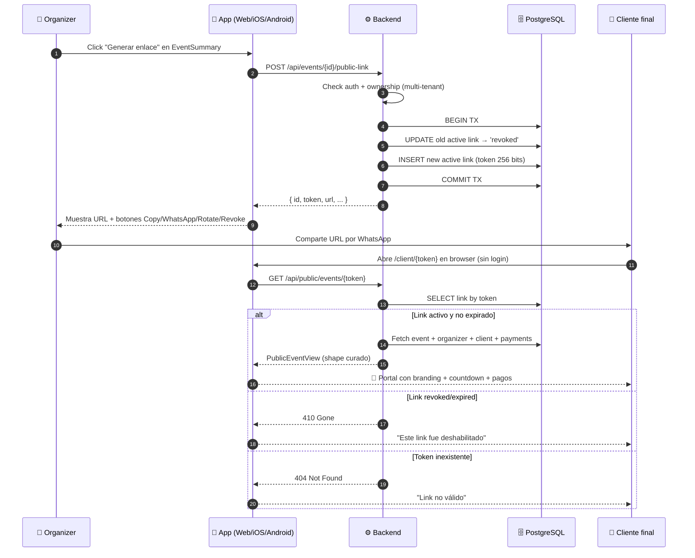
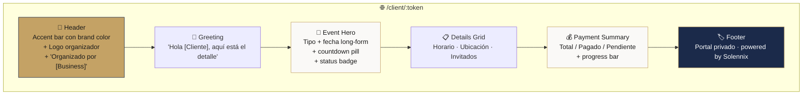

---
tags:
  - prd
  - portal-cliente
  - feature-a
  - client-portal
  - solennix
aliases:
  - Portal Cliente Tracker
  - Client Portal Tracker
date: 2026-04-16
updated: 2026-04-17
status: mvp-complete
feature: "PRD/12 A"
---

# 🎁 Portal Cliente — Tracker de Implementación

> [!tip] Dashboard dedicado para el feature estrella
> El Portal del Cliente (PRD/12 feature A) es la puerta de entrada a toda la diferenciación "antojable" de Solennix vs. competidores LATAM. Este documento trackea su estado end-to-end.

**Feature:** PRD/12 feature A — Portal público del cliente.
**Status global:** ✅ MVP cerrado en los 4 stacks — Backend + Web + iOS + Android en paridad.
**Progreso:** `████████████████████` **100%** (MVP). Extensiones (PIN, visibleToClient, archive permanente) siguen en backlog.

> [!tip] Documentos relacionados
> [[00_DASHBOARD|Dashboard Ejecutivo]] · [[12_CLIENT_TRANSPARENCY_AND_DELIGHT|PRD/12 features A–L]] · [[02_FEATURES|Feature Matrix]] · [[04_MONETIZATION|Monetización §4.3]] · [[09_ROADMAP|Roadmap]] · [[16_SPRINT_LOG_2026_04_16|Sprint Log del día]]

---

## ✨ Sprint 8 cerrado 2026-04-17 — paridad mobile

> [!success] iOS Portal Cliente — commit `1f76702`
> 3 archivos nuevos + 2 modificados:
> - `EventPublicLink.swift` (Codable + status enum)
> - `ClientPortalShareViewModel.swift` (`@Observable`, 404 → empty state)
> - `ClientPortalShareSheet.swift` (3 estados, native `ShareLink`, `confirmationDialog`)
> - `Endpoints.swift` (+ `eventPublicLink(_:)`)
> - `EventDetailView.swift` (+ `clientPortalCard` entre contract preview y documents)

> [!success] Android Portal Cliente — commit `a884733`
> 4 archivos nuevos + 3 modificados:
> - `EventPublicLink.kt` (@Serializable + status enum)
> - `EventPublicLinkRepository.kt` (Hilt @Singleton, 404 → null)
> - `ClientPortalShareViewModel.kt` (@HiltViewModel, StateFlow UiState)
> - `ClientPortalShareBottomSheet.kt` (ModalBottomSheet + ACTION_SEND + AlertDialog)
> - `Endpoints.kt`, `DataModule.kt` (@Binds), `EventDetailScreen.kt` (shortcut "Portal" en DocumentActionsGrid)

**Copy en español paridad iOS + Android + Web:**
- Título · subtítulo
- Botones: *Copiar enlace · Compartir · Rotar enlace · Deshabilitar*
- Confirm rotate: *"Al rotar el enlace, el que ya compartiste dejará de funcionar. ¿Continuamos?"*
- Confirm revoke: *"Se va a deshabilitar el enlace para el cliente. ¿Estás seguro?"*
- Empty CTA: *"Generar enlace para el cliente"*

---

## 🏆 Lo que ya se shipeó — Sprint del 2026-04-16

> [!success] Backend MVP — commit `8dff4f3`
> **5 archivos nuevos, 1 migration:**
> - `backend/internal/database/migrations/041_add_event_public_links.up.sql`
> - `backend/internal/models/models.go` (type `EventPublicLink`)
> - `backend/internal/repository/event_public_link_repo.go` (CRUD + transactional)
> - `backend/internal/handlers/event_public_link_handler.go` (4 endpoints)
> - Router + cmd/server wiring

> [!success] Web MVP — commit `06d69ff`
> **6 archivos nuevos:**
> - `web/src/pages/ClientPortal/ClientPortalPage.tsx` — la vista que ve el cliente
> - `web/src/pages/ClientPortal/components/ClientPortalUnavailable.tsx` — 404 / 410
> - `web/src/services/eventPublicLinkService.ts` — wrap de los 3 endpoints autenticados
> - `web/src/pages/Events/components/ClientPortalShareCard.tsx` — card del organizer en EventSummary
> - App.tsx lazy route registrada
> - EventSummary.tsx importa la card

> [!success] Migration silenciosa Android — commit `a3f425a`
> Preserva checklist progress histórico al migrar de `checklist_prefs` → `checklist_prefs_encrypted`. Evita regression en usuarios existentes. (no Portal Cliente directo pero shipped en el mismo sprint).

### 📐 Arquitectura del flujo

### 🎨 Lo que ve el cliente en el portal

---

## 📊 Matriz detallada por plataforma

### 🍏 iOS — ✅ Shipped (Sprint 8, commit `1f76702`)

| Ítem | Status | Archivo |
|---|:-:|---|
| `.sheet(isPresented:)` nativo en EventDetailView | ✅ | `EventDetailView.swift` |
| Three-state UI: Loading / Has-link / No-link | ✅ | `ClientPortalShareSheet.swift` |
| Fetch del link activo (404 → empty state) | ✅ | `ClientPortalShareViewModel.swift` |
| Mostrar URL actual + copy con `UIPasteboard` | ✅ | `ClientPortalShareSheet.swift` |
| Share nativo (WhatsApp/Mail/SMS/AirDrop via `ShareLink`) | ✅ | `ClientPortalShareSheet.swift` |
| Confirm dialogs para Rotate/Revoke (`.confirmationDialog`) | ✅ | `ClientPortalShareSheet.swift` |
| Tier gating: basic vs full shape (informativo) | 📋 | 7.C |

### 🤖 Android — ✅ Shipped (Sprint 8, commit `a884733`)

| Ítem | Status | Archivo |
|---|:-:|---|
| `ModalBottomSheet` en EventDetailScreen | ✅ | `ClientPortalShareBottomSheet.kt` |
| Three-state UI: Loading / Has-link / No-link | ✅ | `ClientPortalShareBottomSheet.kt` |
| Fetch + render del link (404 → empty state) | ✅ | `ClientPortalShareViewModel.kt` |
| Share vía `Intent.ACTION_SEND` + createChooser | ✅ | `ClientPortalShareBottomSheet.kt` |
| Rotate/Revoke con `AlertDialog` | ✅ | `ClientPortalShareBottomSheet.kt` |
| Repository con Hilt (`@Binds`) | ✅ | `EventPublicLinkRepository.kt` |
| Shortcut "Portal" en DocumentActionsGrid | ✅ | `EventDetailScreen.kt` |
| Tier gating client-side | 📋 | 7.C |

### 🌐 Web — ✅ Shipped

| Ítem | Status | Archivo |
|---|:-:|---|
| Route público `/client/:token` | ✅ | `App.tsx` |
| Page component con estados loading/error | ✅ | `ClientPortalPage.tsx` |
| 404 vs 410 con copy distinto | ✅ | `ClientPortalUnavailable.tsx` |
| Hero + countdown + details grid | ✅ | `ClientPortalPage.tsx` |
| Payment summary con progress bar accesible | ✅ | `ClientPortalPage.tsx` |
| Validación de brand_color (regex hex) | ✅ | `ClientPortalPage.tsx` |
| Share card en EventSummary (organizer) | ✅ | `ClientPortalShareCard.tsx` |
| Service con `getActive/createOrRotate/revoke` | ✅ | `eventPublicLinkService.ts` |
| Copy to clipboard + feedback | ✅ | `ClientPortalShareCard.tsx` |
| WhatsApp share pre-compuesto | ✅ | `ClientPortalShareCard.tsx` |
| Rotate con confirm | ✅ | `ClientPortalShareCard.tsx` |
| Revoke con confirm | ✅ | `ClientPortalShareCard.tsx` |

### ⚙️ Backend — ✅ Shipped

| Ítem | Status | Archivo |
|---|:-:|---|
| Migration 041 tabla `event_public_links` | ✅ | `041_add_event_public_links.up.sql` |
| Partial unique index `WHERE status='active'` | ✅ | idem |
| Model `EventPublicLink` | ✅ | `models/models.go` |
| Repo: `Create` transactional revoke+insert | ✅ | `event_public_link_repo.go` |
| Repo: `GetActiveByEventID` | ✅ | idem |
| Repo: `GetByToken` | ✅ | idem |
| Repo: `Revoke` con `ErrNoRows` guard | ✅ | idem |
| `POST /api/events/{id}/public-link` (auth) | ✅ | `event_public_link_handler.go` |
| `GET /api/events/{id}/public-link` (auth) | ✅ | idem |
| `DELETE /api/events/{id}/public-link` (auth) | ✅ | idem |
| `GET /api/public/events/{token}` (público, rate-limited 10/min) | ✅ | idem |
| Response shape `PublicEventView` curado | ✅ | idem |
| 410 Gone para revoked/expired | ✅ | idem |
| Auto-revoke si evento se borra | ✅ | idem |
| Token gen con `crypto/rand` 256 bits | ✅ | reuso de `generateFormToken` |
| Router wiring público + privado | ✅ | `router.go` |

---

## 🎯 Decisiones de diseño cerradas

### A.1 — Acceso perpetuo del cliente ⭐

> [!abstract] Decisión 2026-04-16
> **El cliente debe poder acceder al portal de su evento SIN importar cuánto tiempo pase.** Bodas, quinceañeras, eventos significativos — la gente vuelve años después. Cortar ese acceso es regresión emocional.

| Regla | Estado |
|---|:-:|
| Default TTL = NULL (nunca caduca) | ✅ implementado |
| No cron que expire automáticamente | ✅ no existe tal cron |
| Revocación explícita disponible | ✅ implementado |
| Confirm reforzado si evento >180 días | 📋 futuro |
| Archive permanente post-cierre de cuenta (Business) | 📋 backlog |
| Legacy URL redirects si movemos la ruta | 📋 futuro |

### A.2 — Tier gating (Gratis con taste)

> [!abstract] Decisión 2026-04-16 (ajustada al final del día)
> Gratis NO queda afuera del portal — tiene versión **básica** como upgrade driver. Calidad > cantidad.

```mermaid
graph LR
    subgraph Gratis ["🆓 Portal Gratis"]
        G1[✓ ∞ eventos]
        G2[✓ Info básica del evento]
        G3[✓ Countdown]
        G4[✓ Greeting al cliente]
        G5[❌ Sin branding propio]
        G6[❌ Sin payments]
        G7[❌ Sin timeline]
        G8[❌ Sin chat/decisiones]
        G9[🏷️ Footer 'Powered by Solennix' linkeado]
    end

    subgraph Pro ["💎 Portal Pro"]
        P1[✓ Todo lo de Gratis]
        P2[✓ Branding propio<br/>logo + colores]
        P3[✓ Payment summary completo]
        P4[✓ Cronograma de cuotas]
        P5[✓ Registrar pago cliente]
        P6[✓ Timeline de etapas]
        P7[✓ Chat + decisiones]
        P8[🏷️ Sin footer Solennix]
    end

    subgraph Business ["🏢 Portal Business"]
        B1[✓ Todo lo de Pro]
        B2[✓ Dominio custom]
        B3[✓ DKIM emails]
        B4[✓ White-label total]
    end

    Gratis -->|Upgrade driver: calidad| Pro
    Pro -->|Upgrade driver: profesionalización| Business

    style Gratis fill:#F5F4F1,stroke:#1B2A4A,color:#1A1A1A
    style Pro fill:#C4A265,stroke:#1B2A4A,color:#1A1A1A
    style Business fill:#1B2A4A,stroke:#C4A265,color:#fff
```

**Implementación pendiente (Sprint 7.C):** el endpoint `GET /api/public/events/{token}` debe leer `organizer.plan` y devolver `basic_shape` o `full_shape` según corresponda. Hoy el MVP devuelve el full shape para todos (OK antes de cobrar real).

### A.3 — Rotación sin pérdida de historia

> [!info] Modelo de datos permite rotación segura
> Un evento puede tener **muchos** `event_public_links` históricos, pero solo **uno** con `status='active'` simultáneamente (enforced por partial unique index). El `Create` es transaccional: revoke anterior + insert nuevo.

---

## 🚧 Pendiente para completar el feature

### Sprint 7.C — Enforcement (antes del cobro real)

- [ ] `GET /api/public/events/{token}` lee plan del organizer
- [ ] Devuelve `basic_payload` (sin branding, pagos, timeline) si plan=Gratis
- [ ] Devuelve `full_payload` si plan=Pro+
- [ ] Footer "Powered by Solennix" como link activo solo en Gratis
- [ ] Copy del paywall web actualizado a "requiere Plan Pro"

### Sprint 8 — Mobile nativo (✅ 2026-04-17)

- [x] iOS `ClientPortalShareSheet.swift` + `ClientPortalShareViewModel.swift` + `EventPublicLink.swift` — commit `1f76702`
- [x] Android `ClientPortalShareBottomSheet.kt` + `ClientPortalShareViewModel.kt` + `EventPublicLinkRepository.kt` + `EventPublicLink.kt` — commit `a884733`
- [ ] UI tests básicos con service mockeado
- [ ] Commit cross-platform con paridad verificada

### Follow-ups (backlog sin fecha)

- [ ] OpenAPI docs de los 4 endpoints en `backend/docs/openapi.yaml`
- [ ] PIN opcional (extra layer de privacy)
- [ ] Field-level `visibleToClient` toggles (organizer puede togglear por campo)
- [ ] Timeline visual de etapas del evento (requiere nuevo schema — va con feature C)
- [ ] Equipo asignado (coordinator/fotógrafo/DJ — requiere `event_staff` schema)
- [ ] Mapa integrado en Ubicación (Google Maps embed)
- [ ] Dress code en Event model
- [ ] Confirm reforzado al revocar eventos >180 días
- [ ] Archive permanente post-cierre de cuenta (Business tier feature)

---

## 🧪 Testing checklist — smoke tests MVP

> [!example] Lo que tenés que probar en tu próximo deploy manual

**Flujo del organizer (web):**
- [ ] Abrir un evento existente → pestaña Resumen.
- [ ] Ver la tarjeta "Portal del cliente" arriba de los KPI cards.
- [ ] Click "Generar enlace para el cliente" → toast de éxito.
- [ ] Ver el URL + 4 botones (Copiar · WhatsApp · Rotar · Deshabilitar).
- [ ] Click "Copiar" → toast "Copiado" + URL en clipboard.
- [ ] Click "Compartir por WhatsApp" → abre `wa.me/?text=...` con mensaje pre-compuesto.

**Flujo del cliente (navegador incógnito):**
- [ ] Pegar el URL `/client/:token` → ver página completa cargada.
- [ ] Ver header con accent bar del color de marca.
- [ ] Ver saludo personalizado con nombre del cliente.
- [ ] Ver countdown ("27 días restantes" / "¡Es hoy!" / "Hace 3 días").
- [ ] Ver status badge con copy correcto (Confirmado / Cotizado / etc).
- [ ] Ver grid de detalles (horario / ubicación / invitados).
- [ ] Ver payment summary con progress bar funcional.
- [ ] Footer "Portal privado · powered by Solennix" visible.

**Rotación / Revocación:**
- [ ] Con el link abierto en el navegador del cliente, click "Rotar" desde el organizer.
- [ ] Recargar la página del cliente → **410 Gone** con copy "Enlace deshabilitado. Contactalos para que te compartan uno nuevo."
- [ ] El nuevo URL funciona normalmente.
- [ ] Click "Deshabilitar" → mismo comportamiento.

**Auto-revoke al borrar evento:**
- [ ] Generar un link para un evento.
- [ ] Borrar ese evento desde la app.
- [ ] Intentar abrir el link → **410 Gone** con copy "El evento para este enlace ya no existe".

---

## 📈 Métricas de éxito (post-deploy)

> [!question] Qué mirar al deployar
>
> - **% eventos con portal activado** (meta 90 días: 40%)
> - **% clientes que abren el portal** (meta: 60%)
> - **Tiempo promedio en el portal** (meta: >60 seg — significa que miraron todo)
> - **NPS del cliente final** (encuesta opcional post-evento — va con feature I)
> - **Reducción de mensajes "¿cuánto debo?" por WhatsApp** (medido cualitativamente con el organizer)

Cuando haya métricas reales, actualizar acá.

---

## 🔗 Links útiles

- **Código backend:** [[../../Backend/Módulo Eventos]] (ampliar cuando se doc el portal link)
- **Código web:** [[../../Web/Módulo Eventos]] (ampliar cuando se doc el Portal Cliente)
- **Código iOS:** ✅ Sprint 8 (commit `1f76702`)
- **Código Android:** ✅ Sprint 8 (commit `a884733`)
- **Spec completa original:** [[12_CLIENT_TRANSPARENCY_AND_DELIGHT|PRD/12 feature A]]
- **Tier matrix:** [[04_MONETIZATION#§4.3]]
- **Decision record:** [[16_SPRINT_LOG_2026_04_16|Sprint Log del día]]

---

#portal-cliente #feature-a #client-portal #mvp-shipped #solennix
