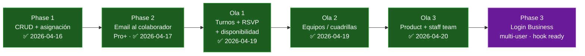

---
tags:
  - feature
  - personal
  - colaboradores
  - phase-1
aliases:
  - Personal Tracker
  - Staff Tracker
  - Colaboradores
date: 2026-04-16
updated: 2026-05-15
status: phase-2-done-olas-1-2-3-complete-ola-4-in-progress
---

# 🤝 Personal / Colaboradores — Tracker

> [!success] Phase 1 cerrada 2026-04-16
> Backend + Web + iOS + Android en paridad. Hooks Phase 2 y Phase 3 ya viajan en la migración 042 → futuros sprints son puro código, sin nuevas migraciones.

> [!success] Phase 2 cerrada 2026-04-17 — email al colaborador al asignar (Pro+)
> Goroutine en `CRUDHandler.UpdateEventItems` manda email via Resend cuando el organizer es Pro+ y el colaborador marcó `notification_email_opt_in=true`. UPSERT pattern preserva `notification_sent_at` para que re-guardar el evento no dispare duplicados. **Commit `20a2d07`**.

> [!success] Ola 1 cerrada 2026-04-19 — turnos + RSVP + disponibilidad
> `event_staff` recibe `shift_start`/`shift_end` (TIMESTAMPTZ) + `status` (pending/confirmed/declined/cancelled). Backend endpoint `GET /api/staff/availability?date=`. Cross-platform: pickers de horario colapsables, badges de estado, indicador "Ocupado ese día". **Migration 043**.

> [!success] Ola 2 cerrada 2026-04-19 — equipos (staff_teams)
> Tablas `staff_teams` + `staff_team_members` con PK compuesta. Repo CRUD transaccional. Endpoints `/api/staff/teams`. Cross-platform: gestión de equipos, toggle `is_lead`, badge corona. **Migration 044**.

> [!success] Ola 3 cerrada 2026-04-20 — Product con staff team
> `products.staff_team_id` nullable FK. Tenant isolation via `SetStaffTeamRepo`. Cross-platform: selector "Equipo asociado" en Product form, chip "Incluye equipo" en EventForm. **Migration 045**.

> [!info] Ola 4 iniciada 2026-05-15 — Team Member Portal Utility-First
> Se definió el backlog funcional y ya se implementó el slice base móvil: entrada por rol `team_member` + bandeja mínima de asignaciones en iOS/Android.

---

## 🧭 Qué resuelve

Los organizadores tenían un problema silencioso: **dónde anotar al fotógrafo, el DJ, los meseros, el coordinador** de cada evento. Hoy eso vive en la cabeza o en WhatsApp y se pierde. Solennix ahora tiene un catálogo de **colaboradores** (propio por organizer) con asignación a eventos, costos opcionales por evento, y scaffolding para los siguientes dos pasos: notificarles cuando los asignan, y darles login cuando seas cuenta Business.

---

## 📊 Paridad cross-platform

| Capacidad | iOS | Android | Web | Backend |
|---|:-:|:-:|:-:|:-:|
| CRUD catálogo de staff | ✅ | ✅ | ✅ | ✅ |
| Búsqueda (nombre/rol/contacto) | ✅ | ✅ | ✅ | ✅ `?q=` |
| Asignar colaboradores a un evento (Step 4) | ✅ | ✅ | ✅ | ✅ `PUT /events/{id}/items` con `staff[]` |
| Ver asignados en EventDetail (read-only) | ✅ | ✅ | ✅ | ✅ `GET /events/{id}/staff` |
| Fee opcional por asignación | ✅ | ✅ | ✅ | ✅ `event_staff.fee_amount` |
| Toggle "notificar por email al asignar" | ✅ | ✅ | ✅ | ✅ `staff.notification_email_opt_in` |
| **Email automático al colaborador al asignarlo (Phase 2, Pro+)** | ✅ | ✅ | ✅ | ✅ goroutine fire-and-forget + Resend |
| **Turnos (shift_start/shift_end) (Ola 1)** | ✅ | ✅ | ✅ | ✅ migration 043 |
| **RSVP status (pending/confirmed/declined/cancelled) (Ola 1)** | ✅ | ✅ | ✅ | ✅ enum + COALESCE UPSERT |
| **Disponibilidad por fecha (Ola 1)** | ✅ | ✅ | ✅ | ✅ `GET /api/staff/availability?date=` |
| **Equipos / cuadrillas (Ola 2)** | ✅ | ✅ | ✅ | ✅ `staff_teams` + `staff_team_members` |
| **Toggle is_lead por miembro (Ola 2)** | ✅ | ✅ | ✅ | ✅ badge corona |
| **Agregar equipo completo a evento (Ola 2)** | ✅ | ✅ | ✅ | ✅ expande miembros via UPSERT |
| **Product con staff_team_id (Ola 3)** | ✅ | ✅ | ✅ | ✅ nullable FK + tenant isolation |
| **Selector "Equipo asociado" en Product form (Ola 3)** | ✅ | ✅ | ✅ | — |
| **Chip "Incluye equipo" en EventForm (Ola 3)** | ✅ | ✅ | ✅ | — |

---

## 🗺️ Fases — roadmap



## 🧩 Ola 4 — Team Member Portal Utility (plan de producto)

### Objetivo

Pasar de "listas con filtros" a un portal operativo diario para miembros invitados: ver su jornada, responder rápido asignaciones, operar por calendario real y ejecutar en evento con contexto útil.

### Alcance funcional (paridad obligatoria)

| Pantalla / capacidad | Web | iOS | Android | Backend |
|---|:-:|:-:|:-:|:-:|
| Home "Mi Jornada" (hoy/próximos/pendientes) | 🔲 | 🔲 | 🔲 | 🔲 agregados por rango |
| Bandeja de Asignaciones (accept/decline + motivo opcional) | 🔲 | 🔲 | 🔲 | 🔲 extender payload opcional |
| Calendario real (mes/semana/día) | 🔲 | 🔲 | 🔲 | ✅ base (`my-assignments`) + 🔲 optimización |
| Detalle de Evento Team (brief, turno, mapa, checklist personal) | 🔲 | 🔲 | 🔲 | 🔲 endpoint detalle scoped |
| Timeline de cambios/notificaciones de asignación | 🔲 | 🔲 | 🔲 | 🔲 feed de cambios |
| Disponibilidad del miembro (bloqueos/preferencias) | 🔲 | 🔲 | 🔲 | 🔲 endpoint + persistencia |

### Historias de usuario priorizadas

#### H1 — Mi Jornada
- Como miembro de equipo, quiero abrir la app y ver en 1 pantalla qué tengo hoy y qué requiere respuesta para decidir rápido mi día.
- Criterios:
  - Muestra "Hoy", "Próximos 7 días", "Pendientes por responder".
  - CTA directos: "Ir a agenda de hoy" y "Responder asignaciones".
  - Empty state claro cuando no hay eventos.

#### H2 — Bandeja de Asignaciones
- Como miembro, quiero aceptar/rechazar asignaciones sin navegar múltiples pantallas.
- Criterios:
  - Card con fecha, turno, rol, fee (si existe), notas y lugar.
  - Acción `accept`/`decline` inmediata, con confirmación visual de estado final.
  - Motivo de rechazo opcional (si backend lo soporta).

#### H3 — Calendario operativo real
- Como miembro, quiero ver mi carga en calendario mensual/semanal/diario para planear trabajo.
- Criterios:
  - Vista mes con densidad por día.
  - Vista semana para turnos y solapes.
  - Vista día tipo agenda por hora.
  - Tap en evento abre detalle Team.

#### H4 — Detalle de Evento Team
- Como miembro, quiero un detalle enfocado en ejecución del evento, no en CRM completo.
- Criterios:
  - Brief: nombre, fecha/hora, rol asignado, turno, contacto operativo.
  - Ubicación con acción de abrir mapa.
  - Checklist personal y notas del organizador.
  - Estado de asignación visible y editable solo cuando aplique.

#### H5 — Timeline de cambios
- Como miembro, quiero saber si cambiaron horario/lugar/rol para no llegar desinformado.
- Criterios:
  - Feed cronológico de cambios relevantes del evento asignado.
  - Marcado leído/no leído.
  - Push/deeplink al evento afectado.

#### H6 — Disponibilidad del miembro
- Como miembro, quiero marcar bloqueos y disponibilidad para evitar choques.
- Criterios:
  - Bloqueos por fecha y rango horario.
  - Preferencias básicas de notificación.
  - Impacto visible en futuras asignaciones.

### Definition of Done por plataforma

#### Web DoD
- Rutas Team Member con guard de rol (`team_member`) sin acceso a layout de organizer.
- Superficies nuevas: `TeamHome`, `TeamAssignmentsInbox`, `TeamCalendar` (mes/semana/día), `TeamEventDetail`.
- Accesibilidad: focus states, navegación teclado, labels ARIA para acciones críticas.
- i18n ES/EN completo para cada nueva clave.
- Tests:
  - Unit de utilidades y estado de filtros/calendario.
  - Integration de acciones accept/decline + refetch.
  - Smoke e2e de flujo team member.

#### iOS DoD
- Navegación nativa Team Member con tabs/secciones dedicadas sin mezclar vistas de organizer.
- Pantallas SwiftUI: `TeamHomeView`, `TeamAssignmentsView`, `TeamCalendarView`, `TeamEventDetailView`.
- Patrones nativos:
  - iPhone: navegación compacta con acciones en toolbar/sheets.
  - iPad: split/adaptivo con detalle persistente cuando aplique.
- `FeatureL10n` aplicado (sin hardcodes visibles).
- Tests:
  - ViewModel tests de carga y respuestas.
  - Snapshot/preview sanity para estados clave (loading/empty/error).

#### Android DoD
- Navegación Team Member dedicada (bottom nav o rail según tamaño), sin mezclar rutas owner.
- Pantallas Compose: `TeamHomeScreen`, `TeamAssignmentsScreen`, `TeamCalendarScreen`, `TeamEventDetailScreen`.
- Patrones nativos Material 3:
  - FAB solo contextual donde agregue valor.
  - `imePadding()` y estados accesibles para TalkBack.
- Recursos ES/EN en `strings.xml` por feature (sin shims temporales nuevos).
- Tests:
  - ViewModel unit tests para responder asignaciones y filtros de agenda.
  - Compose tests para acciones críticas y empty/error states.

### Definition of Done de backend para Ola 4

- Endpoints y contratos OpenAPI completos para:
  - Home agregada de miembro (hoy/próximos/pendientes).
  - Detalle de evento scoped a `team_member`.
  - Feed de cambios de asignación/evento.
  - Disponibilidad del miembro (CRUD básico).
- Tenant isolation estricta: `team_member` solo ve eventos donde esté asignado.
- Tests de integración de autorizaciones y escenarios first-accept-wins.

### Plan de ejecución sugerido

| Fase | Objetivo | Entregables |
|---|---|---|
| Fase A (rápida, alto impacto) | Utilidad diaria inmediata | H1 + H2 + calendario día básico |
| Fase B | Operación completa en evento | H3 completo + H4 |
| Fase C | Coordinación y confiabilidad | H5 + H6 |

### Roadmap ejecutable (issues + dependencias)

| Orden | Issue | Nombre | Fase | Depende de |
|---|---|---|---|---|
| 1 | #337 | H2 Assignments inbox with fast accept/decline | A | base actual Phase 3.5 |
| 2 | #336 | H1 My Day home for invited team members | A | #337 |
| 3 | #338 | H3 Operational calendar (month/week/day) | A/B | #337 |
| 4 | #339 | H4 Team-scoped event detail | B | #338 |
| 5 | #340 | H5 Assignment/event change timeline | C | #339 |
| 6 | #341 | H6 Team member availability management | C | #338 |

#### Orden recomendado de implementación

1. **#337** primero: mejora el flujo ya existente de respuesta a asignaciones y consolida la acción principal del portal.
2. **#336** después: reutiliza los datos de asignaciones para construir la home "Mi Jornada" sin abrir todavía toda la complejidad del detalle.
3. **#338** tercero: convierte el calendario en superficie realmente útil y habilita navegación natural hacia detalle.
4. **#339** cuarto: construye el detalle Team scoped una vez que ya existe navegación desde inbox/home/calendario.
5. **#340** quinto: agrega coordinación y trazabilidad sobre la base del detalle Team.
6. **#341** sexto: cierra el loop operativo al permitir que el miembro gestione disponibilidad futura.

#### Slicing recomendado por PR

- **PR Slice A1:** #337
- **PR Slice A2:** #336
- **PR Slice A3:** #338 (arrancar con vista día/agenda, luego semana/mes dentro del mismo issue si entra en tamaño revisable)
- **PR Slice B1:** #339
- **PR Slice C1:** #340
- **PR Slice C2:** #341

### KPIs de adopción del portal team member

- Tiempo medio de respuesta a asignación.
- % de asignaciones respondidas antes de deadline.
- MAU/WAU de miembros invitados en portal.
- % sesiones que completan acción en "Mi Jornada".

### Avance real de implementación (2026-05-15)

| Slice | Web | iOS | Android | Backend |
|---|---:|---:|---:|---:|
| Routing por rol a shell Team Member | ✅ | ✅ | ✅ | ✅ (contrato ya disponible) |
| Inbox mínima de asignaciones (load + accept/decline) | ✅ | ✅ | ✅ | ✅ |
| Home Mi Jornada | 🔲 | 🔲 | 🔲 | 🔲 |
| Calendario mes/semana/día | 🔲 | 🔲 | 🔲 | 🔲 |
| Detalle Team scoped | 🔲 | 🔲 | 🔲 | 🔲 |
| Timeline de cambios | 🔲 | 🔲 | 🔲 | 🔲 |
| Disponibilidad del miembro | 🔲 | 🔲 | 🔲 | 🔲 |

> [!info] Gating por phase
> - **Phase 1:** sin gate — todos los planes pueden usar el catálogo (es CRM interno, no cara-al-cliente).
> - **Phase 2:** notificaciones email = Pro+.
> - **Phase 3:** login + scope de eventos + chat gerente = Business.

---

## 🧱 Data model — migration `042_create_staff_and_event_staff`

### Tabla `staff`

```sql
CREATE TABLE staff (
    id UUID PRIMARY KEY DEFAULT gen_random_uuid(),
    user_id UUID NOT NULL REFERENCES users(id) ON DELETE CASCADE,
    name TEXT NOT NULL,
    role_label TEXT,
    phone TEXT,
    email TEXT,
    notes TEXT,
    notification_email_opt_in BOOLEAN NOT NULL DEFAULT false,  -- hook Phase 2
    invited_user_id UUID REFERENCES users(id) ON DELETE SET NULL,  -- hook Phase 3
    created_at TIMESTAMPTZ NOT NULL DEFAULT NOW(),
    updated_at TIMESTAMPTZ NOT NULL DEFAULT NOW()
);
```

### Tabla `event_staff`

```sql
CREATE TABLE event_staff (
    id UUID PRIMARY KEY DEFAULT gen_random_uuid(),
    event_id UUID NOT NULL REFERENCES events(id) ON DELETE CASCADE,
    staff_id UUID NOT NULL REFERENCES staff(id) ON DELETE CASCADE,
    fee_amount NUMERIC(12,2),
    role_override TEXT,
    notes TEXT,
    notification_sent_at TIMESTAMPTZ,       -- hook Phase 2 dedup
    notification_last_result TEXT,          -- hook Phase 2 outcome
    created_at TIMESTAMPTZ NOT NULL DEFAULT NOW(),
    UNIQUE (event_id, staff_id)
);
```

**Decisiones clave de diseño:**
1. **Tabla dedicada `staff`**, no reuso de `inventory_items.type='staff'`. Semántica distinta (phone/email/role_label vs stock/unit_cost) y Phase 3 necesita FK a `users`.
2. **Fee per-assignment** (`event_staff.fee_amount`), no default en `staff`. Un DJ puede cobrar distinto por evento.
3. **Sin conflict detection** (doble-booking de personas) en Phase 1. Tracked para Phase 1.5.

---

## 🎨 UX per-plataforma

### Web
- Entrada nueva en sidebar **Personal** (icon `UserCog`) entre Clientes y Productos.
- Páginas `/staff`, `/staff/new`, `/staff/:id`, `/staff/:id/edit`.
- Panel **Personal asignado** dentro del Step 4 del EventForm, abajo de Insumos + Equipo. No se agregó un Step 5.

### iOS
- Nueva sección `personnel` en la enum `SidebarSection` (iPad).
- iPhone: entrada dentro de "Más" (NO se agregó un 6º tab).
- Step4 del event form extendido con `Step4PersonnelPanel` subpanel.
- EventDetailView agrega card "Personal asignado" que push `EventStaffDetailView` (read-only).

### Android
- Nuevo módulo `feature:staff` con estructura idéntica a `feature/clients`.
- Entrada en overflow del bottom nav (NO se agregó un 5º tab).
- Room DB bump con migration que agrega `cached_staff` + `cached_event_staff`.
- Panel Personal integrado en la page 3 (Equipment) del EventForm.

---

## 🔌 API reference

| Método | Ruta | Rol |
|---|---|---|
| `GET` | `/api/staff` | Listado paginado del catálogo — `?page=&limit=&sort=&order=` o `?q=` para search |
| `POST` | `/api/staff` | Crear colaborador |
| `GET` | `/api/staff/{id}` | Detalle |
| `PUT` | `/api/staff/{id}` | Actualizar |
| `DELETE` | `/api/staff/{id}` | Eliminar (cascade a event_staff) |
| `GET` | `/api/events/{id}/staff` | Listar asignaciones con joined staff_name/role_label/phone/email |
| `PUT` | `/api/events/{id}/items` | Ahora acepta `staff: [{staff_id, fee_amount?, role_override?, notes?, shift_start?, shift_end?, status?}]` |
| `GET` | `/api/staff/availability?date=` | Disponibilidad del staff en una fecha o rango (Ola 1) |
| `GET` | `/api/staff/my-assignments` | Portal team_member: lista sus asignaciones |
| `POST` | `/api/staff/assignments/{id}/respond` | Portal team_member: `accept` o `decline` |
| `GET` | `/api/staff/teams` | Listado de equipos con member_count (Ola 2) |
| `POST` | `/api/staff/teams` | Crear equipo con miembros (Ola 2) |
| `GET` | `/api/staff/teams/{id}` | Detalle de equipo con miembros joined (Ola 2) |
| `PUT` | `/api/staff/teams/{id}` | Actualizar equipo — reemplaza miembros atómicamente (Ola 2) |
| `DELETE` | `/api/staff/teams/{id}` | Eliminar equipo (cascade a miembros) (Ola 2) |

---

## 🧪 Verificación

> [!check] Checklist Phase 1 (cerrada)
> - [x] Backend compila limpio + `go vet` verde
> - [x] Mocks + tests actualizados con la nueva signature de `UpdateEventItems`
> - [x] Web `tsc --noEmit` sin errores nuevos (solo errores preexistentes en Settings.tsx)
> - [x] iOS escrito bajo patrón `@Observable` + SwiftUI
> - [x] Android escrito bajo Compose + Hilt + Room migration
> - [x] Paridad cross-platform documentada en PRD/02 §13.ter

> [!todo] Pendiente (Phase 1.5)
> - [ ] Smoke test manual de la feature en cada plataforma
> - [ ] Tests de integración multi-tenant para `staff` en el backend
> - [ ] Openapi spec: agregar schemas `Staff` + `EventStaff` + paths
> - [ ] Deploy manual del backend + correr migration 042 en producción

---

## ✅ Phase 2 — shipped 2026-04-17

**Implementado en commit `20a2d07`:**

1. **UPSERT en vez de DELETE+INSERT** para staff en `UpdateEventItems` — preserva `notification_sent_at` y `notification_last_result` entre saves. Sin esto, cada re-guardado del evento sería spam.
2. **`GetStaffPendingNotifications`** filtra `event_staff` rows con `notification_sent_at IS NULL` + `staff.notification_email_opt_in=true` + email no vacío.
3. **`MarkStaffNotificationResult`** escribe `'sent'` o `'failed:<reason>'` + stampa `notification_sent_at` incluso en fallo (evita retry storms). El organizer puede forzar retry removiendo y re-agregando al colaborador.
4. **`EmailService.SendCollaboratorAssigned`** + template en español con event name, fecha, rol, honorarios (si hay).
5. **Goroutine en `CRUDHandler.notifyAssignedStaff`**: fire-and-forget, nunca bloquea el save. Gate `if user.Plan == "basic" { return }`. Usa `BusinessName` del organizer si está, fallback a `Name`.

---

## ✅ Ola 1 — Turnos + RSVP + Disponibilidad (shipped 2026-04-19)

**Migration 043:** `event_staff` recibe `shift_start`, `shift_end` (TIMESTAMPTZ nullables) y `status` (enum `pending | confirmed | declined | cancelled`, default `confirmed`).

## ✅ Ola 3.5 — Team member response + first-accept-wins (shipped 2026-05-11)

**Migration 050:** `event_staff` recibe `offer_group_id` + `offer_slots` para dispatch de oportunidad a múltiples colaboradores con cupos limitados.

- `POST /api/staff/assignments/{id}/respond` implementa respuesta transaccional.
- Si `response=accept` y el grupo ya llenó cupos, devuelve conflicto (`offer already filled`).
- Cuando el cupo se completa, los demás `pending` del mismo `offer_group_id` se marcan `declined` automáticamente.
- `GET /api/staff/my-assignments` devuelve las asignaciones del colaborador autenticado (`staff.invited_user_id = auth user`).
- Web agrega portal dedicado `/team/assignments` para que `team_member` acepte/rechace asignaciones pendientes.
- Web agrega `/team/events` (lista filtrable) y `/team/calendar` (agenda mensual filtrable) usando solo asignaciones del colaborador autenticado.
- Guard de rol en Web: acceso a rutas operativas del organizer redirige automáticamente al portal de asignaciones.

**Backend:**
- `UpdateEventItems` usa `COALESCE($status, event_staff.status)` para preservar RSVP cuando un cliente viejo no envía el campo.
- `GET /api/staff/availability?date=YYYY-MM-DD` (o rango `start`/`end`) devuelve staff con asignaciones `pending|confirmed` en la ventana.
- Tests: `GetStaffAvailability` handler + `ValidateEventStaff` branches covered.

**Cross-platform:**
- Modelos extendidos con `shift_start`/`shift_end`/`status` (opcionales, retrocompatibles).
- Step 4 del EventForm: pickers de horario colapsables ("Agregar horario (opcional)") + selector de estado con badges de color.
- Indicador "Ocupado ese día" al lado de los nombres en el selector de staff.
- Sin gating de plan — todos los planes.

---

## ✅ Ola 2 — Equipos / Cuadrillas (shipped 2026-04-19)

**Migration 044:** `staff_teams` (user_id, name, role_label, notes) + `staff_team_members` (team_id, staff_id, is_lead, position) con PK compuesta. Cascade a ambos lados.

**Backend:**
- `StaffTeamRepo`: GetAll con `member_count` barato (sub-SELECT COUNT); GetByID con miembros joined; Create/Update/Delete transaccionales.
- Validación de tenant antes de insertar cada miembro.
- Endpoints: `GET/POST /api/staff/teams`, `GET/PUT/DELETE /api/staff/teams/{id}`.

**Cross-platform:**
- CRUD de equipos con pantalla propia accesible desde la lista de Personal (sin tab nuevo).
- Miembros se eligen desde el catálogo existente con toggle `is_lead` por fila.
- Badge de corona para el team lead.
- Integración con EventForm: botón "Agregar equipo completo" en Step 4. Expande miembros a N filas en `event_staff` usando el mismo UPSERT de Ola 1. Sin duplicados.
- Sin gating de plan.

---

## ✅ Ola 3 — Product con Staff Team (shipped 2026-04-20)

**Migration 045:** `products.staff_team_id` nullable FK con `ON DELETE SET NULL`. Partial index para queries de "products con team".

**Backend:**
- `CRUDHandler.SetStaffTeamRepo` valida que el `staff_team_id` pertenezca al mismo user antes de persistir (tenant isolation).
- Cliente orquesta expansión: cuando el organizador agrega un Product con team al EventForm, el cliente fetchea `/api/staff/teams/{id}`, expande miembros y los agrega a `selectedStaff`.

**Cross-platform:**
- Product form: selector opcional "Equipo asociado" (default "Sin equipo").
- EventForm: chip "Incluye equipo" en la lista de productos.
- Semantics snapshot-at-add-time: si el team se edita después, el evento NO se actualiza.
- Coexiste con Recipe: un Product puede tener `staff_team_id` Y `recipe`.
- Sin gating de plan.

---

## 🔮 Phase 3 — scaffolding ya en la migración

**No implementado aún — solo hooks:**

1. Columna `staff.invited_user_id UUID REFERENCES users(id) ON DELETE SET NULL`.

**Phase 3 va a requerir (migration + código, NO solo hook):**

- Nueva migration que amplíe `users.role` CHECK para incluir `'collaborator'`.
- Nueva tabla `staff_invitations (token, staff_id, expires_at, accepted_at)` similar a `event_form_links`.
- `POST /api/staff/{id}/invite` → genera token + email con link.
- `POST /api/public/staff-invitations/{token}/accept` → crea User row con `role='collaborator'`, liga al staff row, setea password.
- Endpoint de signin con auto-redirect al dashboard del colaborador.
- Vista dedicada "Mis eventos asignados" para el colaborador logueado.
- Reuso de PRD/12 feature D (thread de comunicación) cuando esté construida.
- Scoping de acceso — el colaborador logueado SOLO ve:
  ```sql
  events WHERE EXISTS (
      SELECT 1 FROM event_staff
      WHERE event_id = events.id
      AND staff_id IN (
          SELECT id FROM staff WHERE invited_user_id = $collaborator_user_id
      )
  )
  ```

**Gate:** solo cuentas con `plan = 'business'` pueden mandar invitaciones.

---

## 📎 Referencias

- Plan original aprobado: `~/.claude/plans/perfecto-ya-que-estamos-bright-pascal.md`
- PRD features matrix: [[../../PRD/02_FEATURES|02_FEATURES §13.ter]]
- PRD tier gating: [[../../PRD/04_MONETIZATION|04_MONETIZATION §3]]
- PRD roadmap: [[../../PRD/09_ROADMAP|09_ROADMAP Sprint 8.bis]]
- Engram memory topic: `features/personal-colaboradores`
