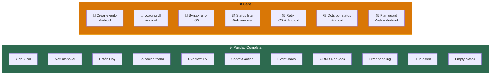

---
tags:
  - prd
  - calendario
  - paridad
  - audit
aliases:
  - Calendar Parity Audit
  - Audit Calendario
date: 2026-04-27
updated: 2026-04-27
status: active
---

# 🔍 Paridad Cross-Platform — Auditoría Calendario

> [!abstract] Resumen
> Auditoría exhaustiva de features del módulo Calendario en las 3 plataformas frontend (Web, iOS, Android). Identifica gaps de paridad, bugs y features faltantes con severidad priorizada.

> [!info] Fuentes auditadas
> - **Web**: `web/src/pages/Calendar/CalendarView.tsx` (750 líneas) + `UnavailableDatesModal.tsx` (283 líneas)
> - **iOS**: `ios/Packages/SolennixFeatures/Sources/SolennixFeatures/Calendar/` (5 archivos)
> - **Android**: `android/feature/calendar/.../CalendarScreen.kt` (1232 líneas) + `CalendarViewModel.kt` (274 líneas)

---

## ✅ Features con Paridad Completa

> [!success] Presente en las 3 plataformas con comportamiento equivalente

| # | Feature | Web | iOS | Android | Notas |
|:-:|---------|:---:|:---:|:-------:|-------|
| 1 | Grid de calendario (7 columnas) | ✅ | ✅ | ✅ | Web: react-day-picker · iOS: LazyVGrid · Android: LazyVerticalGrid |
| 2 | Navegación mensual (prev/next) | ✅ | ✅ | ✅ | Chevron buttons con animación |
| 3 | Botón "Hoy" (ir a hoy) | ✅ | ✅ | ✅ | Web: botón gradient · iOS: toolbar · Android: OutlinedButton |
| 4 | Selección de fecha (single) | ✅ | ✅ | ✅ | Día seleccionado con círculo filled primary |
| 5 | Overflow "+N" badge | ✅ | ✅ | ✅ | Fórmula corregida: `totalEvents - min(uniqueStatuses, 3)` |
| 6 | Context action bloquear/desbloquear | ✅ | ✅ | ✅ | Web: right-click · iOS/Android: long-press con haptic |
| 7 | Cards de evento al seleccionar fecha | ✅ | ✅ | ✅ | Nombre, servicio, hora, pax, monto, status badge |
| 8 | Gestionar bloqueos (modal/sheet) | ✅ | ✅ | ✅ | CRUD completo: listar, agregar rango, eliminar |
| 9 | Bloquear fecha individual | ✅ | ✅ | ✅ | Con razón opcional |
| 10 | Bloquear rango de fechas | ✅ | ✅ | ✅ | Start/end date + validación end >= start |
| 11 | Desbloquear fecha (con confirmación) | ✅ | ✅ | ✅ | Modal/dialog de confirmación |
| 12 | Fechas bloqueadas visual en grid | ✅ | ✅ | ✅ | Strikethrough + color de error |
| 13 | Manejo de errores tipado | ✅ | ✅ | ✅ | 3 casos: loadFailed, blockFailed, unblockFailed |
| 14 | Empty states | ✅ | ✅ | ✅ | Sin eventos / sin bloqueos |
| 15 | i18n (es/en) | ✅ | ✅ | ✅ | Catálogos completos en ambas lenguas |

---

## ❌ Gaps de Paridad

### 🔴 Alta Prioridad

| # | Gap | Web | iOS | Android | Acción requerida |
|:-:|-----|:---:|:---:|:-------:|------------------|
| G1 | **Crear evento desde calendario** | ✅ Link | ✅ Menu | ❌ **NO EXISTE** | Agregar FAB o callback `onCreateEvent` en Android |
| G2 | **Loading state UI** | ✅ Overlay spinner | ✅ ProgressView | ⚠️ **State sin UI** | Consumir `isLoading` con `CircularProgressIndicator` |
| G3 | **Syntax error en CalendarViewModel** | — | 🐛 Líneas 232-235 | — | Eliminar código huérfano (bloque duplicado con `return dots`) |

### 🟡 Media Prioridad

| # | Gap | Web | iOS | Android | Acción requerida |
|:-:|-----|:---:|:---:|:-------:|------------------|
| G4 | **Status filter** | ❌ **REMOVED** (FASE 7C) | ✅ Menu | ✅ Chips | Decidir: restaurar en Web o eliminar en iOS/Android |
| G5 | **Botón Retry en error** | ✅ Retry button | ❌ OK only | ❌ String sin UI | Agregar acción de retry en iOS y Android |
| G6 | **Status dots por status vs por evento** | ✅ Por status | ✅ Por status | ⚠️ **Por evento** | Android debe deduplicar por status (igual que overflow) |
| G7 | **Plan limits guard** en crear evento | ❌ Sin check | ✅ `.disabled` | ❌ Sin check | Validar límite de plan antes de crear evento |

### 🟢 Baja Prioridad

| # | Gap | Web | iOS | Android | Acción requerida |
|:-:|-----|:---:|:---:|:-------:|------------------|
| G8 | **Quick Quote** desde calendario | ❌ | ✅ Sheet | ❌ | Feature exclusiva iOS — evaluar paridad |
| G9 | **Event count badge** (fecha seleccionada) | ✅ | ❌ | ❌ | Badge numérico junto al heading de fecha |
| G10 | **Accesibilidad day cells** | ✅ aria-labels | ✅ Labels | ⚠️ **Parcial** | Agregar `contentDescription` a day cells en Android |
| G11 | **Pull-to-refresh** | N/A (React Query) | ✅ `.refreshable` | ❌ Lifecycle only | Agregar `pullRefresh` modifier en Android |

---

## 📊 Matriz Visual de Paridad



---

## 🏗️ Arquitectura por Plataforma

### Web — Stack

| Aspecto | Implementación |
|---------|---------------|
| Grid | `react-day-picker` con `mode="single"` |
| Estado | React Query + `useState` |
| CSS | Custom styles inyectados + Tailwind |
| Context action | `onContextMenu` (right-click) |
| Bloqueos | Modal propio (`UnavailableDatesModal`) |
| Cache | React Query per-month (keys derivadas de fechas) |
| i18n | `react-i18next` con namespace `"calendar"` |

### iOS — Stack

| Aspecto | Implementación |
|---------|---------------|
| Grid | `LazyVGrid` con 7 `GridItem(.flexible())` |
| Estado | `@Observable` CalendarViewModel |
| Layout adaptivo | `GeometryReader` → split iPad / stack iPhone |
| Context action | `LongPressGesture` (0.5s) + haptic feedback |
| Bloqueos | Sheets nativas (`BlockDateSheet`, `BlockedDatesSheet`) |
| Navegación | `NavigationLink(value: Route.eventDetail)` |
| Crear evento | Menu con 2 opciones: Evento + Quick Quote |

### Android — Stack

| Aspecto | Implementación |
|---------|---------------|
| Grid | `LazyVerticalGrid` con `GridCells.Fixed(7)` |
| Estado | `StateFlow<CalendarUiState>` + combine |
| Layout adaptivo | `LocalIsWideScreen` → Row vs Column |
| Context action | `combinedClickable` + `HapticFeedback` |
| Bloqueos | `ModalBottomSheet` + `AlertDialog`s |
| Navegación | `onEventClick: (String) -> Unit` callback |
| Refresh | `LifecycleResumeEffect` (no pull-to-refresh) |

---

## 🎨 Sistema de Colores por Status

> [!info] Colores consistentes en las 3 plataformas

| Status | Web (light/dark) | iOS | Android |
|--------|------------------|-----|---------|
| **Cotizado** (quoted) | `#d97706` / `#fbbf24` | `statusQuoted` | `statusQuoted` |
| **Confirmado** (confirmed) | `#007aff` / `#2490FF` | `statusConfirmed` | `statusConfirmed` |
| **Completado** (completed) | `#2D6A4F` / `#52B788` | `statusCompleted` | `statusCompleted` |
| **Cancelado** (cancelled) | `#ff3b30` / `#ff453a` | `statusCancelled` | `statusCancelled` |

---

## 📋 Plan de Acción Recomendado

> [!tip] Orden sugerido para cerrar gaps

```mermaid
gantt
    title Plan de cierre de gaps
    dateFormat  YYYY-MM-DD
    axisFormat  %b %d

    section Críticos
    G3 iOS syntax error           :done, g3, 1h
    G1 Android crear evento       :g1, after g3, 2h
    G2 Android loading UI         :g2, after g1, 1h

    section Media
    G4 Decisión status filter     :g4, after g2, 1h
    G5 Retry iOS + Android        :g5, after g4, 1h
    G6 Dots por status Android    :g6, after g5, 1h
    G7 Plan limits guard          :g7, after g6, 1h

    section Baja
    G8-G11 Polish                 :g8, after g7, 2h
```

---

## 🔗 Relaciones

- [[02_FEATURES|Catálogo de Features]] — Estado general de features
- [[11_CURRENT_STATUS|Estado Actual]] — Implementación por plataforma
- [[../Web/Módulo Calendario|Web: Módulo Calendario]] — Detalle implementación Web
- [[../iOS/Módulo Calendario|iOS: Módulo Calendario]] — Detalle implementación iOS
- [[../Android/Módulo Calendario|Android: Módulo Calendario]] — Detalle implementación Android
- [[19_I18N_STRATEGY|i18n Strategy]] — Estrategia de localización

---

#prd #calendario #paridad #audit #cross-platform
