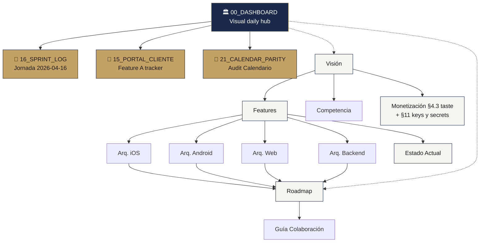

# PRD — Map of Content

> [!info] Solennix
> **Producto**: Plataforma de gestión de eventos para organizadores LATAM
> **Plataformas**: iOS · Android · Web · Backend (Go)
> **Estado**: En producción (4 plataformas live) · Audit 2026-04-16 cerrado (30/38) · **Portal Cliente MVP shipped**
> **Última actualización**: 2026-04-16 — jornada de 28 commits, 7 sprints cerrados, nuevo feature shipped

> [!success] 🎯 Dashboard Visual Diario
> Abrí [[../00_DASHBOARD|🏛️ Dashboard Ejecutivo]] para ver el estado del producto en 30 segundos con Mermaid + progress bars + matrices visuales. **Es el nuevo punto de entrada recomendado.**

---

## 🆕 Jornada 2026-04-16

- 🏛️ [[../00_DASHBOARD|Dashboard Ejecutivo]] — visión global con progreso visual + gantt + pies
- 📅 [[16_SPRINT_LOG_2026_04_16|Sprint Log de la jornada]] — los 7 sprints + 28 commits detallados
- 🎁 [[15_PORTAL_CLIENTE_TRACKER|Portal Cliente Tracker]] — feature A estado end-to-end con mermaid de arquitectura
- 🤝 [[17_PERSONAL_TRACKER|Personal / Colaboradores Tracker]] — feature nueva Phase 1 cerrada · scaffolding Phase 2/3 listo

---

## Visión y Estrategia

- [[01_PRODUCT_VISION|Visión del Producto]] — Problema, visión, objetivos, usuarios, historias de usuario
- [[03_COMPETITIVE_ANALYSIS|Análisis Competitivo]] — Posicionamiento vs HoneyBook, Excel, WhatsApp y LATAM
- [[04_MONETIZATION|Monetización]] — Tiers (**Gratis con taste** / Pro / Business), precios, Stripe, RevenueCat, **§4.3 qué ve cada tier**, **§11 keys y secrets — no confundir**

## Features y Estado

- [[02_FEATURES|Catálogo de Features]] — Paridad cross-platform por feature, **§13.bis Portal Cliente**
- [[11_CURRENT_STATUS|Estado Actual]] — Implementación por plataforma, brechas, migraciones, commits del día

## Arquitectura Técnica

- [[05_TECHNICAL_ARCHITECTURE_IOS|Arquitectura iOS]] — SwiftUI + MVVM + @Observable + SPM
- [[06_TECHNICAL_ARCHITECTURE_ANDROID|Arquitectura Android]] — Kotlin + Compose + Hilt + Multi-module
- [[07_TECHNICAL_ARCHITECTURE_BACKEND|Arquitectura Backend]] — Go + Chi + PostgreSQL + pgx
- [[08_TECHNICAL_ARCHITECTURE_WEB|Arquitectura Web]] — React 19 + TypeScript + Vite + Tailwind
- [[Web MOC]] — Documentación detallada de la app web (módulos, design system, hooks)

## Planificación

- [[09_ROADMAP|Roadmap Maestro]] — Timeline, matriz feature-per-platform, bloqueantes externos, Q2-Q4 2026 + Q1 2027
- [[13_POST_MVP_ROADMAP|Roadmap Post-MVP (Etapa 2)]] — Notificaciones, reportes, portal del cliente, diferenciadores
- [[14_CLIENT_EXPERIENCE_IDEAS|Ideas Experiencia Cliente (Exploración)]] — Clusters A–G: bidireccionalidad, transparencia, momentos en vivo, co-planificación, pagos, telemetría inversa, multi-destinatario
- [[10_COLLABORATION_GUIDE|Guía de Colaboración]] — Workflow con Claude Code, prompts, reglas
- [[21_CALENDAR_PARITY_AUDIT|🔍 Calendario Audit de Paridad]] — Auditoría cross-platform con gaps priorizados (2026-04-27)
- [[22_DASHBOARD_REFACTOR_PLAN|🏗️ Dashboard Refactor Plan]] — Plan aprobado de unificación cross-platform

## Super Plan Cross-Platform

- [[SUPER PLAN MOC]] — Indice principal del programa de transformación
- [[01_VISUAL_EXECUTIVE_SUMMARY]] — Objetivos y resultados esperados
- [[02_PLATFORM_EXPERIENCE_PRINCIPLES]] — UX nativa por plataforma/dispositivo
- [[03_CROSS_PLATFORM_PARITY_MODEL]] — Reglas de paridad y SLA de desvíos
- [[04_BACKEND_AS_PRODUCT_CONTRACT]] — Contratos backend-frontends
- [[05_RELEASE_GOVERNANCE_AND_QUALITY_GATES]] — Gates obligatorios de calidad
- [[06_DEVICE_MATRIX_AND_UX_VALIDATION]] — Matriz de validación smartphone/tablet/desktop
- [[07_WAVE_PLAN_12_WEEKS]] — Roadmap por ondas de ejecución
- [[08_RISK_REGISTER_AND_CONTINGENCIES]] — Registro de riesgos y contingencias
- [[09_TEAM_OPERATING_SYSTEM]] — Sistema operativo de ejecución
- [[10_BACKLOG_STRUCTURE_AND_ACCEPTANCE]] — Estructura de backlog y DoD
- [[11_CROSS_PLATFORM_KPI_SCORECARD]] — Scorecard de salud del programa
- [[12_EXECUTION_CHECKLISTS]] — Checklists de PR, ola y release
- [[13_MASTER_TRACEABILITY_TABLE]] — Trazabilidad ejecutiva objetivo→ola→evidencia→KPI

---

## Principios Clave

> [!abstract] Paridad Cross-Platform
> Cada feature core y cada bug fix DEBE existir en todas las plataformas. Ver [[01_PRODUCT_VISION#Principio de Paridad Cross-Platform|regla de paridad]] y [[02_FEATURES|tabla de features]].

> [!abstract] Flujo de Eventos
> El flujo core del negocio: **Cotizar → Confirmar → Cobrar anticipo → Ejecutar → Cobrar saldo → Cerrar**. Todo gira alrededor de este ciclo de vida.

> [!abstract] LATAM First
> Español nativo, precios en MXN, IVA configurable. No es una traducción — es el idioma de diseño.

---

## Navegación Rápida

---

> [!tip] Navegación
> Cada documento enlaza con `[[wikilinks]]` a sus dependencias. Usá el **Graph View** de Obsidian para ver las relaciones entre documentos del PRD. El `00_DASHBOARD` tiene Mermaid gantt + pies + flowcharts y es el punto de entrada diario recomendado.

#prd #moc #solennix
