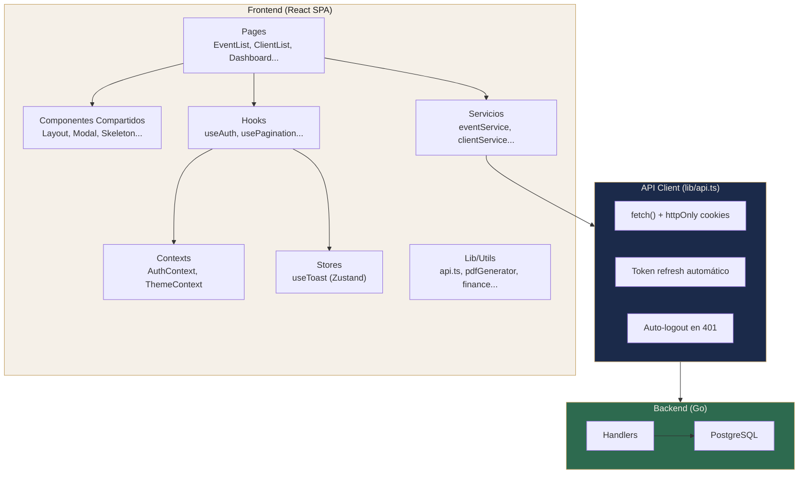
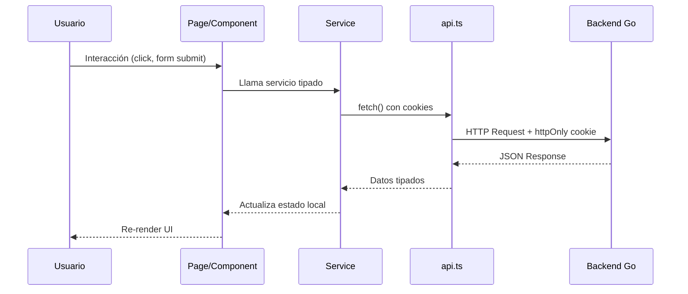

# Arquitectura General

#web #arquitectura

> [!abstract] Resumen
> SPA (Single Page Application) con React 19, comunicándose con un backend Go vía REST API. Autenticación por cookies httpOnly. Sin SSR.

---

## Stack Tecnológico

| Capa | Tecnología | Versión |
|------|-----------|---------|
| UI Framework | React | 19.2 |
| Lenguaje | TypeScript | 5.9 |
| Estilos | Tailwind CSS | 4.2 |
| Build Tool | Vite | 7.3 |
| Routing | React Router | 7.13 |
| Forms | React Hook Form + Zod | 7.71 / 4.3 |
| Server State | TanStack React Query | 5.96 |
| Estado Global | React Context | — |
| Gráficos | Recharts | 3.7 |
| PDFs | jsPDF + autoTable | 4.2 |
| Iconos | Lucide React | 0.575 |
| Drag & Drop | @dnd-kit | 6.3 / 10.0 |
| PWA | vite-plugin-pwa + Workbox | 1.2 |
| Testing | Vitest + Playwright + MSW | — |

## Diagrama de Capas



## Flujo de Datos



## Estructura de Directorios

```
web/src/
├── components/        # Componentes compartidos/reutilizables
├── contexts/          # React Contexts (Auth, Theme)
├── hooks/             # Custom hooks
├── lib/               # Utilidades (API client, PDFs, finanzas)
├── pages/             # Páginas organizadas por dominio
│   ├── Admin/
│   ├── Calendar/
│   ├── Clients/
│   ├── Events/
│   │   └── components/   # Sub-componentes del formulario
│   ├── Inventory/
│   └── Products/
├── services/          # Capa de servicios (API wrappers)
├── types/             # Definiciones de tipos TypeScript
├── index.css          # Design tokens + Tailwind config
├── App.tsx            # Router y providers raíz
└── main.tsx           # Entry point
```

## Principios Arquitectónicos

1. **Service Layer Pattern** — Cada dominio tiene su servicio que encapsula las llamadas API
2. **Type-First** — Tipos definidos en `entities.ts`, todas las capas son type-safe
3. **Composición** — Pages compuestas de componentes más pequeños (EventForm → 6 sub-componentes)
4. **Hooks como lógica reutilizable** — `usePagination`, `usePlanLimits`, etc.
5. **Error handling centralizado** — `logError()` en toda la app, toasts para feedback al usuario
6. **PDF-First exports** — Presupuesto, contrato, checklist exportables como PDF con branding

## Relaciones

- [[Design System]] — Sistema visual completo
- [[Capa de Servicios]] — Detalle de cada servicio
- [[Routing y Guards]] — Estructura de navegación
- [[Manejo de Estado]] — Estrategia de estado
