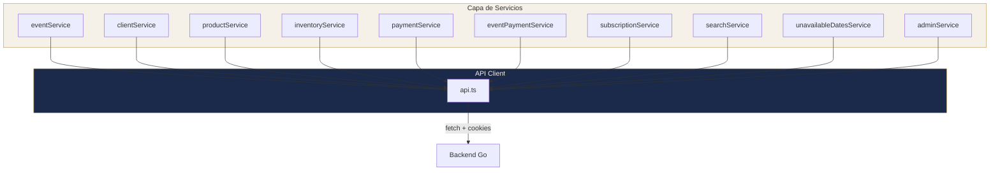

# Capa de Servicios

#web #servicios #api #infraestructura

> [!abstract] Resumen
> Cada dominio tiene un servicio que encapsula llamadas REST tipadas. Todos usan `api.ts` como client base con cookies httpOnly, token refresh automático, y auto-logout.

---

## API Client Base

```
lib/api.ts
```

### Características

| Feature | Detalle |
|---------|---------|
| **HTTP Client** | `fetch()` nativo (no Axios) |
| **Auth** | `credentials: 'include'` — cookies httpOnly automáticas |
| **Token Refresh** | Retry automático en 401 con `POST /auth/refresh` |
| **Auto-Logout** | Emite evento `auth:logout` si el refresh falla |
| **Deduplicación** | Un solo refresh concurrent a la vez |
| **File Upload** | Soporte FormData para fotos/imágenes |
| **Assets** | `getAssetUrl(path)` resuelve URLs de assets del backend |

### Métodos

```typescript
api.get<T>(url): Promise<T>
api.post<T>(url, body): Promise<T>
api.put<T>(url, body): Promise<T>
api.delete<T>(url): Promise<T>
api.upload<T>(url, formData): Promise<T>
```

## Servicios por Dominio



## Inventario de Servicios

| Servicio | Archivo | Dominio | Endpoints principales |
|----------|---------|---------|----------------------|
| `eventService` | `eventService.ts` | Eventos | CRUD + upcoming, by date range, by client |
| `clientService` | `clientService.ts` | Clientes | CRUD + uploadPhoto |
| `productService` | `productService.ts` | Productos | CRUD + uploadImage, ingredientes |
| `inventoryService` | `inventoryService.ts` | Inventario | CRUD stock management |
| `paymentService` | `paymentService.ts` | Pagos | CRUD + by event, by date range |
| `eventPaymentService` | `eventPaymentService.ts` | Pagos Stripe | createCheckout, getSession |
| `subscriptionService` | `subscriptionService.ts` | Suscripciones | status, checkout, portal |
| `searchService` | `searchService.ts` | Búsqueda | searchAll (cross-domain) |
| `unavailableDatesService` | `unavailableDatesService.ts` | Calendario | getDates, add, remove |
| `adminService` | `adminService.ts` | Admin | stats, users |

## Patrón Típico de un Servicio

```typescript
// services/clientService.ts
export const clientService = {
  getAll: () => api.get<Client[]>('/clients'),
  getById: (id: string) => api.get<Client>(`/clients/${id}`),
  create: (data: ClientInsert) => api.post<Client>('/clients', data),
  update: (id: string, data: ClientUpdate) => api.put<Client>(`/clients/${id}`, data),
  delete: (id: string) => api.delete(`/clients/${id}`),
  uploadPhoto: (file: File) => {
    const formData = new FormData();
    formData.append('file', file);
    return api.upload<{ url: string }>('/clients/upload', formData);
  },
};
```

## Relaciones

- [[Arquitectura General]] — Posición en las capas
- [[Autenticación]] — api.ts maneja auth
- [[Sistema de Tipos]] — Tipos de entidades que retornan los servicios
