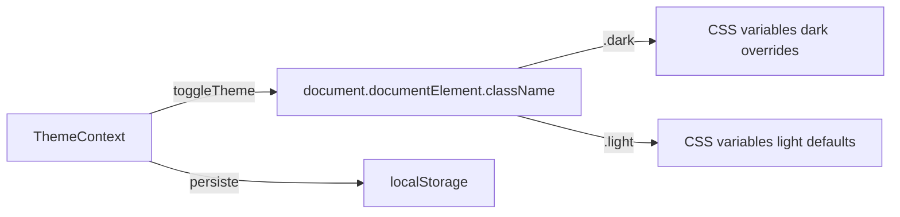

# Design System

#web #design #tokens

> [!abstract] Resumen
> Tailwind CSS 4 con custom properties (CSS variables) que definen toda la paleta visual. Soporte completo de dark mode con switch manual. Tipografía fija (rem-based), no fluid.

---

## Filosofía de Diseño

| Principio | Descripción |
|-----------|-------------|
| **Warmth through precision** | Cada pixel es intencional. El dorado aparece con propósito, no decoración |
| **Professional without sterile** | Inspira confianza, no parece un CRM de 2015 |
| **Information-first hierarchy** | Los datos más importantes son inmediatamente obvios |
| **Light and dark equally first-class** | Ambos modos igual de pulidos |
| **Typography carries the brand** | Escala clara, contraste de peso decisivo |

## Paleta de Colores

### Brand

| Token | Light | Dark | Uso |
|-------|-------|------|-----|
| `--color-primary` | `#C4A265` | `#C4A265` | Dorado/champagne — CTAs, acentos |
| `--color-primary-dark` | `#B8965A` | `#B8965A` | Hover sobre primary |
| `--color-primary-light` | `#F5F0E8` | `#F5F0E8` | Fondos sutiles primary |
| `--color-accent` | `#1B2A4A` | `#1B2A4A` | Navy oscuro — ancla jerarquía |

### Superficies

| Token | Light | Dark | Uso |
|-------|-------|------|-----|
| `--color-bg` | `#F5F4F1` | `#000000` | Fondo base |
| `--color-surface` | `#FAF9F7` | `#111722` | Superficies principales |
| `--color-surface-alt` | `#F0EFEC` | `#1A2030` | Headers de tabla, alternos |
| `--color-card` | `#ffffff` | `#111722` | Cards y contenedores |
| `--color-border` | `#E5E2DD` | `#2A2F3A` | Bordes |

### Texto

| Token | Light | Dark | Uso |
|-------|-------|------|-----|
| `--color-text` | `#1A1A1A` | `#F5F0E8` | Texto primario |
| `--color-text-secondary` | `#7A7670` | `#9A9590` | Texto secundario |
| `--color-text-tertiary` | `#A8A29E` | `#6B6560` | Texto terciario/placeholder |

### Semánticos

| Token | Valor | Uso |
|-------|-------|-----|
| `--color-success` | `#34c759` | Éxito, confirmado |
| `--color-warning` | `#ff9500` | Advertencia |
| `--color-error` | `#ff3b30` | Error, destructivo |
| `--color-info` | `#007aff` | Informativo |

### Status de Eventos

| Token | Valor | Estado |
|-------|-------|--------|
| `--color-status-quoted` | `#d97706` | Cotizado (amber) |
| `--color-status-confirmed` | `#007aff` | Confirmado (blue) |
| `--color-status-completed` | `#2D6A4F` | Completado (green) |
| `--color-status-cancelled` | `#ff3b30` | Cancelado (red) |

## Escala Tipográfica

> [!important] Regla
> **NUNCA** usar `text-[Npx]` custom. Solo clases estándar de Tailwind.

| Clase | Tamaño | Uso |
|-------|--------|-----|
| `text-xs` | 12px | Metadata, badges, captions |
| `text-sm` | 14px | Cuerpo de tabla, descripciones secundarias |
| `text-base` | 16px | Texto principal, descripciones de cards |
| `text-lg` | 18px | Headings de sección (H2) |
| `text-xl` | 20px | Sub-headings, títulos de diálogos |
| `text-2xl` | 24px | Títulos de página (H1) — siempre con `tracking-tight` |
| `text-3xl+` | 30px+ | Solo marketing/hero (Landing) |

### Pesos

| Peso | Uso |
|------|-----|
| `font-medium` | Labels |
| `font-semibold` | Headers de tabla, H3 |
| `font-bold` | H1, H2, CTAs |
| `font-black` | Solo hero/landing marketing |

## Espaciado y Bordes

| Token | Valor | Uso |
|-------|-------|-----|
| `--radius-sm` | 6px | Badges, pills pequeños |
| `--radius-md` | 10px | Inputs, botones |
| `--radius-lg` | 14px | Cards pequeñas |
| `--radius-xl` | 20px | Cards principales, modales |

> [!tip] Patrón de Cards
> ```
> bg-card shadow-sm border border-border rounded-2xl
> ```

## Dark Mode



- Toggle manual via `useTheme()` hook
- Clase `.dark` en `<html>` activa las variables dark
- **Light** = Crema cálido (`#F5F4F1`, `#FAF9F7`)
- **Dark** = Navy profundo (`#0A0F1A`, `#111722`)

## Anti-Patrones (NO hacer)

> [!danger] Prohibido
> - Gradientes cyan/purple (estética "AI slop")
> - Glassmorphism decorativo
> - Cards genéricas repetidas (icon + heading + text)
> - Grises puros (`gray-200`, `gray-700`) — usar tokens del design system
> - `font-black` fuera de landing/hero
> - `text-[Npx]` custom — solo escala estándar

## Clases Utilitarias Custom

| Clase | Efecto |
|-------|--------|
| `premium-gradient` | Gradiente dorado para CTAs premium |
| `cn()` | `clsx()` + `tailwind-merge` — merge de clases seguro |

## Relaciones

- [[Arquitectura General]] — Contexto técnico completo
- [[Componentes Compartidos]] — Componentes que implementan el design system
