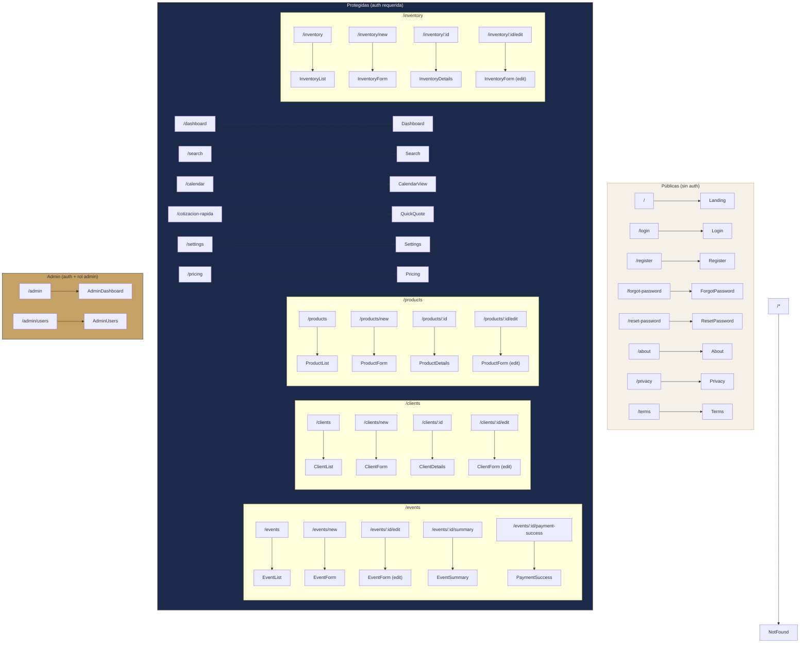

# Routing y Guards

#web #routing #navegación

> [!abstract] Resumen
> React Router 7 con rutas agrupadas por acceso: públicas, protegidas (auth requerida), y admin. Guards implementados como componentes wrapper.

---

## Mapa de Rutas



## Guards

### ProtectedRoute

```
components/ProtectedRoute.tsx
```

- Verifica `user !== null && !loading`
- Si no hay user → redirect a `/login`
- Mientras `loading` → muestra spinner
- Wrappea el `<Layout>` completo (sidebar, topbar, toasts)

### AdminRoute

```
components/AdminRoute.tsx
```

- Requiere auth primero (ProtectedRoute parent)
- Verifica `user.role === 'admin'`
- Si no es admin → redirect a `/dashboard`

## Estructura del Router (App.tsx)

```
<ThemeProvider>
  <AuthProvider>
    <Routes>
      {/* Públicas */}
      <Route path="/" element={<Landing />} />
      <Route path="/login" element={<Login />} />
      ...

      {/* Protegidas */}
      <Route element={<ProtectedRoute />}>
        <Route element={<Layout />}>
          <Route path="/dashboard" element={<Dashboard />} />
          <Route path="/events" element={<EventList />} />
          ...

          {/* Admin */}
          <Route element={<AdminRoute />}>
            <Route path="/admin" element={<AdminDashboard />} />
            <Route path="/admin/users" element={<AdminUsers />} />
          </Route>
        </Route>
      </Route>

      <Route path="*" element={<NotFound />} />
    </Routes>
  </AuthProvider>
</ThemeProvider>
```

## Navegación en la UI

| Elemento | Ubicación | Tipo |
|----------|-----------|------|
| **Sidebar** | Desktop (left) | Links permanentes: Dashboard, Eventos, Clientes, Productos, Inventario, Calendario |
| **Bottom Tab Bar** | Mobile (bottom) | Mismos links principales |
| **Breadcrumb** | Top de cada page | Navegación contextual |
| **Command Palette** | `Cmd+K` / `Ctrl+K` | Búsqueda global + acciones rápidas |
| **Quick Actions FAB** | Bottom-right (mobile) | Nuevo evento/cliente/producto/inventario |

## Relaciones

- [[Autenticación]] — Guards y flujo de auth
- [[Arquitectura General]] — Estructura completa
- [[Componentes Compartidos]] — Layout, Sidebar, BottomTabBar
