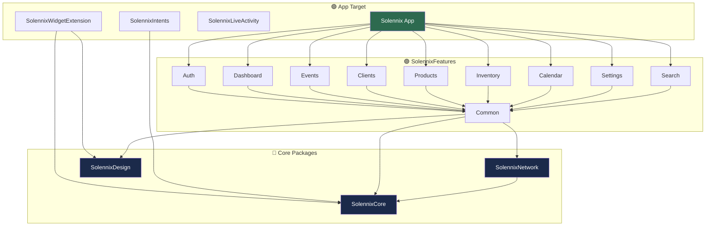
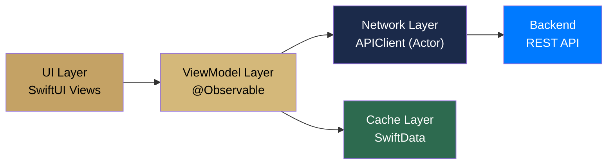
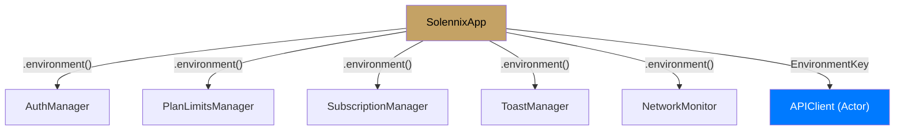

#ios #arquitectura #infraestructura

# Arquitectura General

> [!abstract] Resumen
> Solennix iOS usa **MVVM con @Observable** (Observation framework, iOS 17+), modularizado en 4 paquetes SPM: Core (modelos), Network (HTTP/auth), Design (UI), Features (pantallas). SwiftData para caché offline.

---

## Stack Tecnológico

| Capa | Tecnología | Versión |
|------|-----------|---------|
| UI | SwiftUI | iOS 17+ |
| Estado | @Observable + @State + @Binding | Observation framework |
| Navegación | NavigationStack + TabView | iOS 17+ |
| HTTP | URLSession (actor-based APIClient) | Nativo |
| Serialización | Codable (snake_case ↔ camelCase) | Nativo |
| Caché | SwiftData | iOS 17+ |
| Auth tokens | Keychain Services | Nativo |
| Biometría | LocalAuthentication | Nativo |
| Social login | GoogleSignIn-iOS + Sign in with Apple | v8.0+ |
| Suscripciones | RevenueCat | v5.0+ |
| Búsqueda | CoreSpotlight | Nativo |
| Widgets | WidgetKit + Glance | iOS 17+ |
| Live Activities | ActivityKit | iOS 16.1+ |
| Shortcuts | AppIntents | iOS 17+ |
| Haptics | CoreHaptics | Nativo |
| Build | XcodeGen (project.yml) | — |

---

## Estructura de Paquetes SPM

---

## Capas de la Arquitectura

| Capa | Responsabilidad | Ubicación |
|------|----------------|-----------|
| **UI** | Views, pantallas, navegación | `SolennixFeatures/*/Views/` |
| **ViewModel** | Lógica de presentación, @Observable | `SolennixFeatures/*/ViewModels/` |
| **Network** | HTTP, auth, tokens | `SolennixNetwork/` |
| **Core** | Modelos, rutas, utilidades | `SolennixCore/` |
| **Design** | Tema, colores, componentes UI | `SolennixDesign/` |
| **Cache** | SwiftData containers y modelos cacheados | `SolennixCore/Cache/` |

---

## Inyección de Dependencias

SwiftUI Environment como sistema de DI:

> [!important] APIClient es un Actor
> `APIClient` no puede conformar a `@Observable` porque es un `actor`. Se inyecta via `EnvironmentKey` custom en lugar de `.environment()` directo.

---

## Targets del Proyecto

| Target | Tipo | Descripción |
|--------|------|-------------|
| `Solennix` | Application | App principal iOS |
| `SolennixWidgetExtension` | App Extension | Widgets de home screen y lock screen |
| `SolennixLiveActivity` | Embedded | Dynamic Island y Live Activities |
| `SolennixIntents` | App Extension | Atajos de Siri |

---

## Configuración del Proyecto

| Aspecto | Valor |
|---------|-------|
| Bundle ID | `com.solennix.app` |
| Deployment target | iOS 17.0 / macOS 14.0 |
| Swift version | 5.9 |
| Build system | XcodeGen (`project.yml`) |
| Code signing | Team T5SKULSP2M |
| App Group | `group.com.solennix.app` |

---

## Convenciones de Naming

| Elemento | Convención | Ejemplo |
|----------|-----------|---------|
| Vistas | `*View.swift` | `EventFormView.swift` |
| ViewModels | `*ViewModel.swift` | `EventFormViewModel.swift` |
| Modelos | PascalCase | `Event.swift` |
| Paquetes | `Solennix*` | `SolennixCore` |
| Servicios | `*Service.swift` | `GoogleSignInService.swift` |
| Helpers | `*Helper.swift` | `KeychainHelper.swift` |
| Generadores PDF | `*PDFGenerator.swift` | `BudgetPDFGenerator.swift` |

---

## Relaciones

- [[Sistema de Tipos]] — modelos en SolennixCore
- [[Capa de Red]] — APIClient actor y endpoints
- [[Caché y Offline]] — SwiftData y modelos cacheados
- [[Manejo de Estado]] — @Observable ViewModels
- [[Navegación]] — Route enum y layouts adaptativos
- [[Design System]] — SolennixDesign package
