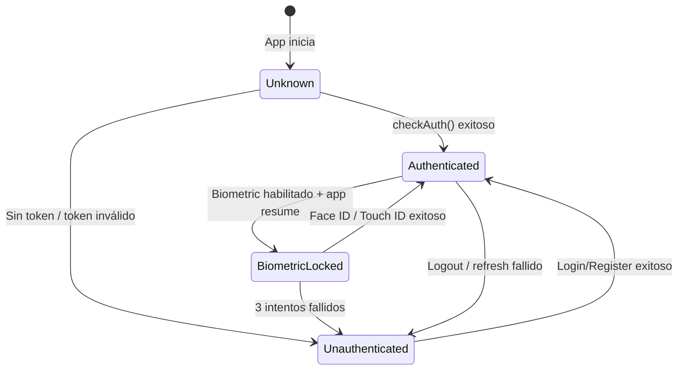
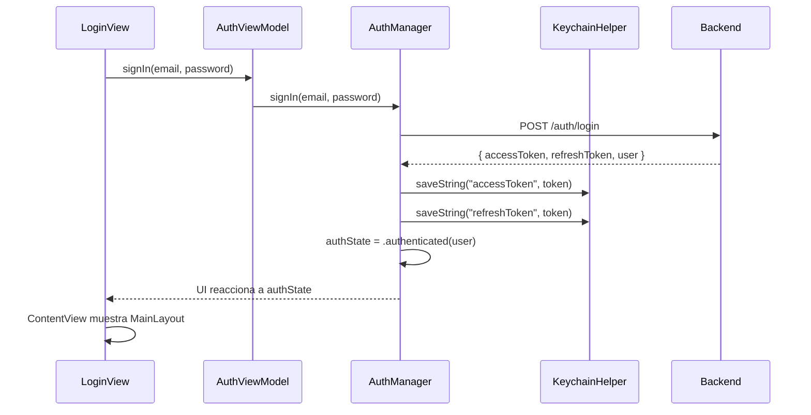
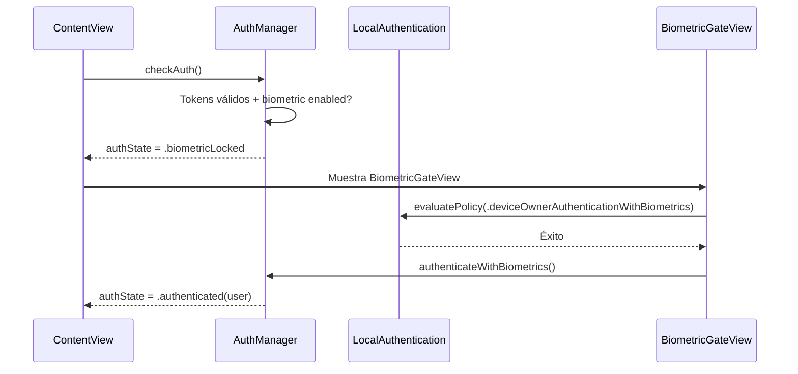

#ios #auth #seguridad

# Autenticación

> [!abstract] Resumen
> JWT Bearer tokens almacenados en **Keychain** (`kSecAttrAccessibleWhenUnlockedThisDeviceOnly`). Soporta email/password, Google Sign-In, Sign in with Apple, y bloqueo biométrico (Face ID/Touch ID). Refresh automático en 401.

---

## Estados de Autenticación



---

## Flujo de Login

### Email/Password



### Google Sign-In ✅

```swift
// LoginView.swift
Task { await viewModel?.triggerGoogleSignIn() }

// AuthViewModel.swift
func triggerGoogleSignIn() async {
    let idToken = try? await GoogleSignInService.signIn()
    await signInWithGoogle(idToken: idToken)
}
```

| Paso | Acción |
|------|--------|
| 1 | `GoogleSignInService.signIn()` → presenta Google Sign-In UI |
| 2 | Obtiene `GIDSignInResult` con `idToken` |
| 3 | Envía token a `POST /auth/google { id_token }` |
| 4 | Backend valida con Google y retorna JWT |
| 5 | `AuthManager.signInWithGoogle()` guarda tokens en Keychain |
| 6 | `authState = .authenticated(user)` |

**Status:** ✅ Completado y testeado en simulator + device

### Sign in with Apple ✅

```swift
// LoginView.swift
Task { await viewModel?.signInWithApple() }

// AuthViewModel.swift
func signInWithApple() async {
    let credential = try? await AppleSignInService.signIn()
    // ASAuthorizationAppleIDCredential con identityToken
    await signInWithApple(credential: credential)
}
```

| Paso | Acción |
|------|--------|
| 1 | `ASAuthorizationController` → presenta Sign in with Apple UI |
| 2 | Obtiene `ASAuthorizationAppleIDCredential` |
| 3 | Envía `identity_token + full_name` a `POST /auth/apple` |
| 4 | Backend valida y retorna JWT |
| 5 | `AuthManager.signInWithApple()` guarda tokens en Keychain |
| 6 | `authState = .authenticated(user)` |

**Status:** ✅ Completado. App Store compliant (EULA/Privacy visible, free trial disclosure).

---

## Seguridad de Tokens

| Aspecto | Implementación |
|---------|---------------|
| Almacenamiento | Keychain con `kSecAttrAccessibleWhenUnlockedThisDeviceOnly` |
| Keys | `com.solennix.app.accessToken`, `.refreshToken` |
| No migra | Tokens NO se incluyen en backups/migrations |
| Inyección | APIClient lee directamente de KeychainHelper |
| Refresh | En 401, APIClient pide refresh a AuthManager |
| Concurrencia | Task guard previene múltiples refresh simultáneos |
| Limpieza | `logout()` borra tokens del Keychain |

---

## Bloqueo Biométrico



| Configuración | Valor |
|---------------|-------|
| Policy | `.deviceOwnerAuthenticationWithBiometrics` |
| Intentos | 3 antes de fallback a unauthenticated |
| Habilitación | Toggle en Settings |
| Keychain key | `com.solennix.app.biometricUnlockEnabled` |

---

## Validación de Password

| Regla | Requisito |
|-------|-----------|
| Longitud mínima | 8 caracteres |
| Mayúscula | Al menos 1 |
| Minúscula | Al menos 1 |
| Número | Al menos 1 |

---

## Archivos Clave

| Archivo | Responsabilidad |
|---------|----------------|
| `SolennixNetwork/AuthManager.swift` | Estado auth, tokens, biometric |
| `SolennixNetwork/KeychainHelper.swift` | Storage seguro en Keychain |
| `SolennixNetwork/GoogleSignInService.swift` | OAuth Google |
| `SolennixNetwork/AppleSignInService.swift` | Sign in with Apple |
| `SolennixFeatures/Auth/ViewModels/AuthViewModel.swift` | Lógica de auth UI |
| `SolennixFeatures/Auth/Views/LoginView.swift` | Pantalla de login |
| `SolennixFeatures/Auth/Views/BiometricGateView.swift` | Gate biométrico |

---

## Relaciones

- [[Capa de Red]] — APIClient inyecta tokens automáticamente
- [[Navegación]] — AuthState determina vista inicial
- [[Módulo Settings]] — Toggle biometric, cambio password
- [[Arquitectura General]] — AuthManager inyectado en root
