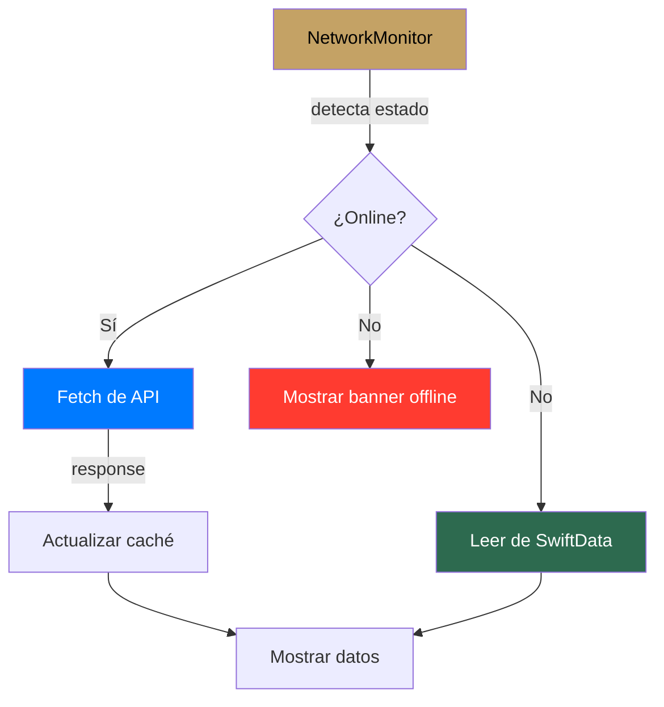

#ios #cache #offline #swiftdata

# Caché y Offline

> [!abstract] Resumen
> **SwiftData** como caché local para datos offline. Modelos `@Model` separados de los modelos de dominio (`Cached*`). `NetworkMonitor` detecta conectividad y muestra banner offline. `CacheManager` coordina el acceso.

---

## Configuración

| Aspecto | Valor |
|---------|-------|
| Framework | SwiftData (iOS 17+) |
| ModelContainer | `SolennixModelContainer.create()` |
| Fallback | In-memory si falla persistencia en disco |
| App Group | `group.com.solennix.app` (compartido con widgets) |

---

## Modelos Cacheados

| Modelo SwiftData | Modelo de dominio | Campos |
|-----------------|------------------|--------|
| `CachedClient` | `Client` | id, name, phone, email, address, city |
| `CachedEvent` | `Event` | id, clientId, eventDate, serviceType, status, totalAmount |
| `CachedProduct` | `Product` | id, name, category, basePrice, isActive |

> [!tip] Modelos @Model
> Los modelos de SwiftData usan `@Model` macro y son independientes de los modelos `Codable` de dominio. El `CacheManager` maneja la conversión.

---

## Flujo Offline



---

## NetworkMonitor

```swift
@Observable
public final class NetworkMonitor {
    var isConnected: Bool = true

    init() {
        let monitor = NWPathMonitor()
        monitor.pathUpdateHandler = { path in
            self.isConnected = path.status == .satisfied
        }
        monitor.start(queue: .global())
    }
}
```

> [!important] Banner Offline
> Cuando `isConnected == false`, ContentView muestra un banner prominente en la parte superior indicando que se están mostrando datos del caché.

---

## Widget Data Sharing

| Aspecto | Detalle |
|---------|---------|
| Mecanismo | App Group container compartido |
| App Group | `group.com.solennix.app` |
| Datos compartidos | Próximos eventos, KPIs |
| Actualización | Desde la app principal al cargar datos |

---

## Oportunidades de Mejora

> [!warning] Gaps conocidos
> - **Sin sync en background**: no hay equivalente a WorkManager de Android
> - **Sin queue de operaciones offline**: cambios offline se pierden
> - **Sin conflict resolution**: no hay lógica para resolver ediciones concurrentes
> - **Sin refresh automático de caché**: datos cacheados pueden volverse stale
> - **Caché parcial**: solo Client, Event, Product — faltan Inventory, Payment

---

## Archivos Clave

| Archivo | Ubicación |
|---------|-----------|
| `CachedClient.swift` | `SolennixCore/Cache/` |
| `CachedEvent.swift` | `SolennixCore/Cache/` |
| `CachedProduct.swift` | `SolennixCore/Cache/` |
| `SolennixModelContainer.swift` | `SolennixCore/Cache/` |
| `NetworkMonitor.swift` | `SolennixNetwork/` |

---

## Relaciones

- [[Arquitectura General]] — SwiftData en la capa de datos
- [[Sistema de Tipos]] — modelos de dominio vs @Model de caché
- [[Manejo de Estado]] — CacheManager como manager global
- [[Widgets y Live Activities]] — App Group para datos compartidos
