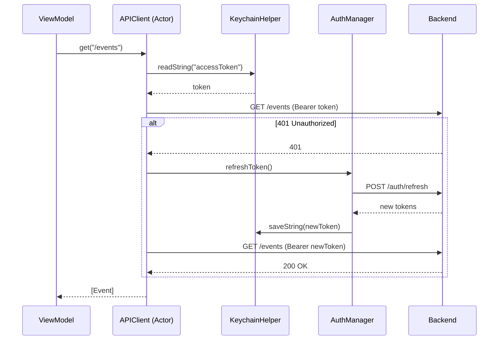

#ios #red #infraestructura

# Capa de Red

> [!abstract] Resumen
> **APIClient** es un `actor` que usa `URLSession` nativo con inyección automática de Bearer token, retry en 401 con refresh, y serialización `Codable` con conversión `snake_case`. Todo vive en `SolennixNetwork/`.

---

## Configuración del Cliente

| Aspecto | Configuración |
|---------|--------------|
| Transporte | URLSession nativo |
| Timeout | 30 segundos |
| Content type | `application/json` |
| Serialización | Codable con `.convertFromSnakeCase` / `.convertToSnakeCase` |
| Auth | Bearer token inyectado en header `Authorization` |
| Token storage | Keychain via `KeychainHelper` |
| Upload | Multipart/form-data para imágenes |
| Base URL | `https://api.solennix.com/api` |

---

## APIClient — Actor

```swift
public actor APIClient {
    public func get<T: Decodable>(_ endpoint: String, params: [String: String]?) async throws -> T
    public func post<T: Decodable>(_ endpoint: String, body: some Encodable) async throws -> T
    public func put<T: Decodable>(_ endpoint: String, body: some Encodable) async throws -> T
    public func delete(_ endpoint: String) async throws
    public func upload(_ endpoint: String, data: Data, filename: String) async throws -> UploadResponse
}
```

> [!important] ¿Por qué Actor?
> `APIClient` es un `actor` para garantizar thread-safety en las llamadas concurrentes. Esto implica que no puede conformar a `@Observable` — se inyecta via `EnvironmentKey` custom.

---

## Flujo de Request con Auth



> [!tip] Tokens directos de Keychain
> APIClient lee tokens DIRECTAMENTE de `KeychainHelper`, no de `AuthManager`, para evitar dependencias circulares. AuthManager es quien los actualiza.

---

## Endpoints

### Autenticación

| Método | Endpoint | Descripción |
|--------|----------|-------------|
| POST | `/auth/login` | Login email/password |
| POST | `/auth/register` | Registro |
| POST | `/auth/refresh` | Refresh token |
| POST | `/auth/google` | Login con Google |
| POST | `/auth/apple` | Login con Apple |
| GET | `/auth/me` | Perfil actual |
| PUT | `/auth/change-password` | Cambiar contraseña |
| POST | `/auth/forgot-password` | Solicitar reset |
| POST | `/auth/reset-password` | Reset con token |

### Clientes

| Método | Endpoint | Descripción |
|--------|----------|-------------|
| GET/POST | `/clients` | Listar / Crear |
| GET/PUT/DELETE | `/clients/{id}` | Detalle / Actualizar / Eliminar |

### Eventos

| Método | Endpoint | Descripción |
|--------|----------|-------------|
| GET/POST | `/events` | Listar / Crear |
| GET | `/events/upcoming` | Próximos eventos |
| GET/PUT/DELETE | `/events/{id}` | Detalle / Actualizar / Eliminar |
| GET/POST | `/events/{id}/products` | Productos del evento |
| GET/POST | `/events/{id}/extras` | Extras del evento |
| GET/POST | `/events/{id}/equipment` | Equipamiento |
| GET/POST | `/events/{id}/supplies` | Insumos |
| GET/POST | `/events/{id}/photos` | Fotos |

### Productos

| Método | Endpoint | Descripción |
|--------|----------|-------------|
| GET/POST | `/products` | Listar / Crear |
| GET/PUT/DELETE | `/products/{id}` | Detalle / Actualizar / Eliminar |
| GET | `/products/{id}/ingredients` | Ingredientes |
| POST | `/products/ingredients/batch` | Batch update ingredientes |

### Inventario, Pagos, Otros

| Método | Endpoint | Descripción |
|--------|----------|-------------|
| GET/POST | `/inventory` | Listar / Crear items |
| GET/PUT/DELETE | `/inventory/{id}` | Detalle / Actualizar / Eliminar |
| GET/POST | `/payments` | Listar / Registrar pagos |
| GET/PUT/DELETE | `/payments/{id}` | Detalle / Actualizar / Eliminar |
| GET | `/unavailable-dates` | Fechas bloqueadas |
| GET | `/search` | Búsqueda global |
| POST | `/uploads/image` | Subir imagen |
| GET | `/subscriptions/status` | Estado suscripción |

---

## Manejo de Errores

```swift
public enum APIError: Error, LocalizedError {
    case invalidURL
    case requestFailed(statusCode: Int, message: String?)
    case decodingFailed(Error)
    case unauthorized
    case networkError(Error)
    case unknown
}
```

> [!warning] Oportunidad
> No hay retry automático con backoff para errores transitorios (500, timeout). Solo se reintenta en 401 (token refresh).

---

## Archivos Clave

| Archivo | Responsabilidad |
|---------|----------------|
| `SolennixNetwork/APIClient.swift` | Actor HTTP con auth y retry |
| `SolennixNetwork/AuthManager.swift` | Estado auth y gestión de tokens |
| `SolennixNetwork/KeychainHelper.swift` | Storage seguro de tokens |
| `SolennixNetwork/GoogleSignInService.swift` | OAuth Google |
| `SolennixNetwork/AppleSignInService.swift` | Sign in with Apple |
| `SolennixNetwork/SubscriptionManager.swift` | RevenueCat |
| `SolennixNetwork/NetworkMonitor.swift` | Detección de conectividad |
| `SolennixCore/Endpoints.swift` | Constantes de URLs |

---

## Relaciones

- [[Autenticación]] — flujo completo de auth y tokens
- [[Sistema de Tipos]] — modelos Codable
- [[Caché y Offline]] — datos cacheados cuando no hay red
- [[Arquitectura General]] — paquete SolennixNetwork
