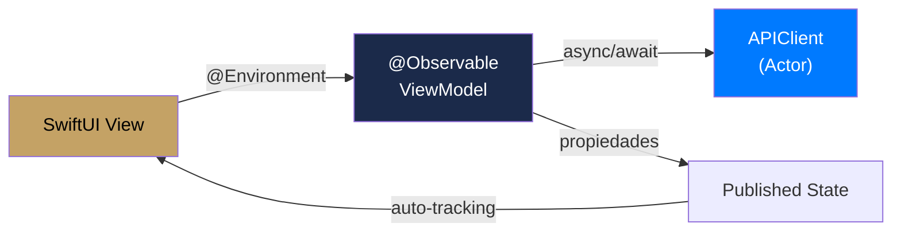
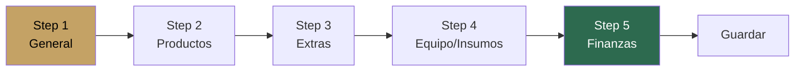

#ios #estado #observable

# Manejo de Estado

> [!abstract] Resumen
> Estado manejado con **@Observable** (Observation framework, iOS 17+). Cada feature tiene ViewModels como clases `@Observable`. La UI accede via `@Environment`. Estado local con `@State` y `@Binding`. Preferencias con `@AppStorage`.

---

## Estrategia por Capa

| Capa | Herramienta | Patrón |
|------|-----------|--------|
| **UI local** | `@State` / `@Binding` | Campos de formulario, toggles, sheets |
| **Feature** | `@Observable` ViewModel | Estado de pantalla completo |
| **App-wide** | `@Environment` managers | Auth, plan limits, toast, network |
| **Persistencia ligera** | `@AppStorage` | Tema, preferencias visuales |
| **Caché** | SwiftData `@Model` | Datos offline |

---

## Patrón @Observable



```swift
@Observable
public final class EventListViewModel {
    var events: [Event] = []
    var isLoading = true
    var searchText = ""
    var statusFilter: EventStatus?
    var error: String?

    func fetchEvents() async {
        isLoading = true
        do {
            events = try await apiClient.get("/events")
        } catch {
            self.error = error.localizedDescription
        }
        isLoading = false
    }
}
```

> [!tip] Auto-tracking
> Con `@Observable`, SwiftUI trackea automáticamente qué propiedades usa cada View y solo re-renderiza cuando esas propiedades específicas cambian. No se necesita `@Published`.

---

## Sincronización Reactiva entre Vistas

Debido a que `eventosapp` iOS carece de un *store* global centralizado estilo Redux o Room (como sí tiene Android), los ViewModels manejan su propio caché aislado. Cuando una vista "hija" dentro de un `NavigationStack` (ej. `EventDetailView`) realiza un cambio exitoso en la API (ej. registrar un pago), la vista "padre" (`DashboardView`) **no vuelve a ejecutar `.task` ni `.onAppear`** al volver atrás (por optimización del sistema iOS 16/17+).

Para resolver esto y mantener el Dashboard sincronizado sin re-consumir APIs innecesariamente, utilizamos un patrón híbrido con **`NotificationCenter`**:

1. El ViewModel que hace la escritura exitosa a la API notifica globalmente: 
   `NotificationCenter.default.post(name: .solennixPaymentRegistered, object: nil)`
2. La vista que necesita estar al día (`DashboardView`) escucha pasivamente y ejecuta su método `refresh()`:
   `.onReceive(NotificationCenter.default.publisher(for: .solennixPaymentRegistered)) { _ in Task { await viewModel?.refresh() } }`

Notificaciones actuales en el sistema (`SolennixCore/SolennixNotificationNames.swift`):
- `.solennixPaymentRegistered`
- `.solennixPaymentDeleted`
- `.solennixEventUpdated`

---

## ViewModels del Sistema

| ViewModel | Feature | Responsabilidad |
|-----------|---------|-----------------|
| `AuthViewModel` | auth | Login, registro, recovery, social auth, validación |
| `DashboardViewModel` | dashboard | KPIs, eventos próximos, alertas stock, charts |
| `EventListViewModel` | events | Lista, filtros, búsqueda, paginación |
| `EventFormViewModel` | events | Formulario multi-paso (5 steps), validación, cálculos |
| `EventDetailViewModel` | events | Detalle, productos, extras, equipo, insumos, fotos, pagos |
| `EventChecklistViewModel` | events | Checklist con mark complete |
| `ClientListViewModel` | clients | Lista, búsqueda, CRUD |
| `ClientDetailViewModel` | clients | Detalle, historial, quick quote |
| `ProductListViewModel` | products | Lista, búsqueda, categorías |
| `ProductDetailViewModel` | products | Detalle, ingredientes, demanda |
| `InventoryListViewModel` | inventory | Lista, filtros por tipo |
| `InventoryDetailViewModel` | inventory | Detalle de stock y uso |
| `CalendarViewModel` | calendar | Vista mensual, eventos por fecha |
| `SearchViewModel` | search | Búsqueda global |
| `SettingsViewModel` | settings | Perfil, negocio, suscripción |

---

## Managers Globales

| Manager | Patrón | Inyección | Responsabilidad |
|---------|--------|-----------|----------------|
| `AuthManager` | `@Observable` | `.environment()` | Estado auth, tokens, biometric |
| `PlanLimitsManager` | `@Observable` | `.environment()` | Límites del plan, feature gating |
| `SubscriptionManager` | `@Observable` | `.environment()` | RevenueCat, estado de suscripción |
| `ToastManager` | `@Observable` | `.environment()` | Notificaciones temporales |
| `NetworkMonitor` | `@Observable` | `.environment()` | Estado de conectividad |
| `CacheManager` | `@Observable` | `.environment()` | SwiftData, datos cacheados |
| `APIClient` | `actor` | `EnvironmentKey` | HTTP requests |

---

## Plan Limits (Feature Gating)

```swift
@Observable
public final class PlanLimitsManager {
    // Basic tier limits
    let maxEventsPerMonth = 3
    let maxClients = 50
    let maxProducts = 20

    func canCreateEvent() -> Bool { ... }
    func canCreateClient() -> Bool { ... }
    func canCreateProduct() -> Bool { ... }
}
```

> [!important] Upgrade Prompts
> Cuando el usuario alcanza un límite del plan, se muestra `UpgradeBannerView` en lugar de bloquear silenciosamente.

---

## Estado de Formulario Multi-Paso (Event)



Cada step tiene validación independiente. El ViewModel mantiene el estado de todos los steps y calcula totales en Step 5.

---

## Relaciones

- [[Arquitectura General]] — capas y paquetes
- [[Capa de Red]] — APIClient como actor
- [[Navegación]] — ViewModels no navegan directamente
- [[Caché y Offline]] — CacheManager con SwiftData
