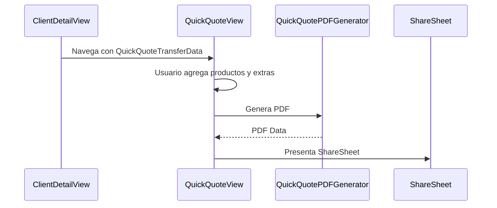

#ios #dominio #clientes

# Módulo Clientes

> [!abstract] Resumen
> Directorio de clientes con CRUD, historial de eventos, total gastado, y flujo de cotización rápida con PDF.

---

## Pantallas

| Pantalla | Archivo | Descripción |
|----------|---------|-------------|
| `ClientListView` | `SolennixFeatures/Clients/Views/` | Lista con búsqueda |
| `ClientDetailView` | `SolennixFeatures/Clients/Views/` | Detalle con historial |
| `ClientFormView` | `SolennixFeatures/Clients/Views/` | Creación/edición |

---

## Campos del Cliente

| Campo | Tipo | Requerido |
|-------|------|-----------|
| Nombre | Text | Sí |
| Teléfono | Phone | No |
| Email | Email | No |
| Dirección | Text | No |
| Ciudad | Text | No |

---

## Analíticas

| Métrica | Fuente |
|---------|--------|
| Total de eventos | Conteo de eventos del cliente |
| Total gastado | Suma de pagos de sus eventos |
| Historial | Lista de eventos con status |

---

## Cotización Rápida

Flujo especial para generar una cotización PDF sin crear un evento completo:

---

## Relaciones

- [[Módulo Eventos]] — un cliente tiene muchos eventos
- [[Módulo Pagos]] — pagos agregados por cliente
- [[Módulo Dashboard]] — conteo en KPIs
- [[Sistema de PDFs]] — cotización rápida
