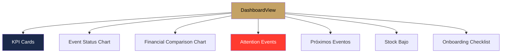

#ios #dominio #dashboard

# Módulo Dashboard

> [!abstract] Resumen
> Panel principal con KPIs financieros, distribución de estados, eventos que necesitan atención, próximos eventos, alertas de stock bajo, y onboarding checklist.

---

## Pantallas

| Pantalla | Archivo | Descripción |
|----------|---------|-------------|
| `DashboardView` | `SolennixFeatures/Dashboard/Views/` | Panel principal |

---

## Secciones del Dashboard

---

## KPIs

| KPI | Cálculo | Color |
|-----|---------|-------|
| Ventas netas del mes | Suma de totalAmount de eventos del mes | Azul |
| Efectivo cobrado | Suma de pagos del mes | Verde |
| IVA retenido | Suma de taxAmount del mes | Naranja |
| Eventos del mes | Conteo de eventos | — |
| Clientes totales | Conteo de clientes | — |
| Cotizaciones pendientes | Eventos en status "quoted" | — |

---

## Eventos que Necesitan Atención

| Tipo | Criterio |
|------|----------|
| Overdue | Fecha pasada + status ≠ completed/cancelled |
| Pago pendiente | totalAmount > pagos recibidos |
| Sin confirmar | Status = quoted + evento próximo |

---

## Onboarding Checklist

| Paso | Condición para completar |
|------|--------------------------|
| Crear primer cliente | ≥ 1 cliente |
| Agregar primer producto | ≥ 1 producto |
| Crear primer evento | ≥ 1 evento |

---

## Relaciones

- [[Módulo Eventos]] — KPIs y próximos eventos
- [[Módulo Clientes]] — conteo de clientes
- [[Módulo Inventario]] — alertas de stock
- [[Módulo Pagos]] — métricas financieras
- [[Manejo de Estado]] — DashboardViewModel
